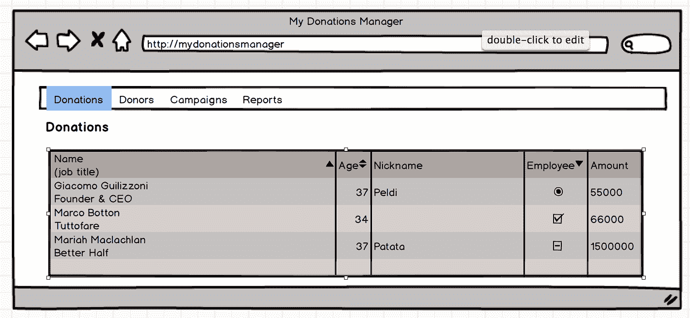
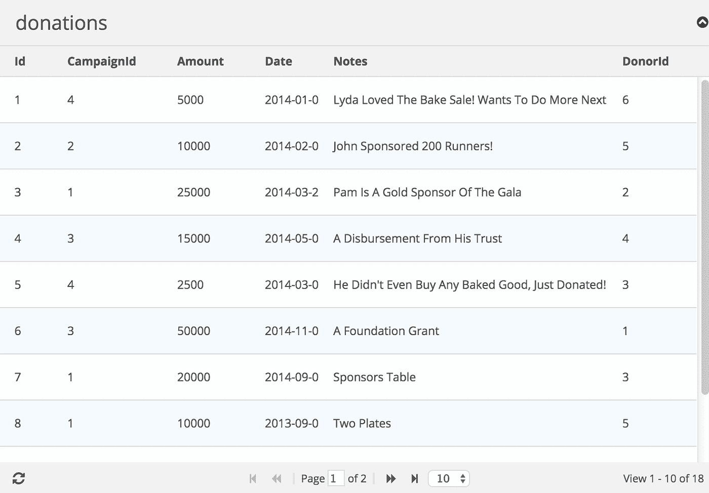
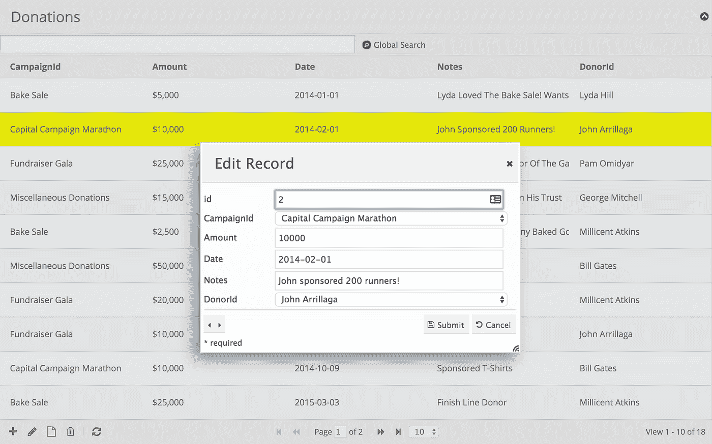
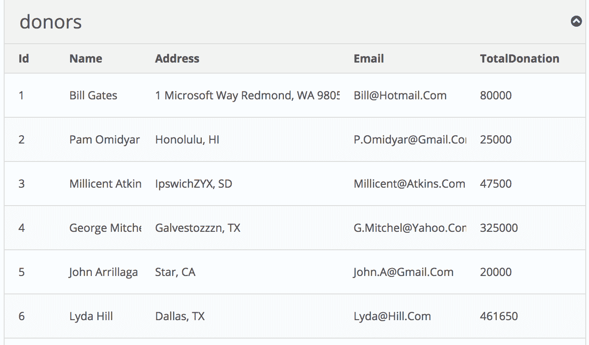
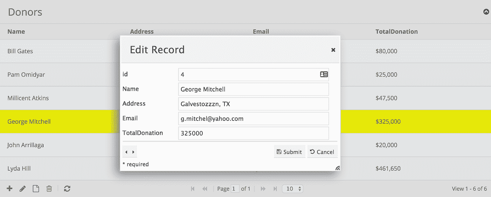
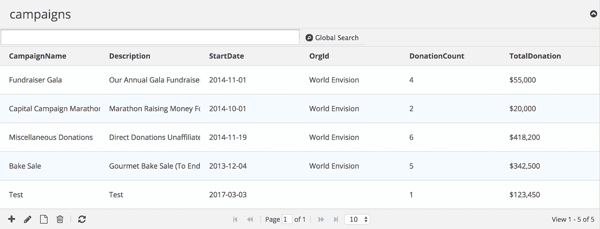

# 如何用 PHP 和 MySQL 从零开始建立一个基于网络的捐赠管理系统

> 原文：<https://medium.com/hackernoon/how-to-build-a-web-based-donation-manager-system-from-scratch-in-php-mysql-f276e6a16ac3>


Photo by [Kat Yukawa](https://unsplash.com/@katyukawa?utm_source=medium&utm_medium=referral) on [Unsplash](https://unsplash.com?utm_source=medium&utm_medium=referral)

# 介绍

慈善组织可以使用此捐赠管理器应用程序来管理捐赠流程，并确保准确的数据输入和与捐赠者的无缝通信。此外，我们将在申请中包含一份附有图表的捐赠总结报告。

# 系统需求

*   PHP 7+版本
*   MySQL 或 MariaDB
*   phpGrid
*   phpChart(第二部分)

# 数据库概述

我们的捐赠管理系统有四个对象。

*   捐赠者—捐赠者的个人信息。
*   捐赠——为特定活动捐赠的金额
*   活动—捐赠活动信息
*   组织—管理捐赠的组织

我们的数据库简单明了。每个表都是代表上述对象之一的实体。

编程术语—对象或实体

> 实体是一个数据库术语，通常由数据库模式中的一个表来表示。对象是面向对象的编程术语，通常映射到数据库表。

在我们的数据模型中，`donations`用于存储关于捐赠的信息；活动用于收集活动数据和活动信息；管理活动的组织存储在`org`中。


# 建立捐赠管理器数据库

从[这里](https://phpgrid.com/example/step-step-guide-building-donation-manager-scratch-php-part/)获取`donation_manager_db.sql` SQL 脚本，然后使用 [MySQL](https://hackernoon.com/tagged/mysql) 工具如 MySQL Workbench 或 Sequel Pro 执行 SQL 脚本。这将创建一个名为`donation_manager`的新数据库和我们在本教程中需要的表。

# 设置 phpGrid

数据网格是一种类似电子表格的数据表，它显示代表存储在数据库表中的记录和字段的行和列。这些网格为最终用户提供了从 web 页面读写数据库表的能力。

[phpGrid](https://hackernoon.com/tagged/phpgrid) datagrid 组件为我们处理所有内部数据库 **CRUD** ( **C** reate， **R** emove， **U** pdate，和 **D** elete)操作，用最少的代码提供更快更好的结果。

在继续之前，请务必[下载一份免费的 phpGrid](https://phpgrid.com/download/) 副本。

要安装 phpGrid，请按照下列步骤操作:

1.  解压缩 phpGrid 下载文件。
2.  将`phpGrid`文件夹上传到 phpGrid 文件夹。
3.  通过配置`conf.php`文件完成安装。

在我们开始编码之前，我们必须在 phpGrid 配置文件`conf.php`中包含以下信息。

# UI 设计


Photo by [Hal Gatewood](https://unsplash.com/@halgatewood?utm_source=medium&utm_medium=referral) on [Unsplash](https://unsplash.com?utm_source=medium&utm_medium=referral)

基本设计很简单。它由一个单级顶部菜单栏和一个数据网格组成。在报告部分，我们将使用 phpChart 添加图表。



# 菜单

捐赠管理器有四个菜单项。每个项目代表捐赠管理器数据库中的一个相应的表。

菜单的包含文件存储在名为`menu.php`的`inc`文件夹中。菜单的代码很简单。为了突出重点，我们就不赘述了。请随意查看存储在`inc`文件夹中的内容。


我们还添加了一个名为`Reports`的菜单项，我们将在本教程的第二部分讨论它。

# 捐赠页面

我们的第一个捐赠管理器页面是捐赠页面，在这个页面上，我们显示从数据网格中的`Donations`表中检索到的捐赠信息。

记住捐赠管理器数据库中的每个表都有`id`作为主键。因此，我们可以用下面两行代码轻松创建我们的第一个数据网格。

phpGrid 101 —一个基本的数据网格

> 1.在第一行，创建要显示的 phpGrid 对象。
> 
> 2.然后调用 [display()](https://phpgrid.com/documentation/display/) 在网页上呈现结果数据网格。

你可以在这里了解更多关于基本数据网格如何工作的信息[。](https://phpgrid.com/example/example-1-a-basic-php-datagrid-2/)

下面是我们的`Donations`数据网格的样子:



现在，我们将对捐款数据网格做一些改进。

首先，我们不需要显示主键`Donations`因为它只在内部使用，对我们的用户没有意义。我们可以使用 [set_col_hidden()](https://phpgrid.com/documentation/set_col_hidden/) 来隐藏它。

接下来，`Amount`列是一个货币值。我们可以使用 [set_col_currency()](https://phpgrid.com/documentation/set_col_currencycol_name-prefix-suffix-thousandsseparator-decimalseparator-decimalplaces2-defaultvalue0-00/) 将该列格式化为货币显示。

我们还希望我们的数据网格显示人类可读的活动描述和捐赠者姓名，而不是在列`CampaignId`和`DonorId`中显示无意义的整数。使用 [set_col_edittype()](https://phpgrid.com/documentation/set_col_edittype/) 函数，我们可以很容易地分别从`Campaigns`和`Donors`表中获得活动描述和捐赠者姓名。

我们还想使捐款网格可编辑。我们可以通过添加以下行来实现这一点:

捐赠数据网格的完整代码:

以下是捐款数据网格在我们改进后的样子:



看起来不错，不是吗？让我们继续前进！

# 捐赠者页面


Photo by [Akshay Chauhan](https://unsplash.com/@akshayspaceship?utm_source=medium&utm_medium=referral) on [Unsplash](https://unsplash.com?utm_source=medium&utm_medium=referral)

第二页是捐赠者页。它包含捐赠者名单和捐赠摘要信息。

表`Donors`和`Donations`之间存在[一对多](https://en.wikipedia.org/wiki/Master%E2%80%93detail_interface)关系，因为一个捐赠者可以进行一次或多次捐赠。`Donations`表有一个外键字段`donorid`，它引用了`Donors`表。

我们可以使用一个[内部连接](https://www.w3schools.com/sql/sql_join_inner.asp)来填充我们的捐赠数据网格，从而连接两个表`Donors`和`Donations`。

*SQL 101 —内部连接*

> 使用内部联接在两个数据库表之间创建一对多关系。“一对多”关系中“一”方的表应该有一个主键列。另一个表有一个外键，指向第一个表中的主键。

这是我们完整的 SQL 语句。

为了让我们的数据看起来更有趣，我们通过用 [CONCAT](https://www.w3schools.com/SQl/func_mysql_concat.asp) 连接名`FirstName`和姓`LastName`字段来创建全名，CONCAT 是一个连接两个或更多字符串的 SQL 函数。在 MySQL 中，它具有以下语法:

为了创建捐献者的全名，我们还在名字后面添加了一个空白字符，在名字和姓氏之间添加了一个空格。

我们还想显示给定捐赠者捐赠的总额。这就是 SQL [聚合函数](https://en.wikipedia.org/wiki/Aggregate_function)派上用场的地方。在 MySQL 中，可以使用 [SUM()](https://www.w3schools.com/sql/sql_count_avg_sum.asp) 函数返回数值列的总和。我们把我们的总数命名为`TotalDonation`。

因为我们想要显示汇总信息，所以我们需要添加一个 [GROUP BY](https://www.w3schools.com/sql/sql_groupby.asp) 语句，该语句对结果集中相同的数据进行分组。在这种情况下，我们假设如果`Address`和`Email`字段相同，这意味着它们指的是同一个施主。GROUP BY 子句将记录分组到每个组的摘要行中。它通常与 COUNT、MAX、MIN、SUM 和 AVG 等聚合函数一起使用。

综上所述，这是我们将用来创建数据网格的最终 SQL 语句。

如果您想知道 SQL 语句中的`d`和`dn`是干什么的，它们是 SQL 表的别名。

*SQL 101 —表别名*

> SQL 别名是用于表或列的临时名称。别名通常用于提高列名或表名的可读性。它只在查询期间存在。

## 捐赠者数据网格

下面是我们的`Donors`数据网格的代码。它由一个使用上述 SQL 语句的 [phpGrid 构造函数](https://phpgrid.com/documentation/construct-our-phpgrid/)和 [display()](https://phpgrid.com/documentation/display/) 函数组成。

我们的捐赠数据网格看起来像这样:



让我们添加一些东西来提高它的可用性。

首先，第一列显示表的主键`id`。我们不需要向用户展示这一点。让我们使用 [set_col_hidden()](https://phpgrid.com/documentation/set_col_hidden/) 函数来隐藏它。

每个捐赠者都有一个电子邮件。我们可以使用 [set_col_format()](https://phpgrid.com/documentation/set_col_format/) 轻松地将这个字段变成一个电子邮件超链接。

`TotalDonation`列是一个货币字段。我们可以使用 [set_col_currency()](https://phpgrid.com/documentation/set_col_currencycol_name-prefix-suffix-thousandsseparator-decimalseparator-decimalplaces2-defaultvalue0-00/) 将该列更改为货币格式。

并且`Name`和`TotalDonation`字段都应该是只读的。

最后，我们使用 [enable_edit()](https://phpgrid.com/documentation/enable_editedit/) 函数使捐助者数据网格可编辑(除了我们刚刚设置为只读的字段)。

完整的捐赠者数据网格代码:

下面是修改后捐赠者数据网格的样子(编辑窗口打开)。



## 捐赠详细信息网格

由于表`Donors`和`Donations`之间存在一对多的关系，我们可以使用 phpGrid [master detail](https://phpgrid.com/example/master-detail-grid/) 特性轻松呈现这种关系。

*数据网格 101 —主细节*

> 两个数据模型之间的一对多关系可以使用数据网格以主从格式呈现。

细节网格是一个常规的 phpGrid 数据网格对象，可以使用与任何其他数据网格相同的方法，如描述标题、排序和更新等。详细网格是根据从父(主)网格中选择的行动态呈现的。

我们将简单地重用我们在本教程前面创建的`Donations`数据网格中的代码。

注意，我们没有包括最后一行`$dgDonations->display()`。

最后，我们使用 [set_masterdetails()](https://phpgrid.com/documentation/set_masterdetail/) 在代码中设置主从关系。第二个参数是细节表`Donations`中定义的外键。第三个参数是主表`Donors`中定义的外键。

还提供了一系列 phpGrid 主-细节演示以及如何在本教程范围之外使用它们。

# 活动页面


Photo by [rawpixel](https://unsplash.com/@rawpixel?utm_source=medium&utm_medium=referral) on [Unsplash](https://unsplash.com?utm_source=medium&utm_medium=referral)

活动页面包含活动信息和捐赠详情。请注意，一个给定的活动可以从一个或多个捐赠者那里获得许多捐赠。同样，我们可以使用 phpGrid 的[主-细节](https://phpgrid.com/documentation/set_masterdetail/)特性，就像我们在捐助者页面上所做的那样。

让我们从活动开始。

由于表`Campaigns`和`Donations`具有一对多的关系，我们可以通过创建一个[内部连接](https://www.w3schools.com/sql/sql_join_inner.asp)来连接这两个表。注意，`c`和`dn`分别是`Campaigns`和`Donations`表的 SQL 表别名。

我们还想显示特定活动的捐赠总额。同样，我们可以使用 SQL 聚合函数 [SUM()](https://www.w3schools.com/sql/sql_count_avg_sum.asp) 从`Donations`表中返回`Amount`列的总和。

除了收到的捐款总额之外，衡量捐款活动成功与否的一个关键方法是捐款总数。这里，我们介绍另一个有用的 SQL 聚合函数，叫做 [COUNT()](https://www.w3schools.com/sql/sql_count_avg_sum.asp) 。

COUNT()函数，顾名思义，计算 SELECT 语句中返回的行数。我们给它起名叫`DonationCount`。

最后，由于我们想要显示活动摘要信息，我们将添加一个 [GROUP BY](https://www.w3schools.com/sql/sql_groupby.asp) 语句，该语句将记录分组并将其总计打印到每个组的摘要行中。

*SQL 101 —分组依据&聚合*

> 每当您需要使用诸如 COUNT、MAX、SUM 和 AVG 之类的 SQL 聚合函数时，请使用 GROUP BY。

我们活动数据网格的完整 SQL SELECT 语句如下所示:

接下来，我们将包含一些 phpGrid 函数来为我们的活动数据网格增添活力。

首先，正如我们对其他人所做的那样，让我们隐藏列`id`。

然后，让我们以货币格式显示我们的`TotalDonation`字段。

不要忘记使活动网格可编辑。

最后，我们通过添加函数 [enable_global_search()](https://phpgrid.com/documentation/enable_global_search/) 来添加一个全局搜索，该函数支持对任何可搜索列进行多字段全局搜索。这就够了。

```
$dgCamp->enable_global_search(true);
```

这就是活动网格。让我们来看看:



活动网格的完整代码:

## 捐赠明细网格

还记得我们之前提到的`Campaigns`和`Donations`表是一对多的关系吗？我们可以使用 phpGrid [master detail](https://phpgrid.com/example/master-detail-grid/) 特性来呈现它们的关系，就像我们对`Donors`和`Donations`表所做的那样。

我们将简单地重用我们在本教程前面制作的用于`Donations`数据网格的相同代码。

注意，我们没有包括最后一行`$dgDonations->display()`。

最后，我们使用 [set_masterdetails()](https://phpgrid.com/documentation/set_masterdetail/) 在代码中设置主从关系。活动是主网格，捐款是明细网格。

因此，活动页面的完整代码是:

这标志着创建本教程所需的数据网格的代码已经结束。然而，我们还没有完成。我们还需要创建一个页面—报告。我们将在第二部分讨论这一部分。

**敬请期待，获取** [**源代码**](https://phpgrid.com/example/step-step-guide-building-donation-manager-scratch-php-part/) **跳转开始！**

# 感谢阅读。如果你喜欢这篇文章，请点击那个按钮👏帮助其他人找到它。