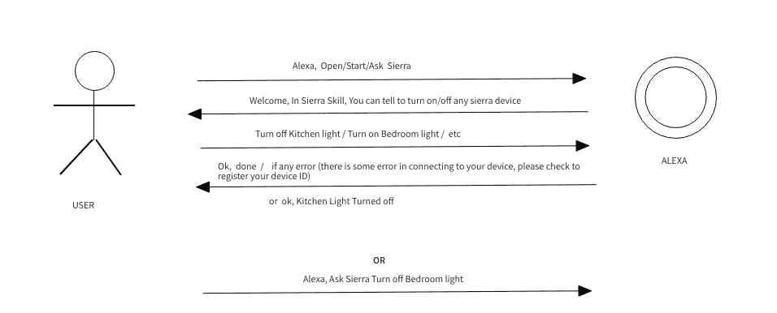
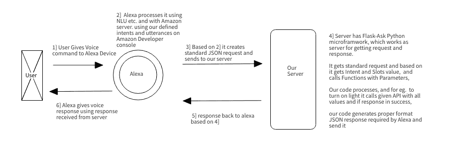

# 如何建立 Alexa 技能的终极指南

> 原文：<https://medium.com/hackernoon/how-to-build-an-alexa-skill-an-ultimate-guide-on-alexa-skill-ee191823cb6b>

语音助手提供的比我们想象的多得多，无论是设置快速提醒还是点餐，用户都可以比移动应用程序更快更容易地完成任务，因此语音技术将是下一个大事情。亚马逊 [Alexa](https://hackernoon.com/tagged/alexa) 领先 it，2018 年拥有 73%的市场份额。你可以用 Alexa 做更多的事情，这里是你可以用你的 Alexa 设备尝试的[十大事情列表。在各种预测中，我们看到，到 2020 年，50%的搜索将是语音搜索。每年 Alexa 都在亚马逊上创造](https://venturebeat.com/2018/12/25/10-things-to-try-with-your-new-echo-smart-speaker/)[的高销售记录](https://press.aboutamazon.com/news-releases/news-release-details/amazon-customers-made-holiday-season-record-breaking-more-items)。它也成为了 [Google Play](https://hackernoon.com/tagged/google-play) 和苹果应用商店[上排名第一的免费应用](https://play.google.com/store/apps/collection/topselling_free?hl=en)，因为它需要移动应用首次设置 Alexa。不仅是 echo 设备，其他各种各样的智能家居设备都是支持 Alexa 的设备。

# **语音将成为下一件大事的 6 个理由:**

1]它能够完成几乎所有使用[移动应用](/@snehilchouhan/why-is-it-necessary-to-get-your-own-mobile-app-developed-2f6bd2360eb)可以完成的事情:由于它能够开发定制技能，我们可以开发技能并将其连接到我们现有的数据库，通过代码我们可以执行几乎所有使用[网站](https://theoptimumlabs.com/Website-Development.html)或[移动应用](https://theoptimumlabs.com/android-app-development.html)可以完成的操作。

2]选择任何内部选项的最快方式，例如:如果用户想要查看他第二天的会议日程，他将不需要逐一查看任何选项/点击。相反，用户可以通过单个语音命令直接访问。

3]免提体验和多任务处理:用户可以在完成其他任务的同时完成工作，如操作、烹饪、阅读、锻炼、清洁、驾驶汽车等。

4]它为用户提供了执行任务和远离屏幕的选项，这对眼睛有益，有眼睛意识的人更喜欢语音助手而不是基于屏幕的设备。

Image from Optimum Technical Labs LLP (Alexa Skills Development Company)

5]与电脑交流的最自然的方式:老年人很难学会使用智能手机，语音命令被证明是最简单的事情，因为它是最自然的交流方式。

6]盲人和手残疾人的最佳选择:正如我们所讨论的，语音助手可以执行智能手机所做的任何任务，因此对于盲人和手残疾人来说是最好的，他们不需要努力或尝试使用基于屏幕的设备来获取任何信息和各种其他任务。

> Alexa 技能商店上发布了近 70，000 种技能，并且还在增加。热门技能大约有。10，000 条评论，收到大约。每天 15 条评论，那还只是评论，想象一下它的用法。

# **打算打造 Alexa 技能？**

**处理你的想法:**所以你有一个惊人的想法，想为它建立 Alexa 技能。现在是开始工作的时候了。最重要的是迈出第一步，一步一步地前进。首先，我们需要确定技能需求。并开始创建文档列出要点。

**查看你的竞争对手:**在网上或手机上浏览亚马逊 Alexa 技能商店，查看与你的想法相关的技能，并找出你的想法如何才能更好？或者说你能给用户提供哪些特色功能？

**目标受众:**由于语音是最自然的交流方式，几乎所有年龄段的用户都有，从年轻到年老。我们可以了解我们的受众，有些技能完全是为孩子设计的，比如学习游戏，有些技能是为老人提供帮助。通用技能可以拥有大量的受众，任何人都可以使用的技能。

**选择正确的团队:**现在你有了想法，并且已经调查了市场。是时候开始建造它了。选择合适的团队是最关键的部分。

Alexa 技能开发是一个相当新的领域，没有像我们在网络或移动应用程序开发中看到的那么多开发者和代理。在开发任何应用程序时，除了技术专业知识，我们还需要关注许多重要因素，我们需要检查团队是否真的关心为我们提供最佳解决方案和适当的支持。

以下是我对一个问题的回答[为发展项目招聘时需要重点关注的要点](https://www.quora.com/What-do-we-need-to-ask-a-freelancer-if-he-was-making-an-Android-application/answer/Snehil-Chouhan)它的一般要点适用于任何地方。

**想从你的技能中赚钱**:亚马逊提供技能内购买功能，现在我们可以提供重复支付选项的消耗品，一些用户可以购买、使用和再次购买的数字服务/产品。

## **事情要重点而言** [**打造 Alexa 技能**](https://theoptimumlabs.com/alexa-skill-development.html) **:**

专注于以下几点将确保伟大的 VUI(语音用户界面)。技能应该有很大的 VUI，这取决于各种因素，用户不应该被迫听长的内容，用户应该在正确的时间获得正确的帮助，技能应该能够提供适当的数据适合用户，技能的流动应该感觉像真正的对话，而不是像任何旧的客户服务电话。

**1】调用名**:调用名用于调用技能(启动我们的 Alexa 技能/app)。这必须是非常清楚和有意义的，并且是用户可以记住的，因为用户需要调用技能的名字来打开它。理想情况下，技能名称应该是两个单词，并与完整的调用句子相匹配，如 Alexa，开放和平世界。这里“和平世界”是祈祷的名字。可以用一些不同的词来代替“开放”，如 Ask[广泛使用]，Begin，Do，Launch，Load 等。

**2]意图:**您的技术团队可能会使用这个词，这里的意图是我们可以说我们的技能将执行的每个功能。因此用户可以调用不同的意图来执行不同的功能。举个例子，如果有什么技能可以开/关灯。因此它可以有一个打开/关闭灯意图和一个添加新用户的意图。

**3】话语:**话语是句子的同义词，我们用来称呼不同的意图。当建立 Alexa 技能时，可以选择手动编写话语，这些话语是用户可以告诉去特定意图的句子，或者打开我们技能中的特定阶段。我们应该写尽可能多话语。我们可以以一个技能为例，我正在为酒店开发，那里我们有各种选项，用户可以问，如果用户必须问早餐时间，话语可以是:

早餐时间是什么时候？

早餐服务什么时候开始？

早餐是什么时候？

早餐服务什么时候结束？

请告诉我早餐的时间

每天早上的早餐时间是几点？

虽然 Alexa 自动理解相似或匹配的句子，但它很好地提供了许多话语。

音乐:这是 Alexa 技能中最重要的部分，与移动应用不同，Alexa 是基于语音的，因此音乐起着重要的作用。用好听的音乐开始技巧，在不同的舞台上播放合适的音乐，会让技巧更吸引人，更好听。你可以找到免费的音乐文件，也可以雇人为你制作定制音乐。

**5】技术方面:**查看以下详情

Photo by [James McDonald](https://unsplash.com/photos/74nIYjsOY88?utm_source=unsplash&utm_medium=referral&utm_content=creditCopyText) on [Unsplash](https://unsplash.com/search/photos/alexa-echo?utm_source=unsplash&utm_medium=referral&utm_content=creditCopyText)

## **在发布你的 Alexa 技能时:**

答:beta 测试:亚马逊开发者控制台现在有了新的选项 Beta 测试，允许我们在发布之前与其他人分享我们的技能，我们可以在 Beta 测试期间继续编辑我们的技能。

要启用 beta 测试，请使用您的开发技能中的发行版选项

b)明确技能能做什么，这样用户可以设定正确的期望值

c) Skill 应该鼓励用户离开评论，这样你就可以知道用户对 Skill 的期望

d)与最新的语音技术保持同步，尽可能以最佳方式实施技能并不断改进，语音技术仍在不断发展，并将在未来几年快速发展，技能也需要不断更新。

# **技术方面:**

为声音设计和为屏幕设计是非常不同的。我们不应该像开发移动应用程序或网站时那样思考它的流程、与用户的交互。相反，为 Alexa skill 设计的最佳方式是练习真正的对话，就像 Alexa Skill 会在用户告诉“this”调用句子时启动，然后 Alexa 会有什么反应等等。

下面是一个示例图，对于流程，我们可以设计任何类型的类似图:

Rough Alexa Skill flow designed by Optimum Technical Labs LLP

设计一个像上面这样的初始粗略流程有助于让整个场景变得清晰。

Alexa Skills 的一个**好处**是用户永远不必下载任何技能，因为它完全运行在云上，用户只需要启用技能。

现在是**实际开发**部分，亚马逊提供 ASK(Alexa 技能工具包),使用它我们可以开发 Alexa 的技能，开发任何定制的 Alexa 技能主要有两个部分:

1]亚马逊开发者控制台:亚马逊开发者控制台有 Alexa 技能部分，它有很好的 GUI。它需要发布任何 Alexa 技能，它包含有关调用名称，意图，话语，端点的信息。

从这里，我们可以分配技能，也可以设置测试，可以邀请团队成员或任何人做测试。

2]back end:Alexa 技能的 Backend/Endpoint，由于完整的 Alexa 技能总是运行在云上，每一个 Alexa 技能都需要 Endpoint。为此，我们有两个选择，我们可以在 AWS Lambda 上创建端点，也可以在自己的服务器上创建端点。

a) AWS Lambda 提供了准备就绪的设置，因此速度会更快。我们不需要创建 SSL 安全服务器。

b)自己的服务器:在这种情况下，我们要求只在端口 443 上运行支持 https SSL 的服务器，我们可以使用 Flask 或任何其他框架来充当服务器。

服务器必须处理来自 Alexa 的 JSON 请求，并提供 JSON 响应。AWS 和自己的服务器将在内部做同样的工作。

**功能&特性:**

在这一部分，每种技能都有所不同。这取决于你想要的技能特征。

它可以是:

正常问答

**或**如果我们想实现一些对话功能

**或**如果我们想把它连接到我们现有的系统到我们的数据库，为用户提供有价值的信息。

**或**如果这是一个游戏，它将包括讲故事，对话，音乐在适当的步骤等。

**或**如果技能是内部使用的业务，那么我们将需要使用 Alexa 的业务

**定价&预算:**

如上所述，这几乎完全取决于我们想要的功能和特性。

决定价格的另一个主要因素是你雇佣谁，他们是大机构、团队还是单个开发者。

一个优秀的 Alexa 技能开发团队应该具备:

1.  语音用户界面设计者
2.  开发者(Python/Node.js 等)
3.  质量保证工程师
4.  项目管理人

既然你已经看到了关于 Alexa 技能发展的所有细节，你可能想要雇佣专业人员或团队来培养你的 Alexa 技能。

我愿意帮助提供解决方案，你可以放下[询问](https://theoptimumlabs.com#contact)，我们可以讨论细节和建议，以创造更好的 [Alexa 技能](https://theoptimumlabs.com/alexa-skill-development.html)。我们有适当的程序和团队，以高标准开发 Alexa 技能。

我希望我已经涵盖了你开始建立自己的 Alexa 技能所需要知道的几乎一切。如果你有任何疑问/疑问/建议，请在评论中告诉我，我一定会回复。

如果你喜欢这篇文章，别忘了鼓掌:)

— — — — — — — — — — — — — — — — — — — — — — — — — — — — — — -

我是 Snehil，LLP 最佳技术实验室的首席执行官，请随时通过 Skype 联系我:snehilchouhan，电子邮件:snehilchouhan@gmail.com 或 LinkedIn

[最佳技术实验室 LLP](https://theoptimumlabs.com) 团队致力于[移动应用](https://theoptimumlabs.com/android-app-development.html)和 [Alexa 技能开发](https://theoptimumlabs.com/alexa-skill-development.html)，我们有多个[快乐客户](https://theoptimumlabs.com#testimonial)和[精美作品集](https://theoptimumlabs.com#portfolio)，请联系任何项目查询。我们很乐意帮助您，并将提供建议。