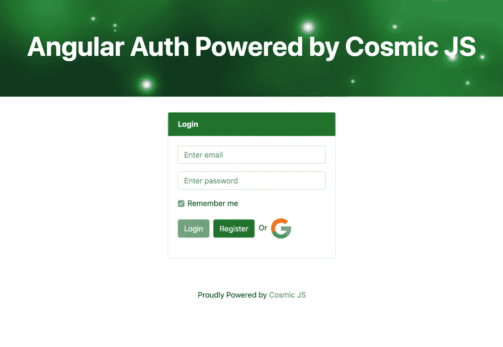
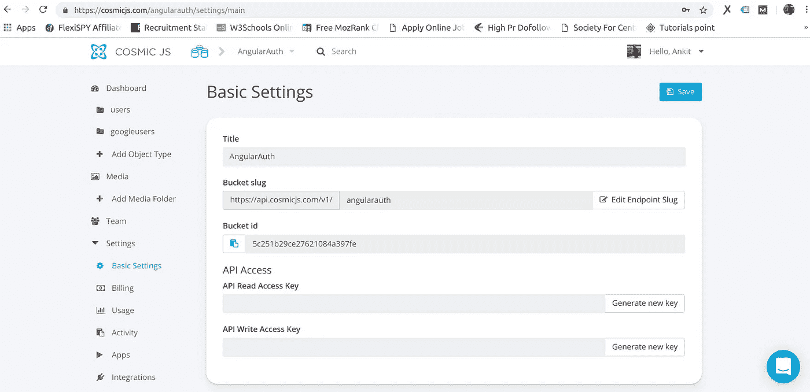
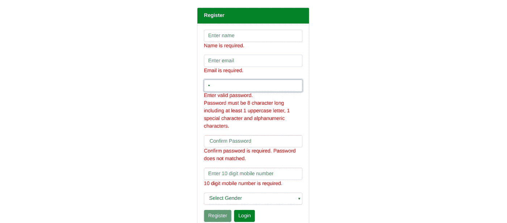
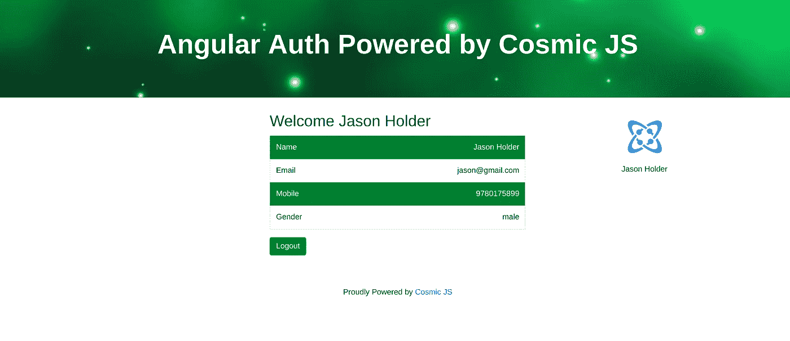
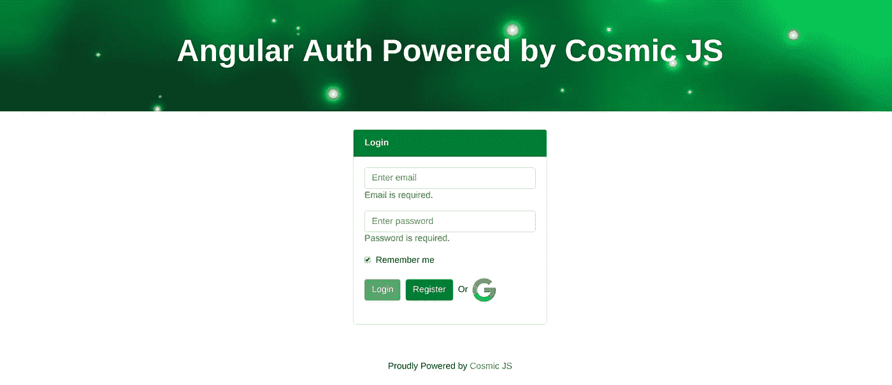
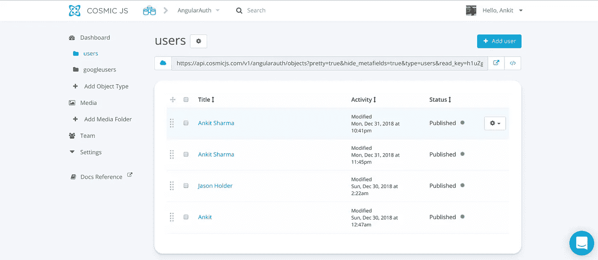
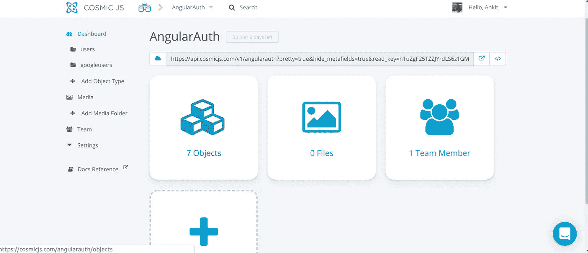
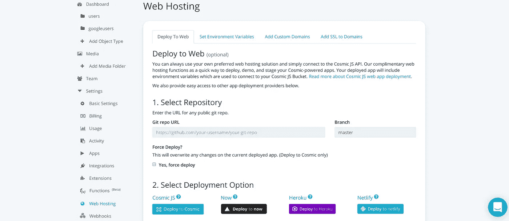

# 如何用 Angular 6 和 Cosmic JS 搭建认证 App

> 原文：<https://medium.com/hackernoon/how-to-build-an-authentication-app-using-angular-6-and-cosmic-js-3bb5605af2ba>

在本教程中，我将演示如何使用 Angular 6 和 [Cosmic JS](https://cosmicjs.com/) 构建一个认证应用程序。从零开始，学习如何构建、配置和部署这个 Angular 6 Auth 应用程序到 Cosmic JS 应用程序服务器进行测试。

# **TL；博士**

[检验演示](https://cosmicjs.com/apps/angular-authentication-app)
[下载代码库](https://github.com/cosmicjs/angular-auth)

# **先决条件**

在开始之前，您需要在系统上安装 [Angular CLI](https://cli.angular.io/) 、 [Node.js](https://nodejs.org/en/) 和 npm。您可以参考这些[角度文档](https://angular.io/guide/quickstart)来获得一些安装帮助。

# **入门**

首先，我们将创建一个角度项目。为此，请转到您想要放置 Angular 项目的文件夹，打开终端并键入以下命令:

`ng new angular-auth`

该命令自动创建标题为“angular-auth”的角度项目。现在转到项目文件夹并运行以下命令:

`cd angular-auth`

`ng serve –open`

该命令在 4200 端口的浏览器上打开项目，即 [http://localhost:4200/](http://localhost:4200/) 。这意味着您已经成功地创建了 Angular 项目的基本结构。

# **设置你的宇宙 JS 仪表盘**

首先登录 Cosmic JS 并创建您的存储桶。创建 Bucket 后，您可以开始创建一个名为“Users”的对象类型，它将存储注册用户的信息。您可以根据符合数据规范的要求创建不同的对象类型。

现在创建一个 Bucket 并从您的仪表板复制密钥，这将允许用户将他们的数据存储在 Cosmic JS 中。为此，转到*铲斗>设置>基本设置*并生成新密钥。类似地，创建一个 read 键，我们将使用它从 Cosmic JS 服务器获取数据。复制这些密钥并保存在系统中的安全位置。

# **导入 Bucket.json**

你可以从 [Angular Auth git repo](https://github.com/cosmicjs/angular-auth) 下载你的 bucket.json 文件，直接导入到你的 bucket 中。这样，您就不必创建对象类型。只需按照步骤操作:登录 Cosmic JS >选择默认 bucket >进入设置>进入导入/导出点击“添加导入文件”按钮上传 bucket.json 文件。

# **角度项目中宇宙 JS 的配置**

为了在 Angular 项目中添加我们的 Cosmic JS 配置，我们在 src/config 文件夹下创建了 cosmic.config.ts 文件。代码如下所示:

# **与 Cosmic JS 交互的角度服务**

在这里，我们在 Angular 中创建了一个服务，它将在提供的 API 的帮助下与 Cosmic JS 交互。让我们用命令创建:

`ng g s apicall`

它将创建两个文件，并与其余的代码分开，将这些文件放在一个名为 services 的文件夹中，位置如下:`src/app/services`

在这段代码中，我们出于几个不同的目的调用了 Cosmic JS 服务器。下面是声明的方法:

*   **login():** 调用该函数让用户使用邮箱和密码登录。
*   **register():** 当用户通过注册页面提供所有详细信息时，注册用户。
*   **checkGoogleUser():** 当用户想要登录 Google 时，它检查数据库中是否存在用户。
*   **googleRegister():** 它在用户点击 Google 图标登录时注册用户。

# **角度模型创建**

这里，我们在文件夹模型中创建一个名为 user.model.ts 的文件；地点是:`src/app/models/user.model.ts`

这里我们声明了一个名为 userModel 的类，它包含了我们在这个项目中使用的所有变量

# **注册新用户**

这里我们实现了注册新用户的功能。我们正在捕捉用户提供的信息，并将其保存在 Cosmic JS 后端。我们将所有组件放在一个名为“components”的文件夹中，因此这个注册组件的位置将是:`src/app/components/register/register.component.ts`

我们可以用下面的命令创建注册组件:`ng g c register`

在这个组件中，我们注册了一个新用户。register()是这里的主要函数，它在第一步调用 login()函数来检查用户是否已经注册。如果用户已经注册，她将得到消息“电子邮件已经存在”，否则，它将注册用户。在此页面上，我们对姓名、电子邮件、密码和其他字段进行了全面验证。

# **认证组件**

顾名思义，它使用注册用户的电子邮件和密码对其进行身份验证。如果你想登录谷歌，你可以点击谷歌图标。该组件的位置是:`src/app/components/authentication/authentication.component.ts`

基本上，这个组件包含两个方法:第一个是 login()，第二个是 socialSignIn()。第一种方法从 API 服务调用 login()函数，并在成功尝试后将返回的数据存储到本地存储，然后导航到仪表板。类似地，socialSignIn()方法也首先在 Cosmic JS 中检查用户，并根据结果注册或登录用户。

# **仪表板组件**

这个组件只显示给登录的用户，所以这显示了我们的应用程序中的授权。该构件在我们项目中的位置是:`src/app/components/dashboard/dashboard.component.ts`

成功登录后，用户将被重定向到该页面，在该页面中，将检查浏览器的本地存储，以获取用户的详细信息，并显示在仪表板上。

# **这里发生了什么**

在这个认证应用程序中，你需要第一次注册，注册成功后，你只需要登录。当您登录时，您的电子邮件和密码将与 Cosmic JS 服务器上的数据进行比较，只有注册用户才能导航到仪表板，在那里他们可以看到自己的信息(这些信息来自您在注册期间保存的后端数据)。

如果时间紧迫，您只需点击登录表单中的 Google 图标，即可通过单击导航到仪表板。重点是所有这些功能都是用 Cosmic JS APIs 完成的。我们将完整的数据存储在 Cosmic JS 服务器中，并在需要时提取数据。

# **Cosmic JS 中的数据建模**

创建不同的对象类型来存储不同的数据类型是一种很好的做法。我们创建了一个名为“Users”的对象类型来存储注册用户及其电子邮件。我们创建的第二个对象类型是“googleusers”，它包含使用 Google auth 进行身份验证的用户。Cosmic JS 提供了不同的对象类型来以简单的方式管理数据，并且可以很容易地访问。

用注册表注册的用户

上面是主仪表板，共有 7 个对象(意味着有 7 个用户通过电子邮件、谷歌或两者注册了我们的应用程序。

# **部署在 Cosmic JS 上**

在这一步中，我们将把我们的 Auth 应用程序部署到 Cosmic JS 应用程序服务器。您应该遵循以下要求:

*   你必须有一个公开的 GitHub repo(如果你连接了你的 GitHub 帐户，可以使用私有的)
*   [必须满足这些要求](https://devcenter.heroku.com/)

现在按照步骤操作:

**修改 Angular 项目中的 package.json 文件:**指定 angular/cli 和 compiler/cli 的版本，以便在部署时，服务器可以根据这些版本进行配置。

**安装 Express:** 现在使用以下命令在项目上安装 Express:

`npm install --save express`

现在您需要在 package.json 中添加一些代码。添加脚本和引擎，如下所示:

现在需要创建 app.js 文件，该文件将使用 express 运行，向其中添加以下代码:

# **立即部署:**

你会在*桶>设置>虚拟主机*下找到部署选项。提供您的 git repo 并单击一下即可部署您的应用程序。

# **结论**

在 Cosmic JS 的帮助下，你可以创建强大的应用程序。在这个例子中，我们能够构建一个 Angular 6 身份验证应用程序，并在几秒钟内完成部署。您不需要配置服务器或安装任何软件，只需点击即可。🚀

如果您对使用 Cosmic JS 构建应用程序有任何意见或问题，[在 Twitter 上联系我们](https://twitter.com/cosmic_js)和[加入 Slack 上的对话](https://cosmicjs.com/community)。