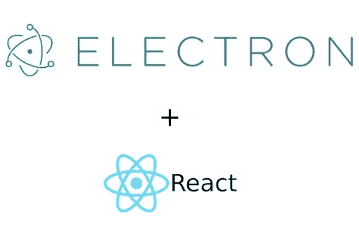
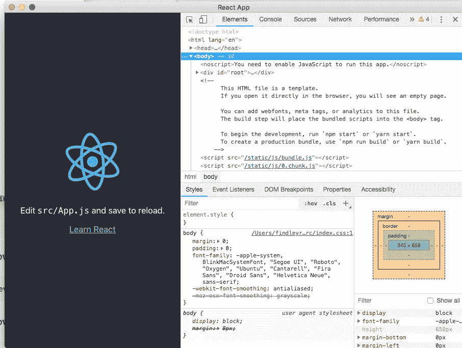

# 如何使用 Create React App 和 Electron Builder 创建电子应用程序

> 原文：<https://medium.com/hackernoon/how-to-build-an-electron-app-using-create-react-app-and-electron-builder-2929dab30b0b>



我最近决定开发一个桌面应用程序来下载和存档我所有的谷歌照片。我真的很担心会丢失我所有的照片。谷歌有几个选择，但他们都有自己的问题。

如果你想用这个应用程序下载并存档你所有的谷歌照片，你可以在这里下载 [OSX](https://finbits.io/downloads/photosdownloader-0.1.1.dmg) 和这里[赢](https://finbits.io/downloads/photosdownloader-0.1.1.exe)。

我决定使用电子和反应。这个堆栈真的很有趣，应用程序也很不错。

在这篇博客中，我将分享我的设置，并讨论我遇到的一些问题。

我在做最初的开发时利用了这些博客， [1](/@kitze/️-from-react-to-an-electron-app-ready-for-production-a0468ecb1da3) & [2](https://medium.freecodecamp.org/building-an-electron-application-with-create-react-app-97945861647c) (感谢各位)。

好了，让我们来学习如何使用 Create React App 构建一个电子应用程序，并使用 Electron Builder 将其打包以供分发。

让我们看看整个堆栈，然后开始。如果您想直接跳到[示例应用](https://github.com/rgfindl/electron-cra-boilerplate)，请随意。

# 堆栈

*   [电子](https://electronjs.org/)
*   [React —创建 React 应用](https://github.com/facebook/create-react-app)
*   [重新编写](https://github.com/harrysolovay/rescripts)
*   [电子生成器](https://github.com/electron-userland/electron-builder)

[Electron](https://electronjs.org/) 是一个使用 web 技术(如 JavaScript、HTML 和 CSS)创建本地应用程序的框架。在我们的例子中，我们将使用 React。

React 是用于构建用户界面的 JavaScript 库…等等。

为了简化 React 设置，我们将使用[创建 React 应用](https://github.com/facebook/create-react-app)。Create React App (CRA)非常棒，因为它节省了大量时间，消除了配置的麻烦。

Create React App 是一款工具(由脸书的开发人员开发)，在开发 React 应用时，它会给你一个很好的开端。它为您节省了耗时的设置和配置。您只需运行一个命令，Create React App 就可以设置启动 React 项目所需的工具。

[脚本](https://github.com/harrysolovay/rescripts)允许我们在不弹出的情况下定制 CRA 设置。

驱逐 CRA 是你真正想要避免的事情，因为你将不再受益于 CRA 未来的改善。

[电子构建器](https://github.com/electron-userland/electron-builder)用于打包我们的桌面 app 进行分发。

# 开发设置

使用 Create React App 创建我们的新应用程序。

```
npx create-react-app my-app 
cd my-app
```

添加电子。

```
yarn add electron electron-builder --dev
```

添加一些我们需要的开发工具。

```
yarn add wait-on concurrently --dev 
yarn add electron-is-dev
```

用以下内容创建一个新文件`public/electron.js`。

```
const electron = require('electron');
const app = electron.app;
const BrowserWindow = electron.BrowserWindow;

const path = require('path');
const isDev = require('electron-is-dev');

let mainWindow;

function createWindow() {
  mainWindow = new BrowserWindow({width: 900, height: 680});
  mainWindow.loadURL(isDev ? '[http://localhost:3000](http://localhost:3000/)' : `file://${path.join(__dirname, '../build/index.html')}`);
  if (isDev) {
    // Open the DevTools.
    //BrowserWindow.addDevToolsExtension('<location to your react chrome extension>');
    mainWindow.webContents.openDevTools();
  }
  mainWindow.on('closed', () => mainWindow = null);
}

app.on('ready', createWindow);

app.on('window-all-closed', () => {
  if (process.platform !== 'darwin') {
    app.quit();
  }
});

app.on('activate', () => {
  if (mainWindow === null) {
    createWindow();
  }
});
```

将以下命令添加到 package.json `scripts`标记中。

```
"electron-dev": "concurrently \"BROWSER=none yarn start\" \"wait-on http://localhost:3000 && electron .\""
```

这个脚本将一直等到 CRA 在 localhost:3000 上运行 React 应用程序，然后才启动 Electron。

将下面的`main`标签添加到 package.json 中

```
"main": "public/electron.js",
```

现在，您的 package.json 应该看起来像这样。

```
{
  "name": "my-app",
  "version": "0.1.0",
  "private": true,
  "dependencies": {
    "electron-is-dev": "^1.0.1",
    "react": "^16.8.3",
    "react-dom": "^16.8.3",
    "react-scripts": "2.1.5"
  },
  "main": "public/electron.js",
  "scripts": {
    "start": "react-scripts start",
    "build": "react-scripts build",
    "test": "react-scripts test",
    "eject": "react-scripts eject",
    "electron-dev": "concurrently \"BROWSER=none yarn start\" \"wait-on [http://localhost:3000](http://localhost:3000/) && electron .\""
  },
  "eslintConfig": {
    "extends": "react-app"
  },
  "browserslist": [
    ">0.2%",
    "not dead",
    "not ie <= 11",
    "not op_mini all"
  ],
  "devDependencies": {
    "concurrently": "^4.1.0",
    "electron": "^4.0.6",
    "electron-builder": "^20.38.5",
    "wait-on": "^3.2.0"
  }
}
```

此时，您可以通过以下方式在开发模式下运行您的新应用:

```
yarn electron-dev
```

您应该会看到类似这样的内容:



如果你看到那张图片，恭喜你已经准备好开发你的应用了。耶！

现在，如果你像我一样需要访问`fs`模块，你会很快遇到`Module not found`错误。见[此处](https://stackoverflow.com/questions/35428639/how-can-i-use-fs-in-react-with-electron)。

为了解决这个问题，我们需要使用`electron-renderer`作为网络包目标…但我们不想让 CRA 去做。所以我们用[重写](https://github.com/harrysolovay/rescripts)。让我展示给你看。

首先，安装脚本。

```
yarn add @rescripts/cli @rescripts/rescript-env --dev
```

然后，将`package.json`中的`scripts`标签从这个…

```
"start": "react-scripts start", 
"build": "react-scripts build", 
"test": "react-scripts test",
```

敬这个。

```
"start": "rescripts start", 
"build": "rescripts build", 
"test": "rescripts test",
```

现在添加一个名为`.rescriptsrc.js`的新文件，内容如下:

```
module.exports = [require.resolve('./.webpack.config.js')]
```

最后添加另一个名为`.webpack.config.js`的新文件，内容如下:

```
// define child rescript module.exports = config => { config.target = 'electron-renderer'; return config; }
```

现在你可以使用`fs`模块了，不用担心。

# 程序包设置

太棒了，现在我们可以打包我们的应用了。

首先，添加电子构建器和类型脚本:

```
yarn add electron-builder typescript --dev
```

默认情况下，CRA 使用绝对路径构建 index.html。这将失败时，加载它在电子。有一个配置选项可以改变这一点。

在`package.json`中设置`homepage`属性。

```
"homepage": "./",
```

接下来让我们添加新的`electron-pack`命令来打包构建。

将以下内容添加到`package.json`中的`scripts`标签。

```
"postinstall": "electron-builder install-app-deps", 
"preelectron-pack": "yarn build", 
"electron-pack": "build -mw"
```

`"postinstall": "electron-builder install-app-deps"`将确保您的原生依赖项始终与电子版本相匹配。

`"preelectron-pack": "yarn build"`将建造 CRA。

`"electron-pack": "build -mw"`为 Mac (m)和 Windows (w)打包应用程序。

在运行这个命令之前，我们必须配置电子生成器。

将以下内容添加到`package.json`。

```
"author": {
  "name": "Your Name",
  "email": "your.email@domain.com",
  "url": "[https://your-website.com](https://your-website.com/)"
},
"build": {
  "appId": "com.my-website.my-app",
  "productName": "MyApp",
  "copyright": "Copyright © 2019 ${author}",
  "mac": {
    "category": "public.app-category.utilities"
  },
  "files": [
    "build/**/*",
    "node_modules/**/*"
  ],
  "directories": {
    "buildResources": "assets"
  }
}
```

你可以在这里看到所有的电子生成器选项。

您还需要创建一个名为`assets`的目录，您可以在其中添加应用程序图标。检查[这里的](https://www.electron.build/icons)以查看这些图标的格式。

下面是整个`package.json`的样子。

```
{
  "name": "my-app",
  "description": "Electron + Create React App + Electron Builder",
  "version": "0.1.0",
  "private": true,
  "author": {
    "name": "Your Name",
    "email": "your.email@domain.com",
    "url": "[https://your-website.com](https://your-website.com/)"
  },
  "build": {
    "appId": "com.my-website.my-app",
    "productName": "MyApp",
    "copyright": "Copyright © 2019 ${author}",
    "mac": {
      "category": "public.app-category.utilities"
    },
    "files": [
      "build/**/*",
      "node_modules/**/*"
    ],
    "directories": {
      "buildResources": "assets"
    }
  },
  "dependencies": {
    "electron-is-dev": "^1.0.1",
    "react": "^16.8.3",
    "react-dom": "^16.8.3",
    "react-scripts": "2.1.5"
  },
  "homepage": "./",
  "main": "public/electron.js",
  "scripts": {
    "start": "rescripts start",
    "build": "rescripts build",
    "test": "rescripts test",
    "eject": "react-scripts eject",
    "electron-dev": "concurrently \"BROWSER=none yarn start\" \"wait-on [http://localhost:3000](http://localhost:3000/) && electron .\"",
    "postinstall": "electron-builder install-app-deps",
    "preelectron-pack": "yarn build",
    "electron-pack": "build -mw"
  },
  "eslintConfig": {
    "extends": "react-app"
  },
  "browserslist": [
    ">0.2%",
    "not dead",
    "not ie <= 11",
    "not op_mini all"
  ],
  "devDependencies": {
    "@rescripts/cli": "^0.0.10",
    "@rescripts/rescript-env": "^0.0.5",
    "concurrently": "^4.1.0",
    "electron": "^4.0.6",
    "electron-builder": "^20.38.5",
    "typescript": "^3.3.3333",
    "wait-on": "^3.2.0"
  }
}
```

现在我们准备打包应用程序。运行此命令来打包应用程序。

```
yarn electron-pack
```

您将在`dist`目录下看到打包的工件。

就是这样。是时候编写您的应用程序并构建一些令人惊叹的东西了。

下面是[样例 app](https://github.com/rgfindl/electron-cra-boilerplate) 。

我希望这个博客有所帮助。下次见。

*最初发表于*[*finbits . io*](https://finbits.io/blog/electron-create-react-app-electron-builder/)*。*