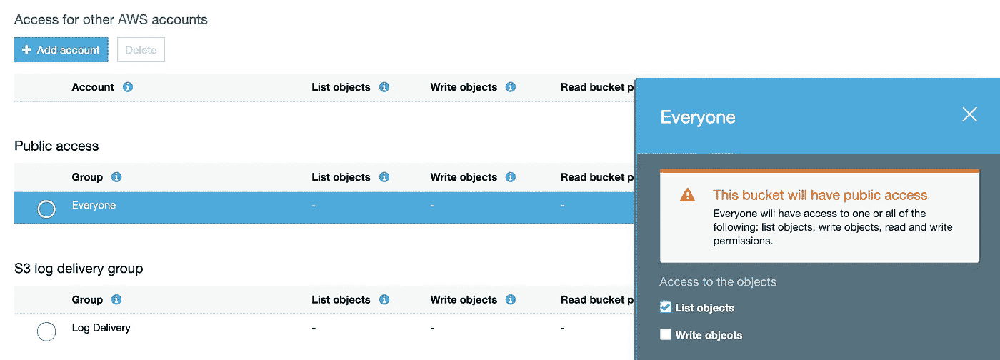
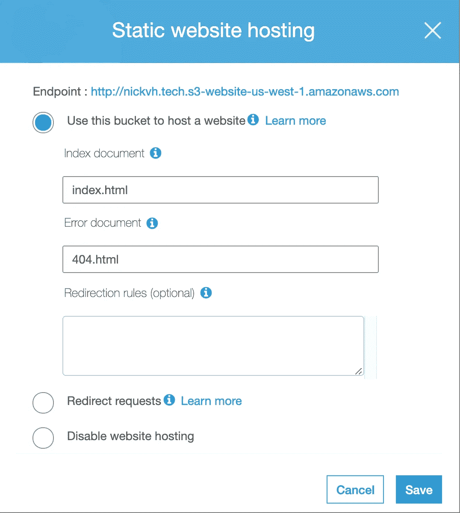
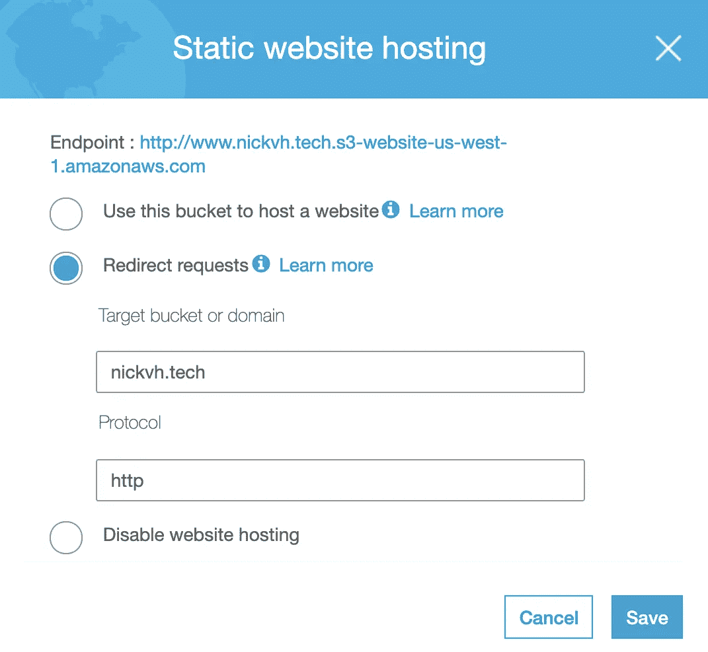
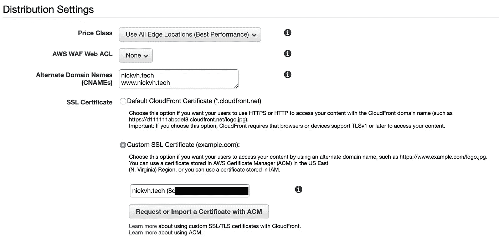
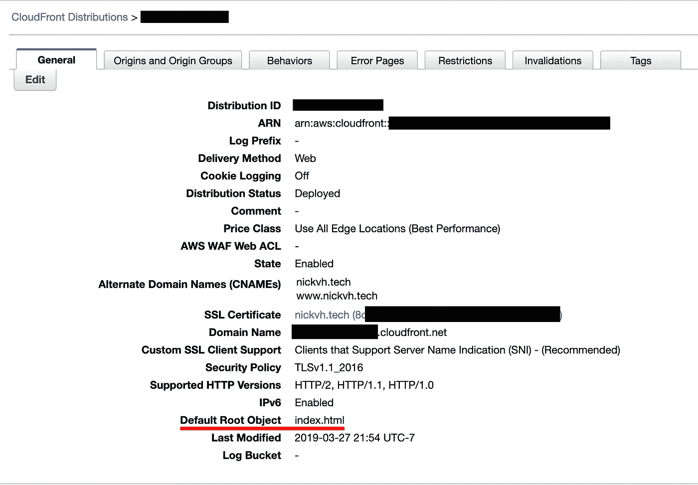
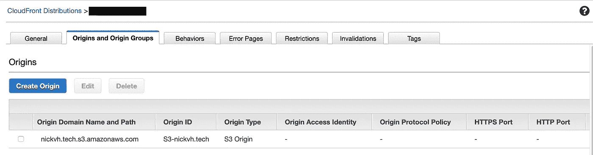
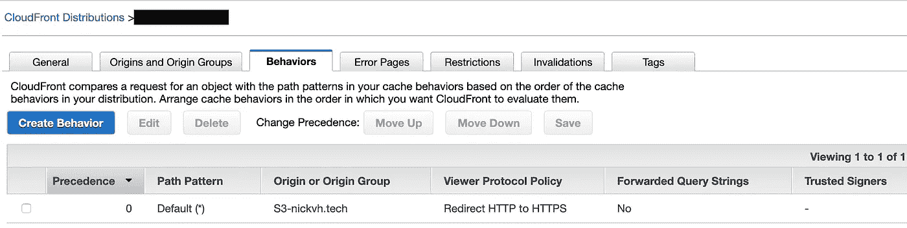
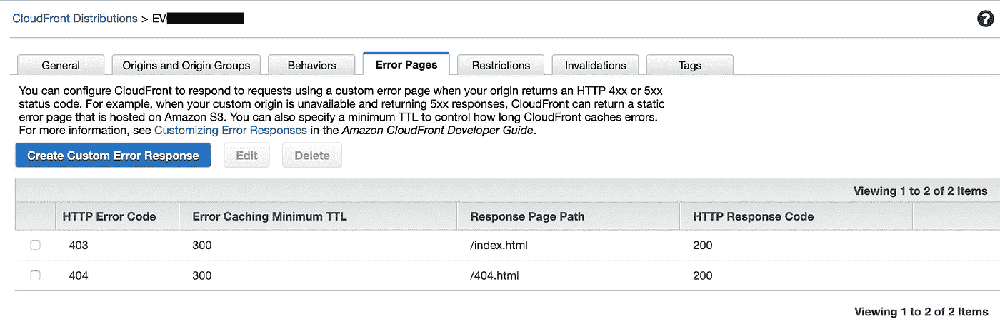
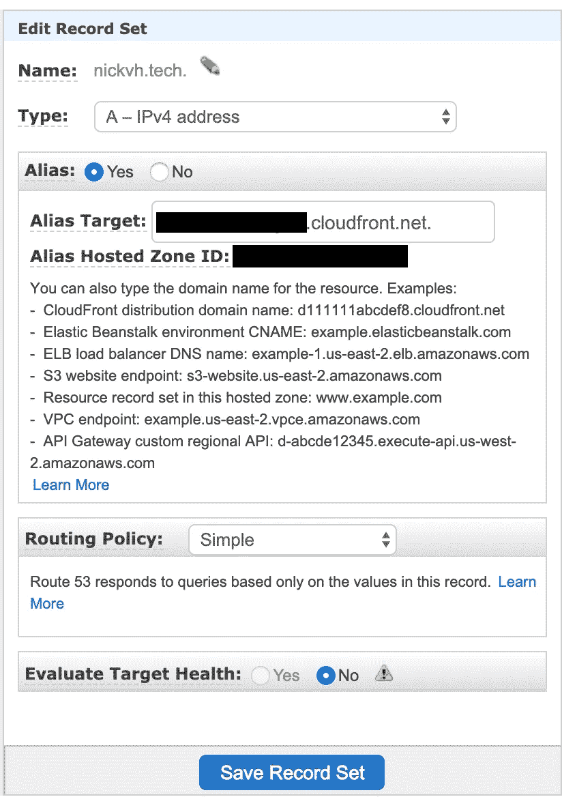

# 如何用 AWS S3、Route53 和 CloudFront 构建和部署一个漂亮的静态站点🔥

> 原文：<https://medium.com/hackernoon/how-to-build-and-deploy-a-beautiful-personal-portfolio-site-with-aws-s3-route53-and-cloudfront-af125ccbb1c2>

*这是一个循序渐进的指南，旨在创建一个响应性的静态广告牌/组合网站，通过 AWS 将其部署到网络上，并通过 HTTPS 安全地提供服务。*

本指南是为初级和中级软件工程师和 web 开发人员设计的，他们正在寻找一种比 SquareSpace 或其他网站建设者更便宜的创建个人网站的简单方法。基本的技术要求包括 HTML/CSS/JS、npm 和 Git 的知识(高级站点创建过程使用 Gatsby.js，它需要 React.js 和 GraphQL 的知识)。

*唯一的经济要求是 AWS Route53 托管区费用(每月 0.50 美元)和获得一个域名的成本(我从 get.tech 以 25 美元的价格租用了 nickvh.tech，为期五年)。根据个人技能和经验，预计时间承诺为四到五个小时。*

*本指南将使你，开发者，能够控制你的网站的设计、开发和部署的所有方面。*

## 第一步——创建你的个人网站(简单还是困难)

**这里有一个简单的方法-** 到[这里](https://html5up.net/)选择一个完全响应的、超级可定制的、100%免费的(在[知识共享](https://html5up.net/license)下)HTML/CSS/JS 模板。下载它，定制/构建它，直到你爱上它！

在你选择的项目的根目录中调用`npm init`。确保`git init`，将所有非公开信息添加到`.gitignore`，并编写出色的提交消息。

**下面是最难的方法——**使用 Gatsby.js 从头开始构建一个速度极快的静态站点和 PWA。这不是一个 Gatsby.js 教程(很多很棒的教程可以在这里找到)并且需要 React.js 和 GraphQL 知识。在这里可以找到许多初学者模板[(我使用“strata”html 5 up 模板作为](https://www.gatsbyjs.org/starters/?v=2) [nickvh.tech](https://www.nickvh.tech/) 的起点)。

测试和开发你的网站，直到你对它感到满意，并想与世界分享。我们将在以后用 Grunt 或`gatsby-plugin-s3`插件建立一个持续的开发管道，这样将来的修改/部署将变得快速和容易。

## 步骤 2-获得一个域名

像 [https://get.tech](https://get.tech/) 或【https://www.namecheap.com】T4 这样的网站为域名提供非常诱人的价格。我等着升职，得到了[https://nick VH . tech](https://get.tech/)25 美元五年。或者从谷歌[购买一个. dev 域名。](https://domains.google/#/)

## 步骤 3-创建 AWS 帐户

创建一个 [AWS 账户](https://aws.amazon.com/premiumsupport/knowledge-center/create-and-activate-aws-account/)。这一步相当简单。新账户获得一年的免费服务——在此[概述](https://aws.amazon.com/free/)。这要求您在 AWS 上有一张有效的信用卡。**请注意安全隐患，不要不小心将您的 AWS 凭据推送到公共网站上。**

## 步骤 4-配置 AWS S3 存储桶

> 亚马逊简单存储服务(亚马逊 S3)是一种对象存储服务，提供行业领先的可扩展性、数据可用性、安全性和性能。这意味着客户可以使用它来存储和保护一系列使用案例中的任意数量的数据，例如网站、移动应用程序、备份和恢复、归档、企业应用程序、物联网设备和大数据分析。

AWS S3 是你的静态站点的所在地；为了正确配置，需要做一些事情。

首先创建一个桶；AWS S3 和 Route53 只有在您的 bucket 名称和域名完全匹配的情况下才能正常工作—将您的 bucket 命名为 mysite.domain(即 nickvh.tech)。请确保正确设置权限；公众应该能够从桶中读取，但不能向桶中写入。



Make sure to give public read access to your bucket

接下来导航到“属性”并将 AWS S3 配置为静态服务`index.html`(见下文)。



创建一个名为 [www.mysite.domain](http://www.mysite.domain) (在我的例子中为 [www.nickvh.tech](http://www.nickvh.tech) )的 bucket(也启用了公共读访问)，并重定向到主 bucket 地址(见下文)。



接下来，在项目的根目录下创建`aws-keys.json`:

这里有一个[指南](https://help.bittitan.com/hc/en-us/articles/115008255268-How-do-I-find-my-AWS-Access-Key-and-Secret-Access-Key-)来找到你的 AWS 访问密钥 ID 和秘密密钥。

**记得给你的** `.gitignore` **加上** `aws-keys.json` **！我的一个学生不小心将他们的 AWS 凭据推送到 Github，被编程攻击，几个小时内产生了约 1.3k 美元的费用。**


Don’t let this happen to you!

## 第五步——用 Grunt 或`gatsby-plugin-s3`将你的网站上传到 S3 AWS 网站

> Grunt 是一个 JavaScript 任务运行器，一个用于自动执行频繁任务的工具，例如缩小、编译、单元测试和林挺。它使用命令行界面来运行文件中定义的自定义任务。

如果你选择简单的方法来创建你的站点，你可以使用 Grunt 来上传你完成的站点文件到你的 AWS S3 桶。

```
npm install grunt grunt-aws-s3 --save-dev
```

创建一个`Gruntfile.js`:

将它添加到您的`package.json`的脚本对象中。

```
"deploy": "grunt deploy"
```

现在，无论何时您想要部署一个新的站点产品版本，只需执行`npm run deploy`。这将仅向 AWS S3 发布/上传已更改的文件，从而减少您需要付费的请求数量(新 AWS 帐户第一年每月获得 2，000 个免费上传请求)。

或者——如果你用 Gatsby.js 构建你的站点，忘记 Grunt，只使用`gatsby-plugin-s3`进行静态站点部署。我写了一个 npm 脚本`npm run ship`，它构建了产品包并上传到 AWS S3 - `gatsby build && gatsby-plugin-s3 deploy`。我的盖茨比网站的代码可以在这里找到。

## 步骤 6 —使用 AWS CloudFront 创建一个发行版

> Amazon CloudFront 是一种快速内容交付网络(CDN)服务，它在一个对开发人员友好的环境中，以低延迟、高传输速度向全球客户安全地交付数据、视频、应用程序和 API。

创建一个新的 CloudFront 发行版(大致遵循这些 [AWS 文档](https://aws.amazon.com/premiumsupport/knowledge-center/cloudfront-https-requests-s3/))。确保正确指定**备用域名** **(CNAMEs)** ，并请求自定义 SSL 证书以启用 HTTPS。



同样指定**默认根对象**为`index.html`。



Remember to specify Default Root Object

点击 Create Origin 将您的 S3 bucket 链接到您的 CloudFront 发行版。将**源域名**指定为`YOUR_S3_BUCKET_NAME.s3.amazonaws.com`。不要限制铲斗的进出。



CloudFront Distribution Origin

创建一个新行为，并将**查看器协议策略**设置为“将 HTTP 重定向到 HTTPS”



CloudFront Distribution Behaviors

您还可以定制错误响应——我将 404 错误重定向到一个定制的 404.html 页面。



CloudFront Error Pages

## 步骤 7-使用 AWS Route53 将流量重定向到您的新 CDN

> Amazon Route 53 是一个高度可用和可扩展的云[域名系统(DNS)](https://aws.amazon.com/route53/what-is-dns/) web 服务。它旨在为开发者和企业提供一种极其可靠和经济高效的方式，通过将像[www.example.com](http://www.example.com)这样的名字翻译成像 192.0.2.1 这样的数字 IP 地址，让计算机相互连接，从而将最终用户路由到互联网应用程序。

现在，我们需要将您的域名(mysite.domain)连接到您的 CloudFront 发行版，以便当用户向您的域发出请求时，他们会收到您的`index.html`和您的静态站点的其余部分(通过点击您新创建的 CDN)。

打开 AWS Route53 控制台，创建一个新的**托管区域**。这里有一些帮助你开始的 AWS 文档。

**确保更新您购买的域名服务器。使用您购买的域的注册商提供的方法来更改该域的名称服务器(使用在 NS —名称服务器记录集中找到的四个 Route53 名称服务器)。**

创建一个新的记录集，并将别名目标设置为您的 AWS CloudFront 发行版(见下文)。确保将其命名为 yoursite.domain。



Alias your CloudFront distribution

对域名服务器的更改需要时间来传播，因此在尝试通过新域访问您的站点之前，请确保等待几分钟。

## 第 8 步—享受新部署站点的荣耀！(或解决问题)

你做到了！享受部署到万维网上的美丽的新投资组合网站。查看我的网站[我使用这个技术栈构建和部署的网站](http://nickvh.tech);我使用本指南[将联系表与 AWS Lambda 连接起来。](https://dev.to/adnanrahic/building-a-serverless-contact-form-with-aws-lambda-and-aws-ses-4jm0)


Enjoy your new beautiful portfolio site! [html5up.com](http://html5up.com)

> *阅读下一条:*
> 
> [scrabbler——一款 react-dnd 和 react-flip-move 的 React 游戏](https://hackernoon.com/scrabblr-a-react-game-with-react-dnd-and-react-flip-move-40cfaac786e2)