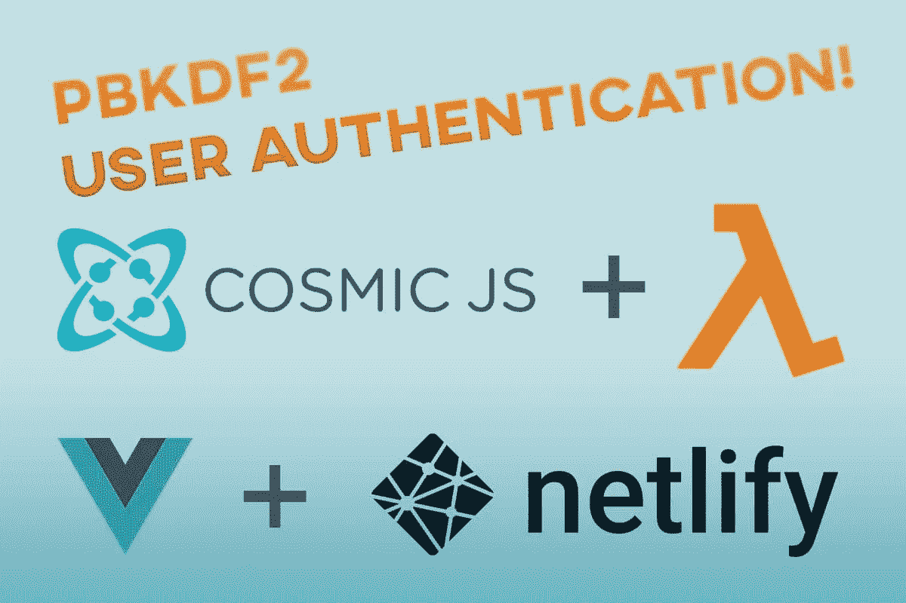
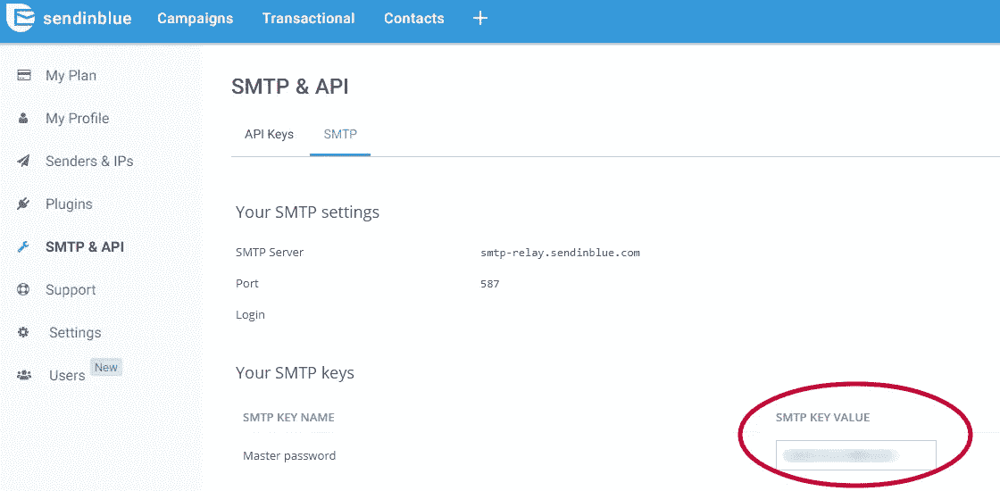
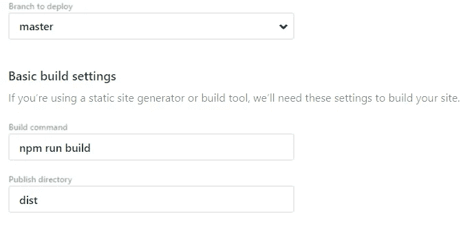

# 如何使用 Cosmic JS、Vue 和 Lambda 构建认证

> 原文：<https://medium.com/hackernoon/how-to-build-authentication-using-cosmic-js-vue-and-lambda-e0e243d9b90b>



在本教程中，我将向您展示在部署到 Netlify 之前，我如何使用 Cosmic JS 和 AWS Lambda 构建一个带有身份验证的 Vue.js 应用程序。让我们开始吧。

# TL；速度三角形定位法(dead reckoning)

[演示链接](https://cosmicjs.com/apps/vue-cosmic-auth)
[在 Github 上查看代码](https://github.com/cosmicjs/vue-authentication)

# 特征

*   网络虚拟主机(加上 CDN、预渲染、缩小等..)
*   验证接口的组件
*   AWS Lambda 通过网络功能
*   用于数据库 API 的 Cosmic JS
*   使用 PBKDF2 和 Salt 进行密码哈希
*   通过 SendinBlue 使用 Nodemailer 进行电子邮件验证

# 需要改进

*   密码重置功能
*   用户头像支持

# 先决条件

在启动之前，您需要拥有节点 JS 和 npm。确保您已经安装了它们。如果没有，你可以在这里找到他们:[https://nodejs.org](https://nodejs.org/)

为了进行部署，您需要一个 Netlify 帐户。

另外，对于 SMTP 服务器发送电子邮件验证链接，我使用的是 [SendInBlue](https://www.sendinblue.com/) ，因为他们每天给你 300 封免费邮件。

# 项目结构

**重要注意事项:**

**~/public/_ redirects**
这个文件很重要，因为它将所有流量指向 index.html 文件，以便 vue-router 处理请求。要了解更多关于网络重定向的信息[请访问他们的文档](https://www.netlify.com/docs/redirects/)。

**~/cosmic.js**

**~/functions**
functions 目录保存了我们所有的 lambda 函数，一旦我们部署到 netlify，这些函数将自动在 AWS 上运行。我们将使用这些函数来处理 Cosmic JS 所需的散列和数据库逻辑。

# 分叉和克隆

首先，我们将分叉 GitHub 上的存储库。然后，打开命令行或终端，用以下命令将其克隆到本地机器上的项目文件夹中:

```
git clone [https://github.com/cosmicjs/vue-authentication](https://github.com/cosmicjs/vue-authentication)
```

用 BitBucket 还是 Gitlab 代替？

如果您喜欢使用不同的 git 提供程序，您可以克隆存储库并将其上传到您想要的远程。

# 安装

在您的命令行 cd 中，进入您刚才克隆的项目根目录，并运行 npm install 来下载并安装所有必需的依赖项。

# 集成宇宙 JS 桶

在你的宇宙 JS 帐户中创建一个新的桶，你想叫它什么都行。

下载这个 bucket.json 文件，在你的 cosmic JS bucket 的设置中进入导入/导出数据页面，选择并上传下载的文件。这将导入所有对象类型和占位符数据。

接下来，您需要修改项目目录中的 cosmic.js 文件，以连接到您刚刚创建的 bucket。

这是你需要的:

*   铲斗废料浆
*   API 读取访问键
*   API 写访问键

**~/cosmic.js**

# 集成 SendInBlue SMTP

为了进行电子邮件验证，您需要一个 SMTP 服务器。为了简化本教程，我将使用 [SendInBlue](https://www.sendinblue.com/) ，因为他们为您提供了 300 封免费电子邮件，并使用 Nodemailer npm 包来集成。

在你创建了一个账户后，进入你的 SMTP & API 设置来生成一个 SMTP 密钥用于 **CreateNewUser.js** Lambda 函数，你可以在“SMTP”标签下找到它。



然后输入以下 transporter 对象的电子邮件和 SMTP 密码。

**~/functions/create new user . js**

# 在本地运行您的应用

为了让 AWS Lambda 函数在本地正常运行，您需要运行以下命令:

```
npm run start:lambda
```

这将使用网络函数库启动本地函数服务器。

接下来，你需要确保你的根项目目录中有一个. env 文件来改变 VUE _ 应用程序 _ 应用程序接口 _ 主机变量，以指向你刚刚开始运行的 lambda 服务器。不然你的 app 就不行了。默认情况下，我的启动端口是 9000。

```
VUE_APP_API_HOST=http://localhost:9000/
```

之后，您可以打开另一个控制台，最后使用以下命令启动 Vue JS 应用程序:

```
npm run serve
```

为了在本地测试 API，你可能需要在禁用 CORS 的情况下运行 Chrome，你可以根据你的操作系统使用以下有用的列表找到如何做:

**视窗:**

```
"C:\Program Files (x86)\Google\Chrome\Application\chrome.exe" --disable-web-security --disable-gpu --user-data-dir=~/chromeTemp
```

**OSX:**

```
open -n -a /Applications/Google\ Chrome.app/Contents/MacOS/Google\ Chrome --args --user-data-dir="/tmp/chrome_dev_test" --disable-web-security
```

**Linux:**

```
google-chrome --disable-web-security
```

现在您可以导航到 [http://localhost:8080](http://localhost:8080) 来打开应用程序。

# 使用网络部署

转到您的 Netlify 仪表板，然后单击“[来自 Git 的新站点](https://app.netlify.com/start)”。选择你的 git 提供者(我用 GitHub)。

认证后，您可以看到您的存储库列表。选择您为之前创建的项目创建的文件，并将构建命令设置为“npm run build ”,将发布目录设置为“dist”。



接下来，您需要确保您已经设置了环境变量，并且让 VUE _ 应用程序 _ 应用程序接口 _ 主机变量指向您刚刚在 Netlify 中创建的新站点。否则你的应用程序将无法工作。

```
VUE_APP_API_HOST=https://yourNewSite.netlify.com/
```

接下来，您想要设置您的函数目录以使用“lambda ”,它将是 **/functions** 文件夹的编译版本。

# 结论

我在麻省理工学院的许可下为开源开发了这个应用程序，所以你可以随意升级、破解或破坏它。

这是使用 Cosmic JS 为用户数据库构建的..和用于哈希的密码哈希加盐库。哦，不要忘记 Vuetify，由 John Leider 和 200 多个开源贡献者开发的令人惊叹的 Vue JS 组件库。

电子邮件验证是使用 SMTP 服务器与 SendinBlue 托管，他们给你 300 个免费的跨国电子邮件。然后当然是 Vuex 的状态管理。

如果你有困难或者它对你不起作用，请在评论中告诉我，我会尽力帮助你的！或者通过 twitter [@Aaron_Vail](https://www.twitter.com/aaron_vail)