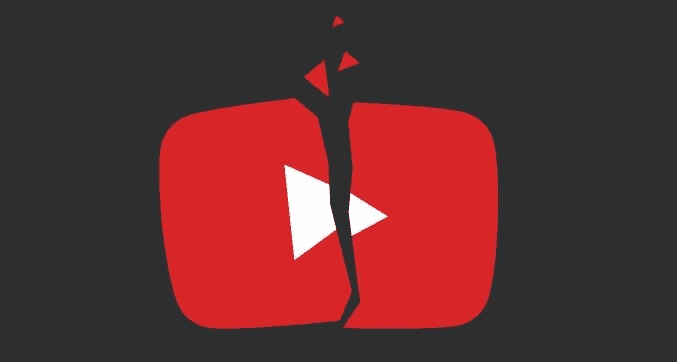
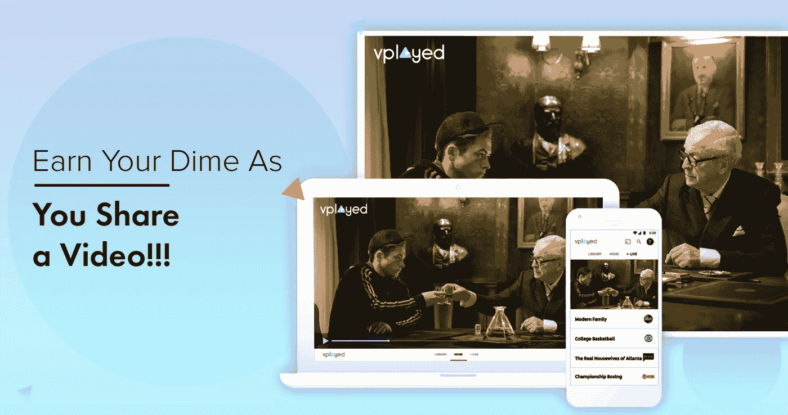

# 如何建立自己的视频分享 App(像 Youtube)？

> 原文：<https://medium.com/hackernoon/how-to-build-your-own-video-sharing-app-like-youtube-f88d234e7bd9>

video sharing

如果你对创建自己的视频分享网站很感兴趣，下面的帖子将向你保证“如何开始使用视频分享应用程序&并从中赚取利润”的宝贵建议。

> ***“YouTube 以 400 亿美元的净资产高居榜首，比其他任何视频分享网站都有价值。”***

你可能听说过这样一句话“任何视频内容的源头都是 YouTube”。世界上 90%重新分发到其他频道的视频内容都来自 YouTube。从娱乐视频到教育视频，从白宫新闻发布到在线崇拜，YouTube 一直是视频内容的目的地。

## ***对视频分享网站的广泛看法以及 YouTube 对视频内容市场的垄断***

久而久之，像 YouTube、Vimeo &网飞这样的视频分享网站的价值，由于这种趋势正在普及，其净值比率正在飙升。值得注意的是，Youtube 凭借其卓越的特性、功能和个性化占据了视频分享行业的世界。

如果谷歌的 YouTube 是股票，它将有价值至少 750 亿美元的潜力。如前所述，YouTube 正变得根深蒂固，就像脸书正成为日常生活的一部分一样。平均来说，人们每天使用 YouTube 的时间是 6 分钟。这些充满希望的见解对于企业和有抱负的媒体专业人士来说，足以启动他们自己的视频分享网站，如 YouTube、Vimeo。

> **入戏之前，YouTube 是一把双刃剑，有充足的崇高品质和陷阱让内容所有者增加收入。**

# ***最大视频分享网站——YouTube 的陷阱***

## ***缺乏小生:***

吸引每一个用户是生成视图的基调。但是，你如何将这个战略与你自己的定位联系起来呢？通过个性化主题和平台来缩小你在平台上的定位在 YouTube 上是不适用的。

## ***不道德&造假内容:***

YouTube 在增加浏览量和订户方面的表现超过了虚假内容。YouTube 不是以防止托管不道德内容的方式定制的，这些内容可能会传播假新闻并导致非法行为。

## ***大到什么都顾不上:***

这个视频分享网站没有一个完整的管理仪表板来跟踪详细的视频分析。网站内太多的内容所有者会导致大量的视频内容上传。这导致资产无法管理。

## ***混合货币化模式***

YouTube 上优质内容的货币化程度还不足以让内容所有者产生大量收入。盈利模式很少，任何用户都可以观看视频内容。每个人都可以查看您的重要资产，这限制了特定优质视频内容的收入。

那么，你怎样才能像 YouTube 一样建立自己的视频分享网站，超越这些陷阱，并从最终用户观看的视频内容中获得更多收入呢？建立一个像 YouTube 一样的视频分享网站的可能性，Vimeo 不再是一个复杂的任务。从根本上来说，你应该了解将会影响你将要建立的视频分享网站的整体性能的最终特性。

# ***增强性能的必备特性***

***拖动&放下/远程上传视频:***

拖放功能有助于从本地磁盘、Dropbox、Google drive 等上传“N”个视频。借助远程视频功能，您可以从 HTTP 或 FTP 位置自动上传视频/音频内容。

***帧预览:***

在视频共享平台中，使用理想的视频预览框更改或定制每个视频的缩略图。该功能提供了最大数量的不同缩略图选项，以托管来自本地磁盘或云的视频。

***多通道支持***

该功能使用户能够上传和共享视频，播放列表，订阅不同的配置文件或从频道管理页面的默认频道。

***播放列表:***

该功能通过在网站中添加最喜爱的视频和歌曲，为最终用户带来了完全的个性化，从而提供了有效的播放体验。

***响应式设计:***

使您的最终用户能够使用多种设计、模板、字体等定制整个视频共享网站或频道，以满足他们的偏好。

***社交媒体分享:***

该功能将让用户在脸书、推特、Instagram 等社交媒体上无缝分享最受欢迎的视频，以提高参与度。

***货币化模式:***

视频分享网站必须拥有一套多样化的盈利模式，如订阅、按次付费、广告等，以从所有视频内容中产生收入。

***多层安全:***

在多层安全 DRM、水印等下确保整个视频资产安全的重要因素之一，以防止未经授权的访问。

所以，现在你已经完成了视频分享网站必须具备的基本功能。由于视频分享网站仍然是一项利润丰厚的业务，开发 one 的需求一直是企业和商业人士的复杂问题。

市场上挤满了大量的视频流解决方案提供商，他们开发自己的视频共享网站和应用程序，如 YouTube、Vimeo。介绍 Vplayed 是服务于全球视频内容市场的领先视频流解决方案提供商之一。

# ***v played——一个未来的视频流解决方案***

Vplayed — Video Streaming Solution

[**Vplayed**](https://www.vplayed.com/video-on-demand-solution.php?utm_source=Build%20Video%20Sharing%20App&utm_medium=InContentLink&utm_campaign=Hackernoon) 为全球客户的内容所有者、广播公司和企业提供完全可定制的直播、视频点播、OTT 和音频流解决方案。凭借先进的技术、功能和熟练的开发人员，Vplayed 让建立一个像 YouTube 一样的企业视频分享网站的梦想变成了现实。

***那么，是什么让 Vplayed 成为内容所有者企业的理想视频分享解决方案提供商&？***

Vplayed 作为一家视频流解决方案提供公司，拥有 300 多名内部开发人员，帮助每个企业建立一个视频共享网站，该网站具有先进的功能和技术，与 YouTube 相比提高了性能。Vplayed 提供灵活的托管可能性和坚实的安全层，以保护每一段视频内容免受未经授权的访问。定制一直是 Vplayed 拥有的重要功能，以适应您的业务期望。

***交给你:***

视频分享网站是其中一种，被认为是最赚钱的业务，将在未来几年蓬勃发展。对于那些有抱负的内容所有者和商业人士来说，随着软件技术的日益进步，建立一个像 YouTube 一样的视频分享网站 变得很简单。唯一需要考虑的因素是，策划您的视频内容业务理念，并与适合您业务需求的正确解决方案合作。