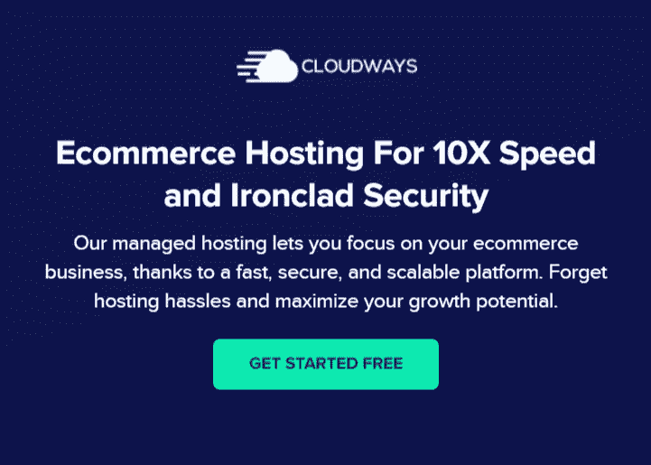
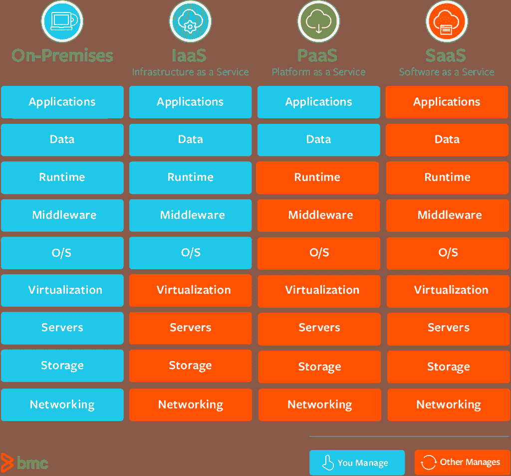
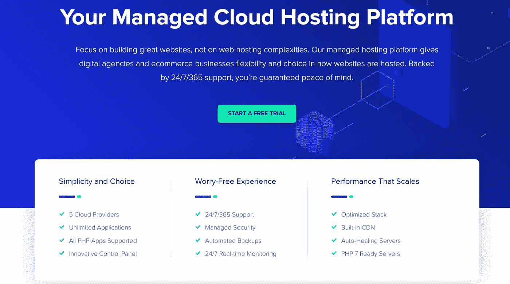
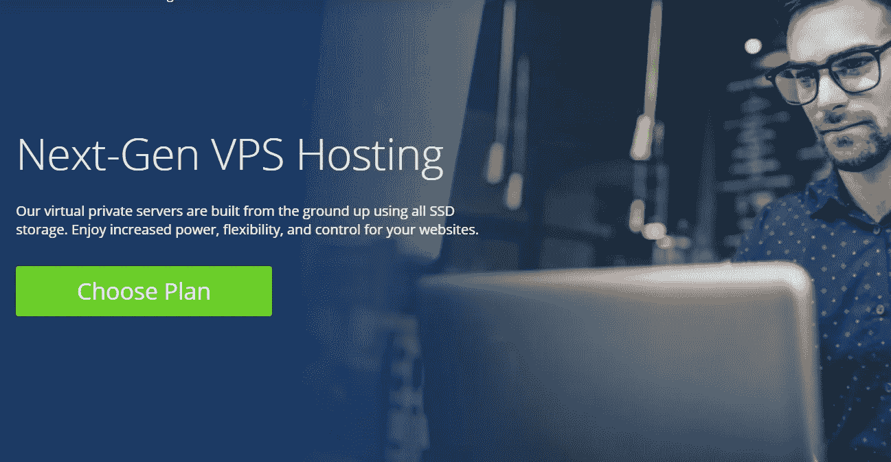

# 电子商务如何选择云托管:SaaS vs PaaS vs IaaS

> 原文：<https://medium.com/hackernoon/how-to-choose-cloud-hosting-for-ecommerce-saas-vs-paas-vs-iaas-f710c6295b8d>

电子商务的云主机现在正在大肆宣传，原因有几个:更快的网站速度和性能，高正常运行时间和可用性，非常容易扩展服务器资源，冗余的服务器环境，灵活的定价系统。

每个电子商务所有者都在考虑迁移到云，因为超过一半的公司已经在那里了。但是也有一些缩写会造成混淆。让我们看看什么是 SaaS、PaaS、IaaS，以及电子商务如何让这些云模式受益。

[**CLOUDWAYS**](https://www.cloudways.com/en/?id=601964) — ECOMMERCE CLOUD HOSTING

# 什么是 SaaS、PaaS、IaaS？

*   **SaaS** —软件即服务——例如，Gmail 或其他云应用；客户端使用应用程序，应用程序的基本设置由提供商管理。
*   **PaaS** —平台即服务—客户端控制应用程序，操作系统由提供商控制；
*   **IaaS** —基础设施即服务*，*例如虚拟服务器和虚拟网络；客户端可以安装任何操作系统、软件和应用程序；

简而言之，任何上述服务的目的是消除部署和支持您的电子商务网站的时间和财务成本的一部分。整个区别在于，你将为自己保留哪一部分顾虑，以及将哪一部分交给[云托管提供商](https://m.do.co/c/262524ebc480)的管理层。

# 电子商务中的 SaaS

在网站托管方面，SaaS 是一个完全现成的平台。您不必部署和支持您网站的代码。你唯一要负责的事情——网上商店的内容和视觉效果。

电子商务中 SaaS 最好的例子是 Shopify。有了 Shopify，你唯一需要做的就是支付订阅费。其他的都在 Shopify 团队。

您可以访问产品、分析、附加应用程序、主题和其他管理功能，但不要为代码和服务器的部署和维护费心。

[Bigcommerce](https://www.bigcommerce.com) 是另一个 SaaS 平台，处理编码、托管和更新每月收费的部分。

## 何时使用 SaaS

如果出现以下情况，您应该考虑使用 SaaS:

*   你想测试你的商业理念，但还没有准备好投入巨资进行托管
*   你想让你的网站快速运行起来
*   你想玩短期或季节性游戏

# 电子商务中的 PaaS

PaaS 介于典型的共享托管和 SaaS 之间。

作为这种电子商务云托管模式的一部分，您不需要管理操作系统和系统软件。你提供了一个平台，在这个平台上你可以建立自己的电子商务网站。借助 PaaS，您可以上传内容、定制代码和管理数据库。但是你将从服务器管理中分离出来:它的硬件和软件。

电子商务中 PaaS 的最佳例子是 Magento Commerce Cloud 或 [Bluehost](https://www.bluehost.com/track/aremistudio/) 。有了这个解决方案，你就有了主机，但仍然可以编辑商店的源代码，为 Magento 开发你的定制应用程序。

除此之外，你可以使用其他流行的 PaaS 提供商:Heroku，AWS Elastic Beanstalk，Windows Azure，Google App Engine。

您可以通过[托管云托管提供商](https://www.cloudways.com/en/?id=601964)轻松管理它们。

[Cloudways](https://www.cloudways.com/en/?id=601964) — managed cloud hosting platform

## 何时使用 PaaS

在以下情况下，PaaS 是有益的，甚至是必要的:

*   你使用自托管 CMS 或自定义开发的网站。
*   你需要访问你的电子商务网站的代码
*   你想安装其他应用程序或软件

# 电子商务中的 IaaS

当从 IaaS 提供商那里为您的电子商务网站租赁虚拟基础架构时，您可以使用各种规模的 IaaS 服务:虚拟服务器(VPS / VDS)和虚拟网络。

在第一种情况下，您租用一台虚拟服务器；在第二种情况下，您可以租用一个虚拟服务器池，并可以将它们连接到一个虚拟网络中。

您在租用的虚拟服务器中获得完全的管理权限。这些服务器的所有操作系统设置都需要你自己完成:安装软件，配置防火墙等。当然，如果您遇到困难，IaaS 提供商的支持服务可以回答您的问题。一些供应商甚至可以为你做一些收费的设置工作。

最初，IaaS 提供商只确保您的服务器可以根据服务级别协议(SLA)通过网络访问。

IaaS 提供商的主要任务是安装和维护设备和基础设施软件。构建虚拟基础架构的硬件位于专门的数据处理中心(DPC)中。这些中心提供冗余的通信信道、断电保护等等。因此，一切与设备的正常运行时间和可用性直接相关的事情将不再困扰您。

## 何时使用 IaaS

正如 SaaS 和 PaaS 一样，在某些情况下，您可以更好地使用 IaaS:

*   这种云托管模式最适合大型在线商店或市场，在这些地方，所有者希望完全控制他们的业务和网站。
*   这对成长中的公司也有好处，因为它们不知道自己扩张的速度有多快。IaaS 有助于按需即时增减服务器资源。

## IaaS 提供商

如今，大多数托管公司都提供虚拟主机，但也有专门的云托管提供商。

我们在 Elligense 使用 [DigitalOcean](https://m.do.co/c/262524ebc480) 在云端托管我们客户的[电子商务解决方案](https://elligense.com/solutions/ecommerce)，因为根据使用的便利性、功能和价格，我们发现这是最佳选择。

> **获得 100 美元免费信用，以下** [**此链接**](https://m.do.co/c/262524ebc480) **。**

最棒的用户友好提供商是 Bluehost。

[Bluehost VPS page](https://www.bluehost.com/track/aremistudio/)

不过，你也可以看看 [Linode](https://www.linode.com/) 、[亚马逊网络服务(AWS)](https://aws.amazon.com/) 、 [Rackspace](https://www.rackspace.com/) 、[微软 Azure](https://azure.microsoft.com/) 、[谷歌云](https://cloud.google.com/)。

# 如何为电子商务选择云托管

上面提到的每个云模型都有自己的特性和特征。为了总结和帮助您选择，我们来提醒一下每种型号最适合哪些情况:

*   [**SaaS** (软件即服务)](https://www.shopify.com/?ref=danikfedirko):如果你规模小，想快速起步，又不想为编码和托管费心。
*   [**PaaS** (平台即服务)](https://www.bluehost.com/track/aremistudio/):如果你需要访问代码、存储、数据库。
*   [**IaaS** (基础设施即服务)](https://m.do.co/c/262524ebc480):如果你想控制从服务器的操作系统到软件和运行时的整个基础设施。

无论您选择 SaaS、PaaS 还是 IaaS，迁移到云都是不错的选择，因为这是企业的未来。我希望这份材料能帮助你理解各种“即服务”模式，并为你的电子商务网站选择合适的云主机。

> 如果您需要帮助将您的业务迁移到云，请填写免费的[联系 Elligense](https://elligense.com/contact-us) ，我们可以帮助您。