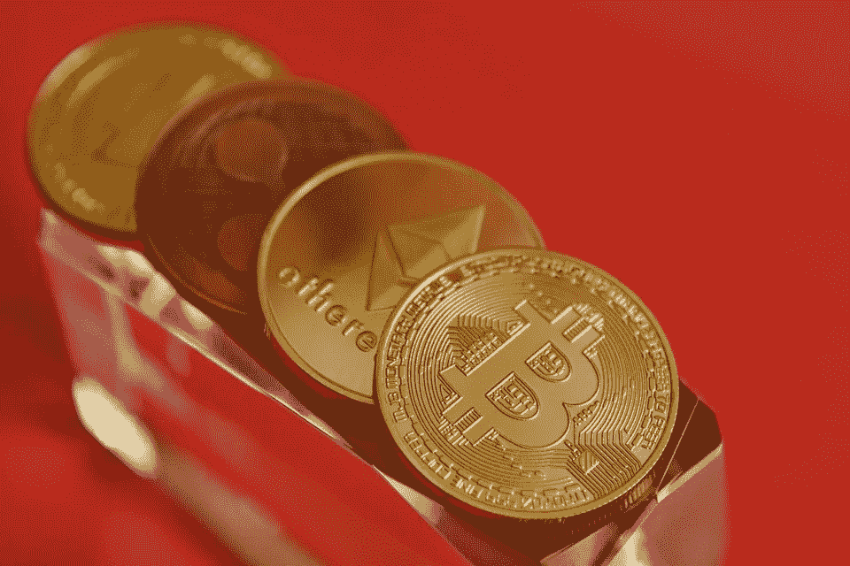

# 如何选择你的比特币和加密货币钱包

> 原文：<https://medium.com/hackernoon/how-to-choose-your-bitcoin-and-crypto-currency-wallet-924a8880cb00>

Photo by [vjkombajn](https://pixabay.com/fr/users/vjkombajn-764634/) on [Pixabay](http://www.pixabay.com)

使用比特币和其他加密货币的工具数不胜数，但并非所有工具都有相同的特征或相同的优缺点。这是你需要知道的关于电子钱包的一切，精选了最好的多重加密钱包。

电子钱包(或“电子钱包”)是使用加密货币的基本工具。它用于存储、发送、接收，有时还用于交换加密货币。因此，选择合适的钱包至关重要，因为它既能保证你的钱的安全，又能对你的钱进行日常管理(从这个角度来看，钱包可以被视为银行类服务的未来)。

虽然加密货币正在传播并变得更加民主，但钱包是加密世界的核心元素，就像网络浏览器是互联网的一部分。

必须明白，钱包的数量是相当可观的。现有的 2000 种加密货币通常都有自己的钱包，主要的加密货币(特别是比特币、以太坊、莱特币)可以由许多钱包和服务管理。

# 世卫组织控制了你的比特币？

在网上搜索的时候，你会发现不同类型的比特币钱包有很多不同之处。热钱包或冷钱包、多签名或非多签名、移动或桌面、在线或离线等。

这些区别很有趣，但往往掩盖了钱包的主要特征:存储比特币的地址是以何种具体方式创建的，以及谁拥有控制权。

从这个角度来看，事实上有两种(且只有两种)比特币钱包:依赖于管理密钥的服务的钱包(称为“保管钱包”)，以及自控的钱包(非保管钱包)。

在第一种情况下，说你有比特币钱包是用词不当:你实际上有权访问第三方公司为你创建和维护的比特币钱包。第二种情况，你拥有(完全独立)自己的比特币钱包(以及里面的比特币)。

在不涉及技术细节的情况下，区别在于与比特币和密码相关的密钥的创建方式。如果要打个比方，想象一下你在银行租了一个保险箱。每当你想打开你的保险箱时，你提供身份证明和签名，银行给你打开保险箱的钥匙(离开前你必须留下钥匙)。因此，你并不真正拥有保险箱和它的钥匙，你只是作为银行提供的服务的一部分，有一个进入的权利。在第二种情况下(非保管)，你不仅是保险箱(在家里)的真正主人，而且你是制作钥匙的人，除了你之外，没有人能接触到这些钥匙。

因此，监禁和非监禁之间的这种区别是非常基本的，并涉及许多后果。

## **1。** **服务(保管钱包)**

**优点:**从外观上看，这个很简单，不头疼。你依赖一家为你管理密码的公司。你只需要一个登录名和密码就可以进入你的角落，实际上，这些信息都存储在这家公司的钱包里。

**缺点**:你什么都不能控制(尤其不能控制交易费或提现)。这些服务是黑客最喜欢攻击的目标。过去曾发生过“大声”黑客攻击，一旦发生，你就有失去一切的风险。一些服务，包括加密银行和许多交易所，需要大量的文件和身份证明(也可能向当局报告你的资产)。

在这一类别中，绝大多数是传统的交易所(交易所)，提供银行服务的公司，可能还有一些其他的“钱包托管”解决方案。

## **2。** **用户控制钱包(非保管钱包)**

**优点:**你是船上唯一的主人。你的比特币和密码都在家里，没有人能接触到。启动时钱包什么都不需要，你就成了“自己的银行”。一般来说，将一个钱包中的内容导入到另一个钱包中是非常容易的。

**缺点**:你必须尊重一些规则和好的做法。例如，如果你没有保存手机上钱包的钥匙，并且丢失了手机，你就(永远)失去了获取比特币的权利。

在这一类中有:“实体钱包”，纸质钱包和许多比特币和多币电子钱包。

## **备注**

。不要混淆“保管与否”的区别与钱包是否可以在网上找到的事实。你可以通过网络访问一项服务，该服务允许你管理自己的私钥，并下载到手机应用程序上。不要将私钥与简单的密码混淆。所有的服务和应用程序都有密码保护，但这并不意味着你可以控制你的硬币。

。非保管钱包通常是确定性的(或者用英语说法是“分级确定性的，HD”)，并且符合 BIP32、BIP39 或和/或 BIP44 标准。实际上，这意味着钱包的所有密钥都来自一个单一的来源，称为“种子”，有时是“密码短语”。该种子通常是 12 个随机单词(有时是 24 个)的序列，在创建钱包时生成或选择。

创建钱包后保存种子是绝对必要的。如果您无法访问您的钱包，只有种子将允许您恢复您的密码。

# **加密钱包的类型**

有五种主要类型的钱包用于存储和管理加密货币。

## **1。** **外汇办事处**

类型:保管(你永远不拥有钥匙)

**运营:**服务专注于购买/出售加密货币(来自法定货币或加密货币)。通常需要提供各种证明或进行身份检查才能从服务中受益。

**费用:**大部分免费，但交易和取款要收费(有时很高)。

**推荐用途:**从古典货币(法币)中获取加密货币，在它们之间转换加密货币，进行中短期投资。

**例子**:有几百个，比如亚洲的 OKEx、币安、火币，美国的比特币基地、北海巨妖或者 Poloniex，法国的 Paymium。

**注**:一些分散的交换局(所谓的“DEX”)允许用户管理自己的密钥。

## **2。** **伪银行服务(密码银行)**

**类型:**视情况而定(有时你有钥匙)

**工作原理:**加密银行通常可在移动设备上使用，通过将电子钱包与传统银行服务(Visa / Mastercard、转账、IBAN 号码等)相结合来管理加密货币，从而寻求两者的最佳结合。).).

**成本:**可变(信用卡、杂费)。

**推荐用途**:支付和日常管理。

例子:历史最悠久的是 Xapo 和 Wirex(我推荐它们)，但也有 15 家新公司在列，包括 TenX、Crypto.com(摩纳哥除外)或 Bankera / Spectrocoin。

注意:有些服务比如 Xapo 或 Crypto.com 为你管理密钥(保管)，有些比如 Wirex 让你管理密钥(非保管)。

## **3。** **纸上钱包(paper-wallets)**

**类型:**非托管(你自己管理钥匙)。

**操作:**纸质钱包是一种不使用任何数字网络存储比特币(或其他密码)的方式。一旦你创建了一个打印在纸上的“公钥/私钥”对，你就把你的硬币发送到公共地址，就可以了。

几个网站解释了这个过程，比如 WalletGenerator 或者 BitcoinPaperWallet。还有装许多其他硬币的纸钱包。

**费用:**免费(除非使用第三方打印服务)。

**推荐用途:**中长期储存。

**注意:**如果你遵守基本规则(比如打印后确保打印机的内存缓存是空的)，安全性是好的。这个过程是离线完成的，你的私钥从来没有通过互联网或任何网络，你只需要把它放在一个安全的地方。然而，要小心第三方服务营销个性化的纸钱包:印刷这些钱包的公司(因此)有钥匙，你不能完全信任他们。

## **4。** **实体钱包**

**类型:**非托管(你自己管理钥匙)。

**操作:**一种独立的电子设备，仅用于保存加密货币，通常提供出色的安全性。

例子:最著名的(也是最受尊敬的)品牌是 Ledger 和 Trezor，但也出现了许多其他解决方案，如 Archos、Coolwallet 或 Xzen。甚至还有针对儿童的硬件钱包，比如 Pigzbe。

**费用:**€50 到€300 之间。

**推荐用途:**中长期储存(安全)。

## **5。** **软件钱包**

**类型:**一般情况下不保管(除非你自己管理钥匙)。

**工作原理:**应用程序(手机、桌面或在线服务)来管理你自己的钱包密码。

**举例:**见下文。

**费用:**免费。

**推荐用途:**支付和日常管理，短/中期存储。

**注:**确保这些应用符合 BIP32、BIP39 或 BIP44 标准。

# **演变与趋势**

第一个比特币钱包只能处理比特币，但今天的趋势是具有各种功能的多币钱包，有时被称为“通用钱包”。

事实上，最现代的钱包有一个非常清晰的演变过程:

管理许多不同的钱包是一件痛苦的事情，如今的领导者除了比特币之外，还允许持有几十种甚至数百种其他加密货币。很可能有一天我们会有一个应用程序来管理所有现有的密码和令牌。

**多服务**。在这方面，趋势非常明显。许多钱包现在以一种自然的方式集成了在它们之间交换加密货币的可能性。很可能其他人正在转向点对点信贷(P2P)或其他形式的银行类服务。钱包和加密银行之间的界限应该逐渐消失。

**多内容**。越来越多的钱包整合了课程的详细展示、投资组合的提醒管理、快递，甚至是可定制的新闻订阅。钱包变成了集中所有与密码相关的东西的应用程序。

**多平台**。这与其说是一种趋势，不如说是一种偏见，但最大的钱包提供商(以及大型网络浏览器提供商)正在寻求在所有平台上出现——网络、桌面和移动。

# **最佳多密码无保管软件币**

## **预备发言**

我测试了以下所有软件，几年来我每天都在使用其中一些。然而，我不能保证这一点，我拒绝对它们提供的安全性或可持续性水平承担任何责任。

一如既往，我专注于最简单的就业工具，面向大众。

此外，由于这些是软件钱包，它们旨在用于加密货币的日常使用，但不一定长期存储大量资金。对于存储，最好选择硬件钱包。

我在这里几乎没有提到专门用于宇宙以太坊的钱包，从逻辑上来说，它们有点不同。

这里提到的所有工具都是免费的。

**瑞士军刀:** Jaxx — [https://jaxx.io](https://jaxx.io)

多平台。Jaxx 提供了大量的加密货币，不同平台上不同钱包之间的同步，以及一个集成的交换办公室，非常能代表我前面提到的趋势。这个钱包经过了彻底的重新设计，Jaxx Liberty，包括更多的选项和服务(已经可以在 Android 上使用，但还不能在桌面上使用，以前的版本 Jaxx Legacy 仍然可以在桌面上使用)。灵活完整。

**优雅:**Exodus—[https://www . Exodus . io](https://www.exodus.io)

桌面(Linux / Mac / Windows)。Exodus 的特点是界面特别整洁，既优雅又直观。它也是多种货币，包括一个集成的交易所，同时提供高级选项(例如，隐藏显示被忽略的秤的地窖)。严肃又有美感。

**很简单:**https://brd.com—[BRD](https://brd.com)

手机(安卓/ iOS)。BRD(原名 BreadWallet 或 Bread)选择了极简主义倾向:界面被简化到极致，冒着被剥光的风险。它不包括大量不同的加密货币或许多补充服务，但包括轻松投资新兴加密货币(ICO)的能力。简单易读。

# **要考虑的其他选项；**

**https://www.abra.com**——手机(Android / iOS)。界面清晰，只有大约 30 个硬币，但(很少)有可能通过银行转账或信用卡直接从法定货币($/€)购买密码。

**原子钱包**—[https://Atomic Wallet . io](https://atomicwallet.io)—桌面(Linux / Mac / Windows)以及即将在移动端上线。管理超过 300 个密码，具有集成的创新交换和高级选项。仍处于测试阶段，但前景看好(《出埃及记》的竞争对手)。

**金恩**—[https://enjin wallet . io](https://enjinwallet.io)—手机(Android / iOS)。钱包多币(重点是以太坊代币)，界面干净，安全性强(竞争对手 BRD)。

**Edge**—[https://Edge . app](https://edge.app)—手机(Android / iOS)。其他钱包简约但坚固，带有集成交换。

你会发现 Bitcoin.org 上几个钱包的比较(不总是最新的，但很严肃)。

# **良好实践**

a.最好通过专用密码管理器(LastPass、1Password 或其他)保存您的用户名和密码。对于非保管钱包来说，保存你的种子(在很多地方，甚至在纸上)是绝对必要的。让我们重复一遍:如果你的比特币在你的电脑上，你没有在其他地方保存你的种子，如果你的电脑被盗或停止工作(硬盘故障)，你将失去所有的钱。

**b.** 千万不要点击电子邮件在网络服务上表明自己的身份。对于托管交易所和钱包来说，网络钓鱼非常常见。相反，通过你的书签，在登录前检查几次网址，访问你浏览器空白页上的钱包。

永远不要向第三方透露你的密码、私钥或种子。千万不要用电子邮件发送。

**d.** 把你的比特币和密码分在几个钱包里。将加密货币从一个地址发送到另一个地址简单、快速且便宜(这是他们感兴趣的一大部分)。利用这一点，将风险降至最低！

# **总之**

就我个人而言，我并不期待大型比特币钱包托管服务的崛起，包括比特币基地。比特币的理念和目的，以及一般的加密货币，是摆脱中介，让用户重新控制自己的钱。

我们真的想再一次诞生控制包括雨和天气在内的一切的数字巨人吗？

将你的加密货币放在第三方服务上就像是移动问题:银行正在被淘汰，以赋予新业务权重，而新业务本身将成为新形式的银行。他们会任意设定服务的成本和限制，提高准入条件，与政府走得更近，要求越来越多的文件、凭证和其他行政文书工作。

非托管钱包将向相反的方向发展:它们将给予用户更多的自由、权力和控制权，同时纳入越来越多的安全机制，以限制黑客攻击和盗窃的风险。