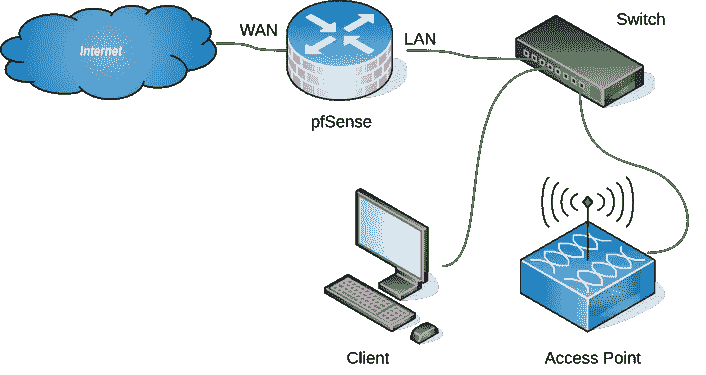
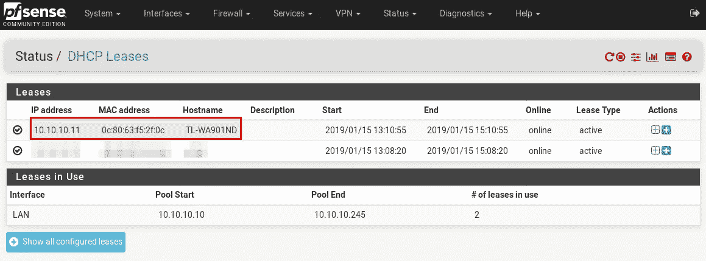
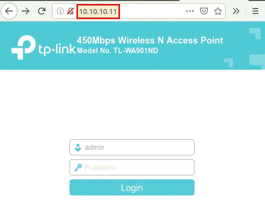
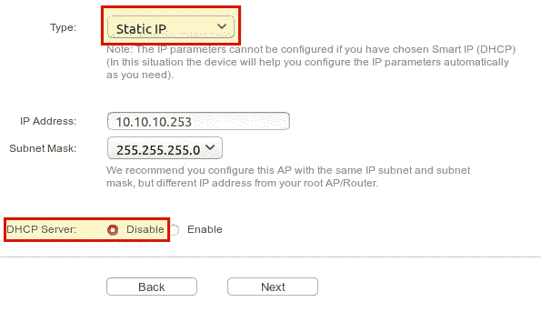

# 如何将接入点连接到 pfSense

> 原文：<https://medium.com/hackernoon/how-to-connect-an-access-point-to-pfsense-ab1ec6d4e824>

PfSense 是一款开源防火墙解决方案，可以在家里、学校或公司使用(参见我们的[安装指南](https://openschoolsolutions.org/install-pfsense/)和硬件建议)。在大多数情况下，您不希望只通过网线连接客户端，也不希望通过无线方式连接。最简单的方法是将 WLAN 接入点连接到管理无线设备(如智能手机)的防火墙。

# 设置

众所周知，一幅画胜过 1000 个字:

pfSense LAN 接口连接到可连接接入点和其他有线客户端的交换机。

# 设置接入点

连接接入点后(在我们的示例中，接入点来自 [**tp-link**](https://www.amazon.com/gp/search/ref=as_li_qf_sp_sr_tl?ie=UTF8&tag=openschoolsol-20&keywords=tp%20link%20access%20point&index=aps&camp=1789&creative=9325&linkCode=ur2&linkId=d7d8e14700c9e025f692431c007080cb) )(就像 [**这个**](https://amzn.to/2MdTDqv) )，仍然需要进行设置。每个接入点通常还带有一个网络界面，您可以使用它进行设置。接入点的 IP 地址可以在**状态→DHCP-租赁**下的 pfSense 中找到。

现在，您可以访问接入点的 web 界面。

登录后(tp-link 的默认用户名和密码是 *admin* )，您可以在**快速设置**下配置所有重要设置:

*   更改登录帐户→是(设置新的用户名和密码)
*   请根据您的需求选择合适的操作模式→接入点

**访问 AP 模式设置**

*   无线网络名称(SSID) → WLAN 网络名称
*   频道→自动
*   无线安全模式→ WPA2-PSK
*   无线密码→ WLAN 密码
*   类型→静态 IP
*   IP 地址→从 LAN 中选择一个 IP 地址，例如 10.10.10.253
*   DHCP 服务器→禁用(因为 pfSense 负责 IP 地址)。

# 结论

虽然也有配备 WLAN 芯片的 pfSense 迷你电脑和路由器，但很少能在接入点模式下运行。在大多数情况下，它们仅支持客户端模式，以便您可以连接到无线局域网络，但您不能自己创建无线局域网络。PfSense 在接入点模式下仅支持少数卡。概览可在[这里](https://docs.google.com/spreadsheets/d/11cF4UoNL68Me5ZC6qhjFPmzdW7mib56dBIAKz30Qpug/edit#gid=0)找到。最后，在我看来，将接入点连接到 pfSense 要比找到合适的 WLAN 芯片容易得多。

*最初发表于*[T5【openschoolsolutions.org】](https://openschoolsolutions.org/how-to-connect-an-access-point-to-pfsense/)*。*