# 如何用托管服务实现 Azure 和 AWS 之间的 VPN 连接？

> 原文：<https://medium.com/hackernoon/how-to-connect-between-azure-and-aws-with-managed-services-4b03ec334e8a>

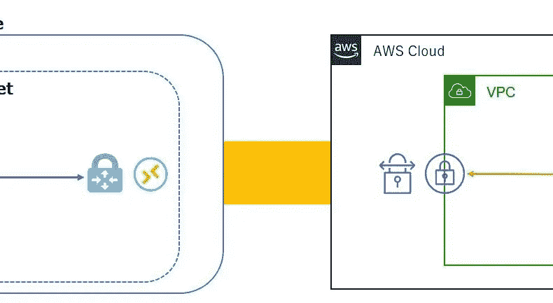

# 介绍

2019/2/6 IKEv2 兼容新闻在 AWS 与站点到站点 VPN 上出现。

AWS 站对站 VPN 现支持 IKEv2
[https://AWS . Amazon . com/about-AWS/whats-new/2019/02/AWS-Site-to-Site-VPN-Now-Supports-ike v2/](https://aws.amazon.com/about-aws/whats-new/2019/02/aws-site-to-site-vpn-now-supports-ikev2/)

连接 Azure 和 AWS 的要点是 AWS 只支持 IKEv1。
这一次，通过支持 IKEv2，实现双向连接成为可能。

但是，有注意事项。
BGP 无法使用(根据设置可能会使用)。

连接配置图如下。

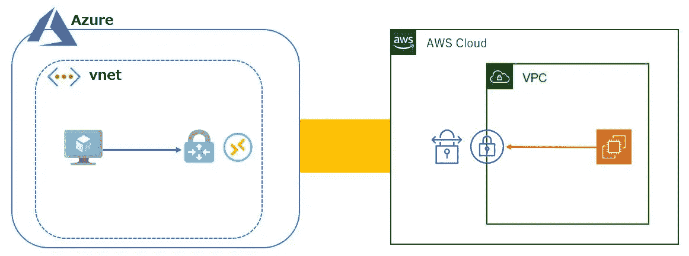

程序如下。
Azure 侧
1、创建虚拟网络
2、创建网关子网
3、创建公共 IP
4、创建虚拟网络网关

AWS 端
5、创建 VPC
6、创建子网
7、创建互联网网关(可选)
8、静态创建客户网关
9、创建虚拟专用网关
10、静态创建 VPN 连接
11、下载配置文件

Azure 端
12、创建本地网络网关
13、创建连接

AWS 端
14、添加一个虚拟专用网关到路由表

选项
蔚蓝这边
15 设置两个连接

下面，我们将一步步讲解。

# 1、创建虚拟网络

创建虚拟网络。
天蓝色一侧的线段为 10.0.0.0/16。

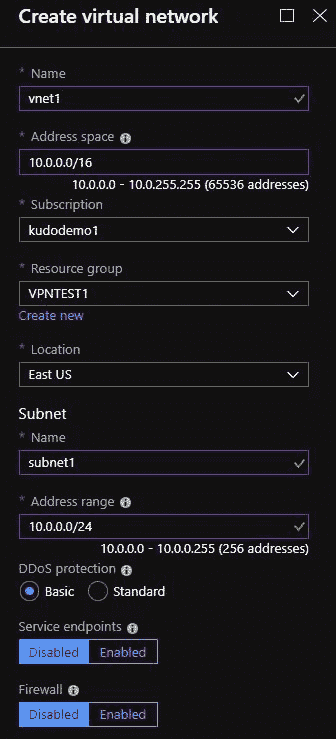

# 2、创建网关子网

创建网关子网。
从虚拟网络屏幕打开子网，并单击网关子网以创建它。

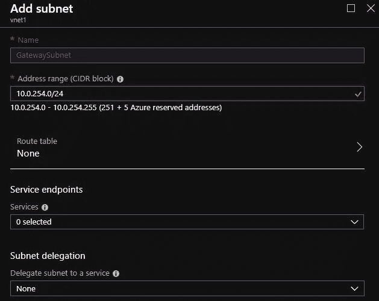

使用另一个 CIDR 创建在 1 中创建的子网。

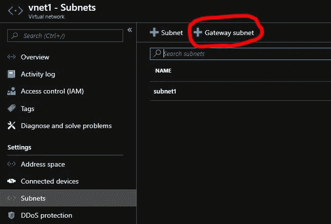

确认它已创建。

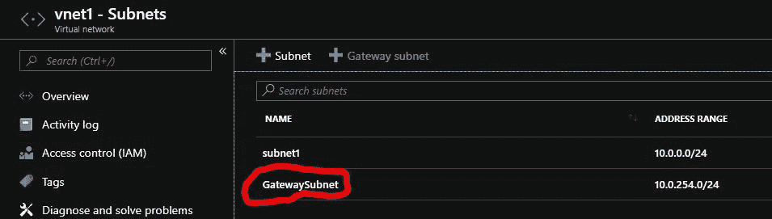

# 3、公共知识产权的创造

创建一个公共 IP。

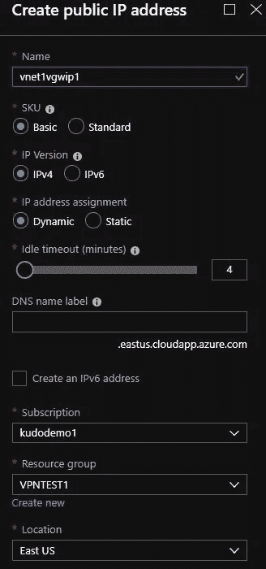

# 4、创建虚拟网络网关

创建虚拟网络网关。

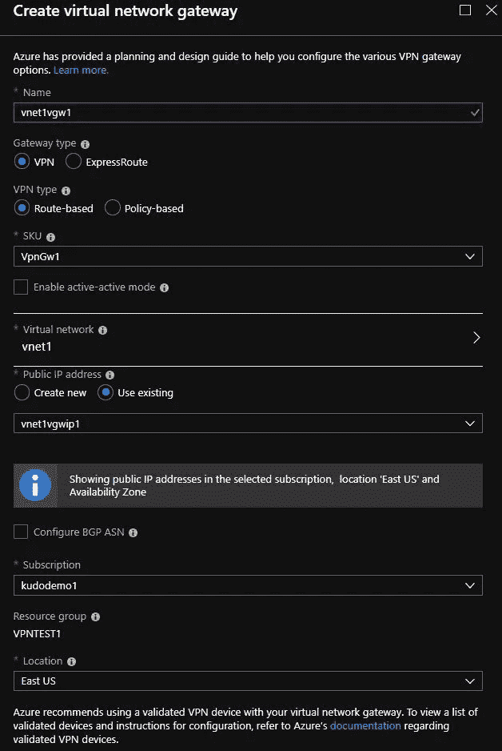

# 5、VPC 的创作

创造 VPC。
AWS 侧的段是 192.168.0.0/16。

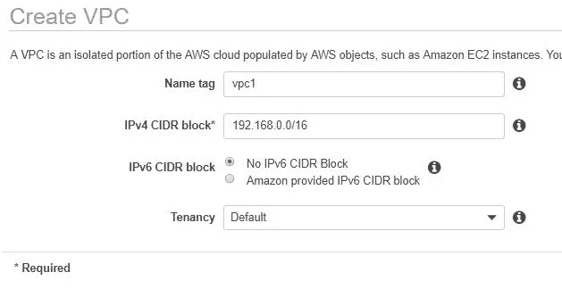

# 6、创建子网

创建一个子网。

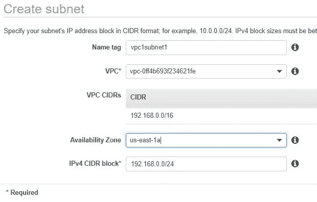

# 7、创建互联网网关(可选)

创建互联网网关(可选)。

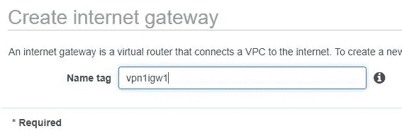

将互联网网关连接到 VPC。

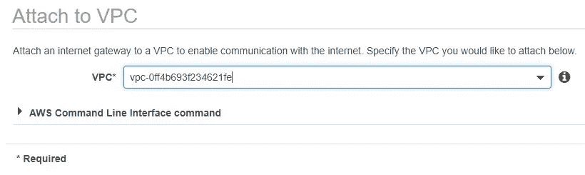

在路由表中将 Internet 网关指定为 0.0.0.0/0。

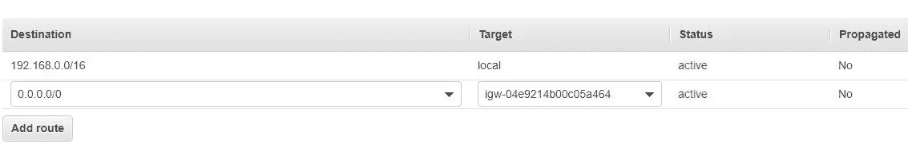

# 8、静态创建客户网关

从 Azure 的虚拟网络网关检查 IP 地址。


静态创建客户网关。在 IP 地址中输入上一部分确认的 IP 地址。

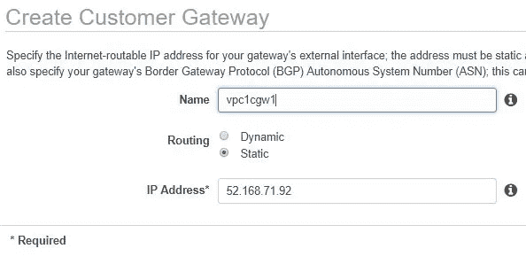

# 9、创建虚拟专用网关

创建虚拟专用网关。

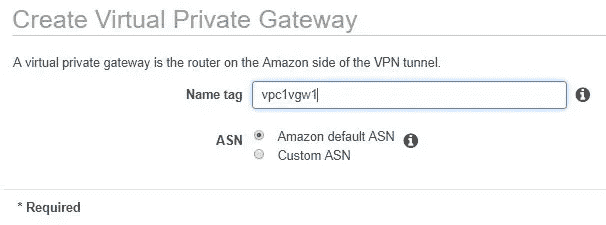

# 10，静态创建一个 VPN 连接

静态创建 VPN 连接。将 Azure 端的子网添加到前缀中。

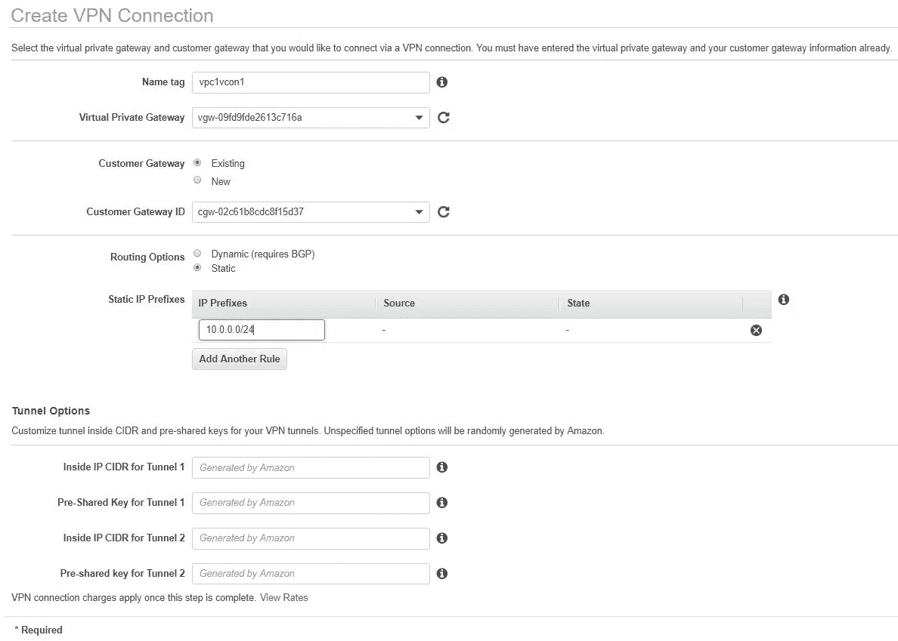

# 11、下载配置文件

下载配置文件。选择是通用的。

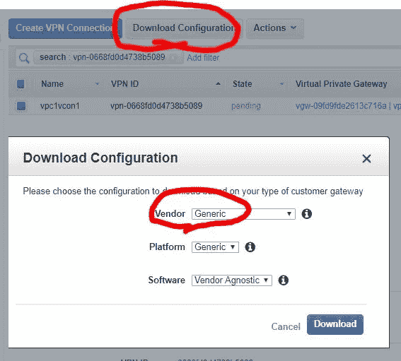

检查以下内容。
IPSec 隧道# 1
预共享密钥
外部 IP 地址:
-虚拟专用网关

# 12、创建本地网络网关

创建本地网络网关。
对于 IP 地址，设置上述识别的 IP 地址(虚拟专用网关)。
在地址空间中，输入 AWS 端的 VPC 段。

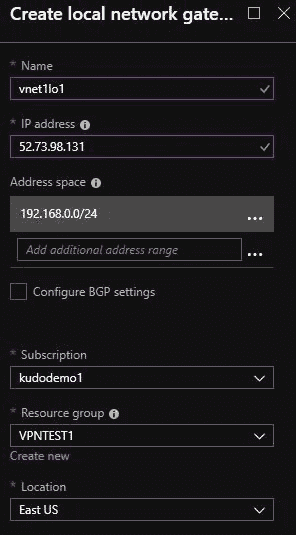

# 13、创建连接

从虚拟网络网关连接添加。

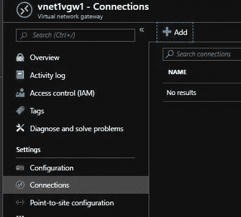

输入确认的公共密钥(预共享密钥)。

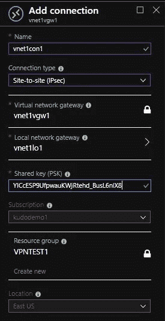

确认它已连接。

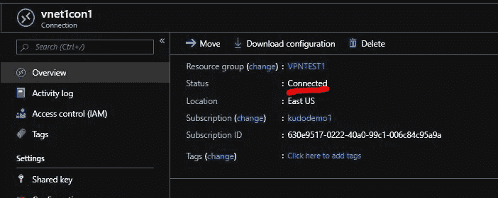

# 14、将虚拟专用网关添加到路由表中

向路由表添加虚拟专用网关。

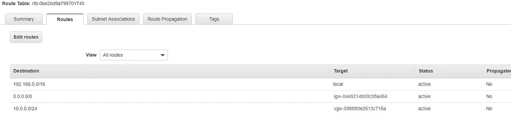

# 15 设置两个连接

单独创建一个本地网络网关。
此时，检查下载文件的 IPSec 隧道# 2 并输入。
创建后，指定您创建的本地网关并创建连接。

通过建立两个连接，即使一个连接过期到某个时间签名，通信也会继续。

# 沟通确认

Azure，AWS 来确认你们可以互相交流。

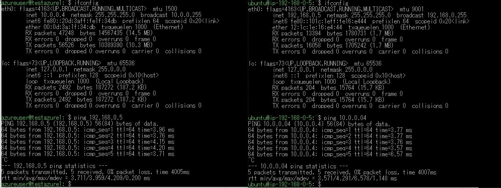

所有的工作都用这个完成了。

# 吞吐量

我使用 iperf 粗略测量了吞吐量。

Azure:标准 D2s v3 (2 个 vcpu、8 GB 内存)
AWS:m5.large (2 个 vcpu、8 GB 内存)

Azure→AWS

```
------------------------------------------------------------
Client connecting to 192.168.0.5, TCP port 5001
TCP window size: 45.0 KByte (default)
------------------------------------------------------------
[  3] local 10.0.0.4 port 51160 connected with 192.168.0.5 port 5001
[ ID] Interval       Transfer     Bandwidth
[  3]  0.0-10.0 sec   659 MBytes   553 Mbits/sec
```

AWS→Azure

```
------------------------------------------------------------
Client connecting to 10.0.0.4, TCP port 5001
TCP window size: 45.0 KByte (default)
------------------------------------------------------------
[  3] local 192.168.0.5 port 50116 connected with 10.0.0.4 port 5001
[ ID] Interval       Transfer     Bandwidth
[  3]  0.0-10.0 sec   759 MBytes   636 Mbits/sec
```

我想知道它是否通常比租用线路服务更快。

# 摘要

我能够确认 AWS 可以通过支持 IKEv2 直接连接 Azure。
到目前为止，需要准备 Windows 服务器等。到 VPN Azure 和 AWS。
通过使 VPN 仅由被管理的服务建立，没有必要建立虚拟机，
减少了管理的需要，因此我们几乎不关心操作。我相信 Azure 和 AWS 可以在一个相互管理的环境中连接起来，以便将来可以用于各种目的。
我认为 Azure 擅长 Azure，AWS 擅长使用 AWS，DR 适合使用并且我认为有很多有用的价值。
另外，多云将继续进行！！

我很高兴，因为这是我几年前就想要的功能！

原文内容(日文):[http://level69.net/archives/26362](http://level69.net/archives/26362)