# 如何将一个网站从零开始转化为 Android 应用

> 原文：<https://medium.com/hackernoon/how-to-convert-a-website-into-an-android-app-from-scratch-de19c84a5801>


在本教程中，我们将学习如何使用 Android Studio 将网站转换为 Android 应用程序。

> *如果你对 Android Studio 一无所知，不要担心。我们将从头开始。*

*这是网站的样子:*

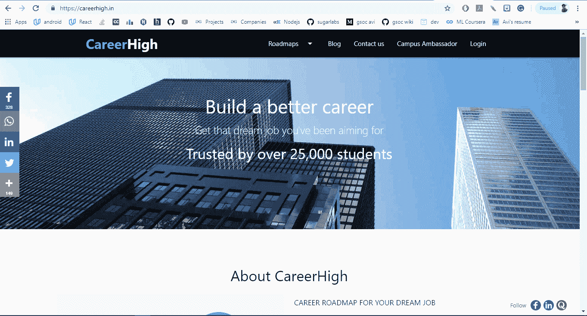

*我们使用 Android Studio 开发的 Android 应用程序看起来像:*

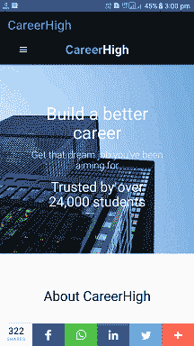

## 在我们开始之前:

**注意:**如果你下载了 Android Studio 并且已经安装在你的系统中，那么你可以跳过这个部分，直接进入编码部分。

*如果不是*
**下载安卓工作室**:

谷歌为 Windows、Mac OS X 和 Linux 平台提供 Android Studio。你可以从 Android Studio 主页[下载这个软件](https://developer.android.com/studio/index.html)。

在下载 Android Studio 之前，请确保您的平台符合以下要求之一:
**Windows OS** Microsoft Windows 7/8/10(32 位或 64 位)
最低 2 GB RAM，建议 8 GB RAM
最低 2 GB 可用磁盘空间，建议 4 GB(IDE 500 MB+Android SDK 和仿真器系统映像 1.5 GB)
1280 x 800 最低屏幕分辨率
加速仿真器:64 位

**Mac OS** 

**Linux OS
GNOME 或 KDE 桌面**:在 Ubuntu 12.04 上测试，Precise Pangolin (64 位分发能够运行 32 位应用)
64 位分发能够运行 32 位应用
GNU C 库(glibc) 2.11 或更高版本
2 GB RAM 最低，8 GB RAM 建议
2 GB 可用磁盘空间最低， 推荐 4gb(500 MB 用于 IDE + 1.5 GB 用于 Android SDK 和仿真器系统映像)
1280 x 800 最小屏幕分辨率
JDK 8
用于加速仿真器:支持英特尔 VT-x、英特尔 EM64T(英特尔 64)和执行禁用(XD)位功能的英特尔处理器，或支持 AMD 虚拟化(AMD-V)的 AMD 处理器

# 在 64 位 Windows 8.1 上安装 Android Studio

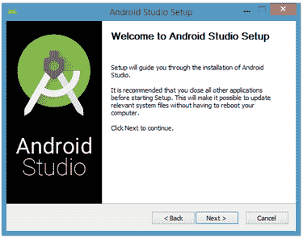

Figure 1\. Set up Android Studio

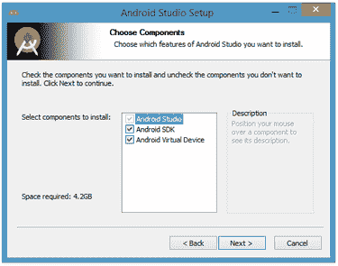

Figure 2\. Do you want to install the Android SDK and AVD?

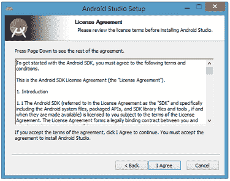

Figure 3\. Accept the license agreement to continue the installation

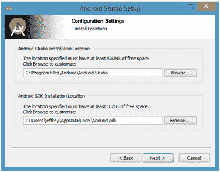

Figure 4\. Set the Android Studio and Android SDK installation locations

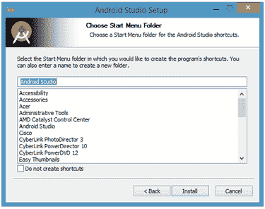

Figure 5\. Create a new shortcut for Android Studio

*要完成安装，请选中启动 Android Studio 框，然后单击完成。*

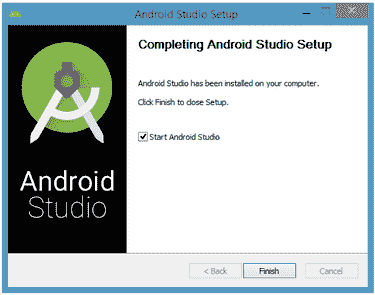

Figure 6\. Leave the Start Android Studio checkbox checked to run this software

# 运行 Android Studio

Android Studio 在开始运行时会出现一个闪屏:

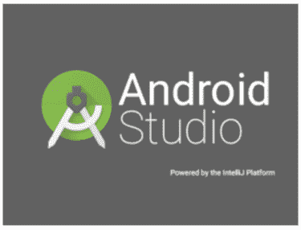

*如果您和我一样，没有先前安装的版本，您可以保持默认设置，然后单击确定。*

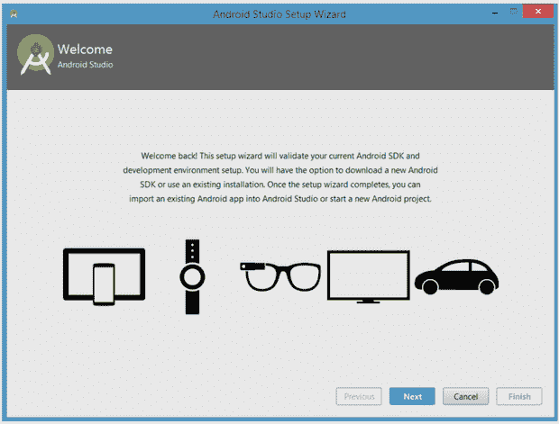

Figure 9\. Validate your Android SDK and development environment setup

*当您单击“下一步”时，安装向导会邀请您为 SDK 组件选择安装类型。目前，我建议您保留默认的标准设置。*

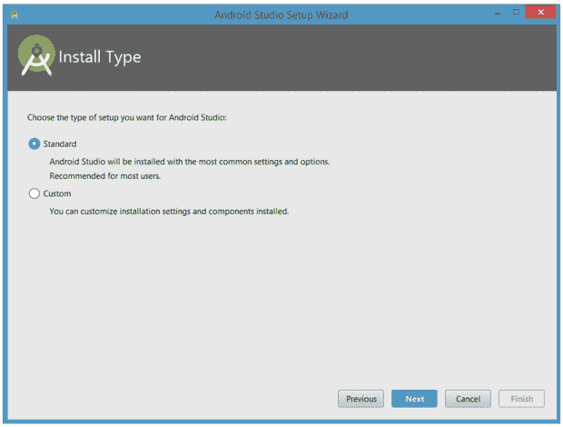

Figure 10\. Choose an installation type

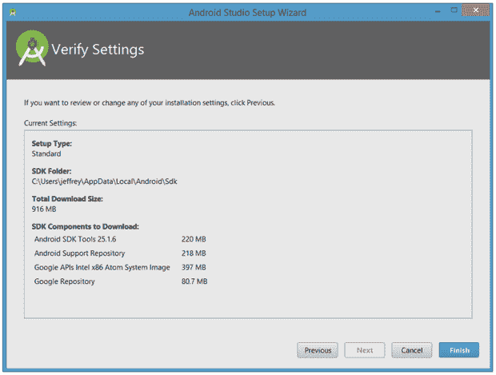

Figure 11\. Review settings

*向导将下载并解压各种组件。如果要查看有关正在下载的归档及其内容的更多信息，请点按“显示详细信息”。*

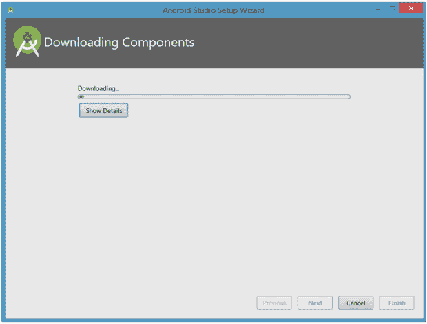

Figure 12\. The wizard downloads and unzips Android Studio components

你的选择是要么忍受缓慢的模拟器，要么使用 Android 设备来加速开发。我将在本教程的后面讨论后一种选择。

*最后，点击 Finish 完成向导。您应该会看到欢迎使用 Android Studio 对话框:*

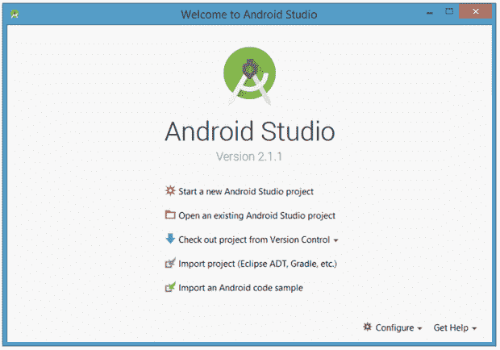

Figure 14\. Welcome to Android Studio

您已经安装和配置了 Android Studio，并为您的第一个 Android Studio 移动应用程序创建了一个项目；现在，您已经准备好构建您的 Android 应用程序了。在 Android Studio 中，这意味着用 Java 源代码和资源文件填充您的新项目。

# 您的第一款 Android Studio 移动应用

# 开始一个新项目

从我们到目前为止的设置来看，您应该还在运行 Android Studio，并显示欢迎使用 Android Studio 对话框。从这里，单击开始一个新的 Android Studio 项目。Android Studio 将显示如图所示的创建新项目对话框。

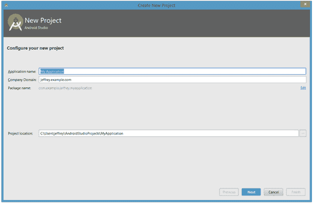

Figure 15\. Create a new project

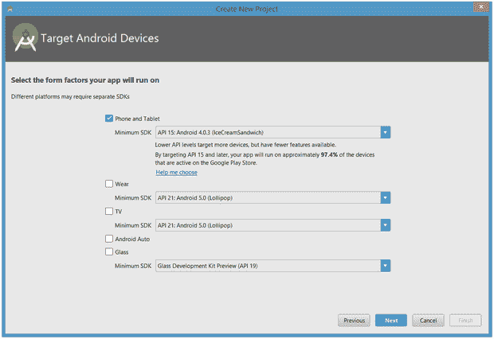

Figure 16\. Select your target device categories

*点击下一步，你将有机会为你的应用程序的主要活动选择一个模板。现在，我们将坚持空活动。选择此模板，然后单击下一步。*

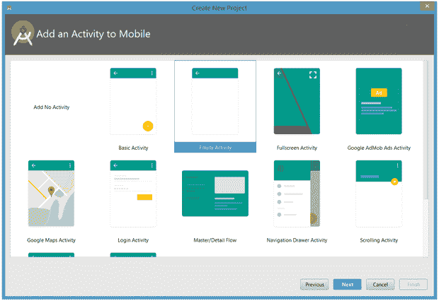

*接下来，您将定制活动:*

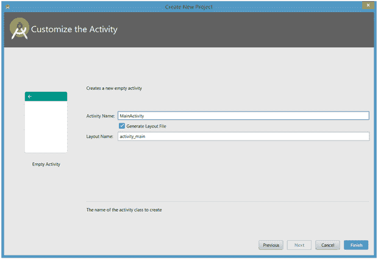

输入 *W2A* 作为活动名称，输入*主*作为布局名称，点击【完成】完成该步骤。Android Studio 将回应它正在创建项目，然后带您到项目工作区。

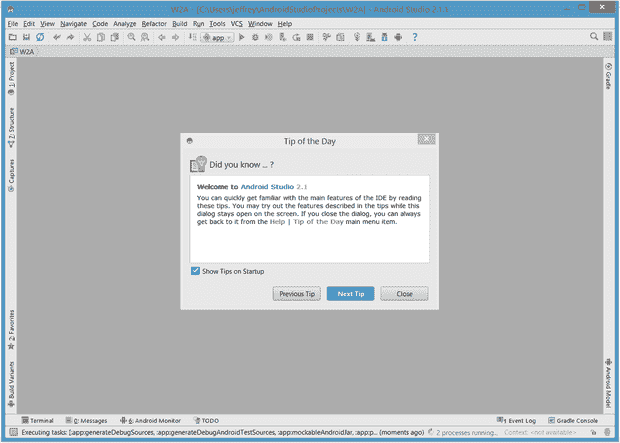

Figure 19\. Android Studio workspace

项目窗口被组织成一个树，其主要分支是应用程序和 Gradle 脚本。App 分支进一步组织为 manifests、java 和 res 子分支:

*   **manifest**存储 AndroidManifest.xml，这是一个描述 Android 应用程序结构的 xml 文件。该文件还记录了应用程序的权限设置(如果适用)和其他详细信息。
*   **java** 按照包层次结构存储一个 app 的 java 源文件，本例中为 ca.javajeff.w2a。
*   **res** 存储应用程序的资源文件，这些文件被组织成 drawable、layout、mipmap 和 values 子分支:
*   **drawable** :一个最初空着的位置，用来存放应用程序的作品
*   **布局**:包含 app 布局文件的位置；最初，main.xml(主活动的布局文件)存储在这里
*   **mipmap** :包含各种 ic_launcher.png 文件的位置，这些文件存储不同分辨率的启动器屏幕图标
*   **values** :包含 colors.xml、dimens.xml、strings.xml 和 styles.xml 的位置

Gradle 脚本分支确定了各种。gradle(如 build.gradle)和。基于 Gradle 的构建系统使用的属性(如 local.properties)文件。

## 现在编码部分将开始…

如下图所示，将 webView 添加到您的活动中。

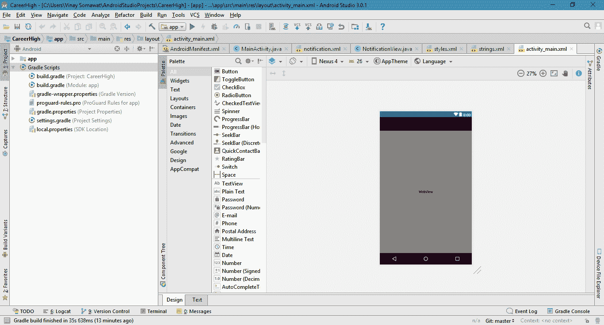

`**layout/activity_main.xml**`

```
<**RelativeLayout xmlns:android=”http://schemas.android.com/apk/res/android"
xmlns:tools=”http://schemas.android.com/tools" android:layout_width=”match_parent”
android:layout_height=”match_parent”
tools:context=”.MainActivity”**><**WebView
android:layout_width=”fill_parent”
android:layout_height=”fill_parent”
android:id=”@+id/webView”
android:layout_alignParentLeft=”true”
android:layout_alignParentStart=”true”
android:layout_alignParentTop=”true”
android:layout_alignParentRight=”true”
android:layout_alignParentEnd=”true”** /></**RelativeLayout**>
**src/main/AndroidManifest.xml
*<?*xml version=”1.0" encoding=”utf-8"*?>* <manifest xmlns:android=”http://schemas.android.com/apk/res/android" package=”com.vinaysomawat.careerhigh”
android:installLocation=”auto”>
<uses-permission android:name=”android.permission.INTERNET”/>
<application
android:allowBackup=”true”
android:icon=”@mipmap/faviconcircular”
android:label=”@string/app_name”
android:roundIcon=”@mipmap/faviconcircular”
android:supportsRtl=”true”
android:theme=”@style/AppTheme”>****<activity android:name=”.SplashActivity” android:theme=”@style/SplashTheme”>
<intent-filter>
<action android:name=”android.intent.action.MAIN” />
<category android:name=”android.intent.category.LAUNCHER” />
</intent-filter>
</activity>
<activity android:name=”.MainActivity” />
</application>
</manifest>**
```

`**MainActivity.java**`

```
**package com.vinaysomawat.careerhigh;** */**
 * Created by Vinay Somawat on 10-01-2019.
 */***import android.support.v7.app.ActionBarActivity;
import android.os.Bundle;
import android.view.Menu;
import android.view.MenuItem;
import android.webkit.WebSettings;
import android.webkit.WebView;
import android.webkit.WebViewClient;****public class MainActivity extends ActionBarActivity {
private WebView mywebview;****@Override
protected void onCreate(Bundle savedInstanceState) {
super.onCreate(savedInstanceState);
setContentView(R.layout.*activity_main*);
mywebview = (WebView)findViewById(R.id.*webView*);
WebSettings webSettings = mywebview.getSettings();
webSettings.setJavaScriptEnabled(true);
mywebview.loadUrl(“https://careerhigh.in");
mywebview.setWebViewClient(new WebViewClient());
}****@Override
public void onBackPressed(){
if(mywebview.canGoBack()) {
mywebview.goBack();
} else
{
super.onBackPressed();
}
}****@Override
public boolean onCreateOptionsMenu(Menu menu){
getMenuInflater().inflate(R.menu.*menu_main*, menu);
return true;
}****@Override
public boolean onOptionsItemSelected(MenuItem item){
int id = item.getItemId();
if(id == R.id.*action_settings*){
return true;
}
return super.onOptionsItemSelected(item);
}
}**
```

`**menu/menu_main.xml**`

```
<**menu xmlns:android=”http://schemas.android.com/apk/res/android"
xmlns:app=”http://schemas.android.com/apk/res-auto"
xmlns:tools=”http://schemas.android.com/tools" tools:context=”.MainActivity”**>
<**item android:id=”@+id/action_settings” android:title=”@string/action_settings”
android:orderInCategory=”100" app:showAsAction=”never”** />
</**menu**>
```

`**values/styles.xml**`

```
<**resources**>

    *<!-- Base application theme. -->* <**style name="AppTheme" parent="Theme.AppCompat.Light"**>
        *<!-- Customize your theme here. -->* <**item name="colorPrimary"**>@color/colorPrimary</**item**>
        <**item name="colorPrimaryDark"**>@color/colorPrimaryDark</**item**>
        <**item name="colorAccent"**>@color/colorAccent</**item**>
    </**style**>
    <**style name="TextAppearance.AppCompat.Widget.ActionBar.Title" parent="android:TextAppearance"**>
        <**item name="android:textColor"**>@color/titlecolour</**item**>
        <**item name="android:textSize"**>30sp</**item**>
    </**style**>

</**resources**>
```

`**values/strings.xml**`

```
*<?***xml version="1.0" encoding="utf-8"***?>* <**resources**>

    <**string name="app_name"**>CareerHigh</**string**>
    <**string name="hello_world"**>Hello world!</**string**>
    <**string name="action_settings"**>Settings</**string**>

</**resources**>
```

`**values/colors.xml**`

```
*<?***xml version="1.0" encoding="utf-8"***?>* <**resources**>
    <**color name="colorPrimary"**>#000000</**color**>
    <**color name="colorPrimaryDark"**>#303F9F</**color**>
    <**color name="colorAccent"**>#FF4081</**color**>
    <**color name="titlecolour"**>#398bb7</**color**>
</**resources**>
```

*给 App 添加启动活动:(看起来不错)*


Launching Activity

`**SplashActivity.java**`

```
**package** com.vinaysomawat.careerhigh;

*/**
 * Created by Vinay Somawat on 10-01-2019.
 */* **import** android.content.Intent;
**import** android.os.Bundle;
**import** android.support.annotation.Nullable;
**import** android.support.v7.app.AppCompatActivity;

**public class** SplashActivity **extends** AppCompatActivity {

    @Override
    **protected void** onCreate(@Nullable Bundle savedInstanceState) {
        **super**.onCreate(savedInstanceState);
        Intent intent = **new** Intent(**this**, MainActivity.**class**);
        startActivity(intent);
        finish();
    }
}
```

并添加一些代码吧`values/styles.xml`

```
<**style name="SplashTheme" parent="Theme.AppCompat.NoActionBar"**>
    <**item name="android:windowBackground"**>@drawable/background</**item**>
</**style**>
```

创建一个`drawable/background.xml`文件:

```
*<?***xml version="1.0" encoding="utf-8"***?>* <**layer-list xmlns:android="http://schemas.android.com/apk/res/android"**>
    <**item android:drawable="@color/colorPrimary"** />

    <**item**>
        <**bitmap android:src="@drawable/logo2"
            android:gravity="center"** />

    </**item**>
</**layer-list**>
```

确保将**样本图像**添加到`drawable`文件夹，以在启动活动中显示。

输出:

*现在运行你的安卓应用，你会看到下面的结果*

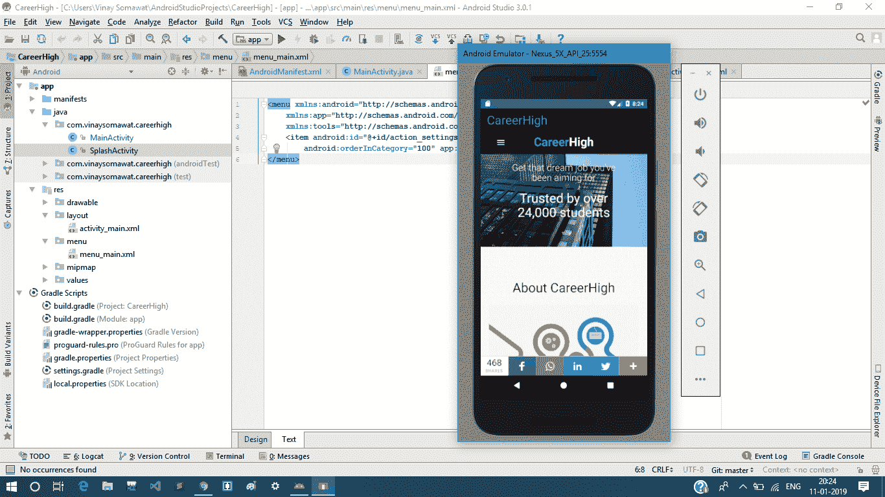

## 最后，您的第一个 Android 应用程序创建完成。

如果你被困在某个地方

[**下载源代码**](https://github.com/vinaysomawat/CareerHigh-App)

*或者使用下面的命令:*

`command-line`

```
>git clone [https://github.com/vinaysomawat/CareerHigh-App](https://github.com/vinaysomawat/CareerHigh-App) 
```

与您的朋友分享您的 Android 应用程序。

> 如果你需要一个专业的网站到 Android 的 app 转换器，联系 [https://convertify.app](https://convertify.app)

我做错了什么吗？请在评论中提及。我很想进步。如果你学到了哪怕是一两件事，就鼓掌吧👏尽可能多的次数来表示你的支持！你好，世界，我是 Vinay Somawat。一个有创造力的开发者和一个有逻辑的设计师。你可以在 Linkedin 上找到我，或者在 GitHub 上跟踪我，或者在 Twitter 上关注我？如果这对你来说太社交化了，如果你想和我讨论技术，就给 vinaysomawat40@gmail.com 发封邮件。

祝您愉快！