# 如何在不到 10 分钟的时间内创建一个 Facebook Messenger 机器人

> 原文：<https://medium.com/hackernoon/how-to-create-a-facebook-messenger-bot-in-less-than-10-minutes-5c1e8fbc8d07>

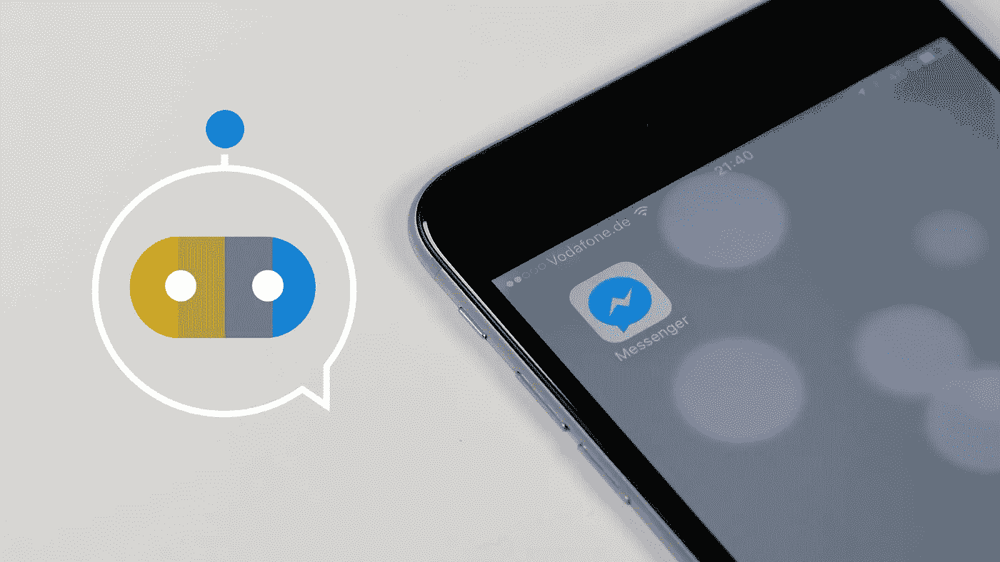

当谈到在不同渠道共享您的聊天机器人时，Messenger 一定是您的首选之一—如果不是首选的话！事实上，我们意识到许多公司在生产后立即将他们的机器人放在脸书上，因为这显然是用户联系公司最友好和最简单的方式。

脸书聊天机器人有很多优点:

*   全天候可用性
*   100%回答
*   即时回答(想想你的*回答率*！)
*   单调乏味的任务被自动化了

在 [SAP 对话式人工智能平台](https://cai.tools.sap/)上，我们为我们的用户创建了一个逐步整合的过程，因此只需要几分钟就可以向你的脸书粉丝展示你的聊天机器人。让我们开始吧！

# 第一步:准备好你的聊天机器人

首先，你需要一个聊天机器人(似乎是合法的，对吗？！).请注意，一旦您的聊天机器人在脸书上线，您就可以对其进行修改，并且您对其所做的任何更改都会显示在您的 Messenger 聊天中。

出于本教程的目的，我们不会深入研究如何创建聊天机器人。相反，我热情地邀请你到[创建你的账户](https://cai.tools.sap/signup)(完全免费！)并阅读我们的教程“[如何用 SAP 对话式人工智能](https://cai.tools.sap/blog/build-your-first-bot-with-sap-conversational-ai/)构建你的第一个机器人”。一旦你的“会讲笑话的聊天机器人”(或者你已经建立的任何东西)准备好了，回到这里！

# 第二步:准备好你的脸书页面

您的聊天机器人将只能在**脸书页面**上集成(不能在您的个人资料上集成)。这意味着你必须创建一个脸书网页，或者想好你要用的网页。让我们假设您的公司、企业或团体已经有了一个页面。(如果不是这样，点击[该链接](https://www.facebook.com/bookmarks/pages)并创建一个。)

正如我在介绍中所说，在脸书页面上安装聊天机器人，一旦它连接到你的页面，就会自动发送私人信息。

因此，如果你决定删除聊天机器人，你会立即恢复到传统的个人对个人的对话(这意味着当用户输入信息时，除非你手动回答他们，否则什么也不会发生)。

# 步骤 3:创建 Messenger 脸书应用程序

创建一个应用程序将有助于在 SAP 对话式人工智能和你的脸书页面之间建立**联系。如果没有此应用，您将无法在您的脸书页面上发布您的聊天机器人。**

点击此链接，在顶部菜单中选择*我的应用*，然后选择*添加新应用*。

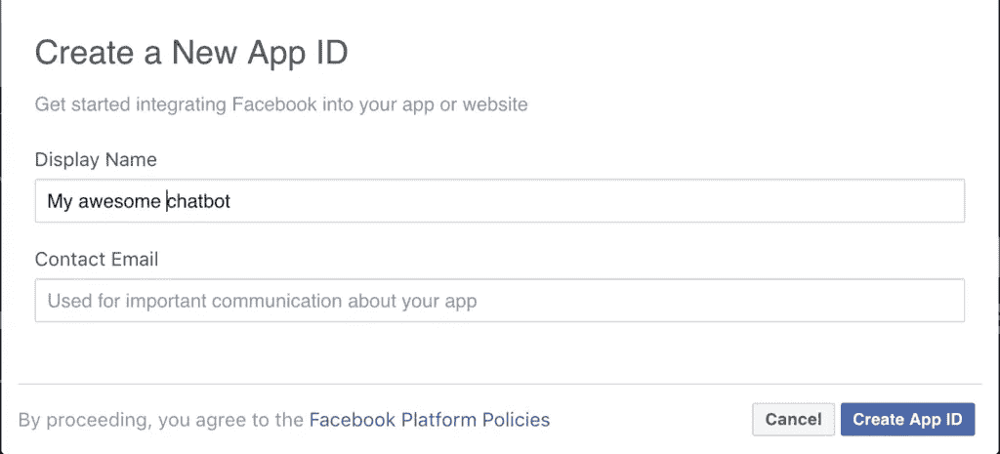

创建应用后，您需要添加一个 Messenger“产品”。一个脸书应用程序可以致力于很多工作，但我们特别想要一个私人消息应用程序。转到你的应用的仪表板，在*信使*框中点击*设置*。

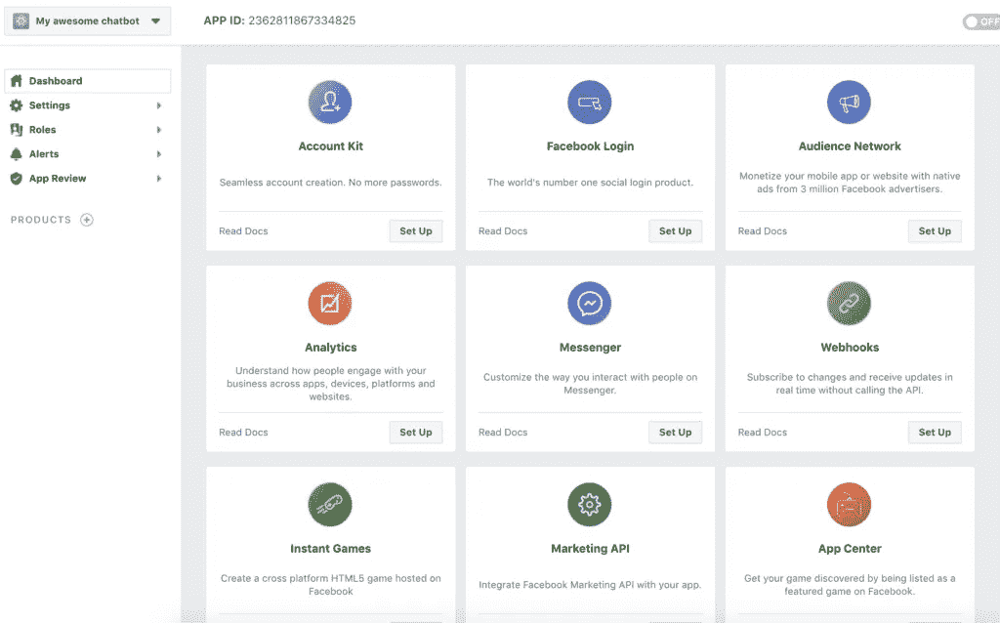

在左侧菜单中，你会在*产品*下看到*信使*。

# 第四步:获取你的页面令牌和应用密码

现在我们已经创建了一个 Messenger 应用程序，我们需要将其链接到您的脸书页面(默认情况下，脸书应用程序是一个独立的实体)。通过这种连接，您将获得一个令牌，这基本上是一个唯一的代码，表示“好的，这是 X 页的 Messenger 应用程序的代码”。

在左侧菜单中，点击产品*信使*正下方的*设置*。

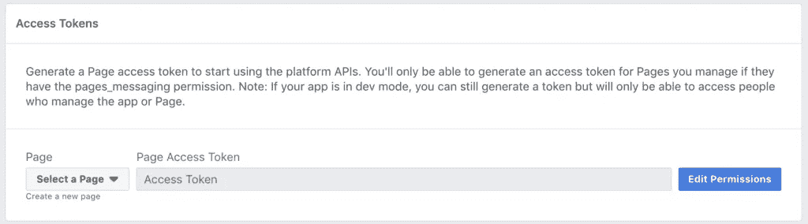

选择您希望聊天机器人出现的页面。

出于安全原因，您可能需要允许应用程序与您的脸书页面进行交互。点击蓝色的*编辑权限*按钮，选择您的页面，并勾选不同的复选框。

一旦给定了权限，就会生成一个令牌。

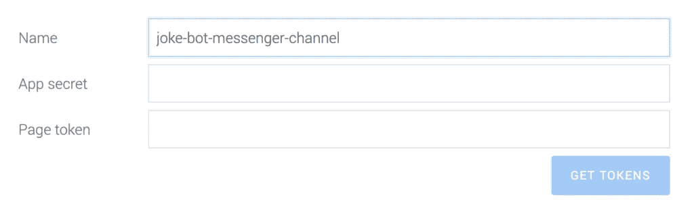

返回到 SAP 对话式 AI 聊天机器人中的*连接*选项卡，选择*信使*，并在步骤 4 中将您的令牌粘贴到*页面令牌*字段中。

耶，我们已经完成一半了！现在让我们来看看我们的“应用程序秘密”，它就像是你的应用程序的密码。

在左侧菜单中，转到*设置* > *基本*。

为了隐私，应用程序的秘密是隐藏的。点击*显示*并将其复制粘贴到聊天机器人*连接*选项卡上的*应用机密*字段(类似于您刚才对页面令牌所做的操作)。

点击 SAP 对话式 AI 表单下的*更新频道*。

# 步骤 5:将 SAP 对话式人工智能连接到您的应用程序

是时候将我们的平台连接到 Messenger 了！

在*产品*>*Messenger*>*设置*页面，进入 *Webhooks* 版块，点击*订阅活动*。

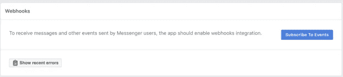

在弹出窗口中，输入*回调 URL* 和*验证令牌*的值，您可以在聊天机器人的*连接*选项卡的步骤 4 中找到它们。

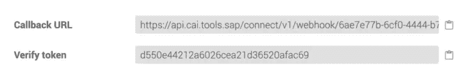

同时选择下面显示的复选框:

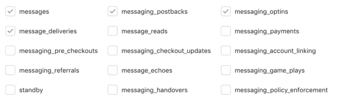

一旦你的页面重新加载，在列表中选择你的页面，这样它就可以访问你的 webhook。

# 步骤 6:测试并发布 Messenger 聊天机器人

现在**你可以作为管理员**测试你的机器人(你也可以使用左侧菜单中的*角色* > *测试用户*来授予一些测试角色)。

在你改变状态之前，你的机器人不会被公开访问，所以**花点时间**测试它，确保在发布之前一切正常！

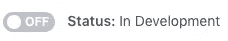

如果你对你的机器人满意，如果你在(在右上角)上切换到*，你将被重定向到设置，并被提示在你的机器人发布之前提供一些额外的信息。(提示:您也可以访问左侧菜单中*设置* > *基本*下的设置。)*

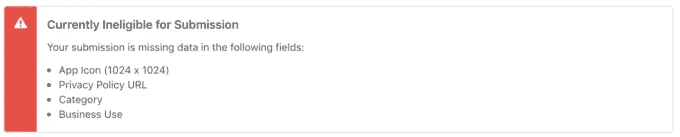

最后一步:脸书想要验证和测试你的聊天机器人。下面是他们在文档中对这一步的描述:

> 当你准备好向公众发布你的机器人时，你必须将它提交给我们的团队进行审查和批准。这一审查过程使我们能够确保您的 Messenger bot 在向 Messenger 上的每个人提供之前遵守我们的政策和功能。*——脸书文档*

在左侧菜单中，进入*产品* > *信使* > *设置*，点击*页面 _ 消息*块中的*添加到提交*。

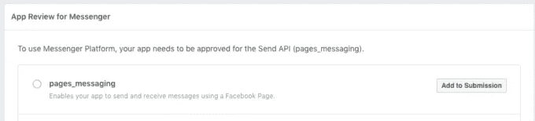

用不了多久，脸书审查小组就会审查你的机器人，给你开绿灯，让你发表它！

仅此而已！

希望你喜欢这个教程。请记住，如果您需要帮助，非常欢迎通过下面的评论部分或通过[堆栈溢出](https://stackoverflow.com/questions/tagged/sap-conversational-ai)联系我们。

如果你正在寻找另一个教程来提高你的聊天机器人构建技能，并将其连接到亚马逊 Alexa，[阅读这篇文章。](https://cai.tools.sap/blog/connect-sap-conversational-ai-chatbot-to-amazon-alexa/)

快乐机器人大厦！

*原载于 2019 年 4 月 24 日* [*SAP 对话式 AI 博客*](https://cai.tools.sap/blog/how-to-create-facebook-messenger-bot-without-coding/) *。*