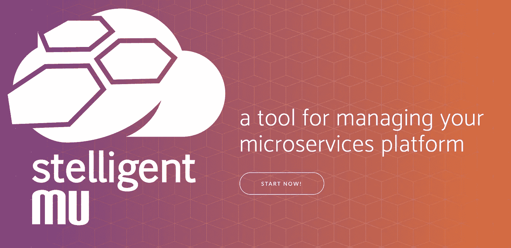
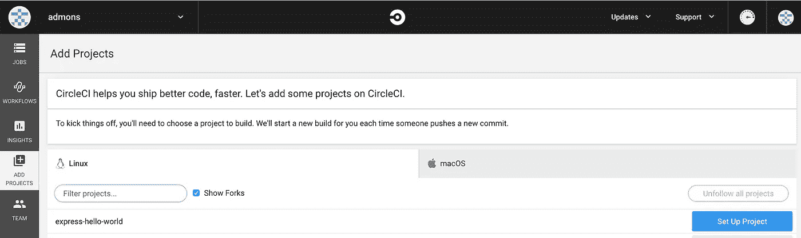
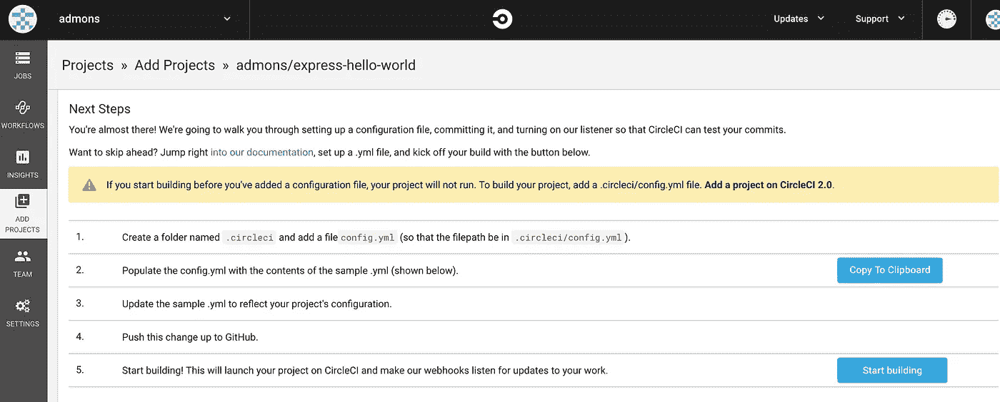
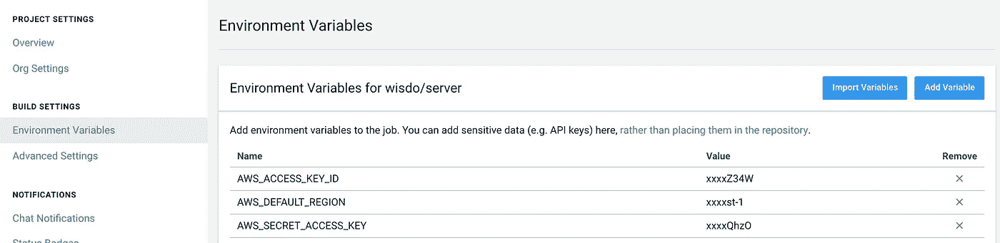
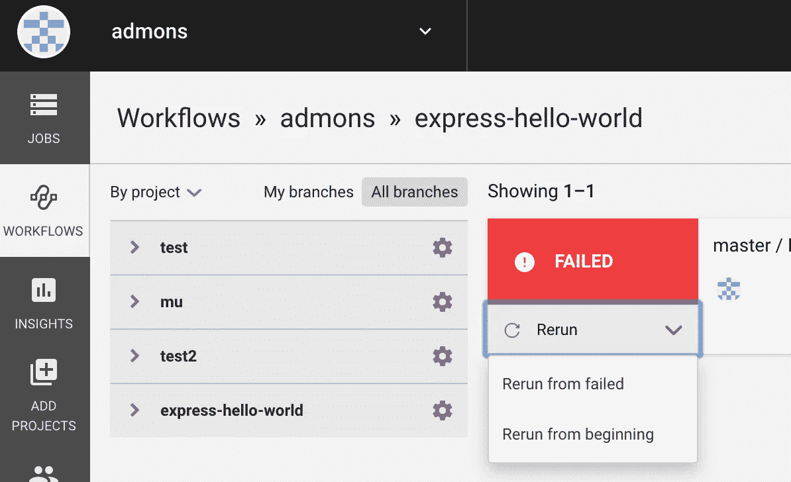

# 如何在几分钟内在 AWS 上创建一个完全码头化的环境

> 原文：<https://medium.com/hackernoon/how-to-create-a-fully-dockerized-environment-on-aws-in-minutes-c2f2d28d74f5>



在本文中，我将与您分享我们使用 CI/CD 管道将传统后端基础架构替换为完全 Dockerized 环境的过程，以及您如何在几分钟内自己实施它。

当我们决定进行这一更改时，我们有一个运行 8 个 Node.js 进程的 EC2 服务器(使用 pm2)。对于每个部署的服务器，我们必须通过 ssh 连接到那个服务器，上传新的工件并重启 web 服务器。

我寻找的是一个高度可用、快速和 VPC 对等兼容的解决方案(我们使用 SaaS 服务，我们希望通过 VPC 对等来确保安全)。
我们考察了其他网络服务，比如 Heroku，但是我们的要求没有得到满足。

经过长时间的寻找最快()讽刺！)我发现了一个名为 mu(读作 mew，像猫一样)的酷库，它提供了一个端到端的解决方案来管理基于 AWS 的 web 服务。

简而言之，这就是你可以用 mu 做的事情:

*   创建一个包括 VPC、3 个高可用性子网、ECS 群集(Fargate 或 EC2)、自动扩展组和应用程序负载平衡器的环境(即转移、生产)
*   创建一个包括 Docker 存储库(ECR)、ECS 服务、ECS 任务定义和目标组(用于负载平衡器)的服务。

您可以用 mu 做更多的事情，但是我们将从基础开始。

在本文结束时，我们将创建一个临时环境，并在其中部署一个简单的 Hello World web 服务器。

**先决条件**

1.  Linux 或 macOS 开发环境。
2.  本地配置的 AWS 凭据(使用“aws configure”命令),具有创建和管理资源的权限。

**我们开始吧！**

1.  首先，我们需要安装 mu。使用:

```
curl -s [https://getmu.io/install.sh](https://getmu.io/install.sh) | sh
```

或者通过自制

```
brew install stelligent/tap/mu-cli
```

2.派生以下 hello world git 存储库，并在本地克隆它(从现在开始，我将把它称为“repo 文件夹”)

[](https://github.com/admons/express-hello-world) [## admons/express-hello-world

### 在 GitHub 上创建一个帐户，为 admons/express-hello-world 的发展做出贡献。

github.com](https://github.com/admons/express-hello-world) 

3.在 repo 文件夹中，创建名为 mu.yml 的文件:

这个文件保存了我们的 staging [环境](https://github.com/stelligent/mu/wiki/Environments#configuration)和 [web 服务](https://github.com/stelligent/mu/wiki/Services#configuration)的配置。

4.让我们创建我们的暂存环境。

```
cd REPO_FOLDER_PATH
mu environment up staging
```

运行此命令最多需要五分钟。
它将创建暂存环境:一个 VPC、一个 Fargate ECS 集群、一个自动扩展组和一个应用负载平衡器。

5.让我们将我们的 web 服务器推到一个新的 ECR 存储库(您自己的私有 docker 存储库)

```
mu service push
```

该命令将“docker build”，“docker tag”它与当前(缩写)提交散列(即 6f81e8d)，并“docker push”它到 ECR 存储库。

6.让我们将服务部署到 staging

```
mu service deploy staging
```

该命令将为最新的 docker 版本创建新的 ECS 服务和任务定义。

7.让我们获取应用程序负载平衡器 url，运行以下命令并复制基本 URL 的值:

```
mu environment show staging
```

到目前为止，您的 web 服务器已经启动并运行在临时环境中，您可以通过访问应用程序负载平衡器 url 来查看这个环境。

至此，我们已经为 web 服务器创建了基础设施，现在让我们**创建 CI/CD 管道**。

我们将使用 [CircleCI](https://circleci.com) 构建系统来实现这一点。首先，我们将配置一切，然后解释刚刚发生了什么。

**注意:** Mu 有一个内置的[管道功能](https://github.com/stelligent/mu/wiki/Pipelines)，它使用 AWS utils (CodeCommit、CodeBuild 和 CodeDeploy)创建整个 CI/CD 管道。
这是一个很棒的特性，但是在我工作的地方，我们已经使用 CircleCI 构建系统，并且不希望我们的构建在不同的系统之间有所不同。

**先决条件**

1.  [向 CircleCI](https://circleci.com/signup) 注册，这很简单，很容易操作，而且[最重要的是，对于开源项目是免费的:)](https://circleci.com/open-source)

**我们开始吧！**

1.将以下 config.yml 文件添加到下的 repo 文件夹中。circleci 新文件夹:

2.更改 app.js，在 get“/”方法中发送“Hello mu”而不是“Hello World”。

3.提交和推送

```
git commit -am"Add .circleci/config.yml file and hello mu!"
```

4.[登录 CircleCI](https://circleci.com/vcs-authorize/) ，点击“添加项目”，然后点击“express-hello-world”项目旁边的“设置项目”蓝色按钮。



5.让“Linux”和“Node”按钮开着，点击“Start Building”按钮。



6.点击“express-hello-world”项目旁边的选项图标按钮。


7.点击“构建设置”下的“环境变量”链接，添加“AWS_ACCESS_KEY_ID”、“AWS_DEFAULT_REGION”和“AWS_SECRET_ACCESS_KEY”作为环境变量。



8.点击左侧菜单中的“工作流程”，点击“快递-你好-世界”、“重新运行”和“从失败中重新运行”按钮。



9.大约 2 分钟后刷新页面，您将看到工作流进入“等待”状态。单击状态，在“批准部署”步骤中，批准它，然后等待您的服务部署。你可以去 ALB 的网址查看一下，看到那个漂亮的“你好 mu”信息。

**就是这样！**

到目前为止，您已经有了一个由每次推送触发的自动化流程，该流程运行您的测试，构建您的 web 服务器并将其推送至 docker 存储库，等待人工批准，然后将其部署到试运行环境。

Mu 还有更多的内容，请在 Mu 官方维基上阅读。

> 要删除 mu 创建的所有资源，只需运行 **mu purge** 键入“yes”

感谢您花时间阅读这篇文章！如果你喜欢读它，你可以给我一些掌声来支持我:)【admon@wisdo.com[的
有任何理由都可以联系](mailto:admon@wisdo.com)