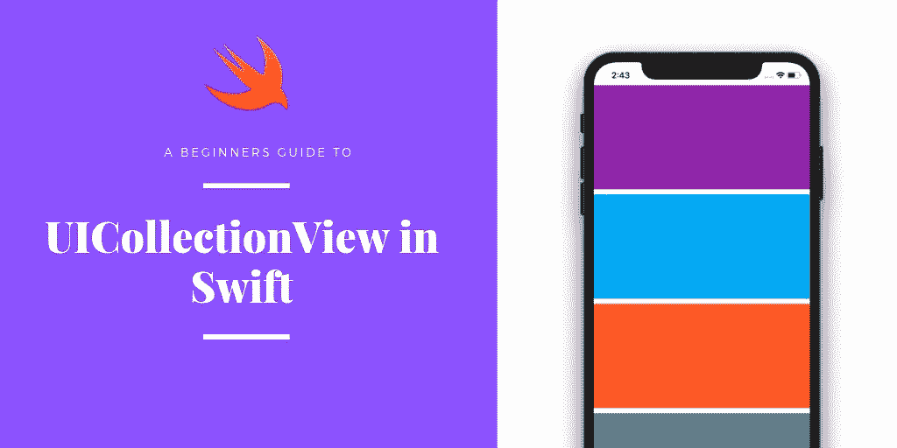
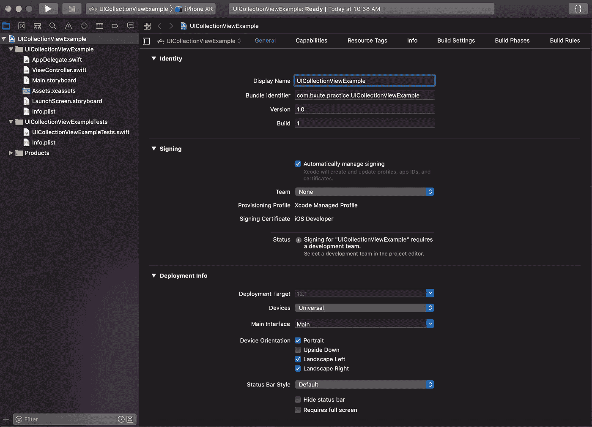
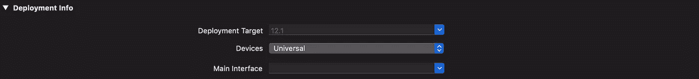
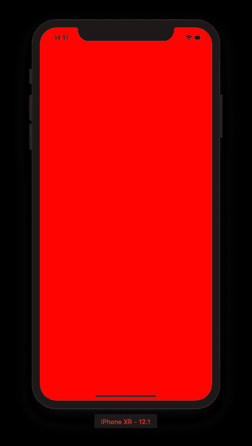
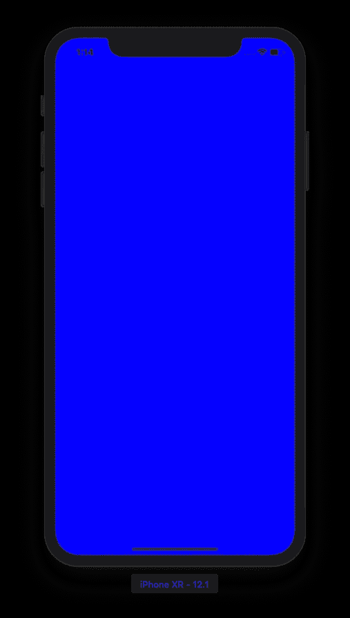
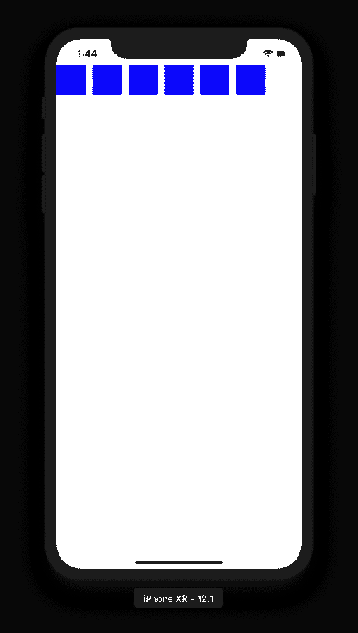
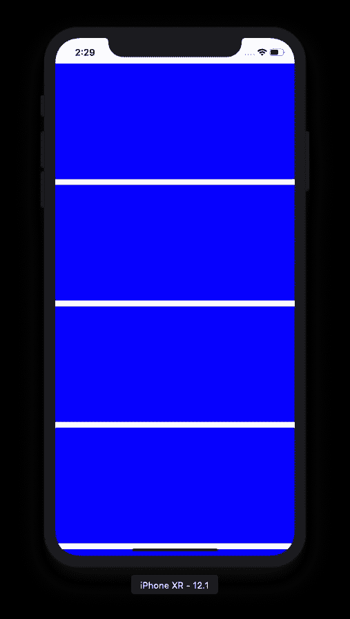
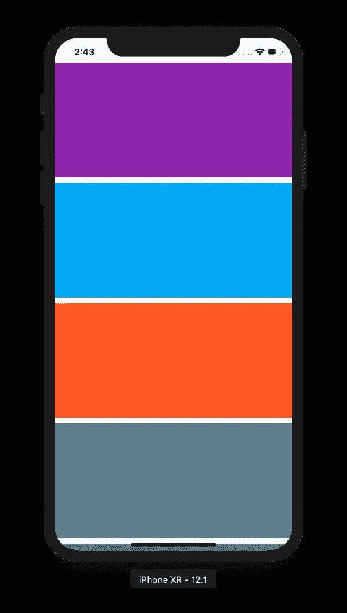

# 如何在 iOS App 中创建列表？

> 原文：<https://medium.com/hackernoon/how-to-create-a-list-in-ios-app-efb0d1e76715>

## UICollectionView 初学者指南

# UICollectionView 简介

`UICollectionView`是`UIKit Framework`的一部分，使您能够在您的 [iOS](https://hackernoon.com/tagged/ios) 应用中添加[列表](https://hackernoon.com/tagged/list)视图。这非常灵活，可以满足您的定制需求。你可以以任何方式显示列表，如水平列、垂直行和网格等。

在本教程中，我们将看到如何以编程方式向`ViewController`添加一个列表(我们不会使用`storyboards`)。

# 项目设置

创建一个新的 **XCode 项目。XCode 准备项目并打开“常规”标签**

Xcode project initial setup

由于我们不打算使用`Storyboards`，我们需要做一些基本的操作。

1.  删除 **Main.storyboard** (从项目文件夹中)
2.  删除**launch screen . story board**(从项目文件夹中)
3.  清除常规选项卡**部署信息**部分的**主界面**字段

Main Interface cleared

如果我们现在运行应用程序，你会看到一个完全黑屏。默认情况下，应用程序中没有窗口。因此我们需要准备一个。

打开 AppDelegate.swift 文件，导航到`didFinishLaunchingWithOptions`方法并添加以下代码。

现在去你的`ViewController`添加一些背景色到 ViewController。这将帮助您识别启动的正确视图控制器。

运行它，然后…我们明白了

ViewController with red background

现在我们在我们的`ViewController`，我们可以添加`UICollectionView`到它。

# 将 UICollectionView 添加到`ViewController` (以编程方式)

在您的`ViewController`中添加一个字段，并给它分配一个闭包。在此之后，我们需要将它添加为我们的`ViewController`视图的子视图。比如，

> iOS 中的每个视图都需要在屏幕上有一个位置。所以它需要一个框架或约束来放置自己。

现在添加一个对其应用约束的 helper 方法。

并在添加 collectionView 后在`viewDidLoad()`中调用该方法。

上述方法对 collectionView 应用约束以占据全屏。该视图将贴在`ViewController`的所有边缘上

为了确认这一点，我们将为 collectionView 添加一些背景色。在添加子视图之前，在`viewDidLoad()`方法中添加这一行。

`collectionView.backgroundColor = UIColor.blue`

运行应用程序，你会得到一个完全蓝色(或任何你分配给它的颜色)的屏幕。这说明你的 collectionView 已经完全膨胀了。

*现在我们可以将其背景颜色改为白色。*

在开始编写代码之前，让我们先了解一些基础知识。

CollectionView 需要一个**布局对象**和一个**数据源**来正确呈现其内容。

**布局对象**提供列表中每个单元格的布局信息。更具体地说，它提供了 collectionView 中每个单元格的`frame`。`frame`的型号为 [**CGRect**](https://developer.apple.com/documentation/coregraphics/cgrect) **。**因此每个单元格都有 x 坐标、y 坐标、高度和宽度。

我们已经在 CollectionView 初始化时传递了这个布局对象。

`let layout = UICollectionViewFlowLayout()`

`let cv = UICollectionView(frame: .zero, collectionViewLayout: layout)`

**数据源**负责向其提供数据，例如集合视图中的项目数、单元格等。

# 将 DataSouce 添加到 UICollectionView

遵循以下步骤:

1.  在`viewDidLoad()`的底部增加`collectionView.dataSource = self`
2.  使您的 ViewController 符合`UICollectionViewDataSource`和`UICollectionViewDelegateFlowLayout`协议
3.  添加协议后，Xcode 会抛出一个错误，并强迫您添加一些方法存根。因此，展开错误并单击修复按钮。它将把 2 个存根(`numberOfItemsInSection`和`cellForItemAt)`添加到您的控制器文件中。

4.从`numberOfItemsInSection`方法返回一些单元格计数

5.在`viewDidLoad()`中注册一个虚拟单元。collectionView 中的每个单元格都是`UICollectionViewCell`的子单元格。CollectionView 要求用标识符注册单元格。

6.从`cellForItemAt`方法返回一个单元格。在上一步中，我们注册了一个单元。现在您需要使用相同的标识符将单元格出队并返回它。(单元格默认没有背景色，所以我们需要设置一个才能在屏幕上看到)。

您的控制器文件应该类似于

现在运行应用程序，您将得到 6 个蓝色方块。

**幕后:**既然我们知道布局对象使用框架提供了单元格大小、位置等布局属性。默认情况下，`UICollectionViewFlowLayout`提供的单元格尺寸为 50x50，因此您得到的是小正方形单元格。

既然我们想要改变单元格的大小，我们可以使用`UICollectionViewDelegateFlowLayout`的`sizeForItemAt`方法来实现。将以下方法添加到控制器中

除此之外，你需要符合`UICollectionViewDelegate`和*将控制器设置为集合视图*的代理，就像`viewDidLoad()`中的`collectionView.delegate = self`

运行应用程序，你会看到一个列表

现在细胞变大了。我们可以改变细胞的颜色，使其看起来更有活力。

让我们添加一个颜色数组，并根据项目的索引路径应用颜色。

现在你会得到，它现在看起来更好。

最后，我们有一个带有彩色单元格的工作集合视图。

你可以在[https://github.com/bxute/UICollectionViewExample](https://github.com/bxute/UICollectionViewExample)获得完整的源代码

# 接下来是什么？

到目前为止，我们已经学会了如何添加集合视图和虚拟单元格/项目。你一定对单元格中的一些文本、图像或其他组件感到疑惑。

`UICollectionViewCell`的定制来了。在下一篇博客中，我们将学习如何准备一个自定义单元格，并在列表中显示一些真实数据。