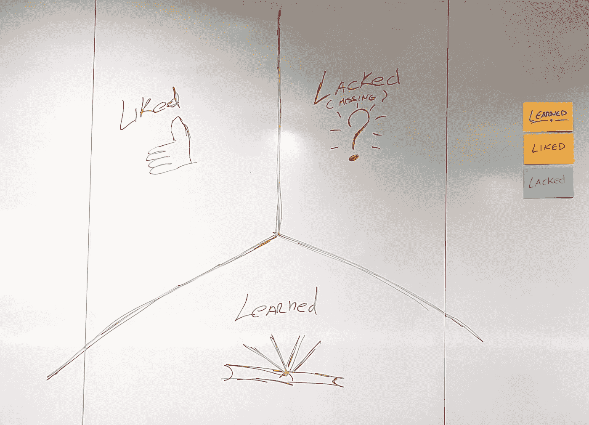
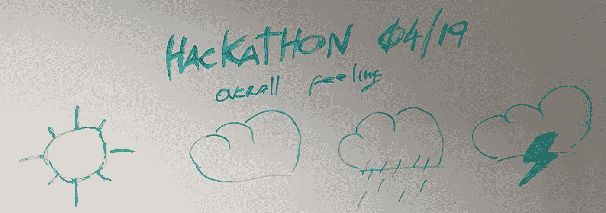
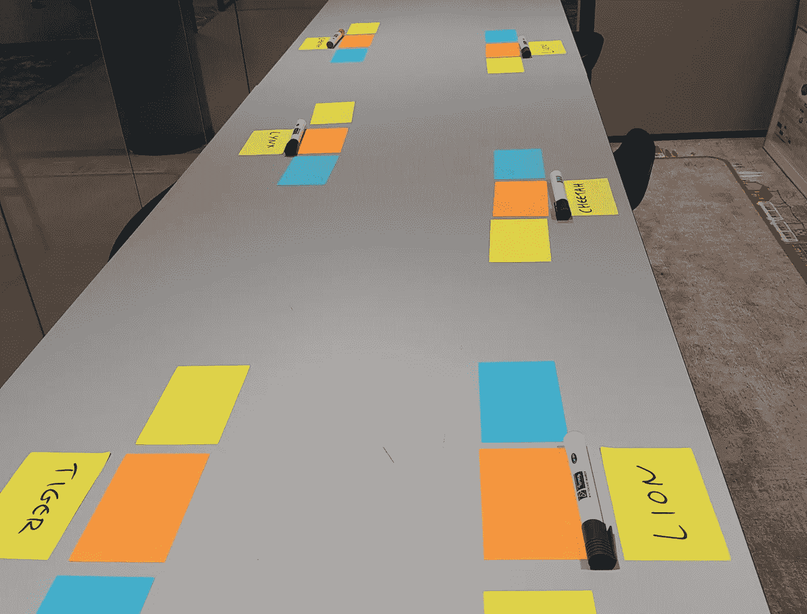
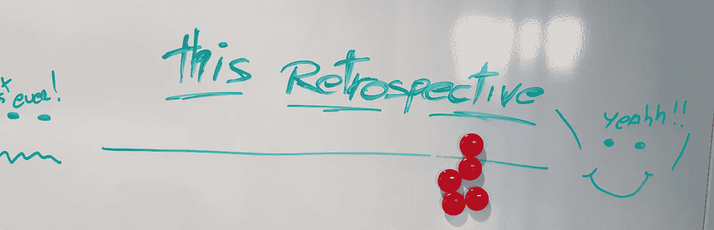

# 如何为新手创建回顾展

> 原文：<https://medium.com/hackernoon/how-to-create-a-retrospective-for-first-timers-3f8bec89e6d8>

## 我已经在敏捷世界和回顾中呆了一段时间了，但是我从来没有机会向别人介绍我们都知道并且认为是理所当然的概念。

直到现在。

这感觉像是一个令人兴奋的挑战。我敏捷之旅的重要一步。我有机会，不，荣幸地向回顾者们介绍一群人。在我看来十二原则中最重要的。

> “团队定期反思如何变得更有效率，然后相应地调整自己的行为。”——[*敏捷宣言*](https://agilemanifesto.org/principles.html)

老实说，我感到了一点压力。我想给团队留下一个好的第一印象，向他们展示敏捷是有价值的，而不仅仅是一种时尚。我怎样才能让回顾变得有趣，并对一个从未有过回顾的团体有用？

我不知道，但我肯定会尝试😄

和当今世界的每个人一样，第一件事就是打开谷歌，输入“回顾”。大约有 8700 万页🤯不乏启发。在打开几个标签和挤压果汁后，我决定了几个想法。

> 没有必要重新发明轮子，但是我们仍然有办法改进它⚡

我发现了一个叫做[趣味回顾](http://www.funretrospectives.com/)的网站。这个网站是灵感的巨大源泉。从回顾到展望，团队建设练习，很多材料。

这个回顾会是为了我们月初在数字实验室举办的黑客马拉松。

我想做一些不同于通常形式的“什么做得好”，“我们能改进什么”，一些更有趣的东西。在读了他们那里的一些复古之后，我选择了一家叫做 3L 的。

The 3L retrospective — Liked, Learned and Lacked

另一个永不失败的来源是 [Spotify 实验室](https://labs.spotify.com/)。

再次阅读他们的复古套件，我得到了一些不错的想法来增加趣味。

我决定用天气预报来询问大家对黑客马拉松的看法。这是对一个主题进行点投票的一种快速方式，并提供了对该主题如何被小组感知的快速洞察。

Weather Report

我不记得过去我是如何遇到[解放结构](http://www.liberatingstructures.com/)的，但是自从我第一次看到它们，我就受到了启发。在这次回顾中，我使用了对[1–2–4-ALL](http://www.liberatingstructures.com/1-1-2-4-all/)的改编，以“让每个人同时产生问题、想法和建议”。

Find your pair …

为了让它更有趣一点，我使用了一个劲量器来“找到你的一对”，这是我在有趣的回顾网站上找到的。我在小组中每个人的座位上写了写有动物名字的便利贴。

看起来这是一个有趣的方式，从个人回顾转变为配对，然后转变为小组讨论。

怎么样了？？？？

在我看来，它真的很好，我会给它一个👍，但我有偏见。另一方面，小组投票是这样的…

Feedback after the retrospective

标准类型的回顾是好的，不要误解我。当我们试图在下一次迭代中找到改善来帮助我们时，关注“什么做得好👍以及“我们需要改进的地方”👎“是个好策略。

但是，偶尔，重要的是增加趣味，远离预定义的模型。

这些资源将帮助你获得一些灵感。

*   [趣味回顾](http://www.funretrospectives.com/)
*   [解放建筑](http://www.liberatingstructures.com/)
*   [spotify 实验室——复古套件](https://labs.spotify.com/2017/12/15/spotify-retro-kit/)

*希望你喜欢这篇文章，你可以在*[*LinkedIn*](https://www.linkedin.com/in/costa-ruitiago/)*和* [*中找到我*](/@costa.ruitiago) *。*

**祝你度过美好的一天……**