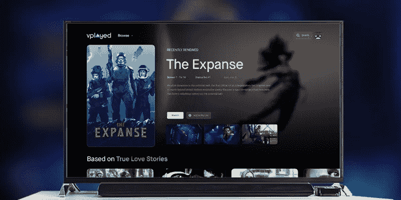

# 如何创建像网飞、YouTube 这样的视频点播网站、服务或应用？

> 原文：<https://medium.com/hackernoon/how-to-create-a-video-on-demand-website-like-netflix-youtube-f238fbcd5e09>

Easy Way to Create Video on Demand Service Like Netflix

> **最近更新—2023 年 3 月 13 日**

***在这篇文章中，我将带你了解在开展视频点播业务之前需要注意的事项，以及如何建立一个视频点播网站/应用程序，在全球范围内销售你的视频。***

点播流媒体服务是已经成为一种信仰的趋势之一。虽然是由千禧一代发起的，但这种娱乐模式已经像野火一样在从婴儿潮一代到 z 世代的每一代人中流行起来。预测图比任何其他娱乐形式都更有利于视频点播业务的发展。

> “预测显示，视频点播市场将从 2014 年的 253 亿美元增长到 2019 年的 614 亿美元”

尽管北美和欧洲在视频点播消费方面处于领先地位，但亚太和中东等地区在几年内显示出了良好的增长前景。整个世界都被视频点播的浪潮冲掉了，如果你正在寻找 [**开始视频点播业务**](https://www.contus.com/blog/how-to-start-a-video-on-demand-business/) ，这是做这件事的正确时机，无论你的目标观众在哪里。这种大规模的迁移正在发生，这是由于这些平台在你家中提供的有希望的高质量视频和内容的排他性。

# 开始视频点播业务之前需要考虑的事情

## 规划您的视频内容:

为了成功地[建立一个视频流网站](https://www.vplayed.com/blog/create-video-streaming-website-like-netflix/)来吸引大量用户并获得重复参与，需要高质量的内容。这个因素归结为两个大的方法，其中迷人的内容可以投到了你的网站。要么研究市场上表现良好的视频，购买他们的权利，要么创建自己的视频，值得病毒传播。在选择第二个选项的情况下，预算、工作人员和与你的观众群相关的剧本等主要因素都要考虑。投入大量的资源使你的视频点播平台的用户界面具有吸引力、反应灵敏和易于使用也是很重要的。

## 管理您的视频:

任何伟大的内容，如果没有适当的管理，注定会走到尽头。因此，视频内容的有效组织和管理同样重要。分析在管理您的视频点播平台中发挥着重要作用。

从 SEO 优化的弹性搜索引擎，到基于流派、乐器、艺术家的搜索标签，以及实时建议算法，一切都可以聚集你的视频在观众中的影响力。

## 正确的货币化战略:

你的视频点播软件的长期成功取决于你如何聪明地赚钱。尽管视频点播模式通常依赖于交易型 VOD 付费模式，但有多种创新的付费方案，如 push TV 和 catch up TV，可能会吸引观众以灵活的方式购买他们感兴趣的精确内容。视频点播平台也可以在视频的前期、中期和后期播放广告，在极少数情况下还会放置横幅广告。选择最适合你的目标人群的方式对你如何获得回报至关重要。

考虑到上述所有因素，[创建自己的 OTT 平台](https://www.streamingtrendz.com/best-solutions-to-create-an-ott-platform)归结为良好的编程和后端技术工作。你可以选择购买现成的、可定制的解决方案，与网飞和 Hulu 等电影流媒体巨头相媲美，而不是雇佣整个团队来从头开始构建你的流媒体网站。

# v played——内容所有者的完美视频点播解决方案

VPlayed 是一家白色标签 [**视频点播平台**](https://www.vplayed.com/video-on-demand-platform.php) 是占据视频流媒体市场的顶级公司之一。说到[建立视频流应用](https://www.vplayed.com/build-video-streaming-app.php)和网站，VPlayed 已经用他们的项目一次又一次地证明了这一点。VPlayed 与遍布各大洲 50 多个国家的全球品牌合作，在他们的解决方案被用于构建流媒体平台的每一次，v played 都以少量创新创造了奇迹。

> 那么是什么让这个视频点播解决方案鹤立鸡群呢？为了更好地理解它，我们创建了一个特性列表，这些特性是 VPlayed 的策展解决方案风格的责任。

**现成且可定制:**现成的解决方案要求缩短孵化时间。但这并不意味着你的产品应该是单调的或普通的。选择一个将您的期望与定制相结合的解决方案。

**云托管/本地托管:**您将数据存储在哪里应由您决定。VPlayed 提供了使用云服务器(如微软 Azure、谷歌、Akamai、AWS)或构建内部托管系统的选择。

**三层安全性:** AES 加密、访问控制和数据权限管理为您的数据传输和发布提供了安全的途径。这些安全措施确保您的内容不会受到任何形式的安全破坏或侵犯。

**内置播放器(HLS):** HTTP live streaming 是一种媒体流通信协议，用于流畅地传输视频内容。HLS player 将整个视频流分成基于 HTTP 的小文件下载，从而实现更快、无错误的流式传输。

**内容管理系统:**使用 VPlayed CMS 高效管理、组织和修改您的数字内容，营造一个持久的协作环境。视频 CMS 平台管理从格式管理、编辑到发布的一切。

**分析:**使用 VPlayed 指标图深入分析您的收入统计数据、用户及其活动。仪表板通过清晰的观看次数显示、最受欢迎和评论最多的视频，细分了用户参与活动的时间线。

**支付方式:**将多种支付网关集成到您的平台，支持多币种。此外，您还可以查看每个用户的订阅有效期，以及他们需要再次充值的时间。您为用户提供的计划可以随时定制，并提供单独添加新计划的选项。

**无限制的视频存储:**云存储或本地存储—无论您的需求是什么，我们都不会偏离我们的质量。获得任何格式的无限视频/音频存储，并以无缝的操作质量进行转码。

**视频内容的地理分块:**监控和管理哪些内容在全球范围内的哪个位置进行流式传输。地理屏蔽在遵守国家法律和让你的平台出现在跨国界的好书里时很方便。

**即时回放&返回:**不给缓冲和延迟留下空间。VPlayed 通过其先进的 HLS 播放器提供即时播放，而不必担心流媒体广告，具有高端用户友好的 UI 和其他定制。

**视频货币化:**在你的点钞机上用各种各样的选项来货币化你的内容。[视频货币化平台](https://www.vplayed.com/video-monetization-platform.php)在广告、订阅计划、交易计划、追赶和推送电视货币化模式方面有着良好的回报。

# 结论:

创建自己的视频点播网站不是一件简单的事情。但是伴随着巨人而来的是更大的积极成果。因此，如果你是一个正在考虑进入这一娱乐领域的企业家，那就别再想了。确保您通过您的[最佳视频点播平台](https://www.contus.com/blog/vod-video-on-demand-platforms/)满足您的目标人群的需求，这些平台具有令人惊叹的定制功能，可将他们吸引到您的平台上。