# 如何制作一个有效的 Instagram 故事广告

> 原文：<https://medium.com/hackernoon/how-to-create-an-effective-instagram-story-ad-bf9aef9eb9>

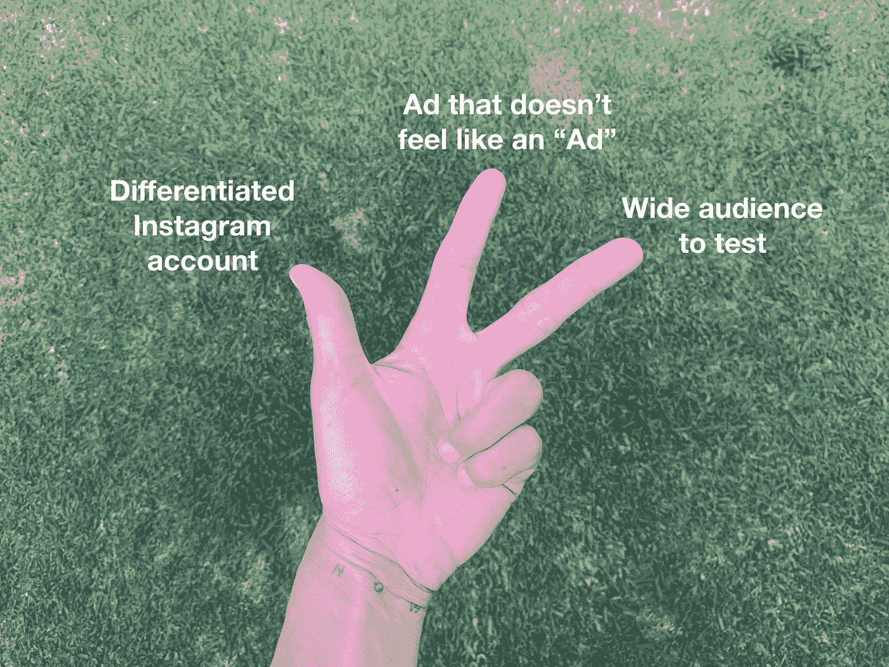

对于 Instagram 上的大多数小企业主来说，创建和发布有效的 Instagram 故事广告似乎仍然势不可挡，遥不可及。广告怎么拍？你如何发布广告？你应该花多少钱？怎么知道设置是否正确？当我开始 Instagram Story 广告之旅时，我也有同样的问题，但是不要担心，尽管它们*可能*是一门非常复杂的科学，但也有办法让*任何人*快速、简单、廉价和有效地创建它们。

就我而言，在被一向敏锐的[芬恩·索梅尔](https://medium.com/u/f01e2fa3986?source=post_page-----bf9aef9eb9--------------------------------)指点迷津之后，我得以在 Instagram 上接触到超过 430 万人，在 4K 的粉丝数量上有所增长，我的网站流量增加了 100%(年复一年)，并且在一个月内仅用 462 美元的预算就获得了超过 450 美元的额外销售额。

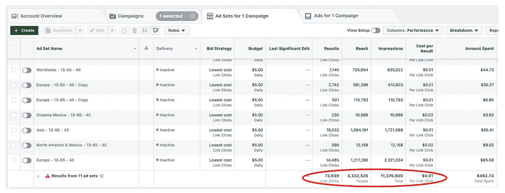

[I make a living from my Instagram accounts](/the-mission/how-to-make-money-on-instagram-7b13ce4b300d) so figuring out a way to be able to control the traffic and sales I can generate is very important for me, especially given [how saturated my niche is](/the-mission/why-your-instagram-account-isnt-growing-and-why-it-s-not-because-of-the-latest-instagram-523f6137014b) and the constant fluctuations of the Instagram algorithm.

我肯定这些结果没有最有经验的脸书广告专家所能产生的利润丰厚，但鉴于我没有经验或大预算，这是我在我的账户上测试过的最有效的 Instagram 增长选项之一(我在 Instagram 上运行了 [@pinlord](https://www.instagram.com/pinlord/) 、 [@potteryforall](https://www.instagram.com/potteryforall/) 和 [@macramemakers](https://www.instagram.com/macramemakers/) )。

更重要的是，这是一个很容易复制的过程(这意味着你也可以做到)，与花同样多的钱在 Instagram home feed 赞助的帖子上相比，结果要有效得多。

我是这样做的…

创建第一个有效的 Instagram 故事广告的过程可以分为 3 个主要步骤:

## 1.确保你的 Instagram 账户与众不同，有“粘性”内容:

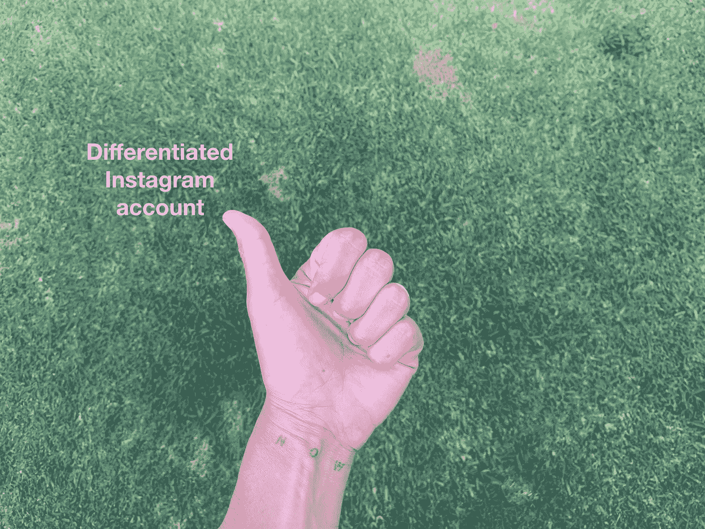

在你开始投放任何广告之前，首先要确保你有一个有粘性内容的差异化 Instagram 账户，这一点很重要。你可以花世界上所有的钱通过广告把人们带到你的账户，但是除非你有差异化的“粘性”内容，否则你带来的所有人很可能只会看到你的页面就离开。你将会浪费你的钱(就像许多做广告的人一样)。

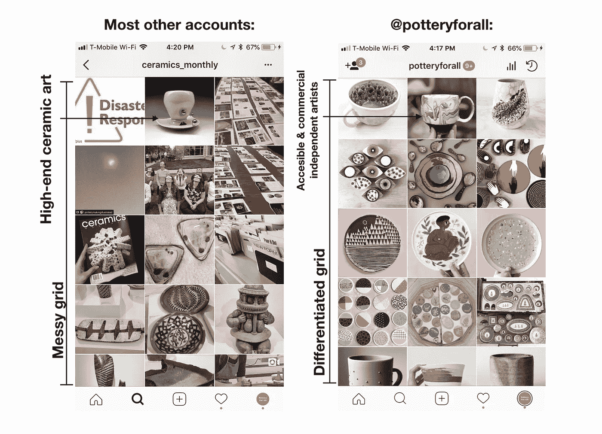

Here’s an example of how differentiated content and a visually distinctive grid generates growth. The account on the left [@ceramics_monthly](https://www.instagram.com/ceramics_monthly/) creates the same type of content as the account on the right [@potteryforall](https://www.instagram.com/potteryforall/) (featuring ceramic artists on Instagram) but the account on the right grows organically at 3x the pace because it’s focused on curating a great grid with great photos. Unless you take the time and effort to create great content and grid layout, you’re not likely to grow as fast as other accounts in your niche. Planning and [automating your posts](/the-mission/how-to-schedule-instagram-posts-from-your-computer-7138ba26658f) ahead of time is a good place to start.

尽管创建一个与众不同的 Instagram 账户有很多方法，但遵循本文中的原则将会增加实际实现的可能性。简而言之，通过了解你的帖子创造了最大的价值，并通过视觉差异化的网格清晰地展示出来，这一切都是为了在你的领域创造最[吸引人的内容](/@edmo_nyc/how-to-measure-engagement-rates-on-instagram-and-why-its-important-d368486a984a)。

如果你的账户在没有赞助帖子或[互动自动化](/the-mission/how-to-automate-an-effective-instagram-bot-that-isnt-spammy-b2146a2c0b19)的情况下稳步增长，你很可能已经足够与众不同，通过 Instagram 故事广告为你的账户带来更多关注，从而产生巨大的结果。相反，如果你的账户本身没有增长，很可能它也没有足够的差异化来通过 Instagram Story 广告增长。

## 2.创建一个感觉不像“广告”的 Instagram 故事广告。

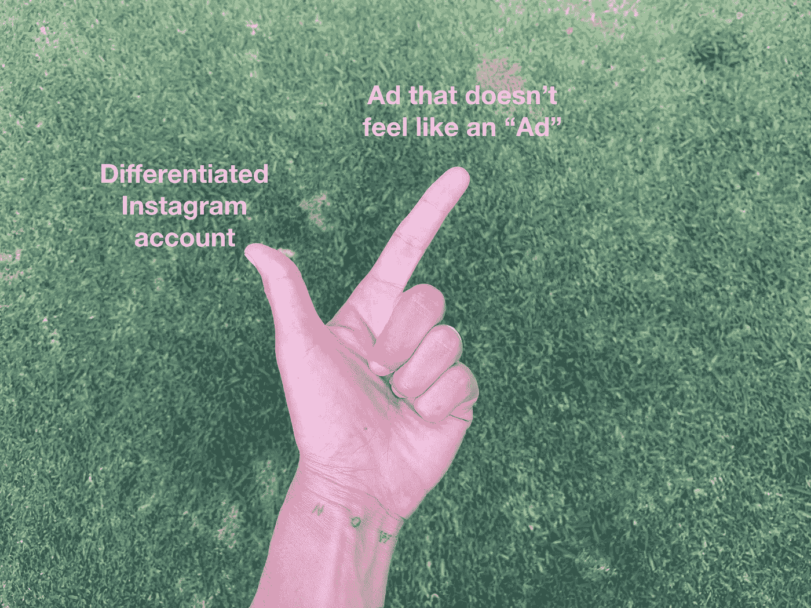

我们从出生那天起就已经看过“广告”，而且我们大多数人对“广告”的样子都有一个先入为主的想法。它通常包括光滑的图形和照片，尖锐，朗朗上口的文字和非常清晰的视觉传达，正是我们正在出售。当谈到 Instagram 故事广告时，它们通常看起来像这样:

不幸的是，由于普遍缺乏关于什么类型的广告在 Instagram 故事上有效的信息，以及 Instagram 视频模板工具的广泛可用性，这些工具在上面的视频等内容上蓬勃发展，大多数小企业(和大品牌)陷入了思维陷阱[这](https://www.youtube.com/watch?v=2TQTXw6qRdE)就是伟大的表演广告应该看起来的样子。

这种共同的信念意味着大多数 Instagram 广告具有相同的审美和格式。他们中很少有人感到真诚和与众不同，因此，他们中很少有人工作。如果你是一个预算很少的小企业主，把钱浪费在不起作用的广告上是一个严重的问题。

好消息是，创建一个有效的 Instagram 故事广告根本不需要任何花哨的图形应用或广告知识。诀窍是让你的广告看起来不像广告。我哪里知道？我测试过了。在测试了多种类型的 Instagram Story 广告格式和视频后，这是迄今为止对我来说效果最好的一种，类似的东西也可能对你有很好的效果:

正如你所看到的，这个视频和大多数“广告”有很大的不同。为什么表现这么好？因为*感觉不像广告*。这感觉就像你可能从朋友或你关注的人那里看到的普通故事，正因为如此，人们才会关注它。

你也可以这样做:

*   **Instagram 广告被限制在 15 秒:**在我们进入细节之前，了解这个时间限制很重要，因为你必须围绕它来计划你的拍摄。以下是关于如何分解广告结构的一个很好的经验法则。
*   **第二个 0:00-0:02——抓住你的观众的注意力:**人们通常会在看完一个故事的前几秒钟内决定是想看更多还是继续看下一个。这意味着你必须用吸引人们注意力的东西来开始你的视频。什么能引起人们的注意很大程度上取决于他们习惯于看什么内容，所以你对观众的反应越合拍，你就越有可能以一种吸引他们更多观看的方式开始你的视频。在我的例子中，它是以我带别针的背包的照片开始广告的(看上面的视频就知道了)。
*   **第二个 0:02–0:09——以充满活力和与众不同的方式清楚地传达你的价值主张:**一旦你抓住了观众的注意力，解释为什么值得他们继续关注你的视频并向上滑动。问问你自己:“为什么人们会认真地从我的广告中感受到足够的价值，想要看完它？”如果你之前使用过 Instagram，你知道除非超级有趣，否则很少会看到一个故事结束，所以如果你想让它表现良好，就尽量让你的广告*真正有趣*！用一种不同的方式积极地展示你的内容真的很有帮助。即使是最有价值的内容，如果以枯燥的方式传递，也没人会在意。就我而言，当我告诉我的观众我向人们展示如何制作他们自己的珐琅别针时，我只是专注于保持精力充沛。在这则广告播出时，Instagram 上没有多少其他账户提供这种服务，因此它脱颖而出。
*   **第二个 0:09–0:12—行动号召:**你已经抓住了人们的注意力，并传达了你的价值，足以让他们看到第二个 9…现在该怎么办？如果你没有明确地告诉你的观众你希望他们在这一点上采取什么行动，他们中的大多数人会点击右按钮，然后进入下一个故事。对大多数观众来说，阻力最小的方法就是向上滑动。不要要求他们购买你的产品或你的课程，这将使他们成为百万富翁…只是要求他们刷卡。它们会出现在你的 Instagram 页面上(稍后会有更多介绍)，然后你的 Instagram 简历和内容会帮你推销。
*   **第二个 0:12–0:15——专门的行动号召屏幕:**在大多数情况下，要求人们向上滑动是不够的，所以在最后留下一个 3 秒钟的屏幕，除了提示“向上滑动”之外，什么也不显示(参见上面的视频示例)。为什么？除非你给人们留出几秒钟的空间向上滑动，否则大多数人只会认为还有更多广告可以看，他们只会看 15 秒钟，而不会真正向上滑动。一旦 15 秒过去，一个新的故事就会出现，他们回到你的广告上去刷的可能性比在最后留出 3 秒钟给他们时间去刷的可能性要小得多。相信我，这非常重要。
*   **包含文字说明:**当谈到视频本身的次要技术元素时，最重要的是确保你的广告有可读的文字说明。大多数用户在浏览他们的 Instagram 故事时会将它们静音，所以除非你添加标题，否则人们不会知道你在说什么，这增加了他们直接点击右键并进入下一个故事的可能性。在我的例子中，我使用 [Videorama](https://itunes.apple.com/us/app/videorama-video-editor/id1049690233) 在底部加入简单的文字说明，并在黑色屏幕的末尾加入行动号召和音乐。
*   **让它看起来不是一个“广告”:**这是这个过程中最主观也是最重要的元素。不要让你的广告感觉像“广告”！什么感觉像广告，什么感觉不像广告，取决于你读这篇文章时 Instagram 上流行的广告类型，所以判断什么感觉像广告，什么感觉不像广告的最好方法是花大量时间在你的 Instagram 故事上，并注意你看到的广告的外观和感觉。然后反其道而行之。创造一些*看上去和感觉上*不一样的东西。当我运行我表现良好的广告时，Instagram 上的所有广告看起来都像是[这个](https://www.youtube.com/watch?v=f0VLrweyo9k)，所以一个休闲、更个性化的广告真的脱颖而出。我用 iPhone 在人像模式下拍摄的。我拍摄它就像拍摄一个“常规”故事一样(没有大制作)，我只是告诉人们我认为我在他们的生活中创造了什么价值，请他们如果感兴趣就点击并关注我。这里的关键是*不卖*东西。你很有创造力！想出一个方法，让人们对你做的事情感兴趣，而不告诉他们去买。

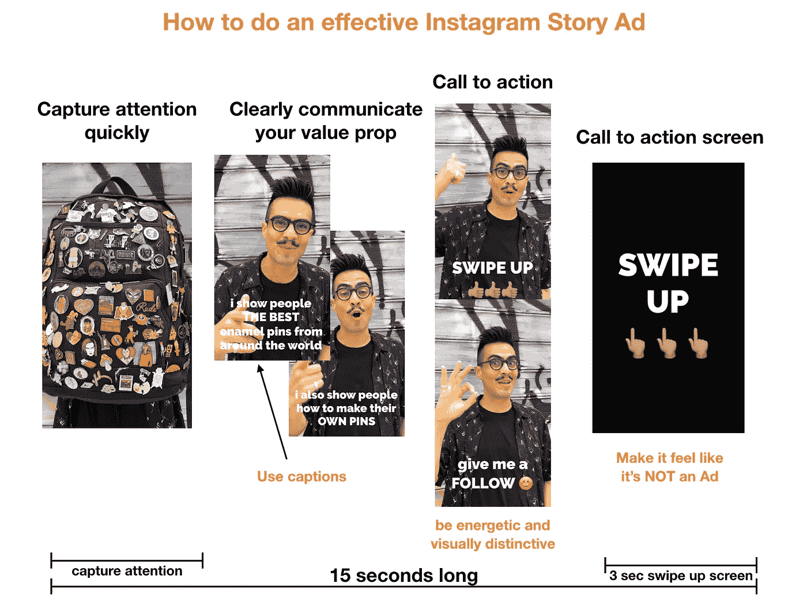

## 3.在最广泛的受众中投放您的广告，以低廉的成本测试其效果:

一旦你有了一个有粘性内容的差异化账户，并且你已经创建了一个感觉不像“广告”的 Instagram 故事广告，你就可以最终推出并衡量它是否有效。

我从经验中了解到，除非你是一名经验丰富的脸书广告经理，否则如果你选择根据人口统计数据锁定特定的利基定制受众，你就不太可能从 Instagram 故事广告中获得正回报。这是因为有效地接触你的目标受众需要对受众定位有非常非常深入的了解，特别是脸书广告工具。因此，除非你愿意投入时间和金钱来熟练地学习这一技能，否则你更有可能通过关注最广泛的适用受众，从你的故事广告中看到积极的结果。

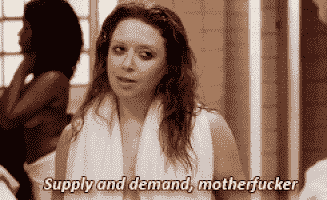

长话短说，Instagram 广告的定制受众定位是通过供求关系实现的。基于人口统计的利基受众往往有限，但需求巨大，这就增加了向他们投放广告的价格。通过关注最广泛的适用受众，并选择按链接点击收费(稍后将详细介绍)，您将关注需求相对较低的定制受众群体，这使您能够以较低的价格接触到更多的人。通过链接点击收费，你只是为那些与你的广告有联系的大量观众中的人付费，而每次链接点击的成本往往会低得多。

如果你不相信我，运行两个广告集(一个具有基于人口统计的细分客户群，另一个具有最广泛的适用客户群)，并衡量哪一个具有最低的每次点击成本以及更大的追随者增长和销售额。

如果通过这个测试，你发现你的利基客户目标受众表现最好，太好了！如果没有，下面是我向广大观众投放广告的具体步骤:

*   首先，确保你设置为一个商业 Instagram 账户。完成该流程后，请转到脸书业务经理档案中的广告经理面板，点击“创建”按钮开始设置流程。

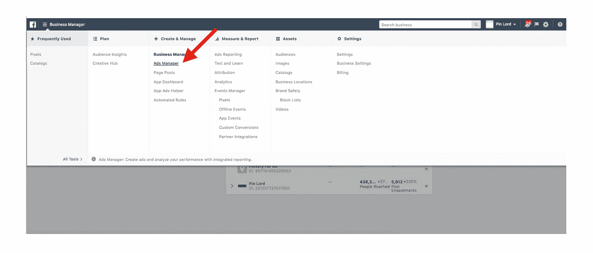

*   点击“创建”按钮后，在活动屏幕中选择流量选项作为您的目标:

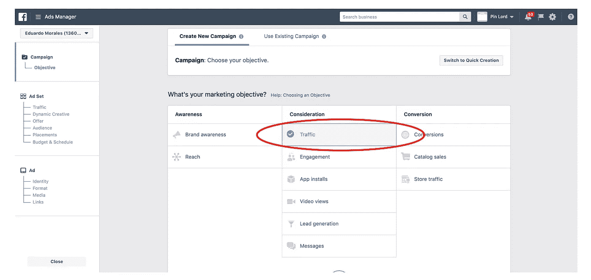

*   向下滚动命名您的活动，并输入最低的每日预算(目前，这是每天 5 美元)，然后点击继续。

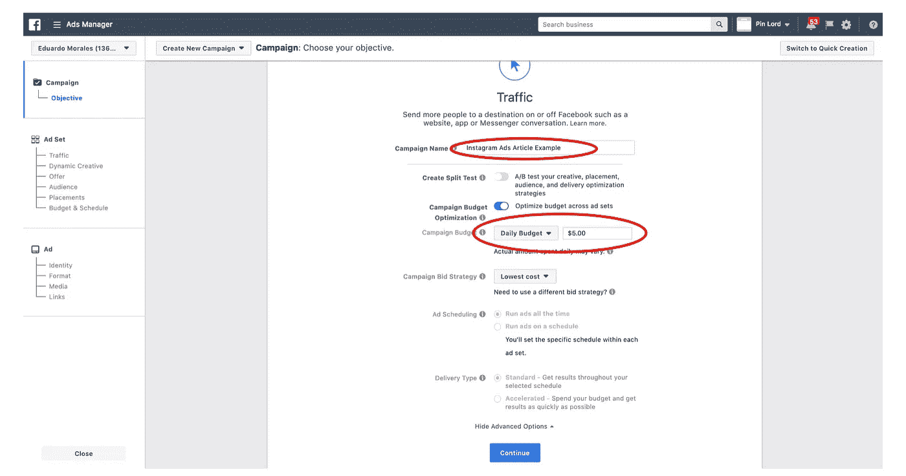

*   现在你进入了广告设置页面，在流量框中选择“网站”选项(这通常是默认的)，然后向下滚动到受众框。在这里，您可以选择最广泛的适用受众。可能已经为您选择了一个(在我的例子中是美国，因为我住在那里)，但只需从那个中“x”出来，并搜索最大的适合您的地区。以@pinlord 为例，我运送的是国际货物，因此我最大的适用受众是“全球”。如果你是国际运输或者有一个广泛可用的数字产品，这可能是你最广泛的受众选择。其他一些选项有“北美”、“欧洲”、“亚洲”等。你要找的是比国家大的地区。哪一个最适合你将取决于你的业务。

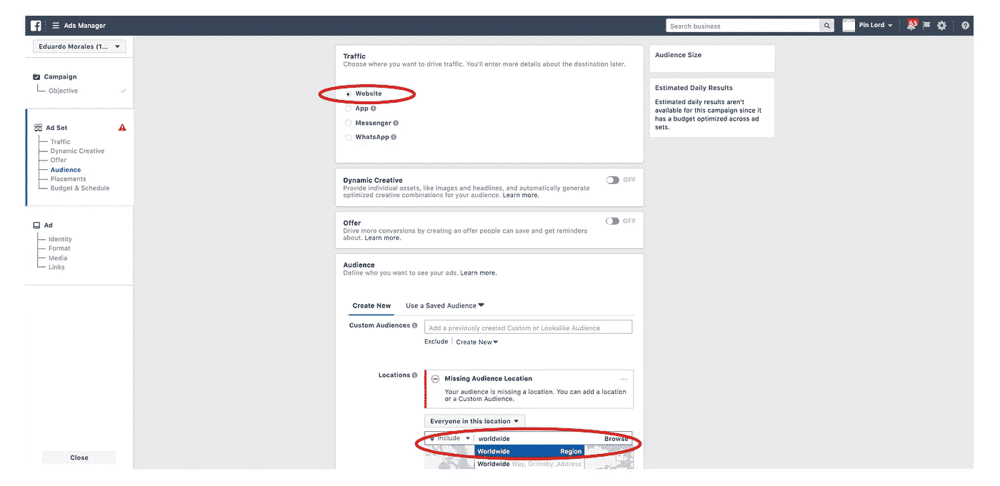

*   一旦你确定了你的受众范围，选择最广泛的年龄和性别适用人群。在我的例子中，没有性别特征的是 18-65 岁(我很幸运，别针通常是所有性别都买的)。

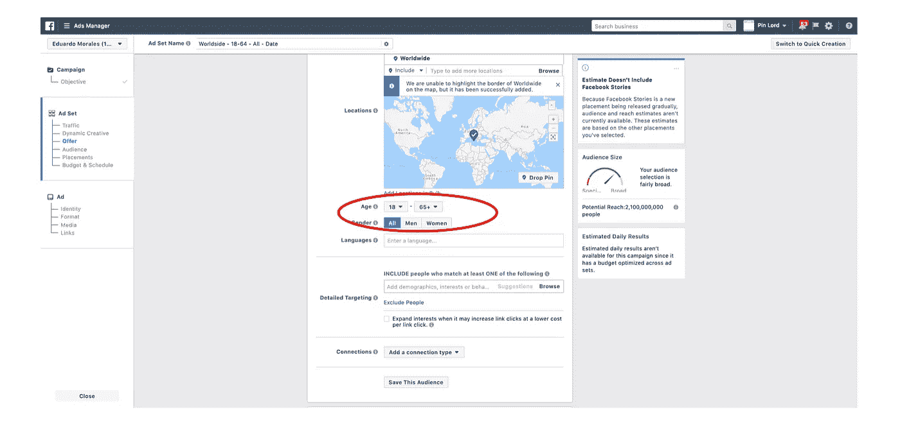

*   现在你已经完成了对受众的访问，向下滚动找到“编辑位置”部分。在这里，取消勾选所有方框，只保留 Instagram 故事的方框标记。这将确保你的广告只是作为一个故事(这将大大降低你的广告的成本和效果，因为你已经把它作为一个故事)。

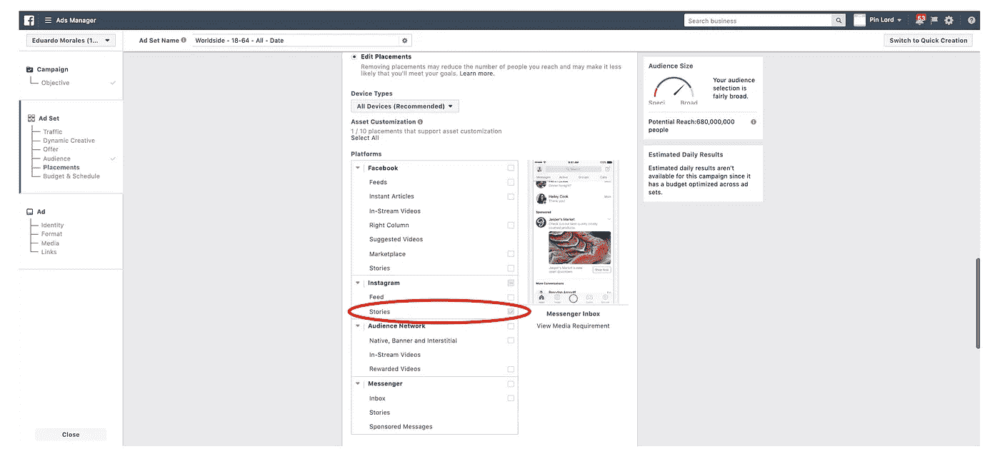

*   编辑完位置后，向下滚动到“预算和时间表”框。在这里，为你的广告安排一个 15 天的时间表(广告通常在 15 天后开始看到回报的最大下降)，然后将“当你被收费时”设置改为链接点击(CPC)。向下滚动并单击继续。

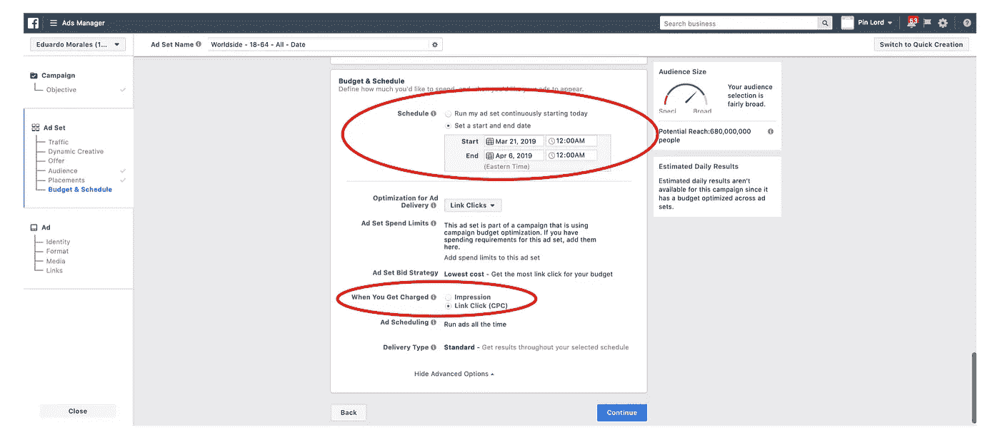

*   您现在处于流程的广告部分。在顶部命名您的广告，然后选择相应的脸书页面和 Instagram 帐户，您将在上面运行广告。此外，选择下面的单个图像或视频。

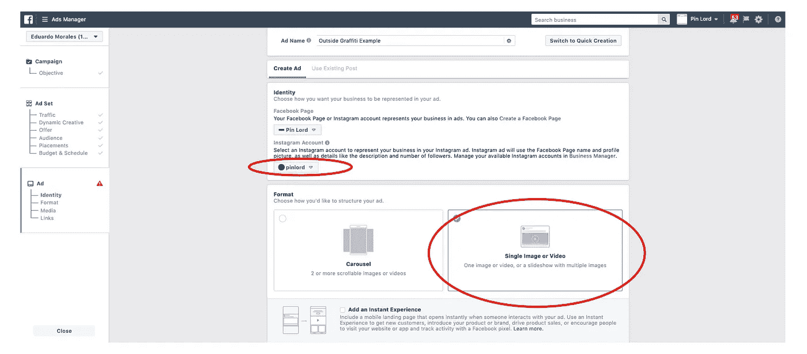

*   现在，上传你的视频，在链接部分，选择网站。在网站链接下方，输入你的 Instagram 网址。对我来说，是 https://www.instagram.com/pinlord/。你想把人们引向你的 Instagram，而不是你的网站，因为你会在这里获得更多的价值。如果你有一个与众不同的“粘性”账户(这就是为什么这一部分如此重要)，人们不仅会通过你在简历中的链接找到你的网站并可能购买，而且你还会获得很多新的关注者。这将给你成千上万的机会，让这些追随者在未来从你这里买东西，相比之下，最初会把他们带到你的网站，他们会登陆一次，然后买或不买。

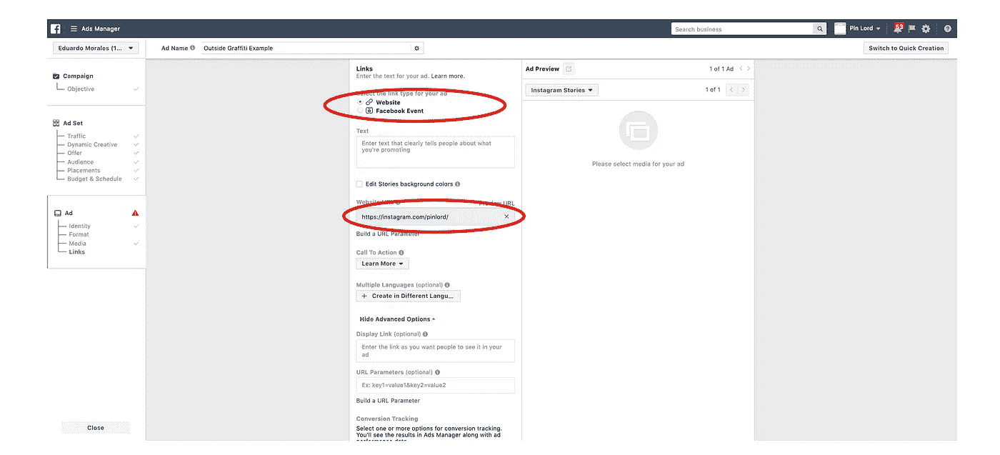

*   完成后，滚动到该屏幕的底部，然后单击确认。恭喜你。您的广告现已提交脸书审批，即将上线。

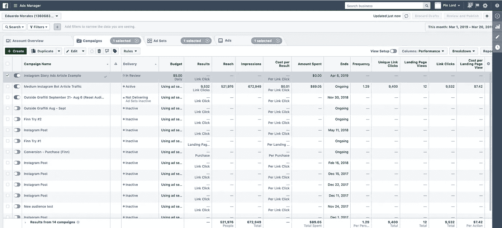

*   在脸书批准之前，您的广告将在您的广告管理器仪表板中显示为“正在审核”。一旦获得批准，它将开始运行(或在您设置日期时运行),您将在仪表板上看到它处于“活动”状态。

## 对另外两个最好的、最广泛的和最适用的受众重复这个过程。

*   现在你已经把你的广告投放给了最广泛的受众，是时候重复同样的过程了。你要改变的唯一一步是把它瞄准第二和第三最广泛的受众。对我来说，是亚洲和欧洲。

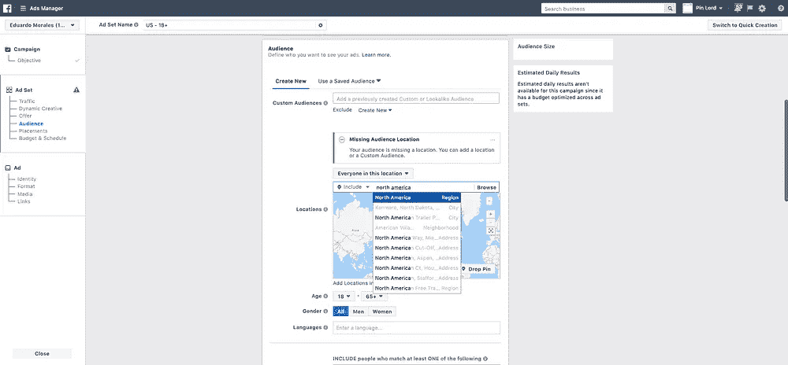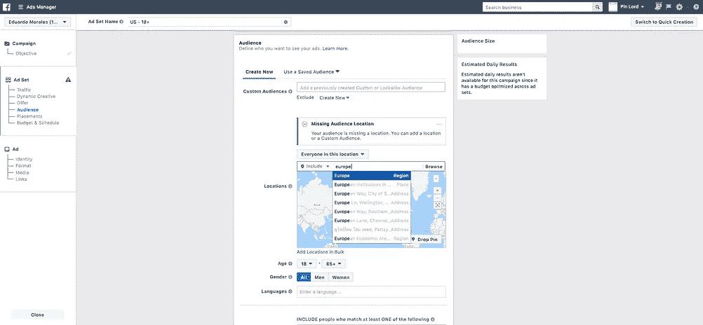

*   通过这样做，你将向 3 个不同的受众提供完全相同的广告。这让你可以在这些受众中测试表现，以了解哪些受众对你的广告和内容反应最好。这些信息是有帮助的，因为它会指出你将来应该把你的广告花费集中在哪些受众身上。
*   运行 3 整天的广告，比较 3 个受众的点击费和每页登陆费。在我的案例中(如下)，针对欧洲的广告表现最好。获得 0.01 美元的点击费和 0.06 美元的登陆页面浏览量(全球 0.01 美元的点击费和 0.10 美元的 cplpv，亚洲 0.01 美元的点击费和 0.12 美元的 cplpv)

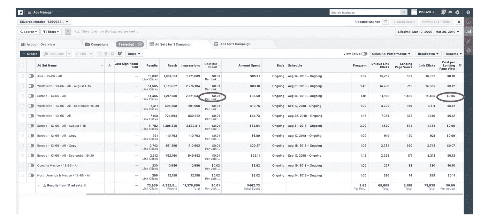

Note, these will all appear as running for you. I took these screenshots once these Ads had finished running.

## 停止所有其他的广告，复制最划算的广告，花两周时间在最划算的广告上。

*   既然你已经找到了三个受众中哪一个在第三天之后给你最好的表现，停止播放两个表现最差的受众的广告，并将预算(如果你有)转移到两个针对表现最好的受众的新广告上。
*   为此，请选择表现最佳的观众下方的“复制”选项。你在这里做的是向该受众所在区域的不同部分投放完全相同的广告，这意味着新的人会看到它，但你更有可能获得同样高的表现(广告的表现水平往往因区域而异，但不会在一个区域内的不同受众群体中发生变化)。

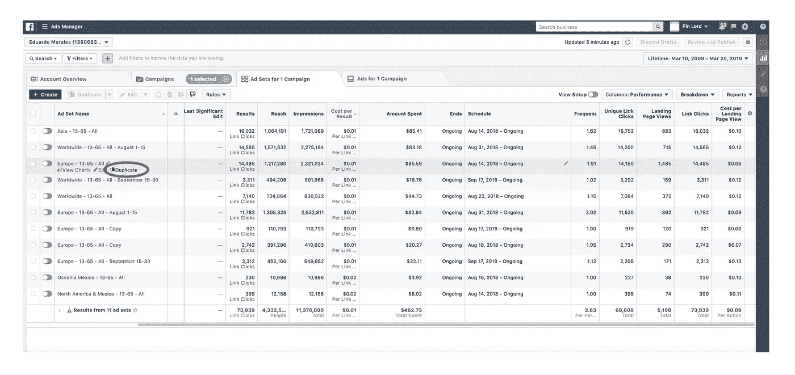

*   一旦你复制了两次广告，你将会有三个广告同时出现在相同的观众面前。它看起来会像下面的照片。

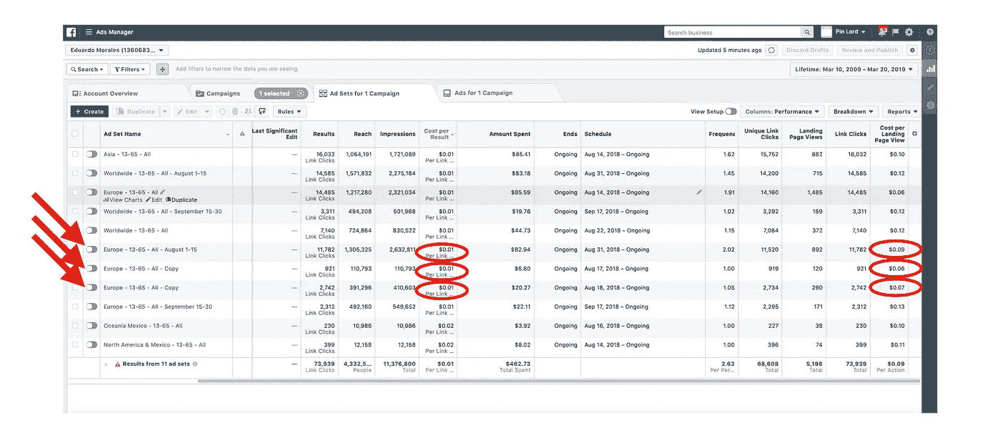

Note: these will all appear as “Running” for you. I took these screenshots once these Ads had finished running.

嘣！完成了。你现在运行 Instagram 广告。

## 衡量它吸引了多少关注者和销售额:

*   一旦你的广告投放了一个星期，通过检查与没有投放广告的一个星期相比，你获得了多少新的关注者(通过你的 Instagram Insights)和获得了多少新的销售额(通过你的电子商务平台),来衡量它们的表现。
*   为了知道你是否应该继续投放广告，问问你自己:“我刚刚在 Instagram Story 广告上花的 105 美元(每天 5 美元 x 3 个广告 x 7 天)是不是获得我在上周获得的粉丝数量和销售额的最便宜的方式？”如果答案是肯定的，那么继续运行它们。如果答案是否定的，那就把你的 105 美元花在能让你获得更好结果的营销策略上。

## 测试并持续改进:

如果你相信 Instagram 故事广告，并经历了足够多的积极结果，觉得你想获得更好的投资回报，唯一的办法就是继续测试你的广告。尝试新的受众目标，调整你的视频，调整你的 Instagram 页面！所有这些因素都会影响你的受众对广告的反应，所以这些因素的质量越高，你的广告表现就越好。

如果一开始这一切看起来令人困惑，不要担心，坚持下去。没有人第一次做广告就成为 Instagram 广告天才。不断测试(并失败)是学习的唯一途径。

PS——如果你有兴趣了解更多关于其他有效的 Instagram 增长策略，请阅读这些关于[Instagram 到底是什么以及如何工作的文章](https://theeduardomorales.medium.com/what-instagram-really-is-how-it-works-ad5d7ff5b6a0)、[Instagram 算法如何工作](https://theeduardomorales.medium.com/what-the-instagram-algorithm-does-how-it-works-how-to-use-it-to-your-advantage-752356122c67)、 [Instagram 利基市场以及它们为什么是增长的关键](/better-marketing/instagram-niches-why-they-are-the-new-key-to-growth-on-instagram-beca2878d55d)、[如何建立一个赚钱的 Instagram 转发账户](/swlh/how-to-create-an-instagram-repost-account-that-makes-money-928a404560)、[如何在 insta gram 上赚钱](/the-mission/how-to-make-money-on-instagram-7b13ce4b300d)、[如何选择正确的 insta gram 用户名](/better-marketing/how-to-pick-the-best-instagram-username-9af1b49b7ad)， [Instagram bot 2021](/better-marketing/instagram-bots-in-2021-everything-you-need-to-know-b57fb0a3b8e9)，[为什么你的 Instagram 账户没有增长](/the-mission/why-your-instagram-account-isnt-growing-and-why-it-s-not-because-of-the-latest-instagram-523f6137014b)，[最好的 Instagram bot](https://hackernoon.com/the-best-instagram-bot-that-will-keep-your-account-safe-4aaf0ccaee4d)，insta gram bot 的状态[insta gram bot](https://bettermarketing.pub/the-best-instagram-bots-for-2022-the-most-effective-options-everything-else-you-need-to-know-73fa36f4e433)，[如何自动化一个没有垃圾邮件的 Instagram bot](/the-mission/how-to-automate-an-effective-instagram-bot-that-isnt-spammy-b2146a2c0b19) ，你需要知道的关于 Instagram hashtags 的一切，[如何创建有效的 insta gram 故事广告](https://hackernoon.com/how-to-create-an-effective-instagram-story-ad-bf9aef9eb9)， [如何](https://hackernoon.com/how-to-create-an-effective-instagram-story-ad-bf9aef9eb9)[将你的媒体文章](https://hackernoon.com/how-to-monetize-a-medium-article-b4c1aeb7fdae)、[货币化、如何自动化你的 Instagram 帖子](/the-mission/how-to-schedule-instagram-posts-from-your-computer-7138ba26658f)、[如何提高你的 Instagram 参与度](/swlh/how-to-measure-influencer-marketing-roi-on-instagram-321b9b397ef4)、[如何找到发布帖子的最佳时机](/the-mission/how-to-optimize-posting-times-to-fix-your-falling-engagement-rates-on-instagram-f9ecf87e82aa)，以及[如何衡量一个影响者的价值](https://hackernoon.com/how-to-measure-what-an-instagram-influencer-is-worth-cb488f605ffe)、[如何找到最有价值的 Instagram 影响者](https://hackernoon.com/how-to-search-for-and-find-the-most-valuable-influencers-on-instagram-df8ddd5b2243)、[如何接触影响者](https://hackernoon.com/how-to-reach-out-to-instagram-influencers-to-maximize-response-rates-16f429008f62)和

希望他们帮忙！

## 非常感谢您花时间阅读我的文章！如果你喜欢它，你可以通过注册我的 [Instagram 小企业班](https://theinstaclass.co/)来支持我，分享这篇文章并给它一堆掌声。你也可以[在 Instagram](https://www.instagram.com/theeduardomorales/) 上关注我，每当我发布❤的新作品，你就可以获得更新

