# 如何创建产品路线图和最佳产品路线图工具

> 原文：<https://medium.com/hackernoon/how-to-create-product-roadmap-examples-and-tools-included-4cf7f4b77b05>

## 产品路线图是一个重要的战略工具，它允许业务部门、产品所有者和利益相关者轻松地在产品方向上保持一致。在这篇文章中，我将介绍如何创建产品路线图和开发的主要步骤，并分享在创建过程中对你有帮助的最佳产品路线图工具。

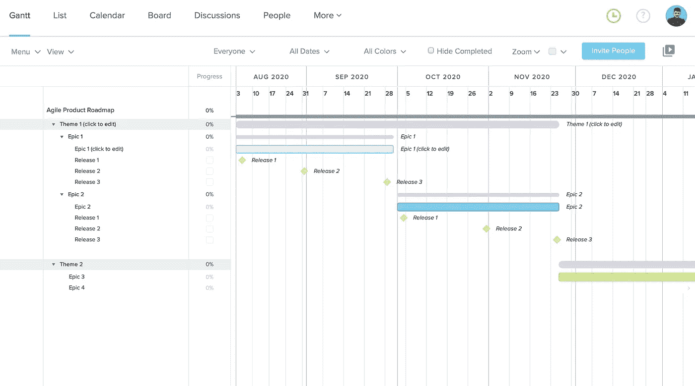

[Use this template](https://bit.ly/3mzmhUJ) from TeamGantt

# 为什么您需要产品开发路线图

产品路线图说明了高层次的产品策略，并说明了产品将如何随着时间的推移而出现。它向团队成员和外部利益相关者传达产品开发的主要思想和进展。

任何以受众为中心的路线图都有自己的特点。

*   开发团队的路线图通常由冲刺、发布和特性组成。它们相当短，通常也更有野心。
*   卖家的路线图侧重于将功能和对客户的好处结合起来。
*   合作伙伴、客户或投资者的路线图集中在产品对他们的主要好处上。像任何向外部利益相关者展示的文档一样，这种产品路线图应该在视觉上吸引人并且易于理解。

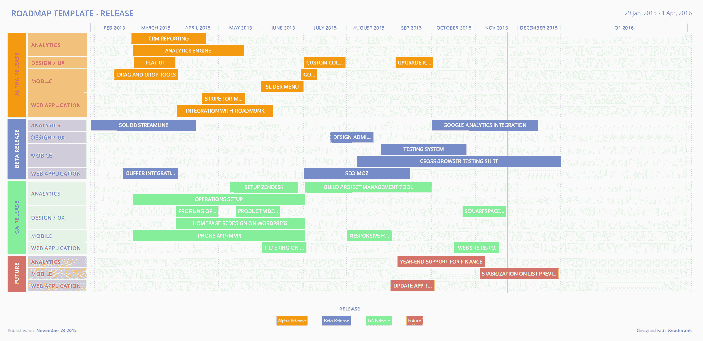

Releases roadmap example

作为一家软件开发公司，我们在 [Relevant Software](https://relevant.software/) 主要使用敏捷软件开发并发布路线图，这有助于我们保持正轨，满足期限并管理开发团队任务。*顺便说一句，如果你需要帮助规划特性发布，请随时* [*联系我们*](https://relevant.software/contact-us/) 。

# 创建成功的产品路线图

路线图的创建与关键业务目标直接相关。只有在您清楚地理解了您的业务目标以及您将要投资的计划之后，您才能决定将哪些特性添加到您的路线图中。

产品路线图应该是灵活的，而不是静态的和废弃的电子表格。您的路线图不断变化，反映了您的公司和产品的发展方向。为了更有效地创建路线图，您将使用产品路线图工具，但在此之前，让我们先了解一下产品路线图的主要步骤。

## 在您的路线图上设定与您的愿景和产品战略一致的目标

你的路线图不应该只是一个发布计划，一个待办事项，或者是你想要发布的特性的甘特图。它应该包括可衡量的目标，这些目标将使你更接近与你的愿景和产品战略直接一致的业务目标。在定义了这些特性之后，您可以根据您的策略创建一个包含一系列特性的开发路线图。

你应该问的关键问题:

*   这项功能/计划如何让我们更接近实现产品战略？
*   这项功能/计划是否推动我们实现 KPI 和 SMART 目标中的数字？
*   这项功能/计划是否解决了我们的用户所面临的核心需求或问题？

## 创建影响图

影响图是一种思维导图方法，允许团队计划和可视化活动，使他们更接近公司的目标。它可以用来定义不同级别的目标:个人团队级别、产品级别或业务级别。

影响图是一项团队练习。它允许产品开发团队以及利益相关者理解他们的努力如何影响整个产品的结果和成果。对于产品路线图规划来说，这是一项有用的活动。它允许每个人对产品和业务目标有一个清晰的认识，这是改进决策所必需的。

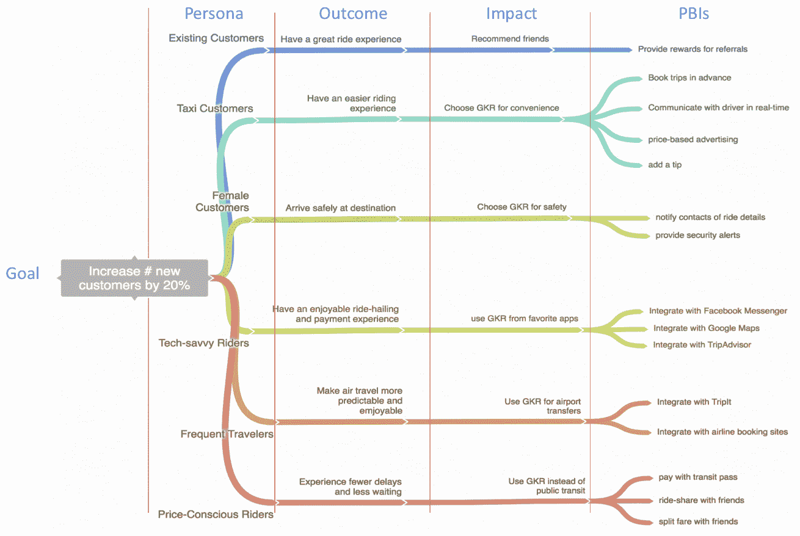

[Illustration by Scrum.org](https://www.scrum.org/resources/blog/extending-impact-mapping-gain-better-product-insights)

## 收集输入和要求

从内部和外部利益相关者那里收集信息是获得定量数据无法提供的额外见解的机会。您应该关注以下主要群体，以获取意见和优先事项:

*   顾客/客户/用户需求
*   内部利益相关者(经理、部门主管、设计、开发、CS)
*   外部利益相关者(高管和投资者)

只有将参与产品开发的每个团队和利益相关者的统一决策、目标和策略合理的目标结合起来，才能设计出优秀的产品路线图。这样的做法让每个人都能把自己的日常活动和公司使命联系起来。

每个部门和不同类型的利益相关者将有不同的路线图，这些路线图与公司的全球愿景相关联。

## 使用路线图工具构建您的产品路线图

在创业行业的早期，为了创建产品路线图，使用了 Excel 或 Powerpoint。但是今天，产品经理可以受益并享受专为创建路线图而开发的高质量产品路线图工具。

使用路线图工具的好处包括:

*   您的产品战略是使用您的团队计划的高层次视图来呈现的
*   在信息设计元素的帮助下，它们帮助您创建视觉上漂亮的路线图
*   产品路线图软件允许您与团队成员协作
*   它们允许在所有涉众之间同步变更，并让每个人都得到更新。

# 最佳产品路线图工具

## [里克](https://www.wrike.com/?r=M6QX9m9n)

适用于大型项目的高级全功能工具。

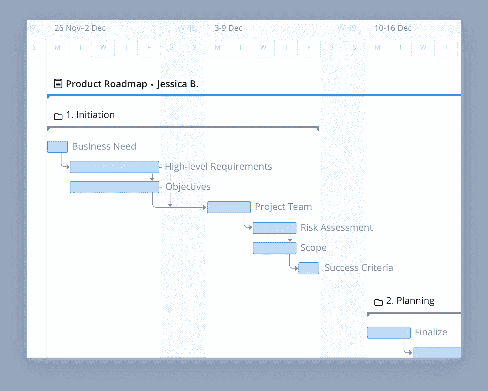

[Free Product Roadmap Template](https://www.wrike.com/templates/product-roadmap-template/?r=M6QX9m9n) from Wrike

## [团队甘特](https://www.teamgantt.com/?fpr=danylo15)

TeamGuntt 是一个很棒的、易于使用的工具，被 Nike、Lush、CreativeMarket 等公司使用。另外，他们有[免费产品模板](https://www.teamgantt.com/software-development-templates/product-roadmap-templates?fpr=danylo15)。

## [产品计划](https://www.productplan.com/)

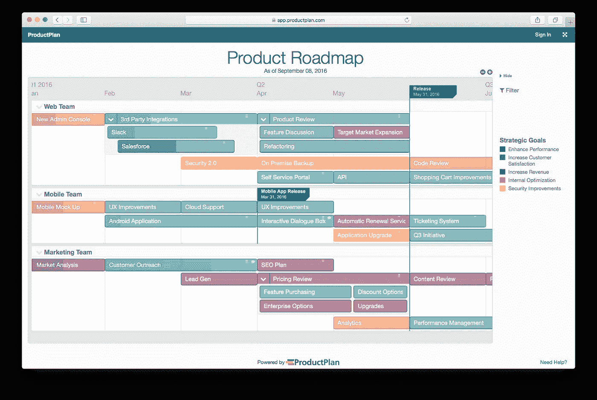

## [Hygger](https://hygger.io/?utm_source=habrahabr%20article&utm_medium=link&utm_campaign=roadmaps)

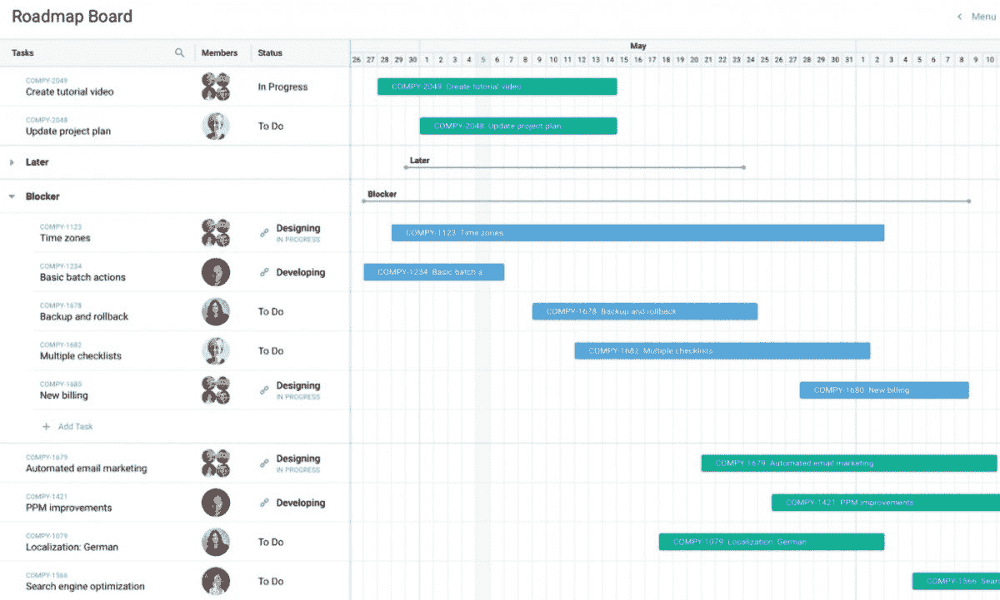

## [任务世界](https://www.taskworld.com/)

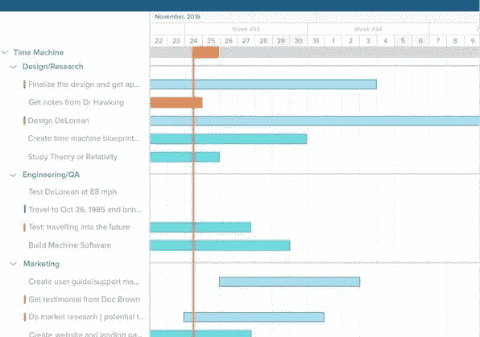

## [Proofhub](https://www.proofhub.com/features/gantt-chart-software)

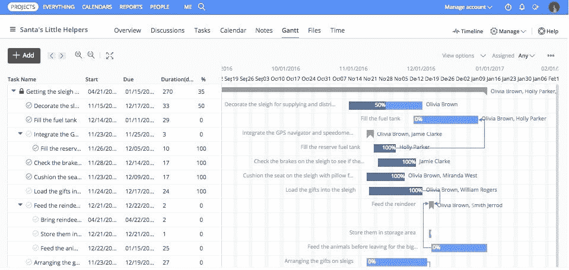

## [GanttPRO](https://ganttpro.com/)

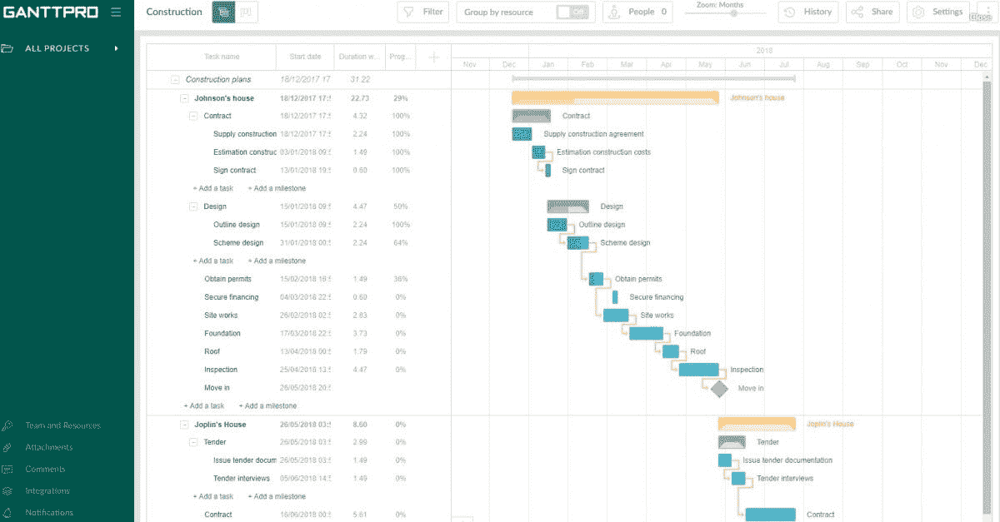

## [蜂巢](https://hive.grsm.io/DanikFedirko)

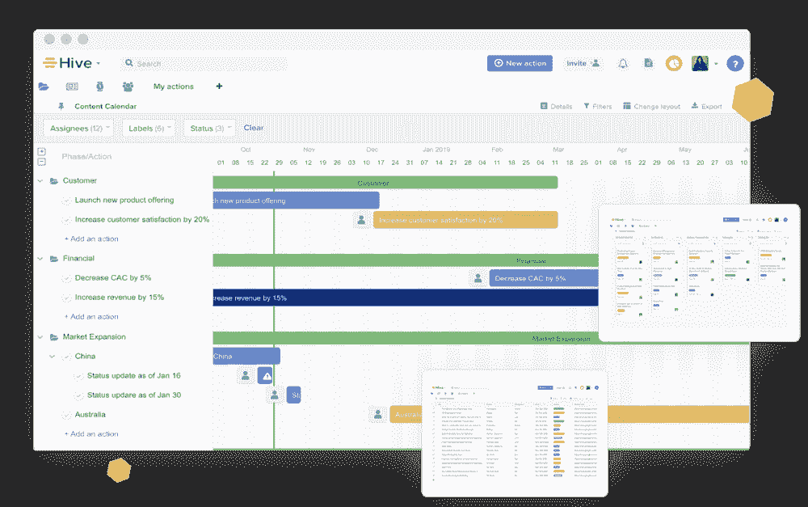

[Hive](https://hive.grsm.io/DanikFedirko)

## [里克](https://www.wrike.com/?r=M6QX9m9n)

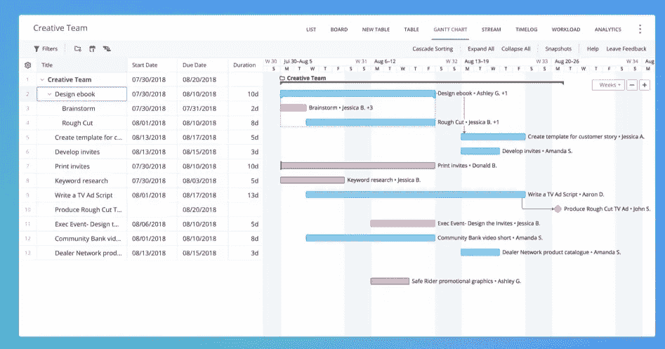

[Wrike](https://www.wrike.com/?r=M6QX9m9n)

## [吉拉](https://confluence.atlassian.com/jirasoftwarecloud/roadmap-957979308.html)

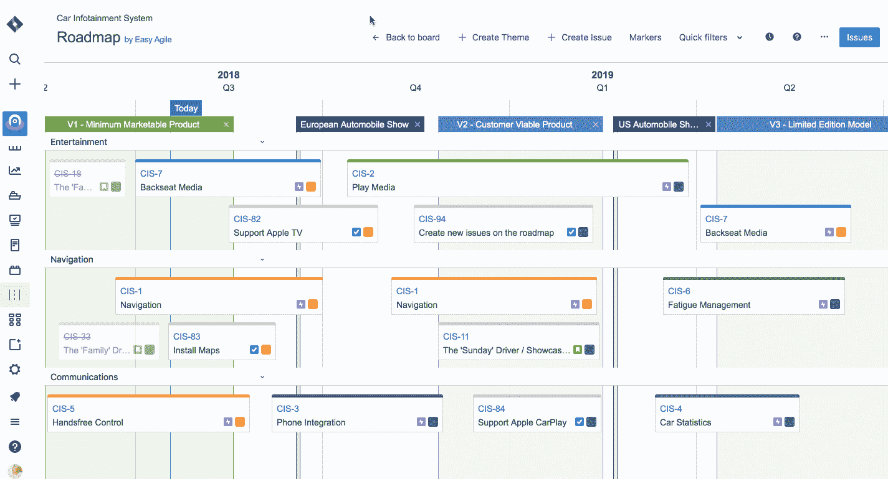

我们的[开发团队](https://relevant.software/)更喜欢吉拉的项目管理。该软件还允许创建与任务和敏捷板相关的路线图。

我们的客户也喜欢吉拉，同时与我们的[敬业团队](https://hackernoon.com/features-and-benefits-of-a-dedicated-software-development-team-model-2016fdef33d8)一起工作。

# 底线

产品开发路线图似乎成了产品管理的强制性有效工具。他们帮助管理团队日程、讨论、将任务分解为子任务、满足截止日期、衡量绩效并取得成功结果。

精心设计的产品路线图是产品开发和增长管理中强有力的战略工具。为了更好地设计您的产品路线图并与团队同步，您应该使用上面提到的最好的产品路线图工具。看看其他的[营销工具(martech)](https://jorhna.com/b2b-marketing-tech-stack/) 。