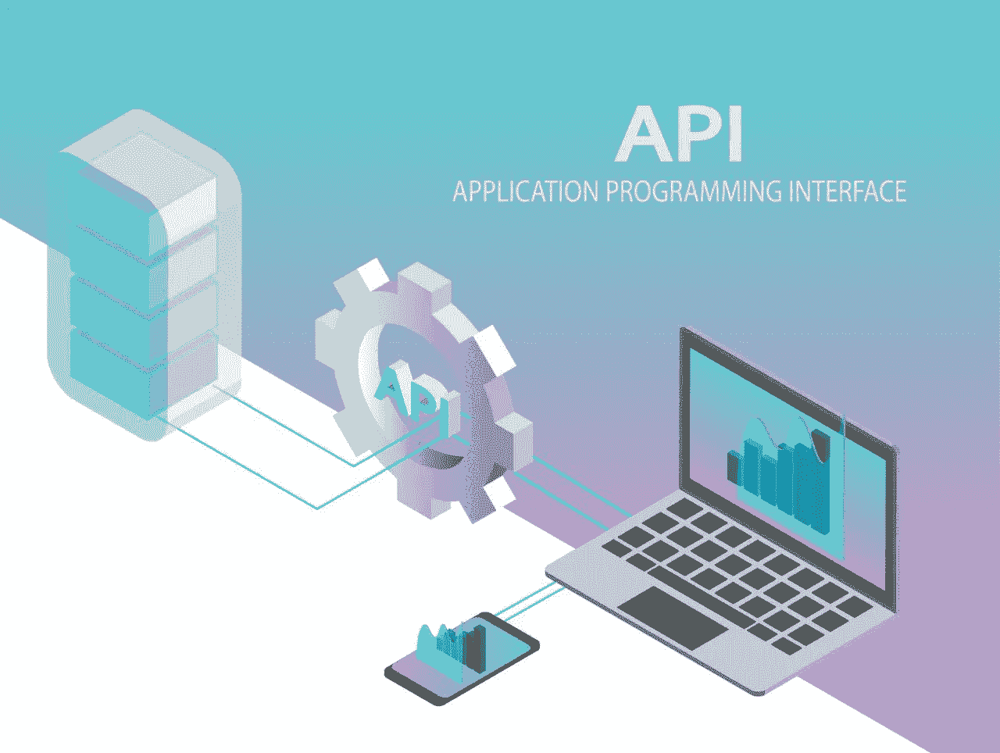

# 加密货币交换 API 文档清单

> 原文：<https://medium.com/hackernoon/how-to-create-the-perfect-cryptocurrency-exchange-api-documentation-71516132b463>

2019 年 6 月 5 日

算法交易员在现代交易中起着主导作用，尤其是在传统市场。随着加密货币越来越受欢迎，对于加密交易所来说，提供清晰的 API 文档以支持 API 用户的流入是至关重要的，这些用户比人工交易者负责更大比例的日常交易量。这样做，交易所将允许更多的开发者在他们自己的基础设施上实现 API 包。提供 API 包是不够的，因为这些用户需要能够完全定制他们对交易所服务器的请求。

根据我们作为软件开发人员和算法交易者的经验，一些交易所提供了出色的文档，而另一些则缺乏要点。在这篇文章中，我们想检查这些点，并为密码行业的改进提供简单的修复方法。本文档为现有/新的交换提供了指南，也为 API 用户提供了潜在的调试思路。

**1。交易对符号格式**

包括交易对符号格式的格式是非常基本的，但并不总是提供。一些 API 文档只将它包含在代码示例中。

**2。API 终点速率限制**

如果您有一个全局速率限制和不同的端点速率限制，或者如果您对公共和私有端点有不同的速率限制，则有必要在 API 文档中详细明确地指定。这样，你可以很容易地防止服务器超载和暂停帐户。

**3。参数范围**

如果你的一些参数有一个给定的范围限制，在你的文档中指明这一点是很重要的。对于获取订单簿、获取未结订单等端点来说尤其如此。我们注意到，许多交易所都有参数来指定可以返回多少订单，但是没有提到这些参数的上限。

**4。URL 参数与正文参数**

一些交换没有指定哪些是 URL 参数，哪些是请求体参数。开发者只能通过猜测来区分两者。如果能够避免这种反复试验的过程，效率会高得多。

**5。Digest 与 hexdigest**

Hmac 在身份验证方面非常流行。然而，摘要作为摘要或 hexdigest 的价值并不总是清楚的，所以开发人员只能猜测。同样，这意味着反复试验。

**6。提供一个认证过程的例子**

认证过程通常包括计算签名值。一个例子应该包括:端点、模拟 API 键、参数和签名值。这样，开发人员可以使用该示例将他们的输出与示例签名值进行比较，以便更快地进行调试和配置。

7 .**。发布和删除请求的正确响应**

一些交易所的 API 对一些 POST 和 DELETE 端点没有响应，比如取消订单。事实上，有必要对每个端点都有一个响应。例如，如果订单被成功取消，取消订单端点应该返回。

**8。公共随机数生成器**

如果您的身份验证过程需要一个升序的 nonce，那么最好提供一个公共源来生成 nonce，比如一个服务器时间端点。通常，开发人员从他们的本地设备获取 UTC 时间戳，并将其用作升序 nonce。然而，如果开发人员希望通过一个 API 密钥对在多个设备上运行应用程序，由于不同设备的 UTC 时间戳可能相差几秒钟，这可能是一个问题。为 nonce 提供公共源代码使得通过一个 API 密钥对从多个设备运行应用程序变得更加容易。

**9。交易对特异性终点**

对于不同的交易对，一些交易所在订单量/价格方面有不同的小数限制或最大/最小限制。如果是这种情况，最好提供一个端点来返回这些特性。

易于实现的 API 对于吸引和留住算法交易员至关重要。我们希望上述提示可以帮助交易所改进他们的 API，并在加密市场中发展算法交易社区。