# 如何创建自己的深度学习平台:完整的硬件指南。

> 原文：<https://medium.com/hackernoon/how-to-create-your-own-deep-learning-rig-a-complete-hardware-guide-7cdc71e174aa>

## 以及从长远来看，它如何比云解决方案更快、更便宜。

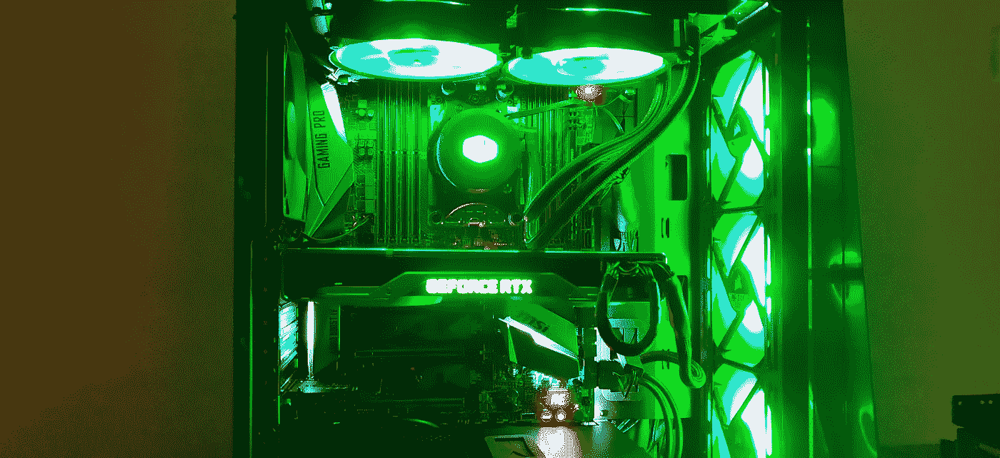

这篇博客是关于建立一个 GPU 工作站，像 [Lambda 的预建 GPU 深度学习平台](https://lambdalabs.com/gpu-workstations/vector?utm_source=kartik-nighania&utm_medium=blog-shout-out&utm_campaign=blogin)一样，并作为一个指南，指导你应该看什么是绝对的东西，以确保你准备创建自己的深度学习机器，而不是意外地购买昂贵的硬件，后来证明不兼容并造成问题。但是在我们开始之前…

# 你真的需要吗？

当我开始更认真地对待深度学习或机器学习时，我遇到的一件事是:**计算**

我过去做过机器人，觉得现在是我自己创建终极深度学习平台的最佳时机，它将像任何东西一样处理信息，并以极快的速度工作。

但是很明显，当你有云计算时，为什么要花这么多钱。当你不需要维护任何机器，也不担心它有一天会过时时，为什么不按照你的意愿，在你想要的任何时候建立另一个实例呢？

好吧，深度学习的故事说的是别的东西。博客[[1](/the-mission/why-building-your-own-deep-learning-computer-is-10x-cheaper-than-aws-b1c91b55ce8c)][[2](https://determined.ai/blog/cloud-v-onprem/)][[3](https://bizon-tech.com/us/blog/building-best-deep-learning-computer-vs-aws-cloud-vs-bizon)][[4](https://blog.exxactcorp.com/cloud-vs-on-premises-which-is-really-better-for-deep-learning/?utm_source=web%20referral&utm_medium=backlink&utm_campaign=kartik)]比较了它的多个方面，漂亮地概括了一切。最后:

> 从长远来看，使用本地深度学习机器实际上比使用云实例更便宜、更快、更容易。[[1](/the-mission/why-building-your-own-deep-learning-computer-is-10x-cheaper-than-aws-b1c91b55ce8c)][[2](https://determined.ai/blog/cloud-v-onprem/)][[3](https://bizon-tech.com/us/blog/building-best-deep-learning-computer-vs-aws-cloud-vs-bizon)]

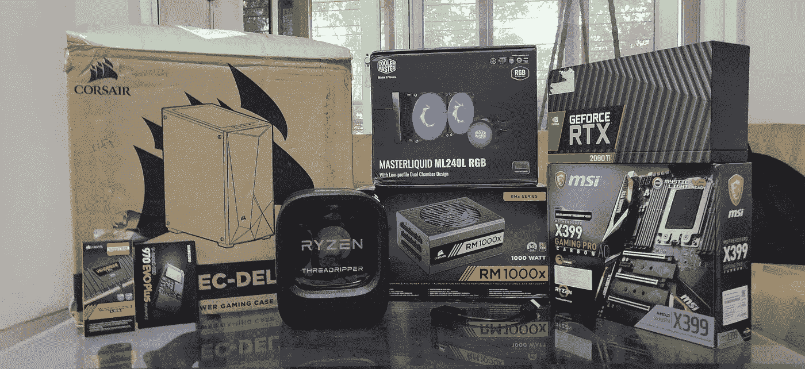

所以，我们来创造自己的深度学习机器吧。

但是，首先，如果你不是一个 DIY 的人，并且正在寻找一个预建的深度学习系统，我推荐 [Exxact 的深度学习工作站](https://www.exxactcorp.com/Deep-Learning-NVIDIA-GPU-Workstations?utm_source=web%20referral&utm_medium=backlink&utm_campaign=kartik)，由英伟达 RTX 2080 Ti、特斯拉 V100、泰坦 RTX 或 RTX 8000 GPU 提供支持，并提供 3 年保修。他们的工作站起价 3700 美元。

# 目录:

*   [CPU](#0a97)
*   [储物解决方案](#d30d)
*   [主板](#ae5a)
*   [冷却解决方案](#7809)
*   [案例](#9ee7)
*   [闸板](#2b20)
*   [PSU](#3a36)
*   [GPU](#508e)
*   [显示器和键盘](#9859)
*   [安装操作系统](#e0af)
*   [最终想法](#51b5)
*   [参考文献](#c616)

我们将在接下来的章节中详细讨论每一项。

# 中央处理器

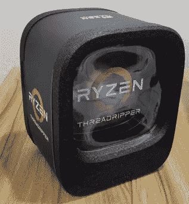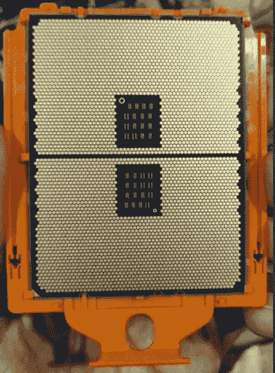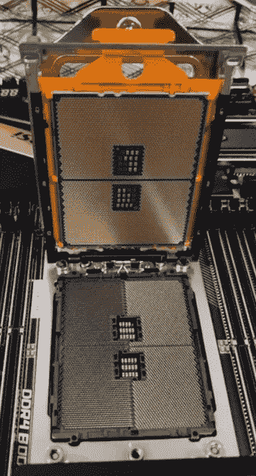

Ryzen threadripper CPU

鉴于目前大多数深度学习模型都在 GPU 上运行，CPU 的使用主要是为了数据预处理。

如果您经常处理千兆字节的数据，并且如果您在分析部分做了大量工作，必须进行大量查询才能获得必要的见解，我建议您投资一个好的 CPU。

否则，投资一个中级处理器不会有任何坏处，因为 CPU 只在 GPU 进行训练时帮助批处理调度和其他小进程。

AMD 的 threadripper 系列非常强大，性价比极高。我选择了 Threadripper 1900x，8 核 16 线程 CPU。

重要事项:

> 由于高性能价格比，我随时会选择 AMD。这就像是为相同的性能支付了英特尔同类产品一半的价格。
> 
> 搜索 youtube 进行安装或查看主板指南。这非常简单明了，但是芯片有点脆弱。小心轻放。

# 储存；储备

三个可用选项是:

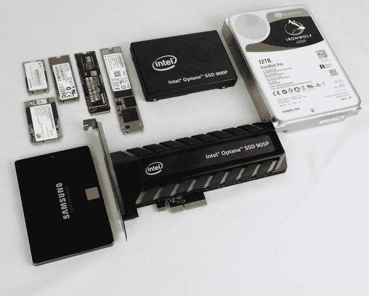

*   **HDD** (硬盘驱动器)
*   **SSD** (固态硬盘)
*   **NVME SSD** (非易失性存储器快速)

**硬盘**是一个旋转的磁盘，上面有毛笔写和读比特。由于它是机械的和完全机动化的，所以性能很慢，占用更多的空间，并且更容易损坏和破坏数据。

固态硬盘:它们体积小，速度快，没有任何移动部件。虽然有点贵。这在整体体验中当然很重要。当操作系统加载到固态硬盘存储之上时，会变得非常流畅。在深度学习中，当你几乎每次都要处理数 GB 的数据时，文件传输速度非常快。SATA 3 插槽使用 AHCI 驱动程序，最高传输速度可达 600 Mbps。

**NVMe 固态硬盘:**不使用 SATA 总线，而是使用 PCIe，性能大幅提升。此外，使用的传输协议不是 AHCI，而是 NVMe，提供了高效的并行处理。最后，我们这里说的是 2–3gb/s。不同型号的数字不同。

它仍然是一项新技术，就其提供的功能而言，它比 SSD 贵得多。与常规固态硬盘相比，NVME 固态硬盘在操作系统中的性能几乎不会有所提升，而且文件传输的等待时间也会大大减少。此外，NVMe 的意思是，确保主板有 m2 插槽，这也增加了它的价格，因为旧的没有它。

要了解更多关于 SSD 和 NVME SSD 技术的信息，你可以去看看 Kingston[ [20](https://www.kingston.com/en/community/articledetail/articleid/48543) ]写的一篇短小精悍的博客，里面有很多对比两者的视觉图像。此外，这个 youtube 视频用动画很好地解释了 NVMe。

英特尔推出了具有 3D 交叉点晶体管的 Optane 存储，可提供更高的密度和性能。但是非常昂贵，根本不值这个价钱。更多关于 Optane 的信息在这里[ [6](https://www.intel.in/content/www/in/en/architecture-and-technology/intel-optane-technology.html) ]。

我选择了 500 GB 的 NVMe M2 固态硬盘，因为我可以为我获得的高速度支付额外的费用。不然 SSD 比 HDD 好很多。

重要事项:

> 鉴于你的数据将驻留在 RAM 或 GPU 的 VRAM。在训练数据时，存储并不重要。
> 
> 从性价比来看，投资固态硬盘比投资硬盘更好。
> 
> NVMe SSD 认为非常快，价格昂贵，还需要兼容主板。

# 母板

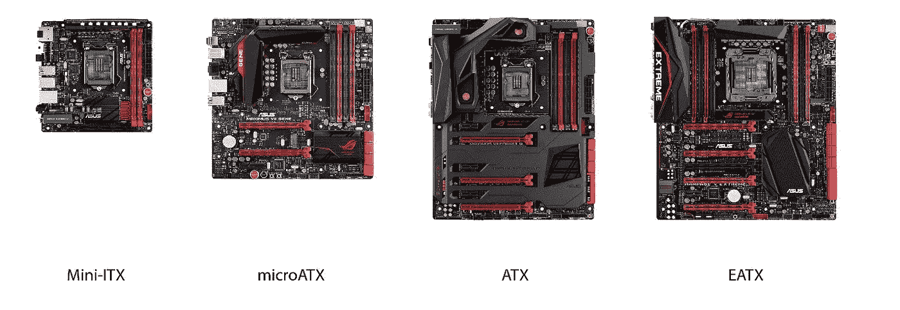

正如你所看到的，它们有不同的尺寸。标准尺寸决定了你想要的箱子类型。根据您的需要，在给定的主板上，您可以检查:

*   内存的 DIMM 插槽
*   GPU 的 PCIe 插槽
*   NVMe 固态硬盘的 M2 插槽(如果你很快就会使用)
*   固态硬盘的 SATA 端口
*   根据需要提供雷电 3/USB 3.0/2.0 接口。

为将来的升级提供额外的插槽是件好事。人们一般会升级到更高的 RAM，并且将来还会添加多个 GPU。

选择会因人而异。预装机器通常通过使用没有足够插槽用于未来升级的主板来节省资金。你可以在这里选择。

重要事项:

> 确保您的 CPU 支持给定的主板。可以选择 CPU 和主板的最佳组合来省钱。
> 
> 许多人关心每个 PCIE 插槽的通道数量。用几个 GPU 完全没关系。在 Tim dettmers 的博客[ [7](http://timdettmers.com/2018/12/16/deep-learning-hardware-guide/) ]中,“CPU 和 PCI-Express”一节以 Imagenet 数据集为例很好地解释了这一点。因此，不要因为另一家提供 16 车道 PCIe 而不是 8 车道就额外付费。
> 
> 如果您计划在未来添加更多 GPU，请确保 PCIE 插槽足够远。鉴于这些天来 GPU 如何在他们的 beafy 散热器中采用多风扇结构，随着 NVIDIA 不断增加越来越多的核心，大多数 GPU 占用 2 个 PCIE 插槽的空间。(否则，你将不得不寻找一个垂直安装的 GPU 连接器，这是昂贵的，也不容易在大多数国家获得。)

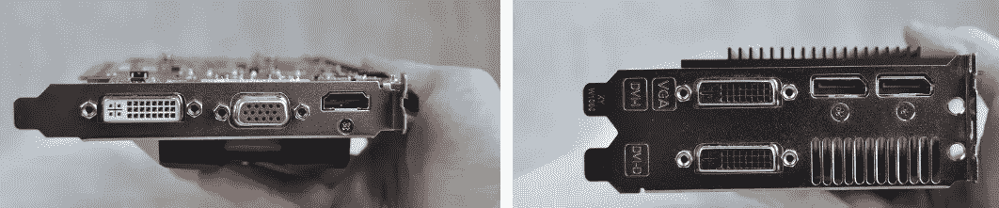

GPUs taking space of 2 PCIe slots.

# 冷却

是的，考虑到硬件正在经历的压缩级别，这个主题需要自己的部分。

你必须保持冷静的两个元素是 CPU 和 GPU。

风扇有不同的尺寸。

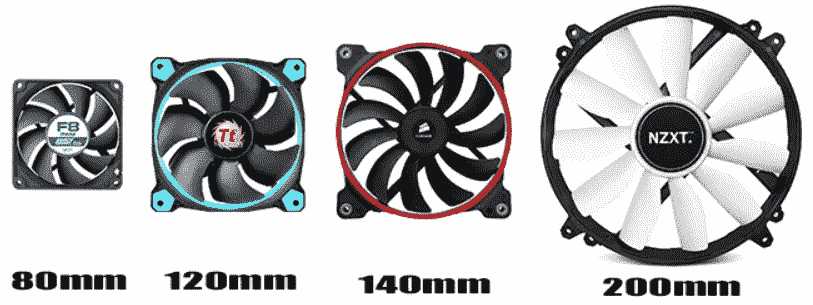

these days most common are the 120mm ones.

**此外，240/360 毫米风扇配置仅指并排安装 2/3 个 120 毫米风扇。**

## CPU 冷却

a typical CPUs exposed top-view

如果你想买一个中高端的 CPU，你可能需要一个 CPU 冷却器。CPU 冷却现在很好，在我们使用 CPU 风扇后，这不是一个大问题。如上面的图片所示，铜板与 CPU 暴露的顶部接触，带走热量，然后风扇将热量带离系统。可用选项包括:

Two types of CPU cooler

*   风扇冷却器
*   一体式液体冷却

正如你所看到的，液体冷却系统和风扇一起有一个泵，可以使水在管子周围循环。有些主板带有单独的 CPU 风扇和泵连接器。它们也可以用于常规风扇端口。在传统的风扇中，这些热量是通过铜管传递给风扇的。这意味着只有一个连接器用于风扇。

两者都有相似的表现，但各有不同。我强烈推荐观看 LinusTechTips youtube 视频[ [8](https://www.youtube.com/watch?v=23vjWtUpItk) ]。

## GPU 冷却

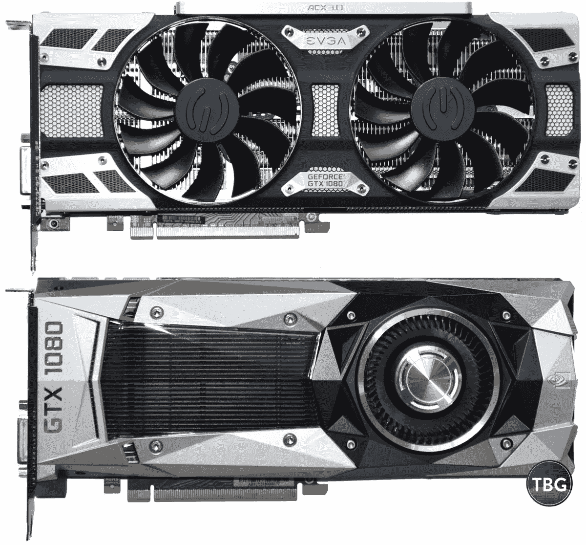

1st one is open-air. 2nd is a blower style config.

GPU 散热是内置的，开箱即用。这两种配置是:

*   露天冷却器
*   鼓风机式风扇

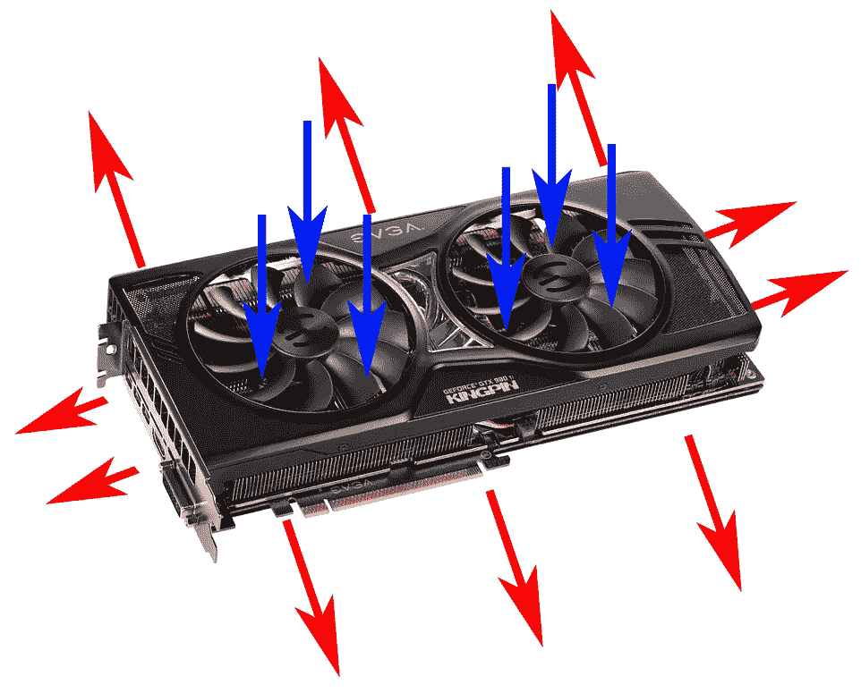

Airflow in both the configurations.

因为露天扔在所有方向的空气，并有多达 3 个风扇，他们更适合单 GPU PC，也给更好的超频结果。

这在多 GPU 系统中成为一个问题。一个 GPU 抛出的空气被其他 GPU 消耗，增加了它们的温度，这种情况一直循环下去，直到整个系统上升到非常高的温度。因此，在多 GPU 配置中，鼓风机风格更好，因为它可以将热量带出电脑机箱，新鲜空气进入 GPU 内部。

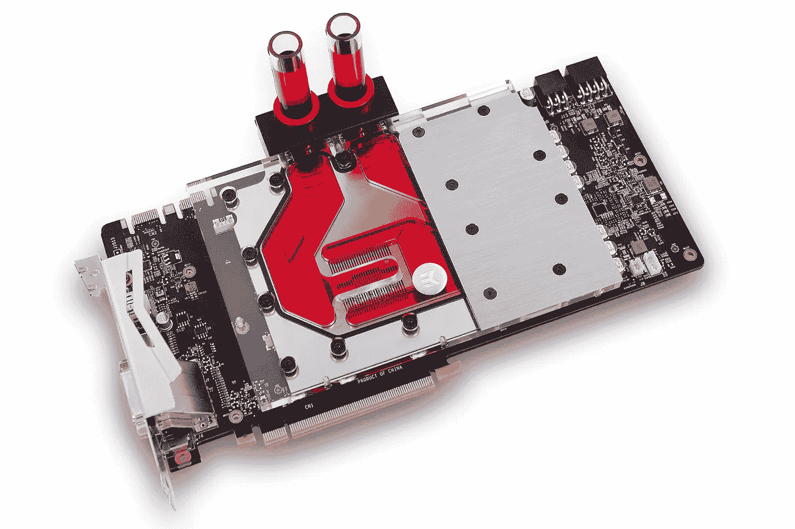

liquid cooling hardware on a GPU

液冷是存在的，但这需要打开 GPU 并将其安装到单独的硬件上，这很可怕，也使保修无效，即使有一天你想达到这一水平，也很难在所有国家获得零件。

**多 GPU 值得额外付出代价吗？**

虽然单个 GPU 可以处理，但大多数情况下温度不会超过 80 度。但是对于多 GPU 系统，冷却成为一个大问题。即使 SLI 桥或 NVLink(现在由 NVIDIA 公司命名)可以将多个 GPU 连接在一起，优化也会受到严重影响。理想情况下，将 2 个 GPU 连接在一起应该可以提供 2 倍的性能，但在大多数情况下，与使用单个 GPU 相比，您最终只能获得 40%的额外提升。这不仅消耗更多的电力，导致更高的电费，而且供暖问题使事情变得更糟。所以，如果你准备好付额外的钱，并且非常需要它，我建议你去试试。

**一体式液体冷却:**

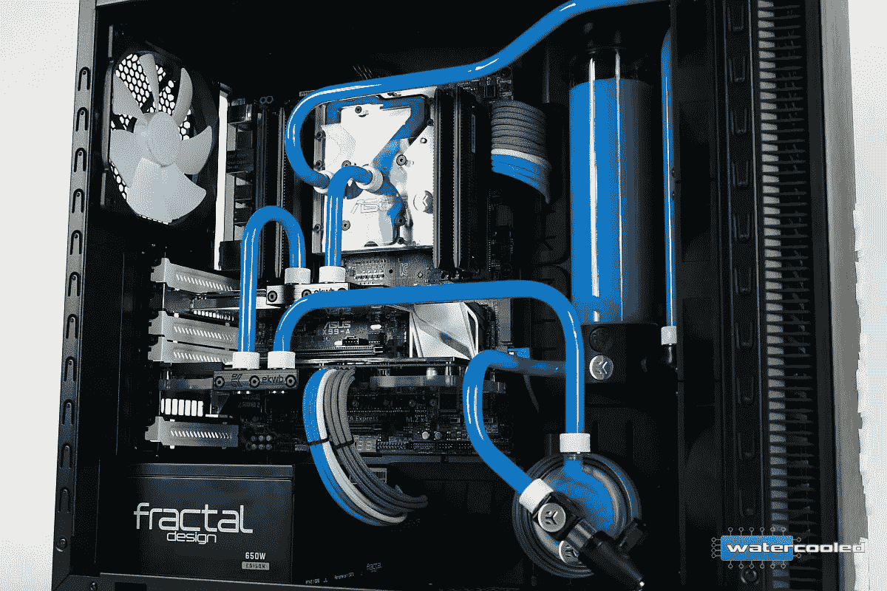

非常昂贵的一体式液冷存在。部件在大多数国家都不容易买到，而且如果你不确定要放入的电脑外壳的兼容性，购买和安装也有风险。此外，它们可能会在某些时候泄漏，更换可能是一个大问题。总的来说，额外的努力也不值得的性能或价格。

**要有多少粉丝？**

良好的空气流动是深度学习装备的必备条件。这可以通过进气和排气风扇来实现。但是，极限是什么？

> 我建议如果你有两个进气风扇在前面，一个排气风扇在后面。它会给你足够的气流。

在这之后，增加更多的风扇只会使温度稍微下降。LinusTechTips 视频[ [9](https://www.youtube.com/watch?v=8OmkmluAYAQ) ]通过在许多不同的风扇和位置配置中进行实验，为我解决了这一切。

重要事项:

> 确保检查您订购的 CPU 冷却解决方案是否适合主板上的特定支架。例如 AMD Threadripper CPU 使用 TR4 安装支架。
> 
> 确保你使用了热敷膏。很奇怪，一个人如何能够通过在笔记本电脑上再次应用热贴来获得显著的提升。Dave2D 的 youtube 视频[ [10](https://www.youtube.com/watch?v=QBNP5I2y668) ]视频详细展示了统计数据。
> 
> 确保你把风扇放在正确的位置。安装并打开主板后，务必检查所有风扇的气流方向。
> 
> 检查主板支持的风扇数量。否则，您可能需要将它们直接连接到 PSU，让它们一直全速运行，而不是通过主板软件来控制它们的速度。

# 情况

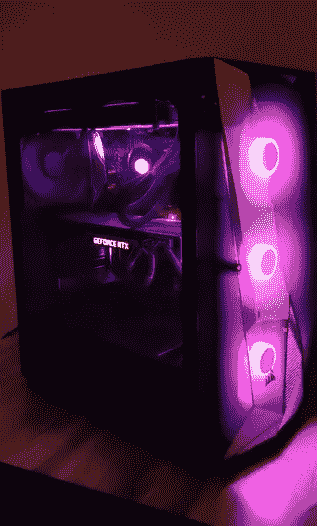

Ohkae，这可能是个问题。无论你如何小心，有时，电缆可能会稍微短一点，或者 RAM 会妨碍你计划放在机箱顶部的 CPU 散热器。小问题就来了。有些也会让你不好过。一些 PSU 或主板制造商也提供电缆扩展器。如果你想获得一个流畅的构建体验，你也可以观看在线 youtube 构建视频并获得相同的产品。但是在大多数情况下，事情都解决得很好。

但是另一个能提供最好的气流！

Can never be a motherboard dying to get some fresh air

在大多数情况下，适当的气流不是问题。这只是一种营销策略，不同的外壳制造商宣传他们如何为组件提供最佳气流。

重要事项:

> 在极少数情况下，电缆长度可能是个问题。你可以得到扩展器。
> 
> 有些箱子有可拆卸的风扇。有些给它们预装在其中，有些有可拆卸的风扇。
> 
> 确保根据主板的大小选择合适的型号。一个给定尺寸的箱子也可以装更小的型号。例如，电子 ATX 案件将支持其较小的版本，如迷你 ATX 或微型 ATX。相应地钻孔。因此，错误地得到一个更大的案件不是问题。尽管如此，有些人还是喜欢看办公桌上的小巧美人。
> 
> 确保你有一个适合 PSU 的房间。他们有一个单独的 PSU 车厢。如果可能的话，检查一下它的大小。
> 
> 音频插孔、USB type 2/3、thunderbolt 的前置 IO 都视情况而定。所以一定要根据自己的需求来选择。显然，您可以使用主板上的端口，但它们将位于电脑的背面。
> 
> 有些情况下，液体 CPU 冷却器仅安装在顶部，而有些情况下，允许风扇仅放置在前面。确保检查可能的配置。

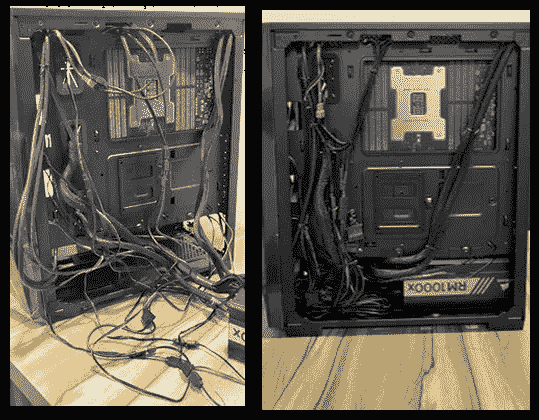

before and after cable management

> 有足够的拉链和扎带，便于完美的线缆管理。请记住，线缆管理是一门艺术。
> 
> 您可以使用 PCpartPicker 的网站[ [11](https://in.pcpartpicker.com/builds/) ]查看您选择的所有部件之间的兼容性。

# 随机存取存储

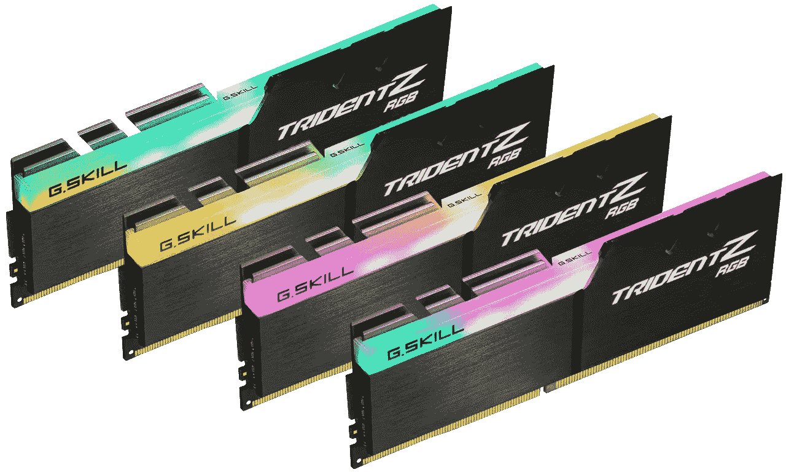

everything can come with LEDs in them

如果您处理大型数据集，如图像或某种日志数据，您的数据可以完全放在 RAM 中，这有助于显著加快处理时间，因为这是 CPU 在没有将数据放入 L1 或 L2 缓存后使用的内存。对于通常不适合 VRAM 的数据集，在 RAM 和 GPU VRAM 之间进行传输。与任何其他存储解决方案相比，这是非常快的，传输速率约为 20 Gbps。

机器中应该有大量的 RAM，但是如果您有大量的预处理工作要做，那么 8 到 16 GB 就足够了。

与 XMP 或极端的内存配置文件设置，可以超频内存到更高的速度。但实际上，这并不重要。时钟速度为 3000 MHz 的 RAM 比 2400 MHz 的工作速度稍快，但这并不是一个很明显的改进，因此性能价格比非常低。此外，你的 RAM 速度一般不会成为系统的瓶颈，因此 17 Gbps 的传输速度会使 PC 比 20 Gbps 的慢。

重要事项:

> 确保您使用的 DDR4 RAM 与您的主板兼容。大多数主板制造商也会提供支持的硬件列表。
> 
> 安装多个 RAM 棒时，不要混合搭配不同的时钟速度和制造商。建议使用完全相同类型的 RAM。
> 
> 给定了 DIMM 插槽号，根据您拥有的 RAM 棒的数量，您必须将其放入各自的插槽中。请参阅主板手册。
> 
> 这些老虎机让我想起了当年我们经常买着玩的游戏盒！！。

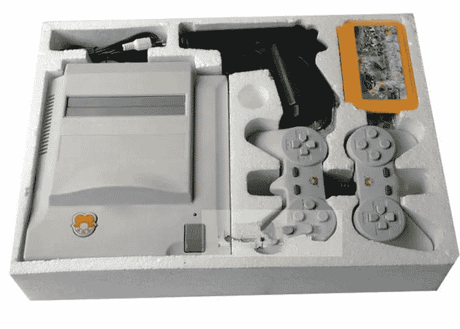

(left) a full gaming console. (right) Inside of a gaming cassette

> 确保当你回到记忆里的时候，你的眼泪不会掉在主板上。即使在它的顶部做了最后的覆盖电镀，插槽也有线路开放，人类的眼泪含有 0.3 毫克的盐，足以打碎东西。顺便说一下，海水中每一滴含有 1.75 毫克的盐。

# 程序存储单元(Program Storage Unit)

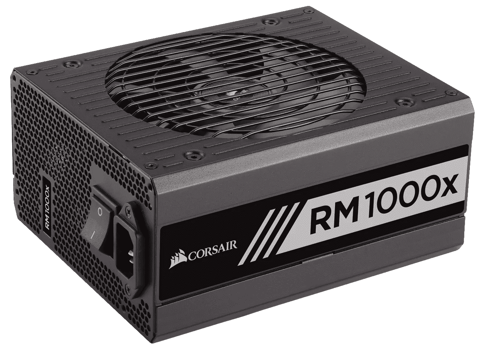

获得 PSU 时需要注意两件事:

*   PSU 电力公司
*   PSU 港口

对于第一个问题，您需要找出系统的总功耗。对于功耗较小的机器，输出功率较高是可以的，但反之则不行。使用以下公式计算总功耗(瓦特):

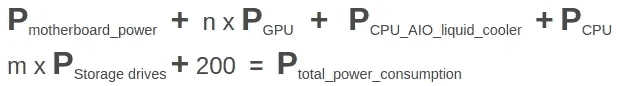

> n —您希望拥有的 GPU 总数，也包括未来增加的数量。
> 
> m——您拥有的硬盘或固态硬盘的总数，也包括未来增加的硬盘或固态硬盘。
> 
> 额外的 200 瓦用于其他外围设备，并留有安全余量。

你可以很容易地在他们的官方网站上找到每个组件的功率使用情况。

对于第二个，确保提供的插槽数量与您要安装的数量相等。或者简单地添加 PCPartPicker 网站列表[ [12](https://in.pcpartpicker.com/list/) ]中的所有部件，您将在最终兼容性部分了解您是否缺少总端口。

PSU 主要有:

*   CPU 插槽:显然是为了 CPU
*   外设插槽——GPU 和其他东西。
*   SATA 插槽:用于存储解决方案
*   24 针 ATX 插槽:为您的主板供电

一个好的电源设备是必须的。气流，即使风扇数量较少，也会自行解决，但请确保为您的系统提供清洁和充足的电力。

重要事项:

> 切勿将转换器插头用于 PSU 插座。适配器与插头轻微接触，会产生大量热量。此外，适配器的材料大多很便宜，并有指定的安培容量，如果超过将烧毁插座。
> 
> 由于印度的电源插座有 5 安培和 15 安培的支持，对于深度学习钻机，你必须将其放在 15 安培容量的更大插座中。如果你的 PSU 上有 G 型英国插头，最好切断插头并接上你需要的支持更高安培输出的插头，而不是放一个适配器。
> 
> 由于 15 安培插头远离我的钻机，我面临着扩展问题。最后，我去了一个 9 米的额外电缆扩展。我确保延长电线的质量是一流的，因为距离越长，电阻越大，最终电压降越大。仅使用所需厚度的高质量铜线。

# 显示器和无线键盘

由于我们不做游戏装备，4K 显示器或 144 赫兹刷新率显示器不是我们要找的。

Tim Dettmers 在他的博客中提到，他是如何使用 3 台显示器的，并且非常喜欢。我非常同意他的观点，但是对我来说，我想两台显示器已经足够了。但是，多显示器设置肯定会让您更有效率。

鉴于如今显示器已经变得如此便宜，你可以很容易地选择 LED，而不是 24 或 27 英寸屏幕的 LCD。

键盘和鼠标也是如此。带有 RGB 照明和长按键行程的机械开关的游戏设备是不必要的。

我个人更喜欢笔记本电脑风格的 chicklet 键盘，按键行程小。此外，无线电话比有线电话稍微贵一点，但是它让环境看起来更干净、更漂亮。如今，无线键盘和鼠标的单个 USB 端口也出现了。

重要事项:

> 请参阅 GPU 规格，了解它支持的显示器数量。几乎都支持一个以上。
> 
> 您可能需要购买一个显示器端口来连接 hdmi/VGA 转换器，以支持多个显示器。检查规格，看看你的 GPU 有多少 HDMI，VGA 或显示端口。

# 国家政治保卫局。参见 OGPU

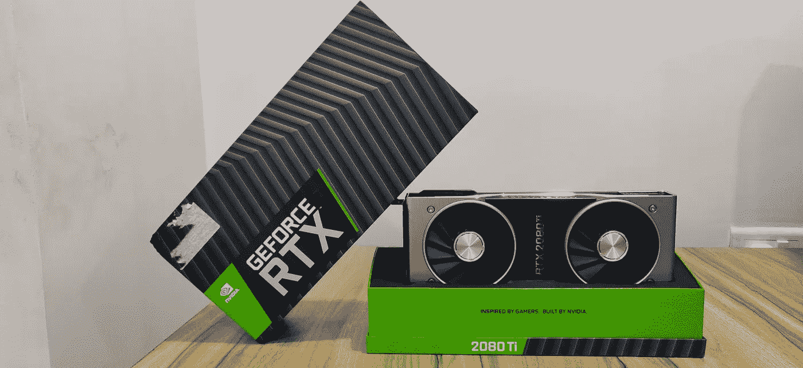

这是你深度学习装备的核心。真正训练的地方。这当然是一个大话题，需要一个独立的博客。但是，至少要拿出点东西来，我建议去:

*   **RTX 2080 Ti 还是**
*   **RTX 2070(这个不支持 NV link)——便宜很多。**

他们有 **16 位精度**选项来加快速度。新架构有一些非常好的性能增益。

你也可以通过购买易贝上的二手 GPU 来节省一大笔钱，这些 GPU 在区块链的悲惨崩盘后就有了。

一辆 **GTX 1080 Ti** 也是一个非常好的选择。此外，不要认为使用旧的会降低性能，这在另一个 LinusTechTips 视频中再次得到了证明。

重要事项:

> 我强烈推荐查看蒂姆·德特默的博客，他对这个话题做了绝对公正的评论。
> 
> 我强烈建议只使用 NVIDIA GPUs 进行深度学习，因为 CUDNN 和 CUDA 工具包与目前的深度学习库高度兼容，无论是 Keras，Tensorflow，PyTorch 还是任何其他库。

# 安装操作系统

深度学习软件首先与基于 Linux 的机器兼容。

我已经安装了 Ubuntu 18.04，因为它现在有 LTS(长期支持)，我没有检查在我以前的 16.04 LTS 版本上工作的不兼容的库。但是主要的深度学习库根本不会有任何问题。

拿一台可以工作的笔记本电脑。从 Ubuntu 的官方网站[ [15](https://www.ubuntu.com/download/desktop/thank-you?country=IN&version=18.04.2&architecture=amd64) ]下载操作系统，如果可能的话，别忘了捐款支持。使用像 Rufus[ [16](https://rufus.ie/) ]这样的免费软件创建一个可启动的笔式驱动器，将其插入端口并启动你的电脑。

你会看到 BIOS。一般是删除按钮或者某个 Fn 按钮。检查所有连接的组件，看看是否一切都被检测到。

您可能需要优先选择连接的 USB 进行引导，以确保可引导磁盘得到加载。

按照说明安装 Ubuntu。

这整个过程可以在这段 youtube 视频中看到[ [17](https://www.youtube.com/watch?v=vt5Lu_ltPkU) 。

# 最后的想法

最后，这是一个有趣和令人兴奋的过程，你一定会喜欢的。如果你过去没有造过机器，那也没关系。没什么复杂的。硬件社区为您提供了全面的保护。现在事情非常模块化。还有一些网站可以让你看到所有部件的兼容性，比如 PC Part Picker[ [18](https://in.pcpartpicker.com/) ]。你可以随时在 Bitwit[ [19](https://www.youtube.com/watch?v=IhX0fOUYd8Q) ]等频道参考 youtube 上充满硬件构建视频的视频，看看如何做到这一点，顺便说一句，当它涉及到生活时，观看它是一种纯粹的幸福。

感谢你的阅读，祝贺你坚持到最后，感谢 [Sandeep T](https://medium.com/u/ba0cc114435d?source=post_page-----7cdc71e174aa--------------------------------) 编辑这篇博客。下次见，爱 u 3000:)

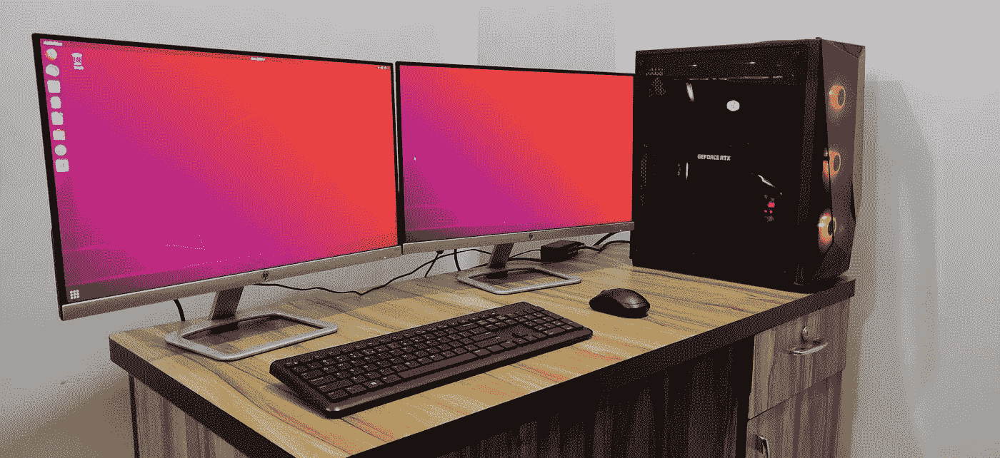

# 参考

[1]medium.com，陈明杰，[为什么建造自己的深度学习计算机比 AWS](/the-mission/why-building-your-own-deep-learning-computer-is-10x-cheaper-than-aws-b1c91b55ce8c) (2018)便宜 10 倍

[2]詹妮弗·维拉，[选择你的深度学习基础设施:云与内部辩论](https://determined.ai/blog/cloud-v-onprem/) (2018)，determined.ai

[3] [预构建 vs 构建自己的深度学习机器 vs GPU 云(AWS)](https://bizon-tech.com/us/blog/building-best-deep-learning-computer-vs-aws-cloud-vs-bizon) (2018)，bizon-tech.com

[4] [云与内部部署:深度学习哪个更好？(2018)](https://blog.exxactcorp.com/cloud-vs-on-premises-which-is-really-better-for-deep-learning/?utm_source=web%20referral&utm_medium=backlink&utm_campaign=kartik) ，exxactcorp.com

[5] Powercert 动画视频，[Youtube.com m . 2 NVMe 固态硬盘讲解— M.2 vs 固态硬盘](https://www.youtube.com/watch?v=HvfIeTieXOI) (2018)

[6] [英特尔 Optane 技术](https://www.intel.in/content/www/in/en/architecture-and-technology/intel-optane-technology.html)，Intel

[7]蒂姆·德特默斯，[深度学习的完整硬件指南](https://timdettmers.com/2018/12/16/deep-learning-hardware-guide/) (2018)，TimDettmers.com

[8] Linus Tech Tips，[为什么你不应该用水冷却你的电脑](https://www.youtube.com/watch?v=23vjWtUpItk) (2019)，Youtube.com

[9] Linus Tech Tips， [Case 粉丝——你应该有多少？](https://www.youtube.com/watch?v=8OmkmluAYAQ) (2015)，Youtube.com

[10]戴夫·李， [$12 Hack 提升你的笔记本电脑性能！](https://www.youtube.com/watch?v=QBNP5I2y668) (2017)，Youtube.com

[11] [完成建造【pcPartPicker.com ](https://in.pcpartpicker.com/builds/)

[12] [系统建造者](https://in.pcpartpicker.com/list/)，pcPartPicker.com

[13] Linus Tech Tips，[性能下降—这是真的吗？](https://www.youtube.com/watch?v=44JqNJq-PC0) (2016)，Youtube.com

[14] Tim Dettmers，[深度学习需要哪些 GPU:我在深度学习中使用 GPU 的经验和建议](http://Which GPU(s) to Get for Deep Learning: My Experience and Advice for Using GPUs in Deep Learning) (2019)，TimDettmers.com

Ubuntu.com Ubuntu 桌面下载 18 . 04 . 2

[16] [Rufus](https://rufus.ie/) ，rufus.ie

[17] LinuxPlus，[如何安装 Ubuntu 18.04 Youtube.com LTS](https://www.youtube.com/watch?v=vt5Lu_ltPkU)(2018)

[18] [建造指南](https://in.pcpartpicker.com/)，pcPartPicker.com

【19】bit wit，[如何搭建 PC！步步为营](https://www.youtube.com/watch?v=IhX0fOUYd8Q) (2017)，Youtube.com

[20] [了解 Kingston.com NVMe 和固态硬盘技术](https://www.kingston.com/en/community/articledetail/articleid/48543)