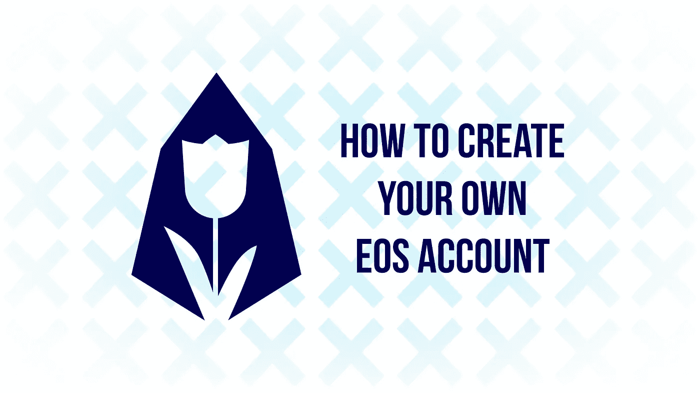
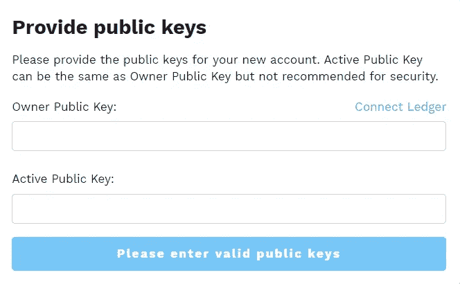
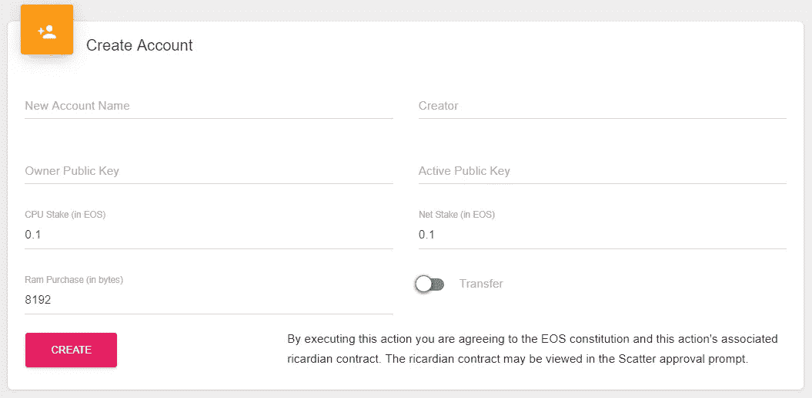
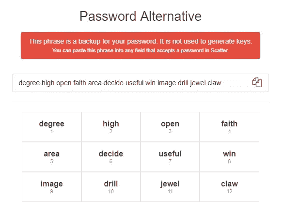
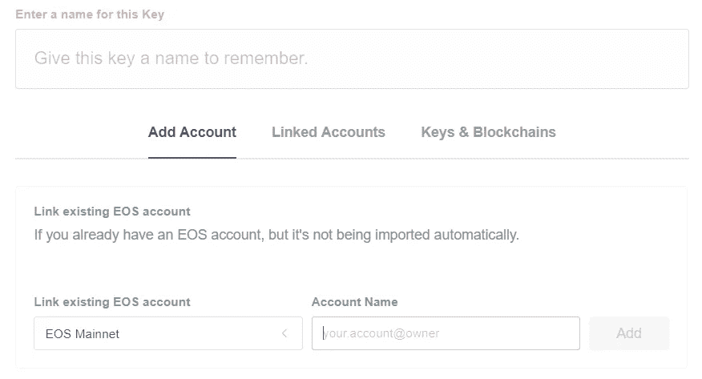

# 如何创建自己的 EOS 帐户

> 原文：<https://medium.com/hackernoon/how-to-create-your-own-eos-account-1ffc3afc89d9>

由于 EOS 使用的帐户结构与大多数区块链不同，因此创建帐户不像生成一个密钥对那么简单。EOS 帐户拥有各种权限，这些权限与帐户中的不同操作相关联。虽然这听起来非常复杂，但创建一个 EOS 帐户相对简单。我们将在本文中讨论一些可能的方法。

在您开始创建自己的 EOS 帐户之前，建议您先熟悉 EOS 帐户的工作方式。如果你还不熟悉 EOS 账户的工作方式，我们建议在继续之前阅读[我们关于理解 EOS 账户工作方式的文章](https://hackernoon.com/the-ultimate-guide-to-understanding-eos-accounts-a44b58ba5601)。

# 生成密钥对

在开始使用这两种方法之前，我们首先必须生成两个密钥对，我们将使用它们来创建新帐户。我们将生成两个密钥对，因为我们希望我们的*所有者*和*活动*权限拥有不同的密钥，从而使帐户更加安全。虽然您可以为*所有者*和*活动*权限使用相同的密钥，但这样做不太安全，因此不建议这样做。

我们将使用支持离线密钥生成的 [EOSKey 工具](https://eoskey.io/#/)来生成我们的密钥对。从他们的网站下载文件后，你可以运行程序并进入“生成和验证密钥”标签。

Generating a key pair using EOSKey (do not use these keys)

进入“生成和验证密钥”选项卡后，您可以生成一个 EOS 密钥对。确保非常安全地存储密钥，最好是离线或在安全的存储位置。存储第一个密钥对后，您可以生成第二个密钥对，然后也可以存储它。完成后，我们可以进入下一步。

# 创建帐户

创建 EOS 账户有多种方法，有些方法非常简单，而有些方法可能更安全也更复杂。我们将讨论创建 EOS 帐户的两种最佳和最简单的方法。

## 帐户生成器

创建您自己的 EOS 帐户的第一个也是最简单的方法是使用帐户生成器创建您自己的 EOS 帐户。一个帐户生成器只要求你的钥匙，一个帐户名称，然后要求你支付帐户，然后自动创建。

Entering your keys in the account generator

在本教程中，我们将使用 EOS Vibes 的[帐户生成器。要开始创建您的帐户，首先输入您想要的帐户名称，然后一旦您选择了一个可用的名称，单击“继续”并输入您之前生成的密钥。你输入哪个钥匙作为你的*激活*或*所有者*钥匙并不重要，只要你确定你知道哪个是哪个(你几乎永远不需要你的所有者钥匙)。一旦您验证了您的密钥，您可以继续下一步，这将是支付帐户。选择您喜欢的付款方式，并按照说明进行操作。当付款收到后，帐户将被创建，您可以使用您的密钥来访问该帐户。](https://eos-account-creator.com/)

## 工具包

创建你自己的 EOS 账户的第二种方法是使用 EOS 工具包。一个 EOS 工具包可以被看作是许多 EOS 功能的接口，例如创建和管理一个帐户。虽然这种方法比前一种方法更简单，并且有更多的选择，但它要求您已经有一个 EOS 帐户(或者认识一个有 EOS 帐户的人)。在本教程中，我们将使用 GenerEOS 的工具包[。](https://eostoolkit.io/account/create)

首先，您/已经拥有 EOS 帐户的人必须使用 [Scatter](https://get-scatter.com/) 将他们的 EOS 帐户附加到工具包。如果他们还没有 Scatter，您/他们应该下载它，并按照导入帐户的说明进行操作(我们还将在“使用您的 EOS 帐户”部分解释如何进行导入)。一旦分散配置和解锁点击“附加帐户”在工具包的左上方。然后导航到“创建帐户”部分。

Creating an account using a toolkit

填写您想要的帐户名称(创建者名称将在您连接散点后自动填写)和密钥。确保你知道哪把钥匙成为*激活的*钥匙，哪把钥匙成为*所有者*钥匙。您可以将 CPU 份额、净份额和 RAM 购买量保留为默认设置，因为这些设置对大多数用户来说都很好。最后，确保打开“转账”选项，以确保新账户与原始账户完全分离，单击创建并使用分散确认交易，以执行新账户的创建。

始终确保您用来创建新帐户的 EOS 帐户包含足够的 EOS 来创建新帐户。创建新帐户的成本(使用上述设置)可以通过以下方式计算:([当前 RAM 价格/Kb](https://www.eosrp.io/))*(8192/1024)+0.1+0.1 =创建新帐户所需的 EOS 的最小数量

# 使用您的 EOS 帐户

现在您已经创建了自己的 EOS 帐户，您可能非常渴望开始使用您的帐户，所以让我们马上开始吧。最简单和最受支持的访问和使用您的帐户的方法是使用 [Scatter](https://get-scatter.com/) ，这是一个支持 EOS 的桌面应用程序，用于访问大多数 EOS dapps 和工具包。散点可以从[这里](https://get-scatter.com/)下载。

Your password alternative represents your password as a phrase

安装 Scatter 并按照说明操作。首先选择一个密码。请确保安全地存储它，因为您将需要它来访问您的分散。然后，系统会提示您进入“替代密码”屏幕，该屏幕会显示一个代表您的密码的短语。安全可靠地存储它(最好离线/纸质)，因为只有在您丢失原始密码时才需要它。

存储完密码和备用密码后，您可以继续。接受条款和协议，并选择自动备份的目标文件夹。

下一步是将您帐户的密钥导入 Scatter。单击“导入现有密钥”，然后单击“将私钥作为文本导入”。完成这些步骤后，将会打开一个新的屏幕，您可以在其中输入您的(第一个)私钥。首先添加*所有者*私钥，然后点击“导入”。

Make sure to pick @active for the active key and @owner for the owner key

如果正确填写了密钥，将会提示您进入上述屏幕。在这里，您可以为密钥命名，以便于识别，并且您可以通过在“帐户名称”部分输入**your _ Account _ Name*@ owner****将其链接到您在 Scatter 中的 EOS 帐户的*所有者*权限。一旦完成添加*所有者*密钥，您就可以添加*活动*密钥。点击“添加密钥”并遵循相同的步骤，唯一不同的是您应该添加*活动*密钥，并在“帐户名”部分使用**您的 _ 帐户名*@活动*** 。*

*现在你可以开始使用你最喜欢的 dapps 和工具包了。在您开始使用 dapps 之前，请确保解锁您的分散应用程序。一旦完成，所有的应用程序都可以通过点击“登录分散”，然后你必须在分散应用程序中接受。但是在使用 dapps 和工具包的时候一定要小心，并且在你接受它之前一定要检查一个(trans)动作。*

*关于如何将你的 EOS 从交易所移走的完整指南，我们推荐这篇文章。我们将很快就这一主题撰写自己的文章。*

## *关于我们*

*EOS Mainnet 的基础模块生产商。欧洲连锁姐妹连锁店的合作伙伴。区块链项目的投资者。治理、跨文化合作和安全专家。可以在这里找到我们:
EOS Block 制作人姓名:eosamsterdam
[网站](https://eosamsterdam.net/)
[推特](https://twitter.com/eosamsterdam)
Youtube
[Steem](https://steemit.com/@eosamsterdam)*

**作者为*[*Yannick Slenter*](https://www.linkedin.com/in/yannick-slenter/)*为*[*EOS Amsterdam*](https://eosamsterdam.net/)*