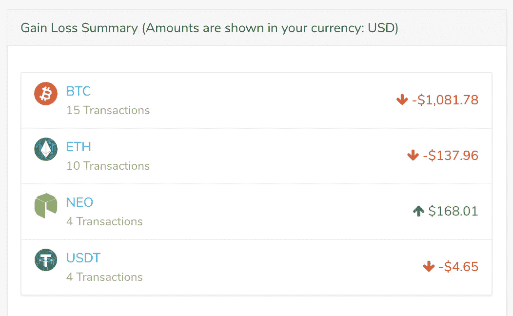

# 收到比特币基地 Pro 的 1099K？以下是处理方法。

> 原文：<https://medium.com/hackernoon/how-to-deal-with-form-1099k-from-coinbase-or-coinbase-pro-for-tax-purpose-a3520eb7af3b>

## 像比特币基地这样的交易所向每个客户提供交易历史记录，但只有满足某些强制要求的客户才会收到一份 1099-K 形式的[IRS 表格。但是我们能用它做什么，如何用它来报税呢？](https://www.irs.gov/pub/irs-pdf/f1099k.pdf)

# 介绍

你会收到比特币基地专业的 1099-K。它实际上说的是你从各处得到了多少钱。它不会显示任何关于你每次交易赚了多少/亏了多少的信息。

## **那么，你能用这个 1099-K 做什么呢？**

比特币基地的 1099K 表格是一种描述你的交易量的综合信息(像比特币基地这样的交易所向每个客户提供交易历史，但只有满足某些强制阈值的客户才会收到 [IRS 表格 1099-K](https://www.irs.gov/pub/irs-pdf/f1099k.pdf) )。).

即使你可能只是与$10K 交易——它会有所有的买卖，最终的数字看起来令人生畏。这对你报税没什么用。如上所述，这是发送给比特币基地超过阈值的交易者的表格。

这是去年 1 月发生在我一个朋友身上的类似情况。

以下是两个选项:

# 只用过比特币基地

如果您刚刚仅在比特币基地进行交易，您可以使用他们的[税务中心](https://www.coinbase.com/bitcoin-taxes#stepstotake)并下载税务表格，该表格可用于在线上传至 TurboTax 或提供给您的报税员/注册会计师。

# 也在其他交易所交易(80%的用户)

如果你在比特币基地和其他交易所交易——那么比特币基地提供的税单就没有用了(见下面的除外条款)

[Coinbase’s](https://www.coinbase.com/bitcoin-taxes#gainsandlosses) disclaimer

在这种情况下，你必须使用第三方加密货币税务软件，如 [BearTax](https://bear.tax) (真希望他们看淡税收，减少纳税义务！)在这里，你可以从比特币基地和几乎所有其他交易所导入你的交易，查看它们，计算你的资本利得或损失。

Gain-Loss Summary on [BearTax](https://bear.tax)

> 他们将为您提供适当的税务表格，如 8949 资本利得表、CSV 导出(可在 Turbotax Online 上导入)、导出为 TaxAct 格式(适用于会计师)或通用 CSV。

 [## 面向交易商和会计公司的加密货币税务软件

### 现在就注册最好的加密货币税务软件，它被美国成千上万的加密货币纳税人用来计算和下载他们的税务文件…

熊税](https://bear.tax) 

> 他们的支持人员反应非常迅速。如果你有任何问题，可以通过他们网站上的[聊天室](https://bear.tax)或者[推特](https://twitter.com/bear_tax)或者[脸书](https://facebook.com/beartaxapp)或者[电报](https://t.me/beartax)联系他们。

## 放弃

我既不是专业会计师，也不是财务顾问。以下所有信息仅供参考。上面收集的信息可能是我认识的人所面临的特定使用案例的结果，并不总是适用于每个人。因此，它不打算取代税务，审计，会计，投资，金融，也不是法律咨询。有关财务、税务或法律方面的建议，请咨询您的专业人士。