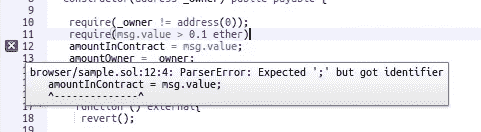
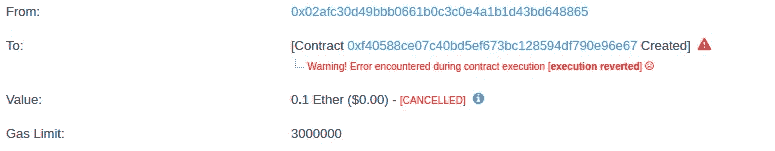
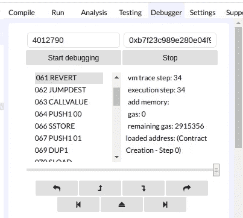

# 如何调试以太坊智能合约？

> 原文：<https://medium.com/hackernoon/how-to-debug-ethereum-smart-contracts-7efd883d8cc3>


在区块链中调试事务不同于调试基于 C++或 JavaScript 的传统应用程序，因为您不是实时运行代码，而是在区块链中使用关联代码映射历史事务执行来调试事务。

智能合约是在区块链上运行的一段代码，智能合约需要以精确的方式理解，调试智能合约是一步一步地分析交易功能内部如何工作和进行，或者实际交易在哪里失败。

让我们先详细讨论一下在调试事务中的错误类型。

## 坚实度的误差类型—

## 1.句法误差

当智能契约代码语法有问题时，就会出现语法错误，当您的代码遇到语法错误时，您的智能契约将无法在区块链上编译或部署。

使用 [remix](https://remix.ethereum.org) 可以很容易地诊断出语法错误，如下图所示，当分号(；)在 remix IDE 中从上面的代码中删除，它显示一条错误消息，并提供了语法错误的解决方案。



使用 truffle、remix 或任何 IDE 都可以很容易地诊断语法错误。

## 2.运行时错误

只有当你已经将智能合约部署到区块链，并且你的可靠性代码已经被编译成 EVM(以太坊虚拟机)能够理解的字节码时，才会出现运行时错误。 **EVM** 被定义为以太坊的一个组件，它运行 solidity 代码，当 EVM 认为你在用你的智能合约代码做一些错误的事情，或者你在进行违反代码逻辑的交易时，就会出现运行时错误。

运行时错误比语法错误更难诊断，因为这些错误在部署到区块链之前无法识别，它们只能在 smart contract 中发生状态更改时出现，我们将详细讨论有关运行时错误和运行时错误调试的更多信息。

## 3.逻辑错误

逻辑错误无法使用任何 IDE 或工具进行调试，因为逻辑错误不会被 EVM 捕获，根据 EVM 的说法，一切都是完美的，代码可以轻松运行。当开发人员犯了一个错误，为攻击者打开了智能合约中循环漏洞时，就会出现逻辑错误。

**逻辑错误示例**:著名的 DAO 攻击(可重入性)是一个逻辑错误示例，开发者在更新用户余额之前犯了一个错误并转移了以太网。

逻辑错误可以通过智能合约的[审计](https://audits.quillhash.com/smart-contract-audit)来识别，因为有时根据开发人员的思维模式，一切都很顺利，智能合约中可能没有错误，但审计员可以运行智能合约，目的是找到循环漏洞、检查业务逻辑并找到智能合约中的安全缺陷。

形式验证可以用于智能合同的逻辑验证。

# 运行时错误的类型

## 没油了

> 当您没有提供足够的汽油来执行交易，或者汽油不足以完成交易时，就会发生汽油用完错误。

## 归还

> 当您试图执行根据智能合约的逻辑无法执行的交易时，将发生交易恢复，因此 EVM 将返回一个错误，交易被恢复。

## 无效操作码

> 当你试图调用一个不存在代码时，无效的操作码就会出现。

## 无效跳转

> 无效跳转发生在你试图调用一个不存在的函数时，例如，如果你通过另一个不存在的契约调用一个契约的函数，**无效跳转**发生**。当你使用汇编语言并指向错误内存时，也会出现这种错误。**

## 堆栈溢出

> 当你试图递归调用函数而没有条件停止它时，就会发生堆栈溢出，在 solidity 中，堆栈最多可以有 1024 帧，所以一个函数只能调用自己 1024 次，如果超过这个数，就会发生堆栈溢出。

## 堆栈下溢

> 在汇编语言中，当你试图弹出一个不存在的变量时，就会发生堆栈下溢。

## 用于调试所有类型的错误和交易的智能合约代码示例-

```
pragma solidity 0.4.24;contract Sample {uint256 public amountInContract;address public amountOwner;constructor(address _owner) public payable {**require(_owner != address(0));****require(msg.value > 0.1 ether);**amountInContract = msg.value;amountOwner = _owner;}function () external{**revert()**;}function withdraw () public {require(msg.sender==amountOwner);msg.sender.transfer(address(this).balance);}}
```

## 调试器提供了逐步调试任何事务(创建或调用)以及可视化内存/存储空间的能力。它有助于通过操作码跟踪气体成本和每个步骤后的剩余气体。

## 调试事务-

在上面的代码中指定构造函数为 payable，而部署一个契约构造函数需要发送高于 0.1 ethers 的 ether 值。如果发送少于 0.1 以太网或地址为零，它将抛出一个错误，事务将被恢复。

如下所示，事务被恢复，所以我们将使用 remix IDE 一步一步地调试事务。



**第一步。**使用 remix 向以太坊区块链提交部署交易后，交易失败，如上图所示。现在按下 remix IDE 中的 debugger 按钮来调试事务，并找出事务失败的可能原因。

**第二步。**要开始调试，请提供块号和事务哈希，然后按下开始调试按钮，这将启动调试过程。



调试事务时，会显示汇编语言操作以及使用的 gas 和剩余的 gas，如上所示，在 remix IDE 中还会突出显示代码，其中实际事务与操作码并行失败，如下所示。

事务在汇编操作码中被还原。在实际事务恢复的地方，代码被突出显示。


如上图所示，在以太网扫描中事务被恢复，发送的值是 0.1 以太网，小于要求的值；这就是在这种情况下事务失败的原因。

该过程可用于调试任何事务，以了解更多关于使用的气体、每个步骤的剩余气体、状态变化以及可视化存储器/存储空间。

智能合约调试也可以使用 truffle 框架来完成，你需要一个事务哈希来调试一个事务。

## 感谢阅读。也请看看我之前的博客[对以太坊网络的潜在攻击。](https://hackernoon.com/potential-attack-on-ethereum-network-to-mint-gastokens-5cf05a7e0303)

> *让我们更多地讨论区块链安全，在我的电报手柄上 ping 我—*[*@ abhi _ 区块链*](https://t.me/abhi_blockchain) *，与*[*QuillAudits*](https://audits.quillhash.com/smart-contract-audit)*久负盛名的安全平台为您的 dapps 和智能合约服务。*