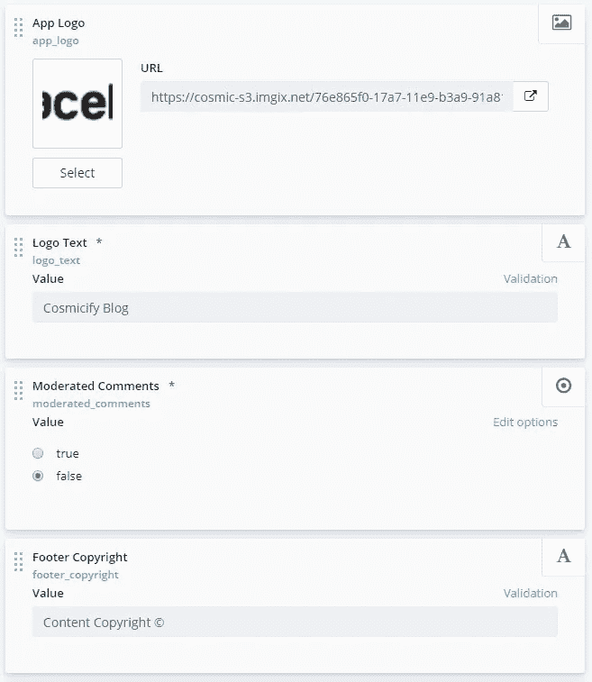
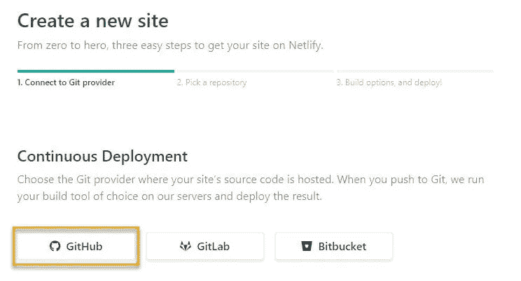
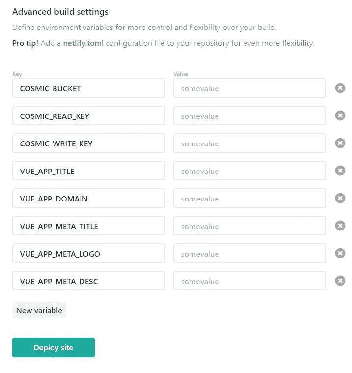
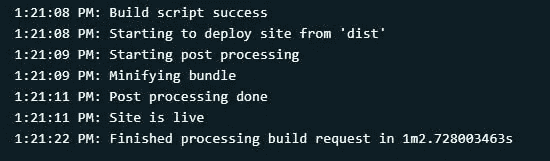
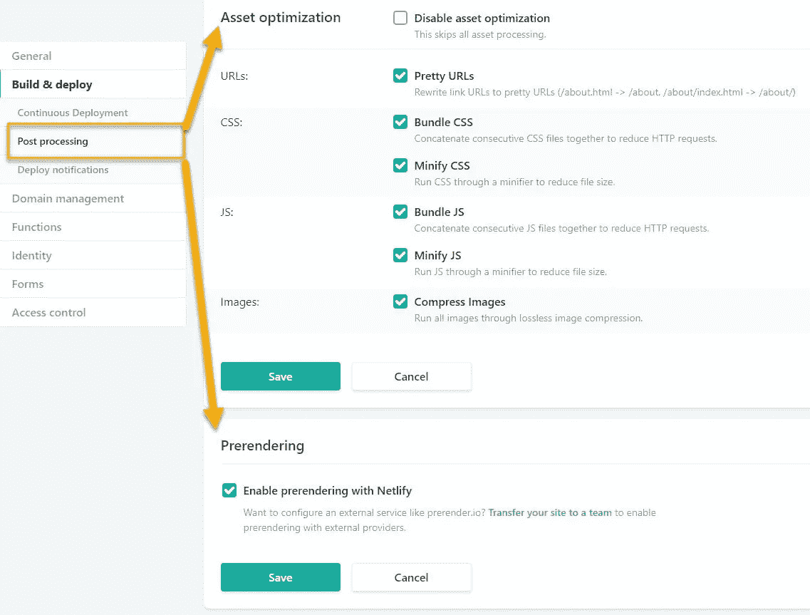

# 如何使用 Cosmic JS + Vuetify 将博客部署到 Netlify

> 原文：<https://medium.com/hackernoon/how-to-deploy-a-blog-using-cosmic-js-vuetify-to-netlify-a5d15dcf9759>


Look at this Vuetiful blog :]

在本教程中，我将向你展示如何使用 Vue、Vuex、Vuetify、 [Cosmic JS](https://cosmicjs.com/?ref=SJHUGTXvf) 创建一个极简但很棒的单页应用博客，并将其部署到 Netlify。让我们开始吧。

# TL；速度三角形定位法(dead reckoning)

[演示链接](https://cosmicjs.com/apps/vuetify-blog) [查看 Github 上的代码](https://github.com/cosmicjs/vuetify-blog)

[网络部署“按钮”](https://app.netlify.com/start/deploy?repository=https://github.com/cosmicjs/vuetify-blog)

# 特征

*   [Netlify](https://hackernoon.com/tagged/netlify) 托管(加上 CDN、预渲染、缩小等..)
*   有人管理的评论系统(默认为无人管理)
*   社交分享按钮
*   [SEO](https://hackernoon.com/tagged/seo) 带有 Vue-Meta 的 Meta 标签
*   通过 Cosmic JS 集成内容管理系统

# 需要改进

*   连接到 Cosmic JS 的静态页面内容
*   帖子类别功能
*   Gravatar 注释集成
*   触发后视图的后退/前进按钮

# 先决条件

在启动之前，您需要拥有节点 JS 和 npm。确保您已经安装了它们。如果没有，你可以在这里找到他们:[https://nodejs.org](https://nodejs.org/)

此外，为了部署它，你可以使用 Netlify 帐户或宇宙 JS 主机。

# 项目结构

**需要注意的重要事项:**
*~/public/_ redirects*
这个文件很重要，因为它将所有流量指向 index.html 文件，以便 vue-router 处理请求。要了解更多关于网络重定向的信息，请访问他们的文档。如果您通过 Cosmic JS 进行部署，则不需要这个文件。

*~/public/favicon . ico*
如果你想自定义你的 favicon，你可以在 public 目录下修改这个文件。

# 分叉和克隆

首先，我们将分叉 github 上的 Cosmicify 库。然后，打开命令行或终端，用以下命令将其克隆到本地机器上的项目文件夹中:

```
git clone [https://github.com/cosmicjs/vuetify-blog.git](https://github.com/cosmicjs/vuetify-blog.git)
```

用 BitBucket 还是 Gitlab 代替？

如果您喜欢使用不同的 git 提供者，您可以克隆 cosmicify 存储库并将其上传到您想要的远程。

# 安装

在您的命令行中`cd`到您刚刚克隆的项目根目录，并运行`npm install`来下载和安装所有需要的依赖项。

# 整合宇宙 JS

在你的宇宙 JS 帐户中创建一个新的桶，你想叫它什么都行。

下载这个 [bucket.json](https://raw.githubusercontent.com/availit/cosmicify/master/bucket.json) 文件。在设置- >导入/导出数据中，选择并上传下载的文件。这将导入所有对象类型和占位符数据。

# 桶形结构

## 设置

有几个设置对象允许你改变你的博客的行为。全局对象拥有大部分的选项，例如选择您的注释是否需要您批准和发布。导航栏中您博客的徽标，或“阅读更多”按钮文本..同时，社交简档对象是设置页脚中的社交网络图标。



## 邮件

这些对象将是您的所有博客帖子/文章。

## 轮廓

这些对象是为将在博客上发表文章的作者准备的。您可以更改您的姓名、简历和个人资料图片。

## 评论

注释对象正是如此；评论，通常通过网站的新评论表单创建。他们收集姓名、电子邮件和评论。

# 使用网络部署

转到您的 Netlify 仪表盘，点击“【Git 的[新网站”。选择你的 git 提供者(我用 github)。认证后，您可以看到您的存储库列表。选择您为之前创建的项目创建的文件。](https://app.netlify.com/start)



接下来，它会让您选择一个分支，然后设置一些配置选项让它正常运行。

将部署目录设置为`dist`并将部署命令设置为`npm start`


接下来，您将单击“显示高级”来设置一些环境变量。

使用下面的列表为您的应用程序输入密钥和值。您需要在 COSMIC_BUCKET 变量中输入您的 Bucket slug。名称中带有 META 的变量用于站点上的 SEO 标签。文章共享链接需要 VUE 应用域才能正常工作。为了让评论系统工作，你需要你的宇宙读取密钥和宇宙写入密钥。

项目所需的环境变量:

```
VUE_APP_TITLE
COSMIC_BUCKET
COSMIC_READ_KEY
COSMIC_WRITE_KEY
VUE_APP_DOMAIN
VUE_APP_META_TITLE
VUE_APP_META_LOGO
VUE_APP_META_DESC
```



一旦一切正常，你可以点击“部署网站”,它将在几分钟内安装和构建应用程序，然后在互联网上发布它！



# 网络后处理

Netlify 提供了在站点构建后运行的后期处理。这是可选的，但我强烈建议启用后处理，因为它可以增强您的网站的性能和预渲染，以便 Googlebot 抓取您的博客内容。



# 结论

我做这个应用是为了好玩，决定分享给大家。它在麻省理工学院的许可下是开源的，所以你可以随意破解它，修改它，或者破坏它。使用 Vue、Vuex 和 Cosmic JS 构建。哦，别忘了 Vuetify，这是由 John Leider 和 200 多名开源贡献者开发的令人惊叹的材料组件库。

如果你有困难或者它对你不起作用，请在评论中告诉我，我会尽力帮助你的！或者通过推特联系 [@Aaron_Vail](https://www.twitter.com/aaron_vail)

本文原载于 [aaronvail.io](https://aaronvail.io/posts/tutorial-how-to-deploy-a-blog-using-cosmic-js-vuetify-to-netlify)