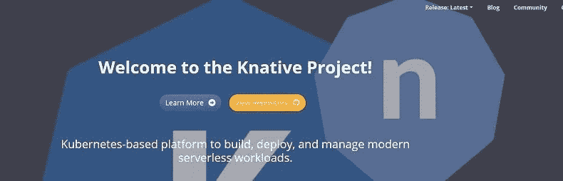

# 如何在 Azure Kubernetes 服务(AKS)上部署 Knative

> 原文：<https://medium.com/hackernoon/how-to-deployment-knative-on-azure-kubernetes-service-aks-537ffa6cc490>



# **简介**

为了使 knative 工作与 AKS，除了官方文件，这需要一些时间，所以我会解释如何做。
整个流程与启动 AKS、安装 isto 和安装 knative 的文档相同，但它需要文档中没有的设置。
现在我来解释一下。

我将省略 knative 本身的解释。
此外，由于有可能存在对已验证版本的依赖性等。，不能保证它完全有效。
假设 Azure CLI 和 kubectl 已经可用。

文件
[https://www.knative.dev/docs/install/knative-with-aks/](https://www.knative.dev/docs/install/knative-with-aks/)

# **AKS 的开始**

基本和文件一样。

指定环境的名称。

```
export LOCATION=eastus
export RESOURCE_GROUP=knative-group
export CLUSTER_NAME=knative-cluster
```

创建资源组

```
az group create --name $RESOURCE_GROUP --location $LOCATION
```

启动 AKS。
版本为 1.11.8。也许即使 1.12 系统也可以…

```
az aks create --resource-group $RESOURCE_GROUP \
   --name $CLUSTER_NAME \
   --generate-ssh-keys \
   --kubernetes-version 1.11.8 \
   --enable-rbac \
   --node-vm-size Standard_DS3_v2
```

设置为能够与 kubectl 一起操作。(- overwrite-existing 覆盖现有设置)

```
az aks get-credentials --resource-group $RESOURCE_GROUP --name $CLUSTER_NAME --admin --overwrite-existing
```

确保启动时没有问题。

```
kubectl get node
NAME                       STATUS    ROLES     AGE       VERSION
aks-nodepool1-24002009-0   Ready     agent     3m        v1.11.8
aks-nodepool1-24002009-1   Ready     agent     3m        v1.11.8
aks-nodepool1-24002009-2   Ready     agent     4m        v1.11.8
```

# istio 安装

按照文件进行。

```
kubectl apply --filename [https://github.com/knative/serving/releases/download/v0.4.0/istio-crds.yaml](https://github.com/knative/serving/releases/download/v0.4.0/istio-crds.yaml)
kubectl apply --filename [https://github.com/knative/serving/releases/download/v0.4.0/istio.yaml](https://github.com/knative/serving/releases/download/v0.4.0/istio.yaml)
```

贴上标签。

```
kubectl label namespace default istio-injection=enabled
```

检查哪个 pod 已启动。

```
kubectl get pods --namespace istio-system
```

等待它运行或完成。

```
NAME                                        READY     STATUS      RESTARTS   AGE
cluster-local-gateway-76db55c785-wkjvh      1/1       Running     0          5m
istio-citadel-746c765786-d758c              1/1       Running     0          6m
istio-cleanup-secrets-cj8cf                 0/1       Completed   0          6m
istio-egressgateway-7b46794587-jbk2s        1/1       Running     0          6m
istio-galley-75c6976d79-z5hp4               1/1       Running     0          6m
istio-ingressgateway-57f76dc4db-xqx8l       1/1       Running     0          6m
istio-pilot-6495978c49-4wl8w                2/2       Running     0          5m
istio-pilot-6495978c49-csfxn                2/2       Running     0          5m
istio-pilot-6495978c49-llw97                2/2       Running     0          6m
istio-policy-6677c87b9f-7ff2g               2/2       Running     0          6m
istio-sidecar-injector-879fd9dfc-2dfkt      1/1       Running     0          5m
istio-statsd-prom-bridge-549d687fd9-8rbfw   1/1       Running     0          6m
istio-telemetry-7d46d668db-khglq            2/2       Running     0          6m
```

# knative 安装

应用以下程序，但继续检查每个 pod 的启动。
然后，在单独应用服务之后，工作将发生。

```
kubectl apply --filename [https://github.com/knative/serving/releases/download/v0.4.0/serving.yaml](https://github.com/knative/serving/releases/download/v0.4.0/serving.yaml)
kubectl apply --filename [https://github.com/knative/build/releases/download/v0.4.0/build.yaml](https://github.com/knative/build/releases/download/v0.4.0/build.yaml)
kubectl apply --filename [https://github.com/knative/eventing/releases/download/v0.4.0/release.yaml](https://github.com/knative/eventing/releases/download/v0.4.0/release.yaml)
kubectl apply --filename [https://github.com/knative/eventing-sources/releases/download/v0.4.0/release.yaml](https://github.com/knative/eventing-sources/releases/download/v0.4.0/release.yaml)
kubectl apply --filename [https://github.com/knative/serving/releases/download/v0.4.0/monitoring.yaml](https://github.com/knative/serving/releases/download/v0.4.0/monitoring.yaml)
kubectl apply --filename [https://raw.githubusercontent.com/knative/serving/v0.4.0/third_party/config/build/clusterrole.yaml](https://raw.githubusercontent.com/knative/serving/v0.4.0/third_party/config/build/clusterrole.yaml)
```

如果在应用过程中出现错误，请再次运行。

```
error: unable to recognize "[https://github.com/knative/serving/releases/download/v0.4.0/serving.yaml](https://github.com/knative/serving/releases/download/v0.4.0/serving.yaml)": no matches for kind "Image" in version "caching.internal.knative.dev/v1alpha1"
```

应用服务。

```
kubectl apply --filename [https://github.com/knative/serving/releases/download/v0.4.0/serving.yaml](https://github.com/knative/serving/releases/download/v0.4.0/serving.yaml)
```

检查吊舱的发射情况。

```
kubectl get pods --namespace knative-serving
```

激活器和自动缩放器将导致错误。我们需要消除这种情况。

```
NAME                          READY     STATUS             RESTARTS   AGE
activator-6f7d494f55-sdhcw    1/2       CrashLoopBackOff   3          1m
autoscaler-5cb4d56d69-xng46   1/2       CrashLoopBackOff   3          1m
controller-6d65444c78-wrnnc   1/1       Running            0          1m
webhook-55f88654fb-tndgw      1/1       Running            0          1m
```

问题报告如下。还描述了解决方案。
虽然没有详细描述，但似乎 istio 有问题。

无法安装 Knative serving
[https://github.com/knative/serving/issues/2878](https://github.com/knative/serving/issues/2878)
请求不要通过 AKS 上的激活器
[https://github.com/knative/serving/issues/3026](https://github.com/knative/serving/issues/3026)
内部 Kubernetes API 调用被 Istio
[https://github.com/istio/istio/issues/8696](https://github.com/istio/istio/issues/8696)阻止

首先得到集群 FQDN。

```
az aks show -n $CLUSTER_NAME -g $RESOURCE_GROUP -o tableName             Location    ResourceGroup    KubernetesVersion    ProvisioningState    Fqdn
---------------  ----------  ---------------  -------------------  -------------------  -------------------------------------------------------------
knative-cluster  eastus      knative-group    1.11.8               Succeeded            knative-cl-knative-group-630e95-44db6d79.hcp.eastus.azmk8s.io
```

接下来，基于 FQDN 创建以下清单。
根据自己的环境各换各的。

```
apiVersion: networking.istio.io/v1alpha3
kind: ServiceEntry
metadata:
  name: azmk8s-ext
spec:
  hosts:
  - "knative-cl-knative-group-630e95-44db6d79.hcp.eastus.azmk8s.io"
  location: MESH_EXTERNAL
  ports:
  - number: 443
    name: https
    protocol: HTTPS
  resolution: DNS
---
apiVersion: networking.istio.io/v1alpha3
kind: VirtualService
metadata:
  name: tls-routing
spec:
  hosts:
  - knative-cl-knative-group-630e95-44db6d79.hcp.eastus.azmk8s.io
  tls:
  - match:
    - port: 443
      sniHosts:
      - knative-cl-knative-group-630e95-44db6d79.hcp.eastus.azmk8s.io
    route:
    - destination:
        host: knative-cl-knative-group-630e95-44db6d79.hcp.eastus.azmk8s.io
```

一旦你设置好你的 istio，再次检查你的 pod。

```
kubectl get pods --namespace knative-serving
NAME                          READY     STATUS    RESTARTS   AGE
activator-6f7d494f55-sdhcw    2/2       Running   8          16m
autoscaler-5cb4d56d69-xng46   2/2       Running   8          16m
controller-6d65444c78-wrnnc   1/1       Running   0          16m
webhook-55f88654fb-tndgw      1/1       Running   0          16m
```

确保你们都在跑。

展开构建

```
kubectl apply --filename [https://github.com/knative/build/releases/download/v0.4.0/build.yaml](https://github.com/knative/build/releases/download/v0.4.0/build.yaml)
```

检查豆荚

```
kubectl get pods --namespace knative-build
NAME                                READY     STATUS    RESTARTS   AGE
build-controller-68dfb74954-vx4rb   1/1       Running   0          12s
build-webhook-866fd64885-dsmdn      1/1       Running   0          12s
```

展开事件。

```
kubectl apply --filename [https://github.com/knative/eventing/releases/download/v0.4.0/release.yaml](https://github.com/knative/eventing/releases/download/v0.4.0/release.yaml)
```

检查豆荚

```
kubectl get pods --namespace knative-eventing
NAME                                            READY     STATUS    RESTARTS   AGE
eventing-controller-756d56fc7-t64lq             1/1       Running   0          35s
in-memory-channel-controller-79ccbb59c-87cnr    1/1       Running   0          22s
in-memory-channel-dispatcher-5c864b94f4-x5jgk   2/2       Running   1          20s
webhook-85f7f4fb6-tdk46                         1/1       Running   0          34s
```

展开事件-源。

```
kubectl apply --filename [https://github.com/knative/eventing-sources/releases/download/v0.4.0/release.yaml](https://github.com/knative/eventing-sources/releases/download/v0.4.0/release.yaml)
```

检查豆荚

```
kubectl get pods --namespace knative-sources
NAME                   READY     STATUS    RESTARTS   AGE
controller-manager-0   1/1       Running   0          18m
```

扩展监控

```
kubectl apply --filename [https://github.com/knative/serving/releases/download/v0.4.0/monitoring.yaml](https://github.com/knative/serving/releases/download/v0.4.0/monitoring.yaml)
```

检查豆荚

```
kubectl get pods --namespace knative-monitoring
NAME                                  READY     STATUS    RESTARTS   AGE
elasticsearch-logging-0               1/1       Running   0          18m
elasticsearch-logging-1               1/1       Running   0          17m
grafana-754bc795bb-cm82c              1/1       Running   0          17m
kibana-logging-7f7b9698bc-pnbp9       1/1       Running   0          18m
kube-state-metrics-768dfff9c5-c4mf2   4/4       Running   0          17m
node-exporter-2snzs                   2/2       Running   0          17m
node-exporter-7tnjp                   2/2       Running   0          17m
node-exporter-95k29                   2/2       Running   0          17m
prometheus-system-0                   1/1       Running   0          17m
prometheus-system-1                   1/1       Running   0          17m
```

展开集群角色

```
kubectl apply --filename [https://raw.githubusercontent.com/knative/serving/v0.4.0/third_party/config/build/clusterrole.yaml](https://raw.githubusercontent.com/knative/serving/v0.4.0/third_party/config/build/clusterrole.yaml)
```

以上所有安装均已完成。

# 操作检查

根据文件检查操作。
[https://www . knative . dev/docs/install/getting-started-knative-app/](https://www.knative.dev/docs/install/getting-started-knative-app/)

展开以下内容:

```
apiVersion: serving.knative.dev/v1alpha1
kind: Service
metadata:
  name: helloworld-go
  namespace: default
spec:
  runLatest:
    configuration:
      revisionTemplate:
        spec:
          container:
            image: gcr.io/knative-samples/helloworld-go 
            env:
              - name: TARGET
                value: "Go Sample v1"
```

指定 INGRESSGATEWAY。

```
INGRESSGATEWAY=knative-ingressgateway
if kubectl get configmap config-istio -n knative-serving &> /dev/null; then
    INGRESSGATEWAY=istio-ingressgateway
fi
```

指定网关并检查 SVC。

```
kubectl get svc $INGRESSGATEWAY --namespace istio-system
NAME                   TYPE           CLUSTER-IP     EXTERNAL-IP     PORT(S)                                                                                                                   AGE
istio-ingressgateway   LoadBalancer   10.0.101.139   104.41.153.79   80:31380/TCP,443:31390/TCP,31400:31400/TCP,15011:30458/TCP,8060:31092/TCP,853:30754/TCP,15030:30403/TCP,15031:30798/TCP   53m
```

获取 IP。

```
export IP_ADDRESS=$(kubectl get svc $INGRESSGATEWAY --namespace istio-system --output 'jsonpath={.status.loadBalancer.ingress[0].ip}')
```

URL 检查

```
kubectl get ksvc helloworld-go  --output=custom-columns=NAME:.metadata.name,DOMAIN:.status.domain
NAME            DOMAIN
helloworld-go   helloworld-go.default.example.com
```

确认“Hello Go 样品 v1！”回来了。

```
curl -H "Host: helloworld-go.default.example.com" [http://${IP_ADDRESS](http://${IP_ADDRESS)}
Hello Go Sample v1!
```

以上操作检查完成。

# 摘要

Knative 现在在 Azure 工作。
未来，使用 knative 的应用也会增加。
此外，如果你使用 Knative Lambda 运行时，你将能够在 Azure 上做 Lambda。
我很期待。

原文内容(日文):[http://level69.net/archives/26443](http://level69.net/archives/26443)