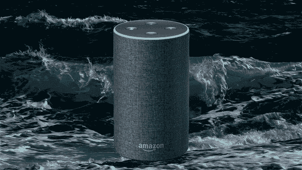

# 2019 年语音助手如何设计大技能

> 原文：<https://medium.com/hackernoon/how-to-design-great-skills-for-voice-assistants-in-2019-1dbd72990241>

## 通过回顾语音界面和用户体验的一些关键元素，进入正确的思维模式，开始设计你的下一项技能。

语音作为一种界面，可以让公司定义自己的角色，并根据环境和与之互动的用户拥有不同的情绪和动态。忘记客户细分，我们谈论的是位于网络边缘的本地数据宝库，允许与客户生活在一起的你的行为与街对面的不同。这是一种独特的“客户关系”。

> 语音可能是第一波关于文化的技术浪潮。是别人怎么说话，不是你。

用户不需要最新的固件，更新等等。演讲是为了理解人们，而不是和他们说话。互动更加自发，缓存寿命更短……想想年轻一代，想想他们对抖音和 Snapchat 的使用。激动吗？酷毙了。我们开始挖吧。

# 现在值得做什么？

CapTech Consulting 的一份报告发现，音乐仍然是智能音箱的主要使用案例(82%的用户报告)，其次是查询和信息收集(42%)。

其中一些问题直接涉及到相关的技能或行为(对于 Google Home 来说)，但是为了让它们发挥作用，措辞需要非常具体。这目前给一些主人造成了相当多的挫折，包括臭名昭著的蹒跚学步的孩子，他痛苦地尝试了五分钟，让 Alexa 播放她最喜欢的歌曲。

至于谷歌的虚拟助手，据说它比 Siri、Cortana 或 Alexa 更强大、更准确，这要归功于它的搜索算法、内容访问和自然语言处理(NLP)技术。

虽然智能扬声器和智能家居的想法可能会吸引年轻的工作成年人，但语音命令通常可以为更广泛的受众提供一个全新的内容世界。从蹒跚学步的孩子到可能不太习惯触摸屏的老年人，语音实际上是对不同的角色说话。这些人通常不会以数字方式与品牌互动，这就创造了一个机会来扩大你对他们的需求和需要的了解。

## 针对语音优化您的内容

在更广泛的语音搜索类别中(包括移动搜索)，谷歌声称平均结果长度为 29 个单词。

这并不是说网页应该只包含少量的单词；搜索结果页面的平均长度实际上是 2312 个单词。

这意味着谷歌可以从长格式的内容中汲取营养，只要它是以一种易于理解的方式编写的。来自[schema.org](https://schema.org/)的结构化数据标记是优化内容的一种方式。

## 先听，然后再多听一些

我们还不知道什么样的客户会觉得更有吸引力，但如果他们能快速找到信息，花更少的时间搜索，这已经是一个胜利。评估语音项目是否值得做的几个简单问题:

它能节省人们的时间吗？

是不是更方便？

它允许用户按照他们的方式(而不是你的方式)与你互动吗？

在一个透明和互动的模式中，信息就是力量，但力量会来回波动。如果客户服务意味着向人们解释为什么事情是这样的，而不是听他们说什么，这是不行的。让它成为一个开放的反馈渠道，这样人们可以帮助你更好地为他们服务。

此外，请记住，2019 年刚刚购买设备的人的期望将与前几年截然不同。这个领域正在快速发展。你等待的时间越长，门槛可能就越高。

# 从哪里开始

理想的情况是，将你的项目分解并逐步展开。如果你有一个不错的 API 和云基础设施，获得第一个技能并运行可能只需要 9 到 12 个月。对 API 和云的投资有助于降低开发语音助手的成本。更广泛地说，无服务器计算非常有意义。

无论哪种方式，你都需要一个语音策略和一个范围定义，然后你就可以测试出一个 SMS“概念证明”，最后，你的语音原型。

对于应用程序，您需要打开应用程序并登录。同时，短信更加直接和简单。即使有些东西需要点击几次，你也会失去一些人。更别提每次界面改头换面的混乱了。

1.从简单的短信智能提醒开始(“你家的闹钟响了。是你吗？键入确认或拒绝”)。在这个阶段，基本的 SMS 工作流甚至可以使用许多基于云的服务中的一种来完成，以进行快速而粗略的概念验证。

2.接下来，试着翻译所有的回答(“OMG 是的，就是我，谢谢！😊”)解读表情符号来定义意图。你也可以试着解读照片。在这个阶段，如果请求的信息太复杂，SMS 对话可能仍然会导致指向网页的链接。

3.然后是声音。这是对话式人工智能的一个关键优势；你不需要考虑构建导航的最佳方式。相反，你要专注于回答客户问题的最佳方式，并找出客户提问的所有方式。

你会问，没有聊天机器人？聊天机器人往往令人失望，部分原因是，正如我们前面所说的，当给了一个键盘时，人们往往会说出更复杂的请求，这使得找到适当的回应更加困难。

# 需要记住的几件事

没有移动技术和可靠的高速互联网，优步不可能成为现实。但目前，我们拥有的是更强大、更互动的家用收音机；我们还没有看到没有声音就不可能存在的东西。

你如何打造一种体验，充分利用你与顾客互动的各种方式的优势？现在，问问你自己:

如果可以的话，有什么东西人们会更经常使用吗？

他们每天都会做些什么吗？在什么背景下？

人们希望不用太多思考就能完成或弄清楚什么？

## 做人，但不要太过分

性格是一致的，而情绪是变化的。对话不太正式，它的设计需要获得细微差别和正确的推论。是人驱动的，产生了一种“不做陌生人”的预期。弄清楚正确的持久性水平对于取悦用户至关重要。不要每次他们问你事情的时候都问我他们的名字。理解诸如“今天会下雨吗？明天呢？”记住选择，并根据偏好提出更多建议。

基本上，要亲密，但不要听起来太像人类，那只是令人毛骨悚然。在语音合成方面，提醒用户它不是一个人，但也不像一个可怕的机器人。

## 形式问题

在未来 10 年内，对话将是至关重要的，因为它允许以客户实际说话的方式倾听客户。有些东西非常适合语音，有些则不适合，比如列表。现在，不太容易弄清楚有多少人真正在看屏幕，他们在看什么，这在未来可能会改变。

当人们有一个完整的键盘时，他们会问复杂的问题(想想聊天机器人)，而短信则更简单，更线性(循序渐进)。在设计口语对话时，要考虑可以说出什么样的细节，以及在新设备的屏幕上可以显示什么作为补充。不要害怕大声朗读！

语境决定一切。有时，有用的可能只是简单地找到你推荐的水管工或电工，或者最近的认可的汽车维修服务。Voice 不是帮助台或聊天机器人。当用户需要时，即时提出仅适用于该用户的本地见解。随着时间的推移，当你了解到他们喜欢什么时，给他们一些建议。不要试图变得太事务化。

## 记录还是不记录？

是的，这是有争议的，但是请倾听错误和疑问。了解你的技能、行动或应用程序做得如何，确保你的模型做得好。识别客户在问但技能不知道的事情(你的对话“跳出率”；答案是“我不知道”的时代)。确保提供的答案是准确的。这很不幸，但有些事情仍然需要人工审查。

## 可发现性不是问题

所谓的可发现性问题可能与其说是一个问题，不如说是一种偏见。对话不是 app，重要的是效用和价值。我们现在还没有真正的语音“应用商店”，我们称之为一个问题。但是曾经有一段时间没有智能手机的应用商店(还记得吗？).

应用商店的建立是为了让开发人员可以轻松地在操作系统层上推出额外的功能，这些功能很容易被发现并可以货币化。我们今天需要这个吗？它已经成为我们大脑的连线方式，但真正的问题是“今天你如何使用人工智能和语音？”如果不符合用户的需求，就不要要求用户在你所在的地方找到你。

至于命令，技能描述让用户知道技能是做什么的，关键是要保持简单明了，这样他们就容易记住。人们通常会问助理一些问题。归根结底，这是价值的问题，而不是为设备增加功能的问题。

如前所述，在智能家居环境中，功能来自于向您的“主操作系统”添加其他连接的东西。这些设备是否应该以及如何相互连接将决定我们是在谈论“物联网”还是仅仅是“连接到互联网的东西”。

## 开源或定制由你决定

您是否应该创建自己的语言和意图模型或开源取决于几个因素。

你的技能需要擅长什么？

术语具体吗？

你的客户会去哪里，他们现在在哪里？

目标是什么:客户参与度？亲和力？增加交易量？

领域特定模型允许在其中注入上下文。他们缩小了某些表达的范围，以避免过多的澄清问题。它们可以根据人们需要它们的时间和地点来构建。如果你的技能是用于狩猎旅行的，那么“美洲虎”和你正在培养的汽车保险索赔技能不是一回事。

如果你认为开源应该工作得很好，考虑一下 IBM 的库 TensorFlow。

## 缓存:一点点就能走很长的路

当涉及到会话维护时，多个意图(同时询问三件事)可能会有点问题。问问你自己“在清除缓存之前，我应该将用户正在做的事情保留多长时间？”

## 注意你的语言

点、点、击已经存在一段时间了，但是对话是一个完全不同的故事。为语音界面写作不像视觉或书面交流那样工作。UX 之声是一个很大的学习曲线，因为对话非常复杂。人们对演讲的反应方式完全不同。

花时间想出合适的回答，以及如何表达。请记住，与让 Alexa 复述相比，在纸上朗读单词看起来非常不同。看起来没问题的可能听起来没问题。

这更像是为电台写作。斯特伦克和怀特的方法值得设计师学习。注意不要太事实化，因为声音有隐含的语气；从客户的角度考虑问题。有些事情大声说出来并不能真正引起共鸣；你需要看看他们。例如，列表、地址和号码。

成功的用户体验清楚准确地使用语言。关注低风险问题；你可以通过短信得到答案。保持它们相当短。你展示信息的顺序是至关重要的，因为大多数人主要会记住最后一点。有哲学和人类学背景的人可以帮助你找到正确的答案。

请记住，首先，主要用途可能仍然是手机和短信，因为这取决于语音设备在家庭中的渗透率。

## 练习你爸爸的笑话

你花了很多钱在你的标志上，那你的声音呢？就像收音机里古怪的顺口溜一样，回忆可能是巨大的。实验。制作你想听起来像什么的白板。

有些人认为语音战略和他们对待网络战略的方式一样:“我必须做，因为其他人也在做”。如果我告诉你，无论你的客户在哪里，你都可以每天与他们交谈，那会怎么样？你们会聊些什么？

不要把性格和个性作为事后的想法，设计你的幽默感，谈论性别，避免刻板印象，以及当客户闲聊和考验你时如何表现(“我爱你”，“我们应该把尸体埋在哪里？”).这是有趣的部分:藏一些复活节彩蛋在那里。

别忘了享受乐趣！