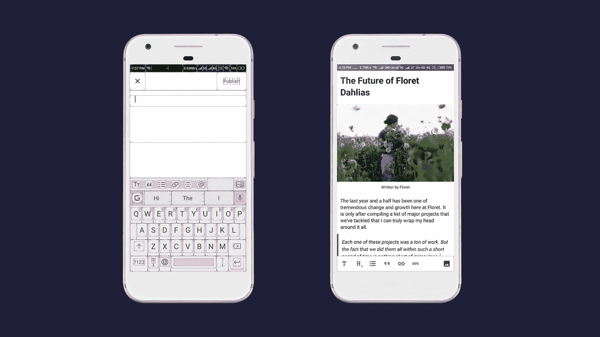
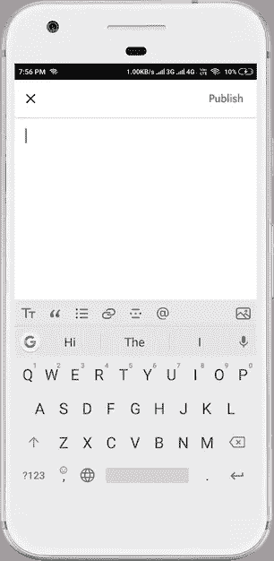
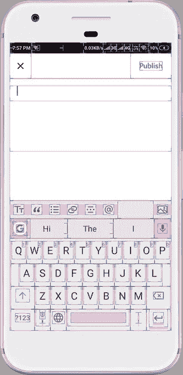
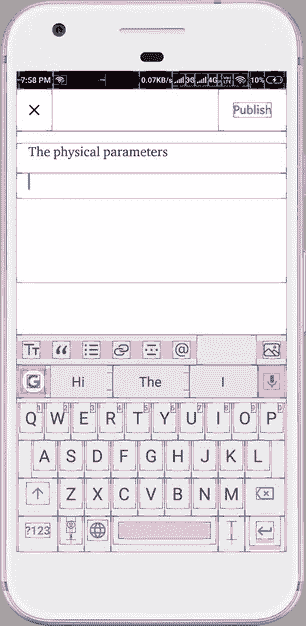
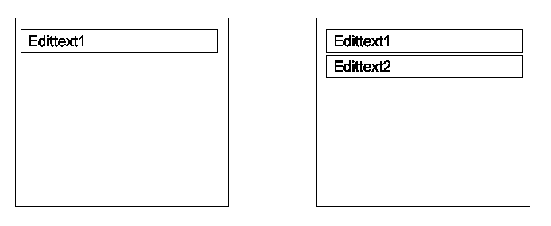
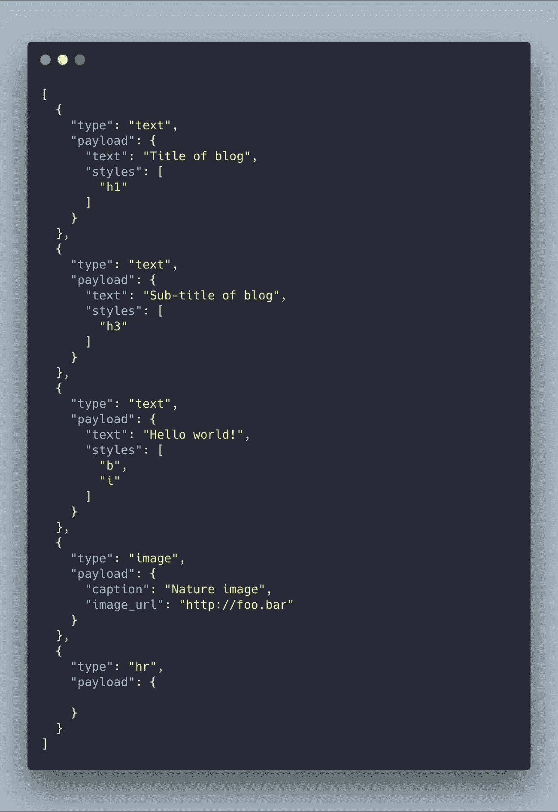
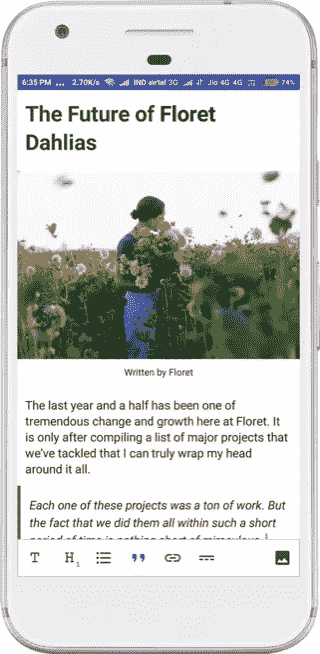

# 如何在 Android 中开发一个所见即所得编辑器

> 原文：<https://medium.com/hackernoon/how-to-develop-a-wysiwyg-editor-in-android-just-like-medium-30e0d4c8471f>

## 一天开发一个 Android 的所见即所得编辑器。

如果你是一个开发者，你可能尝试过 Medium 的编辑器。这是为博客提供的世界级服务，其用户体验是博客网站的行业标准。

**指标—**

1.  什么是[所见即所得](https://hackernoon.com/tagged/wysiwyg)编辑器？
2.  编辑器的内部架构。
3.  如何存储内容？

这个博客将帮助你了解当你想要建立一个编辑器时应该如何思考，构建模块是什么，以及你必须注意的基本规则。

我还在这篇博客的末尾给出了我的示例的链接，供您参考，以防您在某个地方遇到困难，或者您想直接浏览代码。

**那么让我们开始吧，**

# **什么是所见即所得编辑器？**

所见即所得是“所见即所得”的缩写。WYSIWYG 编辑器是一个系统，在该系统中，内容可以以非常类似于其作为最终文档打印或显示时的外观的形式进行编辑。

## 媒体编辑看起来怎么样？

Medium Editor (Android)

以上是编辑器的截图，是一个干净直观的界面。所有编辑工具都显示在底部工具栏上。用户可以输入他们的内容并相应地格式化。

这似乎是一个定制的 [EditText](https://developer.android.com/reference/android/widget/EditText) ，它使用[span ables](https://developer.android.com/reference/android/text/Spannable)来格式化它的内容。但是，使用 *spannable* 很难管理像 10k 单词这样的长文本格式。根据文件显示，

> 这是可以附加和分离标记对象的文本接口。
> 
> 将指定的标记对象附加到文本的范围`start...end`中。

在核心处，*span enable*从其`start`到`end`索引执行字符串搜索操作，然后应用`[Spans](https://developer.android.com/guide/topics/text/spans)`的类型。在`edittext`中的每一个角色变化，它都必须更新跨度。这涉及到在有限的时间内进行大量的操作，因此它会影响 UI 的渲染性能，并且当用户试图快速键入或快速删除任何内容时，会产生糟糕的体验。

为了验证这一点，让我们深入观察一下*‘混凝土后面的栅栏’。*

# 编辑器的内部架构

## 编辑的 x 光片

Layout bounds of editor

给定的图片是在开发者模式下打开的中型应用程序。活动光标在一个框内。这个盒子还是一个`editext`。现在我们来看另一个我们输入东西时的截图

On Typing something

当我们按回车键时，光标移动到新行，另一个框被创建。因此我们可以得出结论，这不是一个单一的`editext`和`Spans`都没有使用。

如果我们继续按回车键，新的盒子就会被添加。这是一个概念—

> 把编辑器想象成一个容器，根据用户的动作(如`enter`或`backpressed`)向其中添加或从中删除元素。每个元素都是可独立设置样式的实体，可以是粗体、H2 或块引用、图像或列表项等。

现在让我们对此进行更多的探索，

## 内部架构的基础

有一个按垂直顺序添加视图的父视图。在[安卓](https://hackernoon.com/tagged/android)中，它简直可以是竖`orientation`中`LinearLayout`的扩展版。

最初，有一个`edittext`被添加到堆栈并被聚焦。直到用户按下回车键，内容进入相同的`edittext`。

按下回车键后，一个新的`edittext`被插入堆栈。父视图跟踪添加到堆栈中的每个视图的索引以及焦点视图。看看这个骨架—

Skeleton of our editor

我认为内部结构很清楚。现在，让我们看看格式化部分。

## 编辑器的基本构件

在我们的基本编辑器中，我们将支持—

1.  标题风格像 H1，H2…H5
2.  粗体，斜体
3.  大宗报价
4.  图像
5.  有序/无序列表
6.  水平分隔线

我们可以对列表进行排序，并将它们分成如下几组。

**组 1** :标题样式、粗体、斜体、块引号、列表

**第二组:**图像

**第三组:**水平分隔线

这里，我们根据呈现元素所需的属性对元素进行了分组。换句话说，文本、图像(多媒体)和水平分隔线。

## **我们可以对组 1 执行的操作—**

1.  我们可以使用`Edittext`来获取输入。
2.  使用字体应用标题样式。
3.  通过改变`edittext`的背景视图显示区块报价。

因此我们可以创建一个自定义的`edittext`。该视图将存储所有应用的配置。当我们收集编辑器数据(稍后介绍)并存储在设备上或发送到服务器时，我们将阅读它们。

> **对于组 1** :我们可以有一个包含所有参数的自定义视图。该块(视图)将在编辑器中添加或删除。

## **我们可以对组 2 执行的操作—**

1.  我们使用`ImageView`来显示图像。
2.  可以通过`Edittext`拍摄图像字幕。

这可以是一个自定义视图，由一个`ImageView`和一个`Edittext`(用于图像上的标题)组成。它将负责上传图像到服务器，并存储回 URL 本身。此外，它需要存储输入到`EditText`中的文本。

> **对于组 2:** 我们可以使用 ImageView 和 Edittext 定制视图。

## **我们可以对组 3 执行的操作—**

这是最简单的部分，这将是一个简单的视图，它将画一条线。

> **对于第 3 组:**我们可以有一个可画线的视图。

为了制作一个稳定的编辑器，我们需要让它的反应真实。所以有一些需要遵守的基本规则。

## 编辑规则

1.  最初，会有一个光标在上面的`editext`。
2.  如果用户正在输入一个段落并按下回车键，我们需要添加另一行(`edittext`)。
3.  如果用户应用一个样式，它将适用于块的全部内容。
4.  如果用户将光标放在文本中间并按 enter 键，则获取光标之后的内容—>插入新块—>将内容复制到其中。
5.  如果用户试图插入图像，则获取当前聚焦视图的索引，并在其下方插入新的图像块。此外，在图像下方插入一个`EditText`块(这样用户可以点击图像下方并继续书写)。
6.  如果用户删除了一个块的全部内容，带他到前一个编辑块。

这些是许多规则中的一些基本规则，可以以类似的方式应用。

# 如何存储内容(文本、图像……)？

到目前为止，我们已经讨论了编辑器的结构部分。现在让我们来看一下内容存储。我们不能直接存储纯文本和 URL，因为涉及到很多样式。这一部分将介绍文本应该如何存储在服务器和设备上，以及如何正确呈现。

## 数据存储结构

我们将有一个助手类，它将遍历父容器并从每个组收集以下信息。我们之前定义的群体。

*   **来自组 1:** 实体(文本)、文本和样式的类型。
*   **来自第 2 组:**实体(图像)类型、图像 URL 和标题文本
*   **来自第三组:**实体类型。

这是存储博客的结构之一—

A basic structure of editor data

在我们以这种格式收集数据后，我们可以将它发送到服务器或将其存储为草稿。

## 呈现数据

现在，如果用户回到博客的草稿版本，我们需要读取 JSON 结构，然后根据它准备视图。这是如何做到的—

1.  遍历 JSON 数据中的实体数组。
2.  实例化特定类型的实体(文本、图像或 HR ),并用给定的数据配置它们。
3.  将实体添加到父视图。
4.  把注意力集中到第一个孩子身上。

我们现在已经成功地从原始数据中恢复了草稿的结构。

# **参考样本库—**

我实现了一个 editor 版本，它是一个 WYSIWYG Markdown 编辑器。它目前正被用于[1 lamp 应用](https://play.google.com/store/apps/details?id=com.hapramp)(一款社交媒体应用)。

你可以在 [GitHub](https://github.com/bxute/MarkDEditor) 上查看源代码。

欢迎在评论中提出你的疑问。