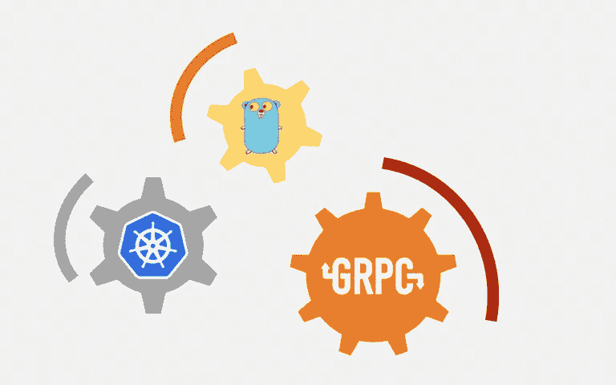

# 如何开发 Go gRPC 微服务并在 Kubernetes 中部署

> 原文：<https://medium.com/hackernoon/how-to-develop-go-grpc-microservices-and-deploy-in-kubernates-5eace0425bf8>



几个月前，我开始了学习 gRPC 的旅程。本文将展示我们如何使用 gRPC 来开发使用 Go 的微服务，并在 kubernetes 集群中部署它们。
我们将开发两种微服务。一个微服务将负责计算两个整数和，另一个将服务于一个公共 REST API。

# 先决条件

在本地机器上运行 kubernetes 集群有很多种方法。我将在这篇文章中使用 [Minikube](https://github.com/kubernetes/minikube) 。我们还需要安装 [kubectl](https://kubernetes.io/docs/tasks/tools/install-kubectl/) 、 [Docker](https://docs.docker.com/install/) 和 Protobuf [编译器](https://github.com/protocolbuffers/protobuf)。

要启动 Minikube，您必须以 root 权限运行以下命令

```
$ minikube start [--vm-driver=<driver>]
```

# 定义通信协议

作为底层传输协议，我们将使用 gRPC。为此，我们需要用协议缓冲区的[接口定义语言](https://developers.google.com/protocol-buffers/docs/proto3)编写消息类型和服务的定义，并编译它们。在您的项目根目录中，在`pb`目录下创建一个名为`add.proto`的文件。

```
syntax = "proto3";

package pb;

message AddRequest {
    uint64 a = 1;
    uint64 b = 2;
}

message AddResponse {
    uint64 result = 1;
}

service AddService {
    rpc Compute (AddRequest) returns (AddResponse) {}
}
```

要编译这个`proto`文件，导航到`pb`目录并运行以下命令

```
$ protoc -I . --go_out=plugins=grpc:. ./*.proto
```

编译成功后，会在同一个目录下产生`add.pb.go`文件。

# 实现总和服务

为了实现求和服务，我们需要使用自动生成的代码。现在在`add`目录下创建`main.go`文件，并确保导入正确的包

```
package main

import (
	"fmt"
        "golang.org/x/net/context"
	"google.golang.org/grpc"
	"google.golang.org/grpc/reflection"
	"log"
	"net"

        // replace this with your own project
	"github.com/shuza/kubernetes-go-grpc/pd"
)
```

现在使用自动生成的`pb.AddServiceClient`接口实现将两个整数相加的`Compute`处理函数。

```
func (s *server) Compute(cxt context.Context, r *pb.AddRequest) (*pb.AddResponse, error) {
	result := &pb.AddResponse{}
	result.Result = r.A + r.B

	logMessage := fmt.Sprintf("A: %d   B: %d     sum: %d", r.A, r.B, result.Result)
	log.Println(logMessage)

	return result, nil
}
```

注意，在 main 函数中，注册一个将处理请求的服务器类型。然后启动 gRPC 服务器。

```
type server struct{}

func main() {
	lis, err := net.Listen("tcp", ":3000")
	if err != nil {
		log.Fatalf("Failed to listen:  %v", err)
	}

	s := grpc.NewServer()
	pb.RegisterAddServiceServer(s, &server{})
	reflection.Register(s)
	if err := s.Serve(lis); err != nil {
		log.Fatalf("Failed to serve: %v", err)
	}
}
```

# API 服务

`API service`使用 [Gorilla Mux](https://github.com/gorilla/mux) 向客户端提供 REST API 响应并路由它们。创建一个与`Add Service`通信的客户端。为了与`Add Service`通信，我们将使用服务名`add-service`，因为稍后我们将在 kubernetes 集群中部署我们的服务。Kubernetes 有内置的 DNS 服务，所以我们可以通过服务名访问。

```
func main() {
	//	Connect to Add service
	conn, err := grpc.Dial("add-service:3000", grpc.WithInsecure())
	if err != nil {
		log.Fatalf("Dial Failed: %v", err)
	}
	addClient := pb.NewAddServiceClient(conn)

	routes := mux.NewRouter()
	routes.HandleFunc("/add/{a}/{b}", func(w http.ResponseWriter, r *http.Request) {
		w.Header().Set("Content-Type", "application/json; charset=UFT-8")

		vars := mux.Vars(r)
		a, err := strconv.ParseUint(vars["a"], 10, 64)
		if err != nil {
			json.NewEncoder(w).Encode("Invalid parameter A")
		}
		b, err := strconv.ParseUint(vars["b"], 10, 64)
		if err != nil {
			json.NewEncoder(w).Encode("Invalid parameter B")
		}

		ctx, cancel := context.WithTimeout(context.TODO(), time.Minute)
		defer cancel()

		req := &pb.AddRequest{A: a, B: b}
		if resp, err := addClient.Compute(ctx, req); err == nil {
			msg := fmt.Sprintf("Summation is %d", resp.Result)
			json.NewEncoder(w).Encode(msg)
		} else {
			msg := fmt.Sprintf("Internal server error: %s", err.Error())
			json.NewEncoder(w).Encode(msg)
		}
	}).Methods("GET")

	fmt.Println("Application is running on : 8080 .....")
	http.ListenAndServe(":8080", routes)
}
```

这里我为`/add/{a}/{b}`端点声明了一个处理程序，它读取参数`A`和`B`，然后调用 Add Service 进行求和。

# 构建 Docker 图像

现在您的服务已经准备好了，但是需要将它们容器化以部署在 kubernetes 集群中。对于添加服务，在`add`目录中创建一个`Dockerfile`

```
FROM golang
COPY . /go/src/add
WORKDIR /go/src/add
RUN go get .
ENTRYPOINT go run main.go
EXPOSE 3000
```

要在 [DockerHub](https://hub.docker.com/) 中构建并推送`summation-service`映像，请导航至`add`目录并运行以下命令

```
$ docker build . -t shuzasa/summation-service:v1.0
$ docker push shuzasa/summation-service:v1.0
```

对于 Api 服务，在`api`目录中创建`Dockerfile`

```
FROM golang
COPY . /go/src/api
WORKDIR /go/src/api
RUN go get .
ENTRYPOINT go run main.go
EXPOSE 8080
```

要构建和推送`api-service`映像，请导航到`api`目录并运行以下命令

```
$ docker build . -t shuzasa/api-service:v1.0
$ docker push shuzasa/api-service:v1.0
```

# 部署到 Kubernetes 集群

对于每个服务，我们需要在 kubernetes **部署**和**服务**中配置两个对象。**部署**将在 kubernetes 集群内创建 poda，并管理这些 poda 的期望状态，以确保我们的应用程序运行以服务流量。**服务**将提供固定地址来访问那些 pod。
对于总和服务，创建`add-service.yaml`文件并插入以下命令

```
apiVersion: apps/v1
kind: Deployment
metadata:
  name: add-deployment
  labels:
    app: add
spec:
  selector:
    matchLabels:
      app: add
  replicas: 1
  template:
    metadata:
      labels:
        app: add
    spec:
      containers:
        - name: add
          image: shuzasa/add-service:v1.2
          ports:
            - name: add-service
              containerPort: 3000

---
apiVersion: v1
kind: Service
metadata:
  name: add-service
spec:
  selector:
    app: add
  ports:
    - port: 3000
      targetPort: add-service
```

为`api-service`创建`api-service.yaml`文件

```
apiVersion: apps/v1
kind: Deployment
metadata:
  name: api-deployment
  labels:
    app: api
spec:
  selector:
    matchLabels:
      app: api
  replicas: 1
  template:
    metadata:
      labels:
        app: api
    spec:
      containers:
        - name: api
          image: shuzasa/api-service:v1.0
          ports:
            - name: api-service
              containerPort: 8080

---
apiVersion: v1
kind: Service
metadata:
  name: api-service
spec:
  selector:
    app: api
  ports:
    - name: http
      port: 8080
      nodePort: 30080
  type: NodePort
```

两个服务定义的主要区别在于`api-service`我们将它声明为`NodePort`类型，因为它可以从 kubernetes 集群外部访问。
现在，通过运行以下命令来创建这些资源

```
$ kubectl create -f summation-service.yaml
$ kubectl create -f api-service.yaml
```

等到所有单元都可用或处于运行状态

```
$ kubectl get pods -w
NAME                              READY     STATUS    RESTARTS   AGE
add-deployment-66df6c78b6-qcj77   1/1       Running   0          2m
api-deployment-577f4965f5-d2bkd   1/1       Running   0          2m
```

# 结论

让我们验证我们的系统。获取我们`api-service`跑步的 URL

```
$ minikube service api-service --url
```

使用之前找到的 IP 地址向服务发出请求

```
curl [http://192.168.99.100:30080/add/1/3](http://192.168.99.100:30080/add/1/3)
```

它将显示求和结果。

你可以在 GitHub 上找到完整的源代码。

*原载于 2019 年 2 月 2 日*[*shuza . ninja*](https://shuza.ninja/how-to-develop-go-grpc-microservice-and-deploy-in-kubernates/)*。*