# 将集合视图单元格拖放并重新排序到一个或多个 UICollectionView 中

> 原文：<https://medium.com/hackernoon/how-to-drag-drop-uicollectionview-cells-by-utilizing-dropdelegate-and-dragdelegate-6e3512327202>

想象一个 Instagram 主题应用程序，你可以拖放你的帖子，在你发帖之前创建一个干净的 feed。如果这没有意义，请继续阅读。

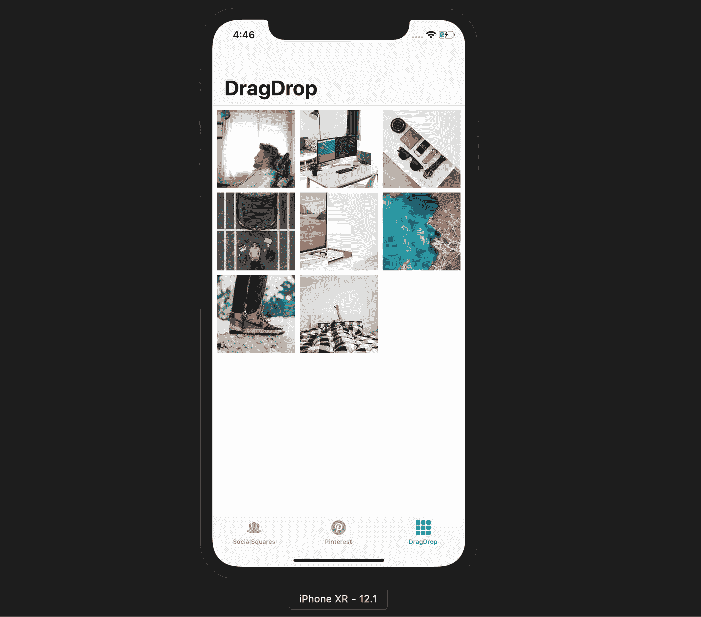

# Swift 是面向协议的，是的，我们喜欢这一点。

在您的应用中使用***UICollectionViewDragDelegate***和***UICollectionViewDropDelegate***Swift 协议来集成拖放功能。

**这是我们将构建的应用/功能的 gif，以及您将学习如何使用的两个协议。如果你在这里，你可能已经熟悉了 UICollectionViewDelegateFlowLayout 和 UICollectionViewDataSource。**

如果你喜欢课程形式，请查看我的收藏视图课程[，我们在那里构建了这个应用程序和 Pinterest 布局。](http://bit.ly/collectionviewmedium)

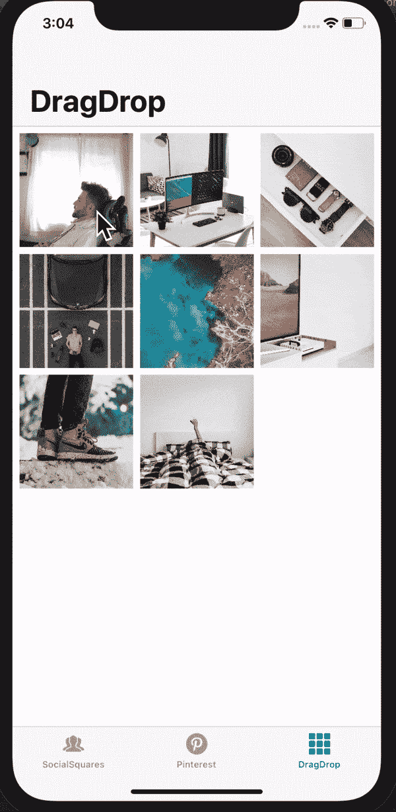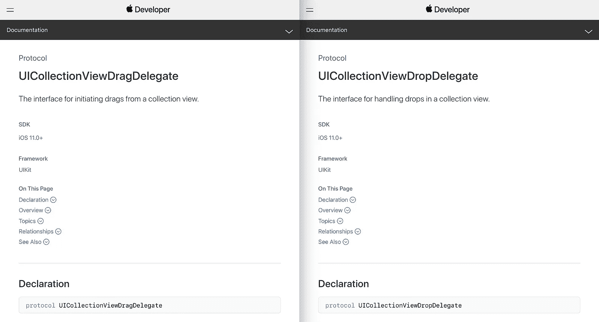

# 步骤 1-在视图控制器✅中设置集合视图

第 1 步和第 2 步我不会解释，因为这是基本的收藏视图垃圾，不是本文的重点。**但是，我将深入解释拖放协议**。将此代码复制到您的应用程序中，以获得集合视图设置(您将不会在屏幕上看到任何内容)

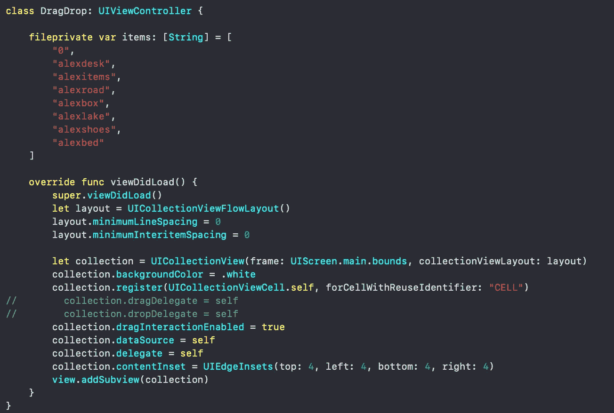

## 类别命名

需要注意的一点是，我已经将这个类命名为 DragDrop。我们将在整篇文章中使用这个类的扩展。

## 形象

*项*数组是字符串的集合。这些字符串是我们的图像。你可以在 unsplash 上免费获得高质量的图像。

Alexacea 有非常好的技术图片，我在每个需要图片的教程中都会用到。

# 步骤 2 —利用 DelegateFlowLayout 和 DataSource 协议在屏幕上获取一些单元格。✅

继续将下图所示的代码复制到您的应用程序中。完成这些后，编译您的代码。

## 我们准备好了。

你的应用应该看起来像这个截图，**底部没有 UITabBar，大导航标题 DragDrop** 。( [*这些在这里是因为它们是我收藏课程*](https://www.udemy.com/tableviews/?couponCode=MEDIUMNINE) 的一部分)

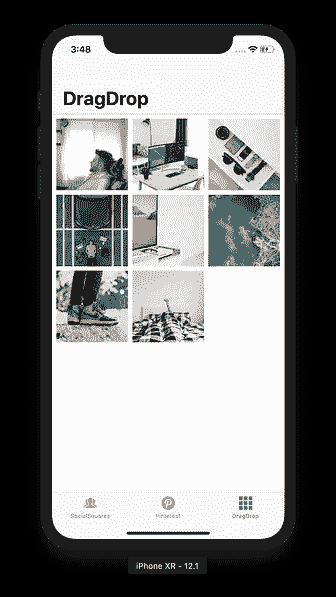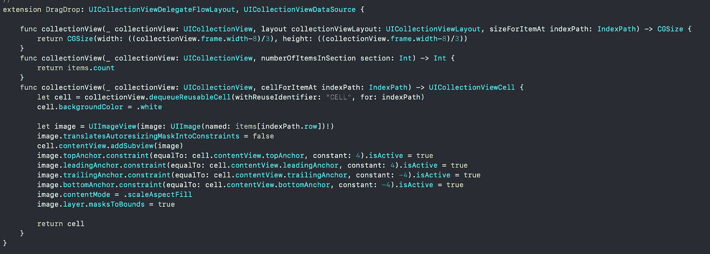

# 步骤 3-整合✅的 UICollectionViewDragDelegate

将此代码键入到您的应用程序中，并取消对视图中 collection.dragDelegate = self 的注释。

又来了！确保您取消注释了视图中的***collection . drag delegate = self***load 方法。如果不这样做，这段代码什么也不会做。

通过创建一个扩展并采用**UICollectionViewDragDelegate**，我们获得了在集合视图中拖动单元格的神一样的能力。(点击右边我的模拟器截图，完成这一步你应该就能做到了。我只是简单地拖动一个单元格，它还没有做任何其他事情。)

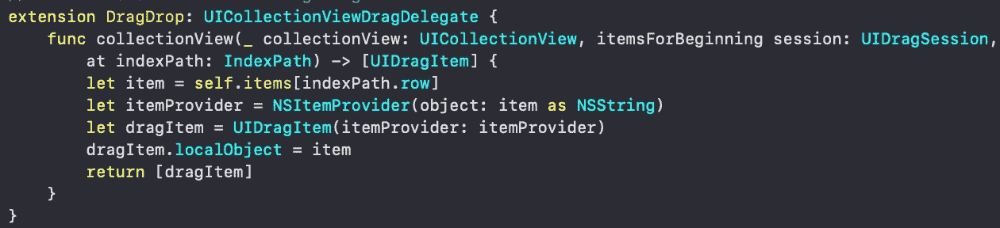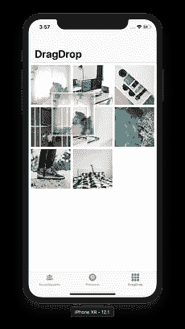

UICollectionViewDragDelegate

## k 但是这是怎么发生的呢？🤷‍♂️

*itemsForBeginning session* 是一个要求我们返回 UIDragItem 集合的方法。

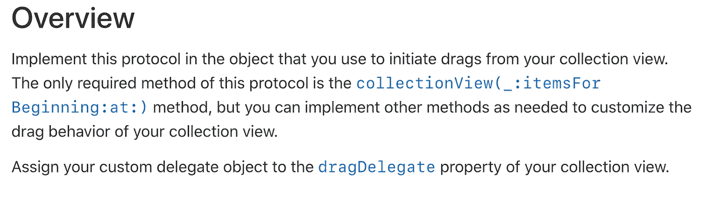

这意味着，如果我们愿意，我们可能会集成一个功能，允许拖动不止一个单元格 **\_(ツ)_/** 。

它还开始 UIDragSession。详情请查阅相关文档。

# 步骤 4-使用 UICollectionViewDropDelegate ✅处理拖放

## 将这段代码复制到 Xcode 中。

您会注意到一个警告和一行注释代码。待机，我会在下一步解释。

## 两种方法

[此处列出的文档中，有更多不需要的方法。](https://developer.apple.com/documentation/uikit/uicollectionviewdropdelegate)

## [dropsessiondupdate 会话](https://developer.apple.com/documentation/uikit/uicollectionviewdropdelegate/2897375-collectionview)

第一个方法返回 UICollectionViewDropProposal。这就是我们如何告诉 DropDelegate 当用户拖动一个单元格并将其放在一个新位置时发生了一些事情。

## [***performdroptwith coordinator***](https://developer.apple.com/documentation/uikit/uicollectionviewdropdelegate/2897304-collectionview)

第二种方法是在通知 dropDelegate 可能很快会有一个 drop 之后，我们将想要运行的代码放在哪里。我们在这里所做的只是计算单元格是否会超出边界。

## 等等，我很困惑。

嘿，我也在那里。所以当我最终理解了它，我决定制作一个课程[来解释每一个步骤，供我自己和其他人参考。](http://bit.ly/collectionviewmedium)

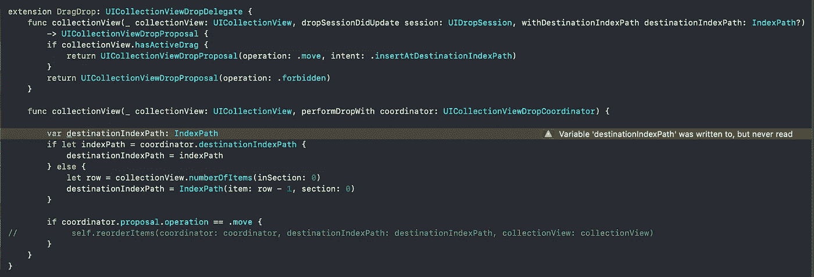

Detect drops with UICollectionViewDropDelegate

# 步骤 5-在 UICollectionView ✅上重新排序数据/项目和批量更新

最后一步是实现重排序项目方法。我把这个方法放在了我的 view did load 方法的正下方，并像所有优秀的开发人员应该做的那样，把它标记为 *fileprivate* 。

首先，取消上面截图中的代码行的注释。我们已经实现的 performDropWith 方法中的行。

## 这个方法需要三个参数。

1.  UICollectionViewDropCoordinator 类型的协调器
2.  IndexPath 类型的 destinationIndexPath
3.  UICollectionView 类型的 collectionView

## 为什么呢？

1.  在最后一行，协调器对象将允许我们在修改数据后告诉 drop delegate 我们已经执行了一次 drop。这允许平滑的动画(单元格下降，而不是集合视图更新数据)
2.  destinationIndexPath 就是我们希望新单元格驻留的目的地。这是我们投放细胞的地方。
3.  collectionView 显然是我们的集合视图，我们需要它来执行批量更新，从原始位置删除拖动的项目，并将其插入新位置。

因此，继续在 performBatchUpdates 方法中包装数据和索引路径的插入和删除，并观察神奇的事情发生。同样，确保在我们的 dropDelegate 扩展中取消对调用该方法的代码行的注释。

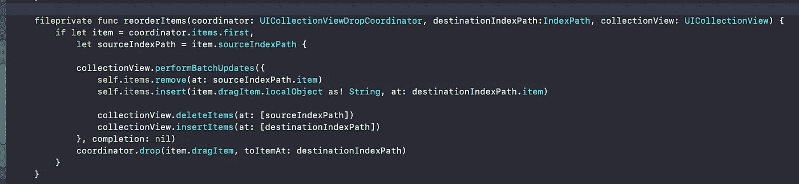

# 应用程序完成✅

如果你想第一个听说有限的免费课程优惠券(每月 10 张)，请随时订阅我的 [**每周开发内容电子邮件列表。**](https://www.maxcodes.io)

你现在知道如何；

*   **用 UICollectionView 的更好**
*   **使用 UICollectionViewDragDelegate**
*   **使用 UICollectionViewDropDelegate**
*   **阅读，但大多参考苹果文档更好**
*   **希望你已经意外地学会了一些其他的小事情，比如如果你还没有使用扩展的话，如何使用它们**

# 如果你还在迷茫！！！！！:) 👨‍💻🧐

你可以做两件事。

1.  [报名参加我的 UICollectionView 课程。我**讲解一下** **如何搭建这个 app** **从** **零到完成**，以及 **Pinterest 的布局！(Pinterest 的布局要复杂得多，我甚至不认为我会尝试写一篇关于它的文章。)**](http://bit.ly/collectionviewmedium)
2.  保存这篇文章，并继续参考它，直到你理解它。这正是我对其他概念和媒介文章所做的。不是开玩笑。我也希望你继续回到我的内容，*这里没有隐藏的计划…*

# 更多资源—高级指南。✅

如果这对你有帮助，看看我在 YouTube 上的视频，感受一下我是如何在视频上做事的。

如果你喜欢我的视频，也许你会喜欢我评分最高的 iOS 开发课程[。](https://www.udemy.com/ios11swift4todolist/?couponCode=MEDIUMBROS)

# 非常感谢您的阅读！

如果你喜欢这篇文章，请留下掌声，在我的社交账户上关注我。每条推文、youtube 订阅、medium clap 和 Instagram 评论都有助于我进一步帮助你完成这些文章和视频。

## [YouTube](http://youtube.com/maxcodes)

## [推特](http://twitter.com/maxcodes1)

谢谢，

[Max](http://instagram.com/maxcodes)