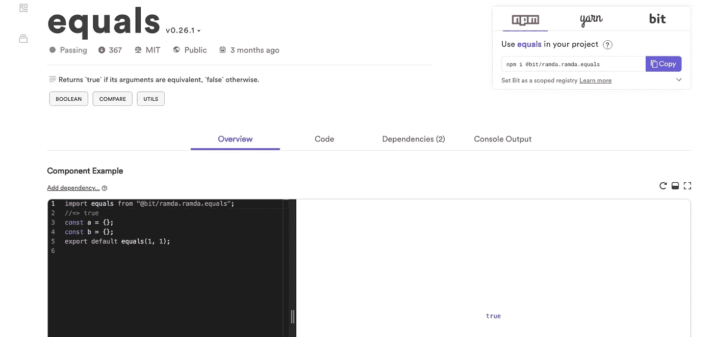
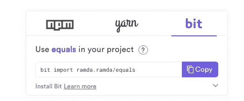

# 如何在 Node.js 中大规模轻松共享可重用模块

> 原文：<https://medium.com/hackernoon/how-to-easily-share-reusable-modules-in-node-js-at-scale-daaab9f0f41d>

## 如何在任何规模的应用程序、项目、服务和其他一切之间实际共享公共 JS 组件。


Source: [FreeCodeCamp](https://medium.freecodecamp.org/in-defense-of-hyper-modular-javascript-33934c79e113)

通过模块和组件共享公共 JS 代码对于创建可伸缩、稳定和可维护的代码库至关重要。也更快。

传统上，我们使用模块在不同的应用程序、项目和服务(或微服务)之间共享和重用公共 JS 代码。这是为了避免复制粘贴，众所周知，这将最终咬我们的…

相反，我们可以创建具有明确目的的自包含模块，这些模块可以在需要它们的项目之间重用和共享。每个都经过封装、独立测试和版本控制。每一个都是可重用的代码单元或代码组件。以完全管理的方式大规模共享它们，将使我们能够更快地构建更好、更易维护的软件。

# 关于包管理器和源代码控制

像 [NPM](https://github.com/npm/cli) 这样的包管理器传统上使我们能够通过它的在线数据库将模块作为包来发布和管理。

这很棒，因为它帮助我们将打包的项目作为一个模块安装在另一个项目中，而不必复制粘贴它。随着最近像 [Lerna](https://github.com/lerna/lerna) 这样的自动化，从一个项目中发布几个模块也变得更加容易。

但是…包管理器不管理源代码。结果，在您的源代码管理(SCM)控制系统和您共享的模块之间有一个间隙，随着您共享更多的模块，这开始变得令人痛苦。

最终，这些症状使得代码共享难以扩展。发布和管理 20 个模块都很难，更别说 200 个了。使用 Bit，我们可以跨服务管理超过 500 个共享的 JS 组件——没有耦合。以下是方法。

[**Bit**](https://bit.dev) 是一款[开源工具](https://github.com/teambit/bit)，它以一种集成到 **Git** 和 **NPM** 的方式将 SCM 和共享模块管理结合在一起，填补了这一空白。

使用 Bit，您可以非常快速地在 Node.js 项目和服务之间共享代码组件，同时获得对它们的依赖图的控制，并同步在不同项目中对它们的源代码所做的更改。

结果是即时和非常可扩展的代码共享，即使是最小的可重用模块，也能够进行更改并在任何地方同步它们。

[](https://github.com/teambit/bit) [## 团队位/位

### 与您的团队轻松共享项目间的代码。—团队位/位

github.com](https://github.com/teambit/bit) 

# 即时共享小模块作为可重用组件

Bit 让您可以将可重用的 JS 代码作为组件来“跟踪”。也就是说，您可以使用`bit add`命令将 Bit 指向项目中可重用的代码。然后，它将开始跟踪这些文件中的源代码，作为一个可重用的组件。它还允许您跨项目对其进行版本控制和管理，我们稍后会看到这一点。

> Bit 使用了一种半自动的依赖定义机制，这种机制节省了封装组件的大部分工作，使它们可以重用！

让我们以 [Ramda JS 实用程序库](https://github.com/ramda/ramda/tree/master/source)为例来看看。相同的工作流程适用于所有类型的 JS 应用程序、服务和项目。

[](https://github.com/ramda/ramda) [## 拉姆达/拉姆达

### ram:实用的函数式 Javascript。在 GitHub 上创建一个帐户，为 ramda/ramda 开发做贡献。

github.com](https://github.com/ramda/ramda) 

在这个例子中，Ramda 在`/source`目录中有超过 200 个可重用的函数。每一个都是我们希望跨项目共享的可重用模块。

```
.
├── package.json
├── source
│   ├── F.js
│   ├── T.js
│   ├── ...
│   ├── internal
│   │   ├── _Set.js
│   │   ├── ...
```

假设我们在代码库中开发了这个项目。我们可以安装 Bit，并用它来开始跟踪这些可重用的组件:

```
$ npm install bit-bin -g$ cd project-directory
$ bit init$ bit add source/*.js
tracking 256 new components
```

现在，Bit 遍历文件，为每个组件写依赖图，包括内部文件/组件和外部包。它使用这些信息来创建组件的独立表示，这种表示也可以在其他项目之间共享、使用和同步。

接下来，让我们运行一个快速的`bit status`命令来查看这个位跟踪了组件，并且它们已经准备好被版本化了:

```
$ bit status
new components
(use "bit tag --all [version]" to lock a version with all your changes) > call ... ok
     > complement ... ok
...
     > add ...  issues found
       untracked file dependencies (use "bit add <file>" to track untracked files as components):
          source/add.js -> source/internal/_curry2.js > add-index ...  issues found
       untracked file dependencies (use "bit add <file>" to track untracked files as components):
          source/addIndex.js -> source/internal/_concat.js, source/internal/_curry1.js
...
```

如我们所见，组件没有被正确跟踪。Bit 告诉我们这是因为组件需要一些位于`internals`目录的文件。我们再补充一点:

```
$ bit add source/internal/*.js --namespace internal
tracking 74 new components
```

太好了！现在，Bit 显示所有的组件都准备好进行版本控制和发布了:

```
$ bit status
new components
(use "bit tag --all [version]" to lock a version with all your changes) > add ... ok
     > add-index ... ok
...
```

太好了。我们现在有 256 个组件准备导出…但是我们如何编译/传输代码呢？嗯，Bit 使用预制的配置作为组件，您可以在项目级别重用，以使这变得容易。

我们只需要将一个[预制的编译器](https://bit.dev/bit/envs/compilers/babel)导入到项目中:

```
$ bit import bit.envs/compilers/babel --compiler
the following component environments were installed
- bit.envs/compilers/babel@0.0.20
```

现在我们可以对组件进行版本控制:

```
$ bit tag --all 0.9.6 --message "initial component version"
330 components tagged | 330 added, 0 changed, 0 auto-tagged
added components:  t@0.9.6, f@0.9.6, __@0.9.6, add@0.9.6, ...
```

就是这样！所有的组件现在都被跟踪，它们的依赖图被解析，被版本化，并准备好被导出和重用。让我们在 bit 的免费在线数据库和 UI 上快速建立一个远程工作空间。然后，让我们导出组件:

```
$ bit export <account-name>.<collection-name>
exported components to <account-name>.<collection-name>
```

就是这样！这是它的样子。每个组件都可以很容易地被发现，在一个热重装的在线游戏中玩，用 NPM/Yarn 安装，也可以用 Bit 直接导入——我们现在将深入探讨。


[https://bit.dev/ramda/ramda](https://bit.dev/ramda/ramda) — reusable JS component collection

# 在另一个项目中重用，同步更改



[https://bit.dev/ramda/ramda/equals](https://bit.dev/ramda/ramda/equals) — reusable JS component

因此，现在我们有了来自原始项目的所有可重用模块，这很好，因为我们能够在不重构任何东西或工作超过 15 分钟的情况下使数百个模块可重用。

我们可以用 Node.js 的包管理器安装这些模块，比如 NPM 和 Yarn，这意味着我们能够利用 Bit 的自动组件跟踪机制显著地扩展可重用模块的共享。

现在，让我们看看将 SCM 和可重用模块的管理结合在一起所带来的另一个伟大的新能力。使用`bit import`命令，我们可以将组件的源代码“复制”到一个新项目中，同时管理它的依赖图和源代码变更！

让我们看看“等于”部分:

[](https://bit.dev/ramda/ramda/equals) [## 等于-拉姆达位

### 如果其参数相等，则返回“真”，否则返回“假”。标签:布尔型、比较型、实用型。建造于…

bit.dev](https://bit.dev/ramda/ramda/equals) 

你可以看到左边的小安装面板，选择“位”。

[](http://How to Easily Share Reusable Modules in Node.js Node.js modules have been around for a long while. Traditionally, we use modules to share and reuse common JS code functionality between different applications, projects, and services (or micro-services). This is to avoid copy-pasting, which as we all know, will end up biting us in the… Instead, we can create self-contained modules with a clear purpose which can be reused and shared between the projects which need them. Each is encapsulated, independently tested and versioned. Each is a reusable code-unit or code components. Sharing them at scale in a fully-managed way, will enable us to build better, more maintainable software, and do it faster. On Package Managers and Source-Control Package managers like NPM have traditionally enabled us to publish and manage modules as packages through its online database. This is great since it helped us install a packed project as a module in another project, without having to copy-paste it. With recent automation like Lerna, it also became more comfortable to publish a few modules from one project. But… package managers do not manage source code. As a result, there's a gap between your source-code management (SCM) control system and your shared modules, which starts to become painful as you share more modules. Bit is an open source tool that brings together SCM and shared-module management in a way that integrates to both Git and NPM to fill the gap. Using Bit you can very quickly share code components between Node.js projects and services while gaining control over both their dependency graph and changes to their source code made in the different projects. The result is instant and very scalable code-sharing even for the smallest reusable modules, with the ability to make changes and sync them anywhere. teambit/bit Easily share code between projects with your team. - teambit/bitgithub.com Tracking JS code as components, making them reusable in a couple of minutes Bit lets you "track" reusable JS code as components. Meaning, you can use the bit add command to point Bit to the reusable code in your project. It will then start tracking the source-code in these files as a reusable component. It will also let you version and manage it across projects, we'll see that later. Bit uses a semi-automatic dependency definition mechanism, which saves up most of the work for encapsulating the component to make them reusable! Let's look at the Ramda JS utility library as an example. The same workflow applies to all kinds of JS apps, services and projects. ramda/ramda ram: Practical functional Javascript. Contribute to ramda/ramda development by creating an account on GitHub.github.com In this example, Ramda has over 200 reusable functions in the /source directory. Each is a reusable module we'd like to share across projects. . ├── package.json ├── source │   ├── F.js │   ├── T.js │   ├── ... │   ├── internal │   │   ├── _Set.js │   │   ├── ... Let's say we have this project developed in our codebase. We can install Bit, and use it to start tracking these reusable components: $ npm install bit-bin -g $ cd project-directory $ bit init $ bit add source/*.js tracking 256 new components Now, Bit goes through the files and writes the dependency graph for every component, for both internal files/components and external packages. It uses this information to create an isolated representation of the component, which can be shared, used and synced across other projects as well. Next, let's run a quick bit status command to see that Bit tracked the components and that they are ready to be versioned: $ bit status new components (use "bit tag --all [version]" to lock a version with all your changes)      > call ... ok      > complement ... ok ...      > add ...  issues found        untracked file dependencies (use "bit add <file>" to track untracked files as components):           source/add.js -> source/internal/_curry2.js      > add-index ...  issues found        untracked file dependencies (use "bit add <file>" to track untracked files as components):           source/addIndex.js -> source/internal/_concat.js, source/internal/_curry1.js ... As we can see, the components were not tracked properly. Bit tells us this is because the components need some files located at theinternals directory. Let's add that too: $ bit add source/internal/*.js --namespace internal tracking 74 new components Great! Now Bit shows that all the components are ready to be versioned and published: $ bit status new components (use "bit tag --all [version]" to lock a version with all your changes)      > add ... ok      > add-index ... ok ... Great. We now have 256 components ready to be exported… but how will we compile/transpile the code? Well, Bit used pre-made configurations as components you can reuse on the project level, to make this easy. We just need to import a pre-made compiler into the project: $ bit import bit.envs/compilers/babel --compiler the following component environments were installed - bit.envs/compilers/babel@0.0.20 And now we can version the components: $ bit tag --all 0.9.6 --message "initial component version" 330 components tagged | 330 added, 0 changed, 0 auto-tagged added components:  t@0.9.6, f@0.9.6, __@0.9.6, add@0.9.6, ... And that's it! All the components are now tracked, have their dependency graph resolved, versioned, and ready to be exported and reused. Let's quickly set up a remote workspace on bit.dev, Bit's free online databse and UI. Then let's export the components: $ bit export <account-name>.<collection-name> exported components to <account-name>.<collection-name> That's it! Here is how it looks. Each component can be easily discovered, played-with in an online playground with hot reloading, installed with NPM/Yarn, and also imported directly with Bit- which we will dive into now. https://bit.dev/ramda/ramda - reusable JS component collectionhttps://bit.dev/ramda/ramda/equals - reusable JS componentReusing in another project, syncing changes So now we have all the reusable modules from the original project available a bit.dev, which is great because we were able to make hundreds of modules reusable without refactoring anything or working for more than 15 minutes. We can install these modules with package managers for Node.js like NPM and Yarn, which means we were able to scale sharing of reusable modules dramatically leveraging Bit's automatic component tracking mechanism. Now, let's look at another great new ability we get from bringing SCM and management of reusable modules together. Using the bit import command, we can "duplicate" the source code of the component into a new project, while having both its dependency graph and source code changes managed! Let's look at the "equals" component: https://bit.dev/ramda/ramda/equals)

然后，将组件导入到项目中。

```
bit import ramda.ramda/equals
```

现在您可以对组件的实际源代码进行更改了！例如，当您希望避免服务之间的耦合时，或者当您希望从不同的 repo 对共享模块进行更改时，这是至关重要的。

一旦完成了代码的修改，你就可以用新的版本`tag`组件，并`export`它回到集合中。然后，您可以将新版本导入到原始回购协议(或其他回购协议)中，并使用`bit checkout`来合并更改！这就是共享模块的双向可伸缩和闪电般快速的代码重用。整洁，对不对？

```
$ bit checkout 1.0.1 equals successfully switched ramda.ramda/equals to version 1.0.1$ bit status 
modified components
  > ramda.ramda/equals... ok$ bit tag equals --patch $ bit export ramda.ramda
```

当您尝试将其与传统的包工作流(从发布包的开销到在任何地方进行更改并跨项目同步它们的能力)进行比较时，您会得到一个强大的解决方案，用于在共享组件和其他所有东西的粒度级别上增加代码重用。

欢迎在下面评论和提问，或者[跳出来试一试](https://bit.dev) …