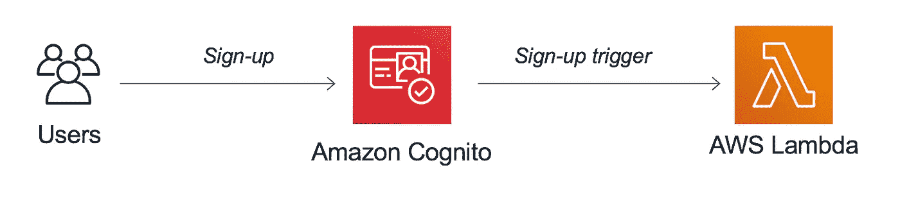
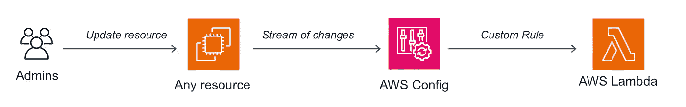
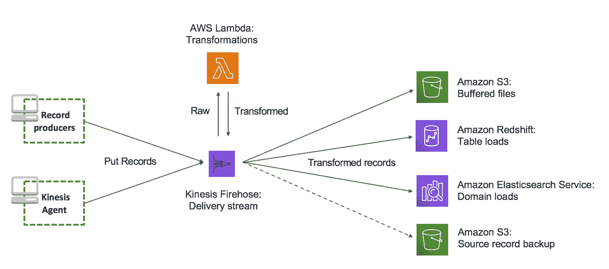
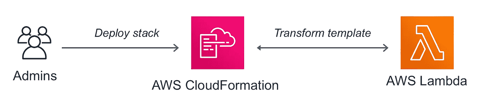

# 如何像专家一样 FaaS:在 AWS 上调用无服务器函数的 12 种不常用方法[第 1 部分]

> 原文：<https://medium.com/hackernoon/how-to-faas-like-a-pro-12-uncommon-ways-to-invoke-your-serverless-functions-on-aws-part-1-dca1078f0c80>

Yes, this is you at the end of this article, contemplating new possibilities! [Photo by [Joshua Earle](https://unsplash.com/photos/etsVKbvxhCc) on [Unsplash](https://unsplash.com)]

如果您想跳过下面的简短介绍，您可以通过这些快捷链接直接跳到前四个触发器:

1.  [亚马逊认知用户池](#42f2) —用户管理&定制工作流
2.  [AWS 配置](#1741) —事件驱动的配置检查
3.  [亚马逊 Kinesis 数据消防软管](#e008) —数据摄取&验证
4.  [AWS CloudFormation](#6835) — IaC，宏&自定义转换

## 先讲一点历史

当 AWS Lambda [于 2015 年 4 月 9 日正式发布时](https://aws.amazon.com/it/blogs/compute/aws-lambda-is-generally-available/)，它成为了第一个功能即服务，除了直接调用之外，只有几种方式可以触发您的功能:亚马逊 S3、亚马逊 Kinesis 和亚马逊社交网络。三个月后，我们获得了 Amazon API 网关支持，这为 web 和 REST 兼容的客户端开启了一个全新的浪潮。

到 2015 年底，你已经可以通过亚马逊 DynamoDB 流、Kinesis 流、S3 对象、SNS 主题和 CloudWatch 事件(预定调用)触发功能。

就我个人而言，我在 2016 年初左右开始用 AWS Lambda [做一个简单的机器学习用例](https://aws.amazon.com/it/blogs/aws/machine-learning-recommendation-systems-and-data-analysis-at-cloud-academy/)的实验。几个月后，我发布了第一个关于我 Lambda 体验的视频，其中涵盖了当时所有可用的触发器和配置；嗯，视频仍然可以在这里[获得](https://www.youtube.com/watch?v=NhGEik26324)，但是 AWS 控制台现在已经非常不同了，所以我建议你只有在怀旧的时候才观看它=)

**回到历史…**

在接下来的几个月里，AWS Lambda 变得非常受欢迎，许多其他 AWS 服务开始集成它，并允许您以许多新的方式触发功能。这些集成非常适合处理/验证数据，以及定制和扩展这些服务的行为。

你可能已经意识到(或者凭直觉猜测)AWS Lambda 是如何与诸如 [S3](https://docs.aws.amazon.com/en_us/lambda/latest/dg/invoking-lambda-function.html#supported-event-source-s3) 、 [DynamoDB](https://docs.aws.amazon.com/en_us/lambda/latest/dg/invoking-lambda-function.html#supported-event-source-dynamo-db) 、 [Kinesis 数据流](https://docs.aws.amazon.com/en_us/lambda/latest/dg/invoking-lambda-function.html#supported-event-source-kinesis-streams)、 [SES](https://docs.aws.amazon.com/en_us/lambda/latest/dg/invoking-lambda-function.html#supported-event-source-ses) 、 [SQS](https://docs.aws.amazon.com/en_us/lambda/latest/dg/invoking-lambda-function.html#supported-event-source-sqs) 、[物联网核心](https://docs.aws.amazon.com/en_us/iot/latest/developerguide/iot-lambda-rule.html)、[步骤功能](https://docs.aws.amazon.com/en_us/step-functions/latest/dg/connectors-lambda.html)和 [ALB](https://docs.aws.amazon.com/en_us/lambda/latest/dg/services-alb.html) 等服务集成的。有大量的文章和入门指南将这些集成作为无服务器之旅的良好起点。

在本文中，我想与您分享一些其他不太常见、不太为人所知、甚至是更新的在 AWS 上调用 Lambda 函数的方法。其中一些集成甚至没有出现在官方的[支持的事件源](https://docs.aws.amazon.com/en_us/lambda/latest/dg/invoking-lambda-function.html)文档页面上，我相信它们值得一提和尝试。

对于每个服务/集成，我将分享有用的链接、代码片段和云信息模板和参考。如果您认为缺少了什么，或者您需要更多的资源/细节，请随时在下面添加评论。即使你不懂 Python 或 JavaScript，代码也是不言自明的，并带有有用的注释。如果你有问题或疑问，请在本文底部发表评论。

让我们从 AWS Lambda 的前 4 个触发器开始。

# 1.Amazon Cognito 用户池(自定义工作流)

[Cognito 用户池](https://aws.amazon.com/cognito/)允许您将**认证和用户管理**添加到您的应用程序中。借助 AWS Lambda，您可以[定制您的用户池工作流](https://docs.aws.amazon.com/en_us/cognito/latest/developerguide/cognito-user-identity-pools-working-with-aws-lambda-triggers.html)并在 Cognito 运行期间触发您的功能，以便定制您的用户池行为。

以下是可用触发器的列表:

*   **预注册** —在 Cognito 注册新用户(或管理员)之前触发，允许您执行自定义验证以接受/拒绝
*   **发布确认** —在新用户(或管理员)注册后触发，允许您发送自定义消息或添加自定义逻辑
*   **预认证** —当用户尝试登录并允许自定义验证接受/拒绝时触发
*   **认证后** —在用户登录后触发，允许您在认证后添加自定义逻辑
*   **自定义认证** —当您使用[自定义认证流程](https://docs.aws.amazon.com/en_us/cognito/latest/developerguide/amazon-cognito-user-pools-authentication-flow.html#amazon-cognito-user-pools-custom-authentication-flow)时触发定义、创建和验证自定义质询
*   **预令牌生成** —在每次令牌生成之前触发，允许您自定义身份令牌声明(例如，新密码和刷新令牌)
*   **迁移用户** —当用户在使用密码登录时不在用户池中或在忘记密码流中时触发
*   **自定义消息** —在发送电子邮件、电话验证消息或 MFA 代码之前触发，允许您自定义消息

所有这些触发器都允许您实现无状态逻辑，并使用您喜欢的编程语言个性化 Cognito 用户池的工作方式。请记住，您的函数是同步调用的，需要在 5 秒钟内完成，只需返回带有附加的`response`属性的传入的`event`对象。

从同一个 Lambda 函数处理多个事件可能会很方便，因为 Cognito 总是会提供一个名为`event.triggerSource`的属性来帮助你为每个事件实现正确的逻辑。

例如，下面是如何在 Node.js 中为一个`Custom Message`实现 Lambda 函数代码:

正如您所看到的，逻辑是完全无状态的，最好的做法是总是检查`triggerSource`值，以确保您正在处理正确的事件——并最终在未处理的源的情况下引发错误/警告。

下面的代码片段展示了如何在 CloudFormation 模板中定义 Lambda 函数和 Cognito 用户池(这里我使用的是 [AWS SAM](https://github.com/awslabs/serverless-application-model) 语法，但是您也可以使用普通的 CloudFormation):

您所需要做的就是向您的用户池定义添加一个`LambdaConfig`属性，并引用一个 Lambda 函数。

你可以在[文档页面](https://docs.aws.amazon.com/en_us/AWSCloudFormation/latest/UserGuide/aws-properties-cognito-userpool-lambdaconfig.html)找到`LambdaConfig`的所有属性。

# 2.AWS 配置(事件驱动的配置检查)

[AWS 配置](https://aws.amazon.com/config/)允许您跟踪 AWS 资源的配置如何随时间变化。它对记录历史值特别有用，还允许您将历史配置与所需配置进行比较。例如，您可以使用 AWS Config 来确保您的帐户中启动的所有 EC2 实例都是`t2.micro`。

作为一名开发人员，有趣的是您可以用 AWS Lambda 实现这种符合性检查。换句话说，您可以定义一个定制规则，并将其与**一个 Lambda 函数相关联，该函数将在响应每一个配置更改**时被调用(或者定期调用)。

此外，您的代码可以决定新配置是否有效:)

当然，你不必监听你所有资源的每一个可能的配置变化。事实上，**您可以根据以下内容收听特定资源**:

*   **标签**(例如，带有环境或项目特定标签的资源)
*   **资源类型**(例如，仅`AWS::EC2::Instance`)
*   **资源类型+标识符**(例如，一个特定的 EC2 实例 ARN)
*   所有**变化**

有很多 AWS Lambda 蓝图可以让你快速入门，而不需要自己编码所有东西(比如`config-rule-change-triggered`)。但我认为理解整体逻辑和移动部分很重要，所以在接下来的几段中我们将深入学习如何从头开始编写一个新的 Lambda 函数。

实际上，您的函数将接收四条非常重要的信息作为输入`event`的一部分:

*   `invokingEvent`表示触发此 Lambda 调用的配置更改；它包含一个名为`messageType`的字段，告诉您当前的有效负载是否与定期调度的调用相关(`ScheduledNotification`)，是否是常规的配置更改(`ConfigurationItemChangeNotification`)，或者更改内容是否太大而无法包含在 Lambda 事件有效负载中(`OversizedConfigurationItemChangeNotification`)；在第一种情况下，`invokingEvent`还将包含一个名为`configurationItem`的当前配置字段，而在其他情况下，我们将需要通过 AWS 配置历史 API 获取当前配置
*   `ruleParameters`是创建自定义规则时可选定义的键/值对的集合；它们代表您的配置的(不)理想状态(例如，`desiredInstanceType=t2.small`)，您可以随意使用它的值；假设这是参数化 Lambda 函数代码并在多个规则中重用它的聪明方法
*   `resultToken`是我们将在通知 AWS Config 配置评估结果时使用的令牌(参见下面三种可能的结果)
*   `eventLeftScope`告诉您要评估的 AWS 资源是否已经从规则范围中删除，在这种情况下，我们将跳过评估

基于上面的输入，我们的 lambda 函数将评估配置合规性，它将能够调用具有三种可能结果的`PutEvaluations` API:

*   `COMPLIANT`如果当前配置*正常*
*   `NON_COMPLIANT`如果当前配置*不正常*
*   `NOT_APPLICABLE`如果这种配置变化可以忽略

好了，理论够了:)

让我们编写一些代码，看看 AWS 配置的运行情况。

例如，让我们实现一个定制规则来检查在我们的帐户中启动的所有 EC2 实例都是使用 Node.js 的`t2.small`:

在上面的代码片段中，我导入了一个简单的实用模块([，你可以在这里找到](https://gist.github.com/alexcasalboni/60a3b45017ad3d44f052c2dd3c1661e4))，以使整体逻辑更具可读性。

大多数神奇的事情发生在名为`evaluateChangeNotificationCompliance`的 JavaScript 函数中。它的逻辑是基于`ruleParameters`和`desiredInstanceType`的值进行参数化的——我们将在下面的 CloudFormation 模板中定义——以便我们可以为不同的规则重用相同的 Lambda 函数。

现在，让我们在 CloudFormation 中定义我们的 AWS 配置自定义规则和 Lambda 函数:

定义自定义规则相当直观。在`Scope`属性中，我只选择了`AWS::EC2::Instance`资源，并将`t2.small`作为自定义规则的输入参数进行传递。然后，我定义了`Source`属性并引用了我的 Lambda 函数。

您可以在这里找到关于 AWS 配置自定义规则的完整文档，其中有关于预定规则、标签过滤等的良好参考。

# 3.亚马逊 Kinesis 数据消防软管(数据验证)

[Kinesis Data Firehose](https://aws.amazon.com/kinesis/data-firehose/) 允许您将流数据导入标准目的地进行分析，如亚马逊 S3、亚马逊红移、亚马逊弹性搜索服务和 Splunk。

您可以让多个数据生产者`PutRecords`进入您的交付流。Kinesis Firehose **将负责缓冲、压缩、加密，甚至可选地重塑和优化您的数据**以提高查询性能(例如，以拼花列格式)。

此外，您可以将 Lambda 函数附加到交付流。该功能将能够在 Kinesis Firehose 继续之前[验证、操作或丰富输入记录](https://docs.aws.amazon.com/en_us/firehose/latest/dev/data-transformation.html)。

(Optionally, you might have API Gateway or CloudFront in front of Kinesis Firehose for RESTful data ingestion)

您的 Lambda 函数将接收**一批记录**，并将需要返回带有附加`result`字段的相同记录列表，该字段的值可以是以下值之一:

*   `Ok`如果记录已成功处理/验证
*   `Dropped`如果记录不需要存储(消防软管将跳过它)
*   `ProcessingFailed`如果记录无效或在处理/操作过程中出错

现在让我们用 Python 实现一个通用的、可重用的验证和操作逻辑:

上面的代码片段是结构化的，因此您只需要实现自己的`transform_data`逻辑。在这里，您可以添加新的字段，操作现有的字段，或者通过引发一个`DroppedRecordException`来决定跳过/删除当前记录。

值得一提的几个实现细节:

*   传入和传出的记录都必须是 **base64 编码的**(上面的代码片段已经解决了这个问题)
*   我假设传入的记录是 JSON 格式的，但是您也可以接收 CSV 数据，甚至是您自己定制的格式；只要确保正确地序列化记录，因为 Kinesis Firehose 总是希望使用普通字符串
*   我在每个编码记录后添加了一个尾随的`\n`字符，这样 Kinesis Firehose 将在交付目的地的每行序列化一个 JSON 对象(这是亚马逊 S3 和雅典娜正确工作所必需的)

当然，您可以在 AWS Lambda 支持的任何编程语言中实现自己的数据操作逻辑，在一些更高级的用例中，您可能需要从 Amazon DynamoDB 或其他数据源获取额外的数据。

现在让我们定义 CloudFormation 中的数据摄取应用程序。

您可以通过定义`ProcessingConfiguration`属性将 Lambda 函数附加到 Kinesis Firehose 交付流。

除此之外，让我们设置 Firehose，每 60 秒(或者一旦 **10MB 被收集**)**用 GZIP** 压缩，将传入的记录传送到亚马逊 S3 **。我们还需要一个专门的 IAM 角色来为 Firehose 定义细粒度的权限，以调用我们的 Lambda 并写入 S3。**

以下是完整的 CloudFormation 模板供您参考:

在我看来，这种架构最好的一点是，它是 100%无服务器的，如果没有数据被接收，你不会被收费。因此，它允许您拥有多个 24x7 全天候的开发和测试环境，而且几乎不需要任何成本。

你可以在这里找到完整的云信息文档。此外，你还会在这里找到[一个端到端的管道，包括 Amazon API Gateway 和 Amazon Athena](https://github.com/alexcasalboni/serverless-data-pipeline-sam)。

# 4.自动气象站云形成(宏)

到目前为止，我们已经在本文中看到了许多 [CloudFormation](https://aws.amazon.com/cloudformation/) 模板。这就是在 JSON 或 YAML 模板中定义应用程序和资源的方式。CloudFormation 允许您将同一个堆栈部署到多个 AWS 帐户、区域或环境，如`dev`和`prod`。

几个月前——2018 年 9 月——AWS 宣布了一项名为 Macros 的新云形成功能。

CloudFormation 带有内置转换，如`AWS::Include`和`AWS::Serverless`，它们通过压缩资源定义表达式和支持组件重用来简化模板创作。这些转换在部署时应用于您的 CloudFormation 模板。

类似地， [CloudFormation 宏](https://docs.aws.amazon.com/en_us/AWSCloudFormation/latest/UserGuide/template-macros.html)是由您自己的 Lambda 函数支持的**自定义转换**。

创建和使用宏有三个主要步骤:

1.  创建一个 Lambda 函数来处理原始模板
2.  定义一个`AWS::CloudFormation::Macro`类型的资源(这里的[资源引用](https://docs.aws.amazon.com/en_us/AWSCloudFormation/latest/UserGuide/aws-resource-cloudformation-macro.html))，将它映射到上面的 Lambda 函数，并部署堆栈
3.  在 CloudFormation 模板中使用宏

宏特别强大，因为您可以使用`Transform`属性将它们应用于整个 CloudFormation 模板，或者使用固有的 [Fn::Transform 函数](https://docs.aws.amazon.com/en_us/AWSCloudFormation/latest/UserGuide/intrinsic-function-reference-transform.html)将它们应用于一个子部分，可选地使用参数。

例如，您可以定义一个宏，将一个简单的资源`MyCompany::StaticWebsite`扩展成一组适当的资源和相应的默认值，包括 S3 桶、CloudFront 分发、IAM 角色、CloudWatch 警报等。

记住只能在创建宏的帐户中使用宏，并且宏名在给定的帐户中必须是唯一的，这一点也很有用。如果启用对处理函数的跨帐户访问，则可以在多个帐户中定义同一个宏，以便于重用。

## 如何实现 CloudFormation 宏

现在让我们关注执行模板处理的 Lambda 函数的实现细节。

当您的函数被调用时，它将接收以下内容作为输入:

*   `region`是宏所在的区域
*   `accountID`是调用该函数的账户的账户 ID
*   `fragment`模板中可用于 JSON 格式处理的部分(可以是整个模板，也可以是它的一个子部分)，包括兄弟模板
*   `params`仅当您正在处理模板的子部分，并且它包含目标堆栈提供的自定义参数(未评估)时可用
*   `templateParameterValues`包含目标堆栈的模板参数(已经评估)
*   `requestId`是当前函数调用的 ID(仅用于匹配响应)

一旦处理逻辑完成，Lambda 函数将需要返回以下三个属性:

*   `requestId`必须与作为输入提供的相同请求 ID 相匹配
*   `status`应该设置为字符串`"success"`(其他任何内容都将被视为处理失败)
*   `fragment`是已处理的模板，包括兄弟姐妹

有趣的是，在某些情况下，处理过的`fragment`将与您作为输入接收到的`fragment`相同。

我可以想到四种可能的操纵/处理场景:

1.  您的函数处理一些资源，**定制它们的属性**(不添加或删除其他资源)
2.  您的函数**通过创建新的资源**来扩展输入片段
3.  您的函数**将一些资源**——可能是您自己的定制类型——替换为其他真实的 CloudFormation 资源(注意:这也是 AWS SAM 所做的！)
4.  您的函数不会改变输入片段，但是如果出现错误或者缺少(例如，如果加密被禁用或者被授予的权限过于开放)，那么**就会故意失败**

当然，您的宏可能是以下四种情况的混合。

在我看来，*场景(4* )特别强大，因为相对于我们在本文开头讨论的 AWS 配置解决方案，它允许您在实际部署和供应资源之前**实现定制配置检查**。

*场景(3)* 可能是最常用的，因为它允许您定义自己的个性化资源，如`MyCompany::StaticWebsite`(使用 S3 桶、CloudFront 发行版或 Amplify 控制台应用程序)或`MyCompany::DynamoDB::Table`(启用自动缩放、按需容量，甚至是主键和索引的复杂共享配置)等。

一些更复杂的宏混合使用了无状态处理和由附加 Lambda 函数支持的 [CloudFormation 定制资源](https://docs.aws.amazon.com/en_us/AWSCloudFormation/latest/UserGuide/template-custom-resources.html)。

[在这里，您可以找到 CloudFormation 宏](https://github.com/awslabs/aws-cloudformation-templates/tree/master/aws/services/CloudFormation/MacrosExamples)的实际实现示例、相应的宏模板以及一些示例模板。我相信你会特别喜欢下面的宏:`AWS::S3::Object`、`Count`、`StackMetrics`、`StringFunctions`等等！

## 如何部署云形成宏

一旦实现了处理函数，就可以用它来部署一个新宏。

以下是定义新宏资源的方法:

就是这样！

每当我们在 CloudFormation 模板中引用名为`MyUniqueMacroName`的宏时，AWS CloudFormation 都会调用处理函数。

## 如何使用云形成宏

对于大多数开发人员来说，使用宏是最有可能的情况。

很常见的是，宏由您的组织或另一个团队拥有和管理，您只需在您的 CloudFormation 模板中使用/引用一个宏。

下面是如何使用上面定义的宏并将其应用于整个模板:

如果您想将同一个宏仅应用于模板的一个子部分，您可以通过使用`Fn::Transform`内在函数来实现:

让我知道你将构建什么样的 CloudFormation 宏，以及它们为你的团队解决了什么样的挑战！

# 结论

第 1 部分到此为止:)

我希望你已经了解了一些关于[亚马逊认知](https://aws.amazon.com/cognito/)、 [AWS 配置](https://aws.amazon.com/config/)、[亚马逊 Kinesis 数据消防软管](https://aws.amazon.com/kinesis/data-firehose/)和[亚马逊云信息](https://aws.amazon.com/cloudformation/)的新知识。

现在，您可以定制您的 Cognito 用户池工作流，实时验证您的配置，在 Kinesis 将数据交付到目的地之前处理和验证数据，并实施宏来丰富您的 CloudFormation 模板。

在本系列的下两部分中，我们将了解更多关于服务的其他不太常见的 Lambda 集成，如 AWS IoT 1-Click、Amazon Lex、Amazon CloudWatch Logs、AWS CodeDeploy 和 Amazon Aurora。

感谢您花时间阅读这么长的文章。
欢迎在下面分享和/或发表评论。