# 如何像专家一样 FaaS:在 AWS 上调用无服务器函数的 12 种不常用方法[第 2 部分]

> 原文：<https://medium.com/hackernoon/how-to-faas-like-a-pro-12-uncommon-ways-to-invoke-your-serverless-functions-on-aws-part-2-78a5f09a773d>

I was told my articles contain too much code & I had to make it sweeter [Photo by [Valerian KOo](https://unsplash.com/photos/2N0enFKzDe8) on [Unsplash](https://unsplash.com/)]

几周前，我分享了本系列的第一部分，其中我深入分析了一些不太常见的调用 AWS Lambda 的方法，如 *Cognito 用户池*、 *AWS 配置*、*亚马逊 Kinesis 数据消防软管*和 *AWS CloudFormation* 。你可以[在这里](https://hackernoon.com/how-to-faas-like-a-pro-12-uncommon-ways-to-invoke-your-serverless-functions-on-aws-part-1-dca1078f0c80)找到【第一部分】！

在第二部分，我将描述另外四个:

5. [AWS 物联网按钮](#2ec5) —一键式处理程序
6。[亚马逊 Lex](#4095) —履行活动
7。[亚马逊 CloudWatch 日志](#1a14) —订阅
8。[亚马逊极光](#1384) —触发器和外部数据

# 5.AWS 物联网按钮(一键式)

从 2018 年初开始，你可以从简单的物联网设备中触发 Lambda 功能，一键完成。我们称之为 [AWS 物联网 1-Click](https://aws.amazon.com/iot-1-click/) 。

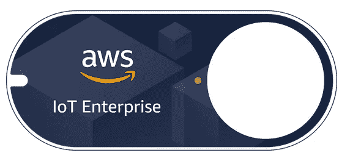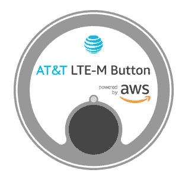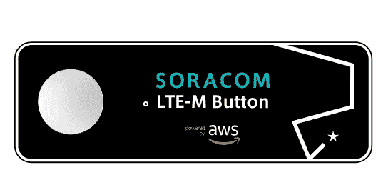

AWS IoT Enterprise Button ([link](https://www.amazon.com/dp/B075FPHHGG)), AT&T LTE-M Button ([link](https://marketplace.att.com/products/att-lte-m-button)), and SORACOM LTE-M Button ([link](https://soracom.jp/products/gadgets/aws_button/)).

你需要的只是上面的一个物联网按钮和几行你最喜欢的编程语言代码来实现一个 Lambda 操作。

当然，这些设备使用 TLS 加密出站数据，并通过 API 与 AWS 通信以调用您的函数。

一旦你在 [AWS 控制台](https://console.aws.amazon.com/iot1click/)或通过[移动应用](https://docs.aws.amazon.com/iot-1-click/latest/developerguide/1click-mobile-app.html)认领了你的设备，它们就会出现在你的 AWS 控制台上，你可以将它们的点击事件映射到一个特定的动作。

有三种可能的操作类型:

*   **发送手机短信** —用于配置电话号码和信息
*   **发送电子邮件** —您可以配置电子邮件地址、主题和正文
*   **触发 Lambda 函数** —允许您在任何区域选择 Lambda 函数

此外，您可以为每个部署的设备配置自定义属性(类似于标记)。

请注意，短信和电子邮件是 AWS 作为内置选项提供的两个非常常见的场景，但在引擎盖下总会有一个 Lambda 函数实现点击逻辑(在这两种情况下，使用 [Amazon SNS](https://aws.amazon.com/sns/) 来传递消息)。

如果你需要比短信或电子邮件更复杂的东西，你可以用 AWS Lambda 实现你自己的逻辑。例如，您可能想要调用第三方 API，发送由 [Amazon Polly](https://aws.amazon.com/polly/) 呈现的语音消息，或者只是在 Amazon DynamoDB 上存储一个新项目。

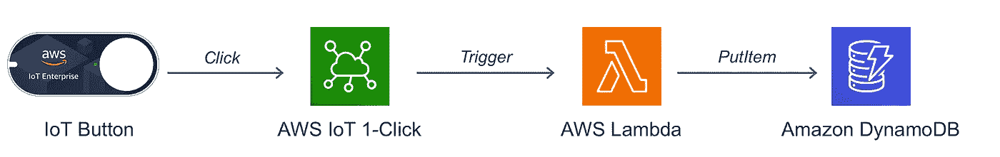

在我们开始编码之前，让我们提几个重要的细节:

*   我们的 Lambda 函数将接收两种类型的事件:`buttonClicked`和`deviceHealthMonitor`
*   输入事件总是包含关于设备的有用信息，如 ID、自定义属性、剩余寿命等。
*   对于`buttonClicked`事件，我们接收两条额外的信息:`clickType` ( ***SINGLE*** 、 ***DOUBLE*** 或 ***LONG*** )和`reportedTime`(一个 ISO 格式的日期)。这个想法是，我们可能希望为单击、双击和长时间单击实现不同的行为。或者，我们可以简单地忽略一些点击类型，或者甚至将它们视为普通的点击事件
*   可以想象，当健康参数低于给定阈值时，`deviceHealthMonitor`事件被触发；它们允许您在设备预期寿命过低时采取适当的措施

这是典型的点击事件的样子:

现在让我们实现一个简单的 Lambda 函数，它将在单击时向 DynamoDB 中存储一个新的(每日)项目，并在双击时删除它。

因为我们可能希望在其他计算平台上运行相同的业务逻辑——比如 EC2 实例、ECS 容器，甚至 Kubernetes——这里有一个用 Python 实现的**平台无关的实现:**

在上面的代码片段中，我定义了一个新的`ClickHandler`类，它抽象了具体的`DailyClickHandle`类的一些细节。它的构造函数将接收`buttonClicked`事件作为输入。一旦我们创建了一个新的`DailyClickHandler`对象，我们就可以调用它的`run()`方法来为单击、双击或长时间单击执行正确的逻辑。

我正在单击创建一个新的 DynamoDB 项目，使用当前日期作为主键，并存储最近报告的时间。双击我正在删除同一个日常项目。
***注意:*** 我不是*而是*跟踪这个简单用例的每日点击次数，但这对你来说是一个很好的改进和有用的练习——如果你设法实现了它并分享了你的结果，请告诉我！

因为我已经将主要的业务逻辑封装到一个独立的类/模块中，所以我的 Lambda 处理程序将非常简单，只是一个简单的适配器:

上面的 Lambda 处理程序将检查当前事件是健康检查还是实际的点击。如果是实际的点击，它将创建一个新的`DailyClickHandler`对象并调用它的`run()`方法。

在我们可以部署一切之前，下一步是定义我们的 CloudFormation 模板( [IaC](https://en.wikipedia.org/wiki/Infrastructure_as_code) )。

我们需要定义一个新的`AWS::IoT1Click::Project`资源，并将它的`onClickCallback`属性映射到我们的 Lambda 函数(这里的[full cloud formation reference](https://docs.aws.amazon.com/AWSCloudFormation/latest/UserGuide/aws-resource-iot1click-project.html)):

请注意，上面的 CloudFormation 模板将创建一个新的物联网一键式项目及其配置，但您仍然需要手动(在 AWS 控制台上)或通过`UpdateProject` API 将您的物联网设备添加到项目中。

如果您想将这个示例代码作为您自己项目的起点，也许您可以通过*在 DynamoDB* 上存储一个每小时/每周的项目来跟踪每小时或每周的任务(而不是每天)。或者你可以扩展 Lambda 函数来*开始一个新的代码管道部署*(你不是一直想要一个物理的“ ***部署按钮*** ”放在你的桌子上吗？).

让我知道你将用 AWS 物联网 1-Click 构建什么！

# 6.亚马逊 Lex(履行活动)

亚马逊 Lex 允许你建立聊天机器人和对话界面，使用与 Alexa 相同的技术。

Lex 支持语音和文本 I/O，并且具有高级自然语言理解(NLU)能力。这些功能帮助您从对话中提取并存储正确的信息，这样您就可以将时间集中在改进界面本身上，而不是将时间和精力浪费在边缘情况、输入解析和错误处理上。

一旦 Lex 从对话中收集了你需要的所有信息，你就可以**配置你的机器人调用一个 Lambda 函数来满足用户的意图**，这可能是像创建一个酒店预订，重新安排约会，请求某个给定主题的帮助等等。

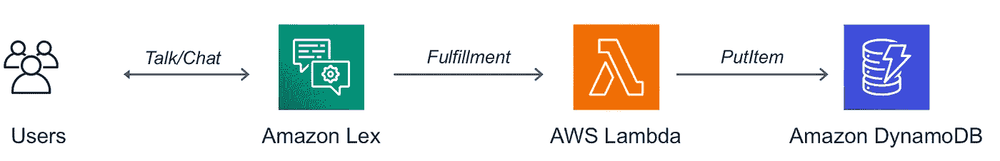

为了理解如何将 Lambda 与 Lex 集成，我们需要理解几个重要的概念:

*   **意图** —您的机器人可以执行的不同动作/目标(例如，“*预订酒店*”、“*租车*”、“*重新安排约会*”等)。)
*   **Slots** —您的机器人将在对话期间收集的单个信息/字段(例如，“*位置*”、“*到达日期*”、“*汽车类型*”等)。)—一些插槽具有内置类型，如城市、日期、电话号码、体育、工作角色等。您还可以定义自己的自定义插槽类型
*   **示例话语** —关于用户可能如何传达意图的典型句子和提示，潜在地通过一起提供时段值(例如，“*在{Location}* 预订酒店房间”或“*在{Location}* 预订酒店房间{N}晚”)
*   **频道**——只需点击几下就能整合 Lex 的信息平台，如 *Facebook Messenger* 、 *Slack* 、 *Kik* 和 *Twilio SMS*

将 Lamdba 与 Lex 集成有两种主要方式:

*   **输入初始化&验证** —它允许您在 Lex 收集每个槽值后立即对其进行验证，并最终提示一条“*无效值消息*”以请求不同的值
*   **履行活动** —它让您处理收集的值并继续实际的业务逻辑

由于您经常希望在执行之前重新验证您的输入，许多开发人员喜欢实现一个 Lambda 函数来处理验证和执行。在一些特定的场景中——例如，如果你有可选的插槽或者非常重的验证逻辑——你可能想要实现两个独立的 Lambda 函数。

现在让我们假设我们正在实现一个***book hotel***intent，我们想要实现两个独立的 Lambda 函数用于数据验证和实现。以下是我们将在对话中收集的时段:

*   我们需要酒店的城市
*   `CheckInDate` —我们入住酒店的日期
*   `Nights` —我们将在酒店住几晚
*   `RoomType` —自定义槽位，具有*皇后*、*国王*、*豪华*等值。

在真实的用例中，我们需要确保收集的四个槽在语义上是有效的。例如，`Location`需要是我们预订系统支持的城市；`CheckInDate`一定是未来；`Nights`的数量必须大于零(也可能小于最大允许数量？);`RoomType`需要是我们的预订系统支持的有效类型；诸如此类。

在下面的代码片段中，我用 Python 实现了`BookHotel`意图。因为我希望您关注核心业务逻辑，所以我已经将大部分“枯燥”的验证逻辑和实用程序转移到了可重用的外部模块中([您可以在这里找到这三个文件](https://gist.github.com/alexcasalboni/3ea2d8dda11c6b73bbf98adf2dd6a214))。

正如您在上面的代码片段中看到的，Lambda 处理程序本身只是一个简单的用于`book_hotel`业务逻辑的包装器/适配器。在这种情况下，我们用一个函数同时处理单个插槽验证和最终履行。

主要的逻辑看起来是这样的:加载会话数据(这在输入`event`中给出)，验证单个槽，如果缺少/无效数据，则引出槽，将下一步委托给 Lex，直到我们达到最终实现。然后，我们最终可以通过我们的后端或第三方 API 预订酒店。

完整的代码片段可在[这里](https://gist.github.com/alexcasalboni/3ea2d8dda11c6b73bbf98adf2dd6a214)获得，它实际上是对`lex-book-trip-python` Lambda 蓝图的重构，您可以在 AWS 控制台中找到:

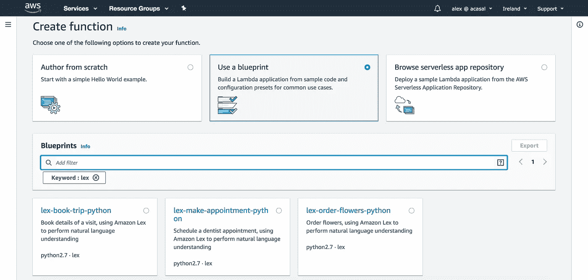

一旦您部署了这个 Lambda 函数，您就可以直接在 Lex 控制台中将它用作您的 bot 的验证代码挂钩和实现，如下面的屏幕截图所示:

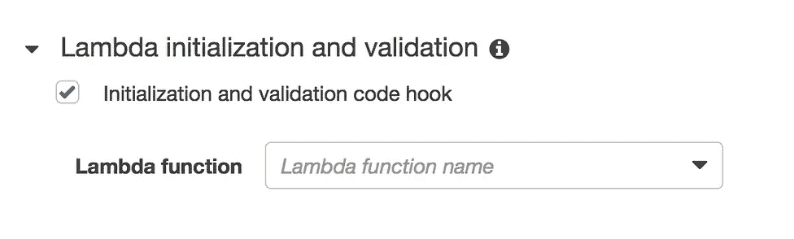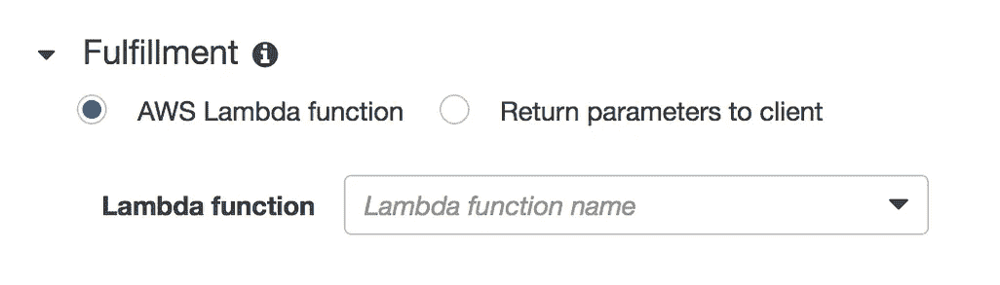

不幸的是，CloudFormation 还不支持 Amazon Lex，但是[在这里您可以找到一组 CloudFormation 模板，它们将使用自定义资源](https://github.com/aws-samples/aws-lex-web-ui/tree/master/templates)部署 Lex bot。

# 7.亚马逊云观察日志(订阅)

每当你操作`print`或者`console.log`什么的时候，你都会在 CloudWatch 日志上找到相应的日志。同样的情况也发生在 30 多个可以原生发布日志到 CloudWatch 的服务上，包括*亚马逊 Route 53* 、*亚马逊 VPC* 、*亚马逊 API 网关*、 *AWS CloudTrail* 等。
更不用说那些使用 [CloudWatch 代理](https://docs.aws.amazon.com/AmazonCloudWatch/latest/logs/QuickStartEC2Instance.html)将日志发布到 CloudWatch 的本地服务器了。

但这并不是 CloudWatch 上榜的原因。

还可以使用 CloudWatch 日志作为 Lambda 的事件源。事实上，CloudWatch 允许您在日志组上定义过滤订阅，并实现自己的 Lambda 函数来处理这些日志。

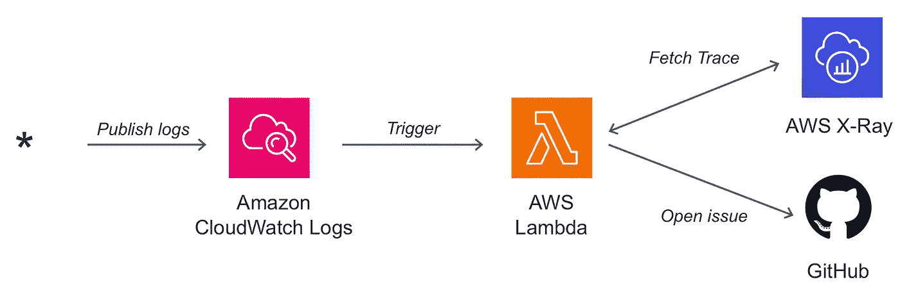

例如，您可能想要处理由 Amazon EC2 实例生成的所有(经过过滤的)日志，并将这些日志与来自 AWS X-Ray 的相应跟踪相关联。最后，您可以将处理后的信息存储在亚马逊 S3 上，也许可以发送一份电子邮件报告，或者甚至在 GitHub 上打开一个新问题，其中包含调试问题所需的所有信息。

让我们看看 CloudWatch 日志事件的结构:

嗯，在我们`base64-decode`和`unzip`收到数据之前，我们看不到太多。好消息是，您可以使用大多数运行时的内置库来实现这一点，包括 Node.js 和 Python。

解码后，CloudWatch Logs 负载将类似于以下对象:

有效负载包含一些关于事件本身的元数据，比如相应的`logStream`、`logGroup`和`subscriptionFilters`的名称。

您想要处理的实际有效负载是列表`logEvents`，每个列表都有其`id`、`timestamp`和`message`。请注意，根据您定义的订阅过滤器，您可能只会收到与给定流程/任务/功能执行相对应的日志的子集。这就是为什么您可能希望从同一个日志流中获取额外的信息，特别是在您过滤错误或异常以便以后调试它们的时候。

以下代码片段是 Python 中的一个示例实现:

上面代码片段的一些注释:

1.  假设您已经用我们在本文前面看到的`decode`函数创建了一个`decode.py`文件
2.  代码休眠 5 秒钟，等待所有日志被收集到相应的流中；这样，我们可以在这场比赛前后收集更多的日志
3.  我们可以实现一个`fetch_traces`函数来获取基于某种请求 Id 的 X 射线追踪(这是为 Lambda 函数执行日志自动添加的，但是您可以在自己的定制日志中使用不同的格式)
4.  理想情况下，我们希望完全避免`time.sleep`，而是用 [AWS 阶跃函数](https://aws.amazon.com/step-functions/)定义一个合适的状态机；这样，我们不会为 5-10 秒的空闲执行付费，因为阶跃函数允许我们定义`Wait`状态(长达一整年),而只对状态转换收费

您还可以在 Node.js 的[中找到类似的实现。](https://github.com/awsdocs/aws-lambda-developer-guide/blob/master/sample-apps/error-processor/processor/index.js)

好了，现在我们对活动部分和示例实现有了更好的理解，是时候为我们的日志处理应用程序定义 CloudFormation 模板了。

最好的部分是，我们不必定义任何特殊的云信息资源，因为 [AWS SAM](https://aws.amazon.com/serverless/sam/) 将为我们完成大部分工作。我们需要做的就是为我们的处理函数定义一个`CloudWatchLogs`事件。

如果没有 AWS SAM，我们需要手动创建一个`AWS::Logs::SubscriptionFilter`资源，以及一个额外的`AWS::Lambda::Permission`资源来授予 CloudWatch 调用我们函数的权限。AWS SAM 将把我们的`CloudWatchLogs`事件转换成那些资源，它允许我们使用更简单的语法。

可以在 GitHub 上了解更多 AWS SAM 支持的[内置事件源！](https://github.com/awslabs/serverless-application-model/blob/master/versions/2016-10-31.md#event-source-types)

另外，不要忘记为您的处理函数提供正确的权限。在上面的 YAML 模板中，我提供了细粒度的权限，只在一个日志组上调用`logs:GetLogEvents`。或者，我可以使用托管 IAM 策略，比如`CloudWatchLogsReadOnlyAccess`。

您可以在这里找到关于错误处理的[完整参考架构，其中也包括 AWS X 射线跟踪。](https://docs.aws.amazon.com/lambda/latest/dg/sample-errorprocessor.html)

# 8.Amazon Aurora(触发器和外部数据)

Aurora 是一个全新设计的云原生关系数据库，具有 MySQL 和 PostgreSQL 兼容的接口。它根据您的应用需求提供多达 15 个读取副本和不同风格，例如 [Aurora 全球数据库](https://aws.amazon.com/rds/aurora/global-database/)用于需要高弹性和数据复制的多区域应用，或者 [Aurora 无服务器](https://aws.amazon.com/rds/aurora/serverless/)用于不频繁、间歇或不可预测的工作负载。

我们可以用两种不同的方式集成 Aurora MySQL 和 Lambda:

*   **同步** —用于在 MySQL 查询中从其他 AWS 服务获取数据；
*   **异步** —有助于在事情发生时执行任务，例如通过触发器

## 异步调用—示例:外部数据或 API

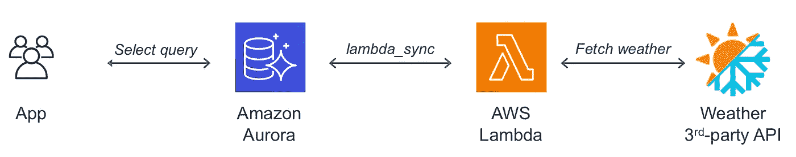

通过同步调用 Lambda 函数，您可以检索存储在其他服务中的数据，如 S3、Elasticsearch、Redshift、Athena，甚至第三方 API。

例如，我们可以获取今天的天气，使我们的一些查询动态化。

首先，我们需要[给 Aurora 集群访问 Lambda](https://docs.aws.amazon.com/AmazonRDS/latest/AuroraUserGuide/AuroraMySQL.Integrating.Lambda.html#AuroraMySQL.Integrating.LambdaAccess) 的权限，方法是用适当的 IAM 角色设置`aws_default_lambda_role`集群参数。如果您的集群不能公开访问，[您还需要启用网络通信](https://docs.aws.amazon.com/AmazonRDS/latest/AuroraUserGuide/AuroraMySQL.Integrating.Authorizing.Network.html)。然后，我们可以向数据库用户授予调用权限:

现在我们终于可以使用`lambda_sync`调用 Lambda 函数了:

上面的代码片段是从一个`weather_mapping`表中选择所有字段，假设我们存储了系统的一些参数和给定位置的当前天气(可以参数化)之间的映射。例如，我们的应用程序可以使用不同的图像、欢迎消息，甚至是基于当前天气的价格。

另外，请注意 Lambda 函数`FetchWeather`应该返回一个原子值，在本例中是一个字符串，因为 Aurora MySQL 不支持 JSON 解析。

***免责声明 1*** : `lambda_sync`和`lambda_async`提供 Aurora MySQL 版及以上版本。对于旧版本，可以使用存储过程`mysql.lambda_async`。

***免责声明 2*** :上面的功能也可以在应用层实现，而且我很确定你会为同步调用提供更有创意的用例:)

## 异步调用—示例:触发器

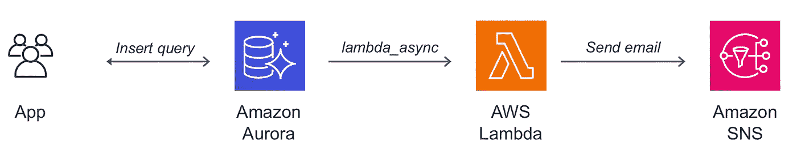

通过异步调用 Lambda 函数，对于那些需要对数据库中发生的特定查询或事件做出反应的场景，您可以实现一些非常类似于[Amazon dynamidbstreams](https://docs.aws.amazon.com/amazondynamodb/latest/developerguide/Streams.html)的东西。

例如，您可能希望在每次向`DemoContacts`表中插入新记录时发送电子邮件。在这种情况下，您可以通过发送来自应用程序代码的电子邮件来实现同样的目的。但在其他一些场景中，您可能需要为应用程序代码添加太多逻辑(或者甚至只是修改太多文件/模块)，因此使用数据库触发器来扩展应用程序的行为会更简单。

实际上，您可以定义一个 MySQL 触发器，它将异步调用 Lambda 函数。

首先，我们需要[通过为 Aurora 集群参数设置一个适当的 IAM 角色，使其能够访问 Lambda](https://docs.aws.amazon.com/AmazonRDS/latest/AuroraUserGuide/AuroraMySQL.Integrating.Lambda.html#AuroraMySQL.Integrating.LambdaAccess) 。如果集群不可公开访问[，还需要启用网络通信](https://docs.aws.amazon.com/AmazonRDS/latest/AuroraUserGuide/AuroraMySQL.Integrating.Authorizing.Network.html)。然后，我们可以向数据库用户授予调用权限:

现在我们可以定义一个 MySQL 触发器:

上面的代码片段定义了一个名为`TR_contacts_on_insert`的触发器，它收集`email`和`fullname`的插入值，然后异步调用 Lambda 函数。内置函数`lambda_async`需要一个 ARN 函数和一个 JSON 有效负载，这里是通过连接字符串来构建的。

如果您想为其他类似的触发器重用上面的调用逻辑，您可能还想创建一个可重用的存储过程。

# 结论

第 2 部分到此为止！

我希望你已经受到启发，用 [AWS 物联网 1-Click](https://aws.amazon.com/iot-1-click/) 、[亚马逊 Lex](https://aws.amazon.com/lex/) 、[亚马逊 CloudWatch 日志](https://aws.amazon.com/cloudwatch/)和[亚马逊 Aurora](https://aws.amazon.com/rds/aurora/) 来构建一些新东西。

现在，您可以无服务器地处理物联网按钮点击，实现聊天机器人的完整逻辑，实时处理日志，并实现 MySQL 触发器和/或将数据从外部服务/数据库提取到 Aurora。

在本系列的第三部分(也是最后一部分),我将讨论最后四种不常用的调用 Lambda 函数的方法，包括 AWS CodeDeploy、AWS CodePipeline、Amazon Pinpoint 等等！请继续关注，如果您想了解其他 Lambda 集成，请告诉我。

感谢您花时间阅读这么长的文章。
欢迎在下面分享和/或发表评论:)