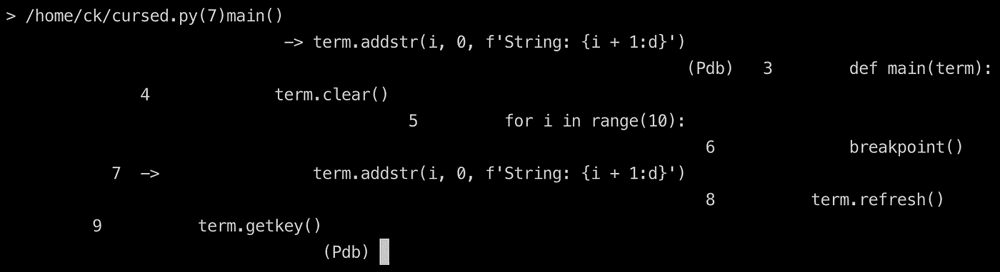
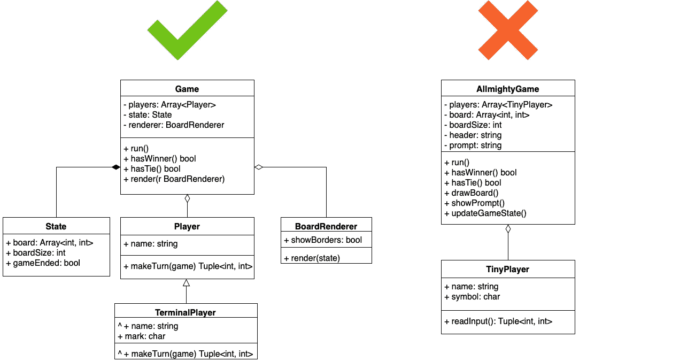

# 如何在编码面试中失败

> 原文：<https://medium.com/hackernoon/how-to-fail-a-coding-interview-8d02cb70225f>

## 一个关于错过最后期限和过度工程的寓言

不久前，我参加了一家初创公司数据科学家职位的编码面试。我觉得自己准备充分，充满信心，练习了大量的编程难题，从头开始编写各种机器学习技术，并有几年的编程经验。什么会出错？

不幸的是，我在与梯度下降法或时间复杂度分析没有任何关系的事情上失败了。不，这次失败与一些非常不同和复杂得多的事情有关。这是一个井字游戏！

我敢打赌，在这个时刻，你们中的一些人刚刚结束这个故事的想法:*什么，井字游戏？这么简单的事情怎么会做不到呢？你应该是个彻头彻尾的新手，伙计，连这么琐碎的练习题都不会解！*

其余的读者，他们决定给我一个机会，我邀请你们阅读我的故事，也许这种经历可以帮助你们在软件开发实践中避免类似的错误，并且更加小心。

Photo by [Quino Al](https://unsplash.com/@quinoal?utm_source=medium&utm_medium=referral) on [Unsplash](https://unsplash.com?utm_source=medium&utm_medium=referral)

# **这里怎么会出问题呢？**

现在让我更彻底地解释一下采访任务，让你对项目的范围有足够的背景和理解。下表列举了最低要求。

*   基于终端的界面。
*   回合制游戏；一个玩家一个接一个地移动。
*   在每个回合的开始和结束后，游戏会显示该轮到谁，并允许做出选择。
*   提交回合后，游戏会自动显示新棋盘的状态，并分析是否有赢家。如果有，用户界面会显示获胜者的信息，游戏结束。
*   游戏是用 Python ≥ 3.x 写的。

听起来很简单，对吗？这里最大的转折是*时间限制*。你只有 **1 小时**的时间来构建 MVP，即基于终端的双人游戏。此外，还有一个优先级列表，它阐明并扩展了设计要求。请注意，它们在*中按照重要性递减的顺序*列出。

1.  该游戏满足上述最低要求。
2.  用户界面很直观，不需要额外的说明。
3.  代码结构良好、紧凑，易于阅读。
4.  测试证明了开发的程序及其组件的正确性。
5.  游戏可以处理不正确的输入。
6.  用户界面很方便。
7.  代码使用了现代语言特性和库。

好的，很好，要求很明确。一切看起来都很简单，是时候开始构建代码了！应该不会太棘手…

Photo by [Ant Rozetsky](https://unsplash.com/@rozetsky?utm_source=medium&utm_medium=referral) on [Unsplash](https://unsplash.com?utm_source=medium&utm_medium=referral)

# 我知道如何区分事情的轻重缓急

当我阅读了包含需求的文档后，我的想法是:*嘿，井字游戏的基本玩法非常琐碎，所以让我们在开始时关注 UX 和处理输入，然后构建游戏逻辑的其余部分*。我想做一些新奇的互动的东西。到目前为止，我已经开发了许多 CLI 工具，简单的终端体验是不够的。所以我选择了`curses`库，让事情变得互动和方便。(我知道，谈论基于终端的界面的“便利性”听起来可能有些奇怪，但仍然……)

这里有一个小问题:*你如何调试一个控制终端的程序？这里有一个小片段来解释我在说什么。下面的代码显示了与断点交互的最简单的`curses`程序。*

看起来不错，对吧？直到你尝试运行它。

> 从上面的列表中可以看出，拥有一个交互式 UI 并不是一个严格的要求。尽管如此，这件事耗尽了我的注意力和相当一部分分配的时间。

当您运行这个代码片段时，它没有显示您所期望的内容。你可能已经猜到了，`curses`控制了终端会话，当调试器试图呈现它的接口时，事情[完全被破坏了](https://stackoverflow.com/questions/20761311/how-to-properly-debug-a-python3-3-curses-application-using-pdb)。

Not a something you would like to see when running a debugger

我花了大量的时间尝试设置和处理一个坏掉的调试器。果然，宝贵的几分钟浪费了，没有给开发的程序带来任何价值。这里最有趣的事情是拥有一个交互式 UI 并不是一个严格的要求，正如你从上面的列表中看到的。尽管如此，这件事耗尽了我的注意力和相当一部分分配的时间。

# 以后重构这个神级很容易

在我放弃驯服终端的尝试后，我开始构建游戏逻辑。名为`Game`(是的，对于管理游戏的类来说，这是一个非常不寻常的名字)的主类负责存储棋盘状态，切换活动玩家，以及管理整个游戏过程。

正如你已经知道的，我已经没有时间了，所以我试着把精力集中在构建工作解决方案上，把重构推迟到过程的最后。过了一段时间，`Game`不仅负责游戏，还负责渲染棋盘，包括一些硬编码的常量等等。在没有通知的情况下，我的`Game`班开始负责*一切*。

> 临时解决方案和快速补丁导致了大量糟糕的代码，没有时间去修复它们

Expectation vs Reality from the world of Computer Programming

所以你可以猜到，我没有足够的时间将这个`AllmightyGame`类分解成更易管理和轻量级的东西。反而成了[神级反模式](https://sourcemaking.com/antipatterns/the-blob)的绝佳例证。临时解决方案和快速补丁导致了大量糟糕的代码，却没有时间去修复它们。看起来区分干净的代码和难看的代码比发现它如何慢慢地将 T4 从一个类别滑入另一个类别要简单得多。

# **编写测试花费太多时间**

一个难看的游戏逻辑类，一个脆弱的 UI，给的完成任务的时间也快结束了。对于这么“简单”的事情来说还不错！我们怎样才能挤出一点时间来解决这些乱七八糟的事情呢？软件开发过程的哪一部分似乎是我们可以轻易放弃而不会产生太多后果的？

答案是单元测试！代码非常紧凑，你可以看到每个类和函数；我们可以安全地直接进入应用程序逻辑编码，而不是编写这些额外的函数，对吗？

不对。即使是简单琐碎的程序，你也需要用某种方式验证你的输入产生了一个有效的输出。你还需要写一些*入口点*来运行你的程序，在开发过程中你会经常执行它。这些入口点正是测试给你的东西。

> 测试不仅不会给你的代码增加太多的开销，而且还会给开发过程带来很多好处，甚至对于非常简单的玩具程序也是如此

此外，编写测试对您的 API 构建过程有着重要的影响:它迫使您分离模块并解开系统的碎片。请看下面的片段。您需要验证游戏逻辑是否有效，最直接的方法是从外部传递游戏状态。然后你只需要调用你的 winner checking 函数，看看它是否按预期工作。否则，你需要运行游戏界面，手动输入回合。即使对于小的游戏状态，每次运行都会占用你几秒钟的时间，更不用说测试更大的电路板了。

因此，测试不仅不会给你的代码增加太多的开销，而且会给开发过程带来很多好处，甚至对于非常简单的玩具程序也是如此。我相信实际上有一个相反的趋势:测试甚至可以加速开发过程，并帮助它变得更好。在缩减测试以节省时间之前，应该三思而行。

# 经验教训

果然，写这个小故事不是为了告诉你如何处理终端渲染的麻烦，也不是为了写益智游戏。这是对软件开发的总体思考。

人们会发现这个“寓言”很肤浅，我犯了很多明显的错误。嗯，对你有好处！你是一个比我好得多的开发者。尽管如此，我还是决定与我们这些自信而有经验，但有时会忘记诸如截止日期、亲吻和 MVP 等“世俗之事”的人分享这次失败。紧迫的时间限制和任务的简单性可能会给你开一个糟糕的玩笑，我不仅是指测试任务，还包括日常的开发过程。所以，让我们从这个故事中学到一些教训。

1.  不要本末倒置。如果你没有一个工作产品，其他的一切都没有太大意义。我在我的运营商中见过类似的事情，当一家公司开始构建花哨的定制仪表板，一堆跨平台的应用程序，试图考虑所有可能的边缘情况时，专注于最少的逻辑而不是分散精力会更有益。
2.  **忙碌并不意味着进步。当只给你一个小时来完成任务时，这一点就变得很明显了。如此短暂的时间凸显了在更大范围内真实存在的事情。此外，长时间的开发很容易隐藏问题。**
3.  **尽可能使用测试驱动的开发方法。**测试不能保证没有 bug，但会迫使你将代码分割成更小的片段，解耦子模块，逆依赖，总的来说就是写一个更干净的 API。这是一个很好的方法来构建思维过程，更好地理解需求。
4.  使用你最了解的技术。至少在开发过程的最开始。即使这个任务看起来非常简单，他也抑制住了将其实现与学习新框架相结合的冲动。
5.  **不要把用户的方便放在干净代码之前。你应该把用户的便利放在心上，但是把它作为最终目标可能不是一个好主意。这一点与前几个观点有许多共同之处。根据客户的意外请求，您倾向于忽略测试，进行特别的更改，修改代码库，并从本质上“过度适应”您的产品质量。**

许多这些事情看起来很明显，而且会重复很多次。(不是说大量伟大的书籍)。尽管如此，我相信我们每个人都有机会陷入同样的陷阱，每隔一段时间提醒自己这些简单的观察是一个好主意，以保持良好的状态，做出更好的决定。

*你在你的开发者载体期间有过类似的经历吗？或者，如果你是雇主，你更愿意把什么样的任务交给你的候选人？你对这种“压力测试”有什么看法？很高兴听到你的想法！*