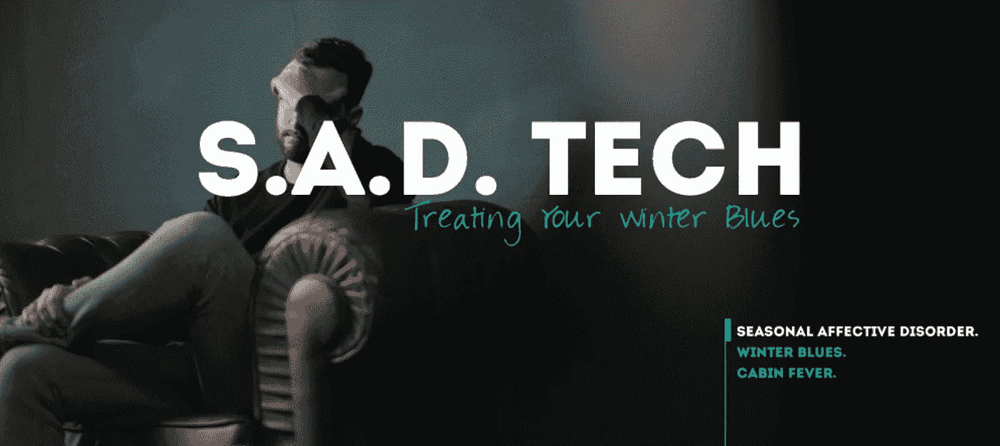
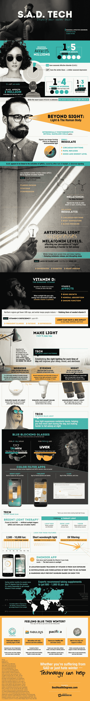

# 如何用更好的技术对抗季节性情感障碍

> 原文：<https://medium.com/hackernoon/how-to-fight-seasonal-affective-disorder-with-better-tech-bfd494176aec>

不管你怎么称呼它，从幽居病到冬季忧郁症，几乎我们所有人都与寒冷月份带来的简单的坏情绪和精力减退有关。从医生的角度来看，这些病例中更严重的被称为季节性情感障碍，或 SAD，在冬季影响最大。

虽然 SAD 的确切原因尚不清楚，但它的治疗方式与传统抑郁症大致相同，但研究开始揭示更多关于 SAD 的见解，即我们的昼夜节律，以及我们的身体和大脑如何对光线水平做出反应，特别是阳光。固有光敏视网膜神经节细胞，或 ipRGCs，是一个长期描述大脑中对环境光做出反应的信号。这意味着调节我们的瞳孔反射、昼夜节律以及我们的情绪和能量水平。科学家认为，成年人和儿童应对季节性情感障碍的症状可能与 ipRGCs 和普遍缺乏阳光有关，这在冬季是正常的。

虽然我们还不了解季节性情感障碍的所有活动部分，但从强光治疗到蓝光阻断眼镜的技术正在帮助无数人战胜冬季忧郁。这张信息图详细描述了 SAD 的内部运作，可用的治疗方法，以及使之成为可能的技术。

