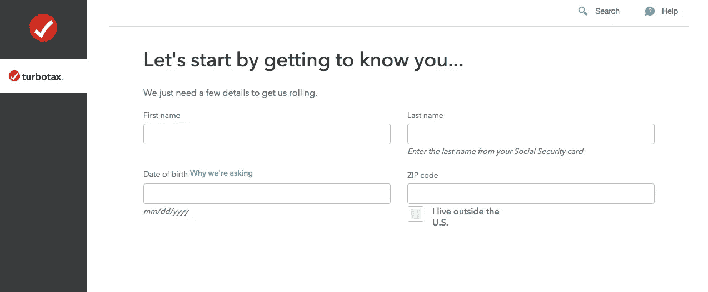
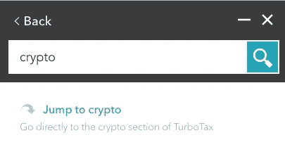
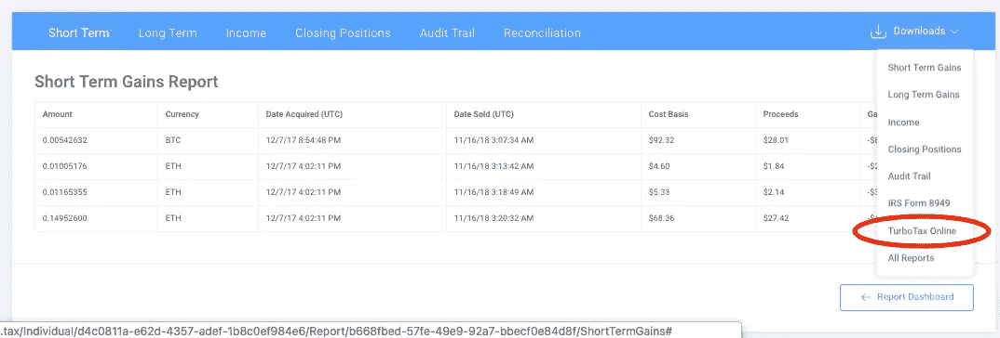
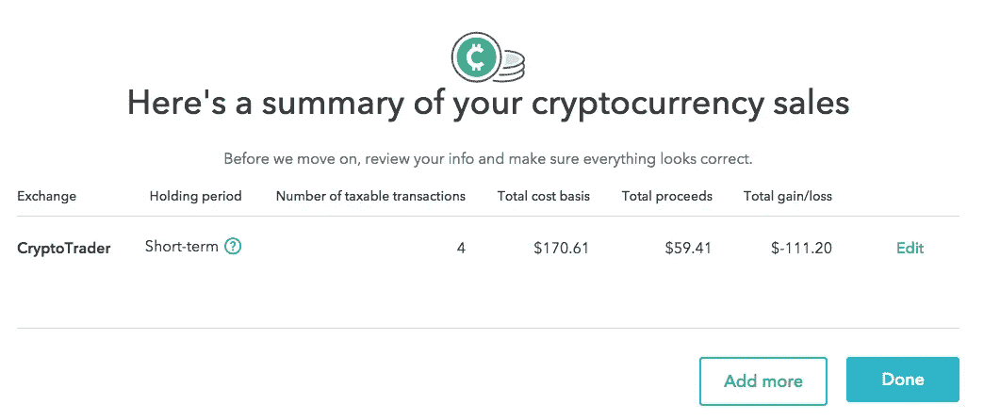

# 如何向 TurboTax 申报加密货币税

> 原文：<https://medium.com/hackernoon/how-to-file-your-cryptocurrency-taxes-with-turbotax-fd950d41ab95>

TurboTax 官方宣布，他们将为[比特币](https://hackernoon.com/tagged/bitcoin)和加密货币纳税申报提供支持，这是他们与 [crypto](https://hackernoon.com/tagged/crypto) 税务软件公司、[crypto trader 合作的结果。税](https://www.cryptotrader.tax/) 。这意味着 premier、premier-live、个体户或个体户 live 软件包都有能力处理税务的加密方面。对于使用加密货币进行交易的消费者来说，这是一件大事，因为数字资产的纳税申报过程可能非常困难。

本文介绍了通过在线版 TurboTax 申报加密货币税的过程。

# 入门指南

前往 [**TurboTax**](https://turbotax.intuit.com/microsite/home.htm?priorityCode=5708400000&cid=all_bitwor_aff_5708400000) 并选择 premier 或个体户套餐，因为这些套餐具有加密货币功能。

创建帐户后，您将进入 TurboTax live 应用程序。

在应用程序中，您将回答一些提示。在早期的一个提示中，你会被要求“了解你的财务状况”。选择所有适用于您的选项，并确保“我出售或交易了加密货币”也被选中。

继续在 TurboTax 中填写您的税务档案。

# 加密货币区

一旦您填写了初始提示，您就可以通过在搜索栏中键入“crypto ”,然后选择“jump to crypto”来跳转到加密部分。

在加密货币部分，您可以选择用于准备加密数据的加密税务平台。

如果您尚未使用 [**CryptoTrader 建立您的加密货币税务报告。然而，这是你应该停下来创建你的报告的地方。请记住，TurboTax 不会为您收集所有的加密数据。如果您在多个交易所进行交易，并且有许多交易，您将需要使用 CryptoTrader.Tax 构建您的报告和加密税务档案。**](https://www.cryptotrader.tax/)

查看这篇关于如何使用 CryptoTrader.Tax 创建加密税务报告的文章。

# 将您的数据导入 TurboTax

好了，你已经在 CryptoTrader 上完成了你的 [**加密税务报告**](https://www.cryptotrader.tax/cryptocurrency-tax-reports) 。税务平台，现在你需要将这些数据导入 TurboTax。为此，只需下载 CryptoTrader 的 TurboTax CSV。对每个报告包征税。

下载文件后，回到 TurboTax 并上传这个 CSV 文件。

导入您的 CSV 后，您应该会看到您的所有交易都出现在 TurboTax 中。请记住，TurboTax 平台最多只能导入 500 笔交易。如果您有超过 500 笔交易，您将无法上传您的 CSV。

您应该在应用程序中“选择所有”应纳税交易。密码交易商。Tax 导出您的应税交易，因此您无需在 TurboTax 中逐一筛选。只需选择全部。

完成后，点击“完成”，您将在 TurboTax 中看到您的加密货币交易摘要。

现在你知道了！现在，您所有的应税加密交易都将包含在您的年终纳税申报表中，为您提供 TurboTax 文件！

# 了解有关加密货币税的更多信息:

[如何处理你的比特币和加密损失用于税收目的](https://www.cryptotrader.tax/blog/how-to-handle-your-bitcoin-and-crypto-losses-for-tax-purposes)

[加密货币税完整交易者指南](https://www.cryptotrader.tax/blog/the-traders-guide-to-cryptocurrency-taxes)

*最初发布于*[*www . cryptotrader . tax*](https://www.cryptotrader.tax/blog/how-to-file-your-cryptocurrency-taxes-with-turbotax)*。*