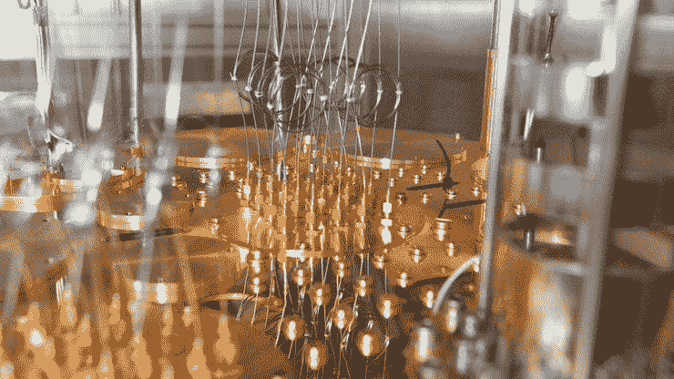
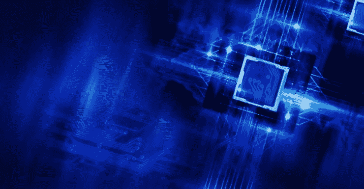

# 量子计算如何找工作

> 原文：<https://medium.com/hackernoon/how-to-find-a-job-in-quantum-computing-quantum-computing-weekly-11-ccde0a10be8d>

## 量子计算周刊#11

> 这是我每周电子邮件中关于量子计算新闻的综合版本。[访问主页](https://www.quantumcomputingweekly.com/)订阅更新和查看以前的问题。

☁️你好，来自寒冷的伦敦！

这个周末我从墨西哥回来了，虽然时差还没倒过来，但我还是回到了工作岗位，再次学习量子计算。

在新闻中，我们看到了一些有趣的文章，比如寻找构建量子计算机的组件的困难，以及非密码学相关的应用，等等。

我们还将学习一些关于量子隧道的知识，并分享一个资源来寻找量子计算方面的工作！

你在寻找量子计算的某个特定领域，希望在下一期文章中看到它吗？ [Ping 我](https://twitter.com/jesperht)然后让我知道！

# 本周的小事实

本周我们将学习一些叫做量子隧道的东西，它可能会对核聚变等事情产生重大影响。

> 量子隧道效应是一种量子现象，当粒子穿过根据经典物理学理论不可能穿过的屏障时发生。该屏障可以是物理上不可通过的介质，例如绝缘体或真空，或者是高势能区域。
> 
> 在经典力学中，当粒子能量不足时，它将无法克服势垒。然而，在量子世界中，粒子通常表现得像波一样。遇到障碍时，量子波不会突然终止；相反，它的振幅将呈指数下降。振幅的下降相当于发现粒子更深入屏障的概率下降。如果势垒足够薄，那么另一边的振幅可能不为零。这就意味着某些粒子有有限的概率会隧穿势垒。[来源](https://www.azoquantum.com/Article.aspx?ArticleID=12)

和往常一样，维基百科上有一篇关于这个话题的令人惊奇的文章，有更多的细节，值得一看。

# 学习

量子计算领域有什么样的工作？在这篇文章中，Jay Gambetta 列出了大约 12 种不同类型的角色，以及如果您对量子计算领域的职业感兴趣，如何与 IBM 联系的一些信息。非常酷！

[**《搭便车的猫》量子计算求职指南**](/qiskit/the-hitchhiking-cats-guide-to-getting-a-job-in-quantum-computing-da7e3bb9ff64?utm_campaign=Quantum%20Computing%20Weekly&utm_medium=email&utm_source=Revue%20newsletter)**——**[**medium.com**](/qiskit/the-hitchhiking-cats-guide-to-getting-a-job-in-quantum-computing-da7e3bb9ff64)
在四处旅行进行量子计算演讲时，我注意到两件事——我们日益壮大的社区的热情，以及下面这个问题的频率:“我不太了解…

# 新闻

[**如果不是很难找到该死的电缆，我们会有更多的量子计算机**](https://www.technologyreview.com/s/612760/quantum-computers-component-shortage/?utm_campaign=Quantum%20Computing%20Weekly&utm_medium=email&utm_source=Revue%20newsletter)**——**[**www.technologyreview.com**](https://www.technologyreview.com/s/612760/quantum-computers-component-shortage/)
量子计算机将带来计算领域的下一次大跃进，但建造它们的研究人员无法轻易获得他们需要的一些奇异组件。

[**现在需要 IBM 晶格密码来防御量子计算未来**](https://www.forbes.com/sites/tiriasresearch/2019/01/17/ibm-lattice-cryptography-is-needed-now-to-defend-against-quantum-computing-future/?utm_campaign=Quantum%20Computing%20Weekly&utm_medium=email&utm_source=Revue%20newsletter#62882dd5c42e)**——**[**www.forbes.com**](https://www.forbes.com/sites/tiriasresearch/2019/01/17/ibm-lattice-cryptography-is-needed-now-to-defend-against-quantum-computing-future/#62882dd5c42e)
说到保护数据，现在开始预见量子计算的未来威胁并不算早。你需要为量子未来计划今天。我和 IBM 谈过，这家公司了解这个问题的两个方面。

[**量子计算的真实商业案例**](https://knowledge.insead.edu/blog/insead-blog/the-real-business-case-for-quantum-computing-10836?utm_campaign=Quantum%20Computing%20Weekly&utm_medium=email&utm_source=Revue%20newsletter)**——**[**knowledge.insead.edu**](https://knowledge.insead.edu/blog/insead-blog/the-real-business-case-for-quantum-computing-10836)
无视那些危言耸听的头条新闻:量子计算机不会在线终结隐私。事实上，他们最具革命性的影响可能是在线下感受到的。

[**埃克森与 IBM 合作推进量子计算**](https://www.thechemicalengineer.com/news/exxon-partners-with-ibm-to-advance-quantum-computing/?utm_campaign=Quantum%20Computing%20Weekly&utm_medium=email&utm_source=Revue%20newsletter)**——**[**www.thechemicalengineer.com**](https://www.thechemicalengineer.com/news/exxon-partners-with-ibm-to-advance-quantum-computing/)

埃克森美孚已经成为第一家加入 IBM Q Network 的能源公司，IBM Q Network 是一个全球性的社区，旨在推进量子计算并探索科学和商业应用。

[**为什么美国宇航局、洛克希德·马丁公司和其他公司在这台量子计算机上花费数百万？**](https://gizmodo.com/why-did-nasa-lockheed-martin-and-others-spend-million-1826241515?utm_campaign=Quantum%20Computing%20Weekly&utm_medium=email&utm_source=Revue%20newsletter)**——**[**gizmodo.com**](https://gizmodo.com/why-did-nasa-lockheed-martin-and-others-spend-million-1826241515)
量子计算机可能是新生技术中最容易被误解的，这是有道理的，因为它们的基础知识依赖于最难理解的物理概念。这导致人们做出一些荒谬的声明，比如他们给了你“上帝般的力量”，他们是“迫在眉睫的威胁”

# 感谢阅读！投稿？

写了一篇有趣的博客或者发现了一些关于量子计算的有趣的事情来分享？发现了一个错误？在 twitter 上 Ping 我( [@jesperht](https://www.twitter.com/jesperht) )。