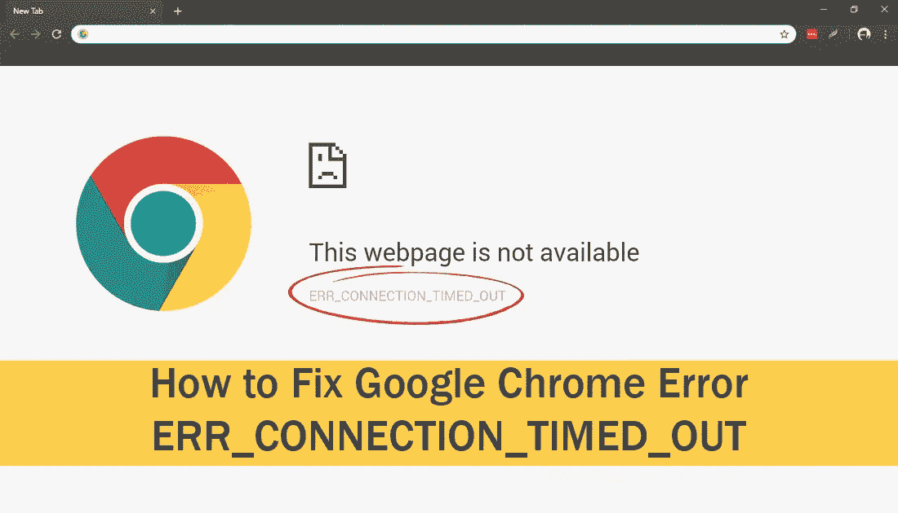

# 如何修复 ERR_CONNECTION_TIMED_OUT 错误

> 原文：<https://medium.com/hackernoon/how-to-fix-err-connection-timed-out-error-1f1325bfaf8c>

Image source-[downloadsource.net](https://www.downloadsource.net)

最恼人的错误之一是当你的互联网连接超时，你不能访问特定的网页。您将在屏幕上看到消息“网页不可用”ERR_CONNECTION_TIMED_OUT。此错误通常发生在互联网连接出现问题，并且页面无法加载时。您可以在屏幕上看到带有该错误名称的消息。当网站或[网页](https://www.youcalendars.com/)响应时间过长，或者连接超时时，chrome 会建议三种方法来消除错误

检查连接

检查代理和防火墙

运行 windows 网络诊断

这些是有限的解决方案，不能很好地解决这些问题。你需要对这个问题采取更多的行动。如果你不知道其他的解决方案，那么你可以在这篇文章中找到。我们提供了最好的方法来消除浏览器中的错误。您无需担心，因为这些解决方案不需要任何专业知识。你可以自己使用这些方法。

## **什么是 ERR_CONNECTION_TIMED_OUT？**

当 web 浏览器和网站之间没有通信时，就会出现此错误。浏览器总是有可能停止接收来自网站的数据，或者网站花了很长时间才做出响应并且无法连接。Chrome 针对这个问题提出了三种解决方案，但这些不足以从浏览器中消除这个问题，我们通常会尝试这些方法来解决问题，但它仍然存在，我们需要更多的方法。这个错误在 Chrome 用户中非常常见，如果你正面临这个错误，那么不要惊慌，你并不孤单。在这里你会找到解决这个问题的完美方法。

## **ERR _ CONNECTION _ TIMED _ OUT 错误的原因是什么？**

任何错误的原因都可以说明问题的许多方面，这有助于找到问题的合适解决方案。既然我们在讨论 err_connection_timed_out 错误，那么在得到答案之前，你必须知道这个错误的原因。以下是导致这一问题的一些原因。

服务器无法处理您的浏览器发送的请求

服务器变得不负责任或延迟响应

服务器和浏览器之间没有建立连接

无效的 URL

[互联网连接受限或无法访问](https://hightechjigsaw.com/vpn-basic-guide-what-is-a-vpn-and-how-does-it-work-explained/)

这些可能是连接超时问题的原因。所以我们需要关注互联网连接。我们的方法将与这个问题有关。看看这些技巧，试试适合你的。

## **如何修复 ERR_CONNECTION_TIMED_OUT 错误？**

根据错误背后的原因，我们有各种方法来解决这个问题。消除错误的最好方法是找到一个合适的解决方案。你可以开始使用第一种方法，如果它不能解决问题，然后转向另一种解决方案。尝试直到你的问题被根除。此外，小心使用这些方法，并遵循每一步。以下是你可以使用的方法。

# **方法**

## **方法一:从浏览器中清除浏览数据和缓存**

Cookie 和缓存相关的问题总是在服务器和浏览器之间建立连接时产生问题。解决这个问题的唯一方法是从头开始清除浏览数据。有时我们访问网页，它的缓存是在我们的浏览器中创建的。缓存现在阻止我们创建与网站的连接。从设备中移除缓存。如果您不知道如何执行这项任务，那么请看一看

1 打开谷歌浏览器，在地址栏输入以下网址

chrome://settings/clearBrowserData

2 转到高级选项卡，从头开始更改时间范围

3 勾选所有选项，尤其是与 Cookies 和缓存相关的选项

4 单击清除数据按钮

这样，您将从设备中清除缓存和历史记录。现在检查网页是否正在加载。如果问题仍然存在，请尝试其他方法。

## **方法 2:更改局域网设置**

一些互联网设置可能受到病毒的影响，或者您错误地进行了一些更改。所以还是改变这些设置比较好。

1 使用开始菜单打开控制面板

2 将“按类别查看”调整为大图标，然后单击“互联网选项”

3 转到“连接”选项卡，单击“局域网设置”按钮

4 现在取消勾选自动配置和代理服务器部分给出的所有选项

5 单击确定

6 重新启动浏览器并开始冲浪

如果您再次得到错误，那么代理和局域网设置不是这个问题背后的原因。所以换个方法吧。

## **方法三:修改 windows 主机文件**

仅当您在单个网站中遇到此错误时，才使用此方法。如果网站不止一个，那就跳过这个方法，转到另一个。这仅适用于一个网站错误，因为主机的文件可能会产生问题。因此，通过修改来解决主机的文件问题。如果您不知道如何修改 windows hosts 文件，请按照以下步骤操作

1 打开开始菜单，然后选择所有程序>附件

2 现在右键单击记事本，选择“**以管理员身份运行。”**

3 屏幕上将出现记事本窗口。点击**文件**菜单，从列表中选择**打开**。

4 从窗口右下角的下拉菜单中选择**所有类型**。

5 单击列表中的主机

6 如果在最后一个#符号行之后有网站的 IP 地址或主机名，则删除该地址或在结束#行之后给出的所有数据。

7 保存更改并重启浏览器

如果问题仍然存在，稍后尝试另一种方法。

[**Steam** **代码**](https://ifreegiveaways.net/free-steam-wallet-codes) 通过向他们的 **steam** 账户添加点数，玩家可以即时访问数千款游戏，从动作游戏到独立游戏，以及所有介于两者之间的游戏。

## **方法 4:更新和刷新 DNS**

可能是 DNS 和 IP 问题限制了服务器和浏览器之间的连接，因此您必须通过刷新 DNS 和续订 IP 来解决此问题。这不是一项困难的任务。任何人都可以做到这一点，我们已经给出了详细的步骤，这将使这项工作更容易。

1 同时按下 Windows 徽标键+ R 键打开运行对话框

2 在运行对话框中键入 cmd，然后单击确定按钮

1 在命令提示符窗口中键入下面给出的命令

ipconfig /flushdns

ipconfig/已注册

ipconfig/释放

ipconfig /renew

netsh Winsock 重置

不要忘记在键入每个命令后按 enter 键，并以相同的顺序键入命令。关闭命令提示符后，重新启动计算机。

如果问题没有解决，那么使用下一个解决方案。它肯定会帮助你，因为防火墙或防病毒设置可能是造成这个问题的原因。

## **方法-5:检查防火墙和防病毒设置**

防火墙和杀毒往往在对网站可信度打上问号的情况下，似乎会屏蔽掉一些网站。防火墙拒绝与服务器连接，不允许您访问网页。它有助于保护您的设备免受有害文件的侵害。如果您知道该网站是安全的，那么您可以关闭防火墙并访问该网站。杀毒软件也是一样，你可以卸载[软件](https://www.youcalendars.com/rent-receipt-template-format-example.html)来访问网站。建议您在工作结束后打开防火墙和杀毒。否则，您的设备将面临风险。如果防护罩在工作中制造了问题，它就会被关闭，但是你不能忘记它是在保护你免受有害物体的伤害。因此，在防火墙和防病毒设置中进行可能的更改，但在工作完成后进行更改。

## **结论**

我们分享的这些方法是准确的，你可以毫无障碍地使用它们。然而，我们已经在文章中告诉了你所有可能的方法，但是还有一个解决方案可能对你有用。它正在更新驱动程序，为此，您将需要工具。虽然您可以不借助任何工具来完成这项任务，但是您需要更新 windows 来完成这项任务。你的驱动程序会自动更新，不需要做太多。err_connection_timed_out 错误并不像看起来那样是个大问题。它可以阻止你从一个网站访问所有的网站。因此，如果您在单个站点或每个站点都遇到问题，请记住使用这些方法。我们主机的文件修改方法只适用于特定网页不加载的情况，其他方法适用于所有。所以要小心使用这些方法，快速解决问题。