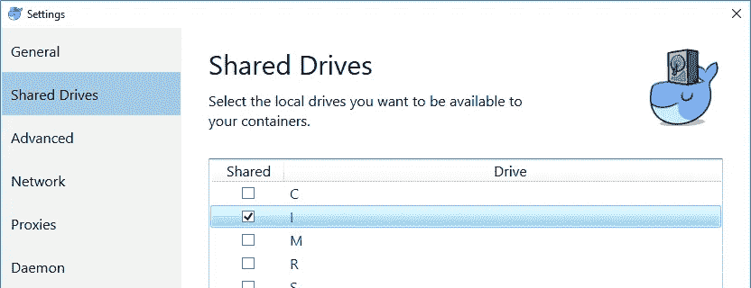

# 如何修复讨厌的“巴什:。/wait-for-it.sh:是 Windows 上的目录💪

> 原文：<https://medium.com/hackernoon/how-to-fix-the-nasty-bash-wait-for-it-sh-is-a-directory-on-windows-7f34855dce87>

如今，当构建应用程序时，它们通常使用由许多服务组成的分布式微服务架构来构建。这些服务中有许多依赖于其他服务，通常是需要先启动的基础设施。以可控的简单方式管理多个服务 [Docker](https://www.docker.com/) 和 [Docker Compose](https://docs.docker.com/compose/) 可以帮助您。

Docker Compose 是一个用于定义和运行多容器 Docker 应用程序的工具。然而，有限的是知道容器何时准备好开始接受流量。您可以通过使用`depends_on`来[控制容器的启动顺序](https://docs.docker.com/compose/startup-order/)。比如说:

```
services:
   service1:
     ...omitted
     depends_on:
     - "rabbitmq" rabbitmq:
     ...omitted
```

这将仅验证容器在`service1`引导之前正在运行。为了确保在依赖关系准备好接受流量之前不启动容器，wait-it 是一个很好的脚本。

```
services:
  service1:
    ...omitted
    volumes:
      - "./scripts/wait-for-it.sh:/app/wait-for-it.sh"
    entrypoint: ["bash", "-c", "./wait-for-it.sh rabbitmq:15672 -t 0; ./start.sh"] rabbitmq:
     ...omitted
```

这将确保在执行下一个脚本(在本例中是一个简单的 start.sh 文件)之前，`rabbitmq`服务在端口 15672 上可用。这种方法通常非常有效，但是当您主要在 Windows 上开发时，可能会遇到麻烦:

`bash: ./wait-for-it.sh: Is a directory`

在这篇文章中，我将分享我是如何解决这个问题的。我已经花了很多时间排除故障，所以希望我可以节省你一些时间。

# 错误的行尾

您的`wait-for-it.sh`文件正在使用 windows 行尾(CRLF)。在 Windows 上创建的文件与在 Unix 上创建的文件具有不同的行尾。如果你运行 Linux 容器，你需要确保你的脚本文件使用 LF 而不是 CRLF。您可以通过在一些现代的文本编辑器(如 Notepad++或 VSCode)中打开该文件来轻松找到答案。

## 存储库中的行尾

你可能会对你的软件进行版本化，当你使用 git 时，你可以配置一个设置来处理行尾[。如果你是跨平台协作，你通常将设置配置为`auto`。这意味着，每当您向 git repo 添加一个 git 认为是文本文件的文件时，它都会将所有 CRLF 行尾都转换为 LF，然后再将其存储在 commit 中。每当你做`git checkout`时，所有的文本文件都会自动将它们的 LF 行尾转换成 CRLF 尾。](https://help.github.com/en/articles/dealing-with-line-endings)

确保您的回购中有一个当前的`.gitattributes`文件，该文件具有以下设置:

`*.sh text eol=lf`

这将告诉 git 将 LF 行尾应用于所有。sh 文件。

# 共享驱动器

确保您共享您的驱动程序。在上面的例子中，我使用一个[主机卷挂载](https://docs.docker.com/storage/volumes/)将文件从我的主机共享到容器中。要做到这一点，你需要共享你的驱动器。你可以在 Docker 设置中通过右键点击托盘中的图标来实现。



[https://token2shell.com/img/howto/token2shell/docker/docker-settings-shared-drives.png](https://token2shell.com/img/howto/token2shell/docker/docker-settings-shared-drives.png)

在我们的环境中(我假设您也是这种情况)，我们使用特定的本地管理员帐户来提升权限。若要共享您的驱动器，您需要使用此帐户进行身份验证。当这个本地帐户的密码到期时，Docker 不会告诉你或再次提示你输入密码— *，除非*你取消勾选框，点击应用，勾选框，再次点击应用。令人沮丧！

希望当您修复了行尾并共享了您的驱动程序后，您的问题将会消失，您将会看到如下内容:

`service1 | wait-for-it.sh: waiting for rabbitmq:15672 without a timeout`

这两样东西可能会咬你一口。希望我已经为您节省了一些故障排除时间！😆