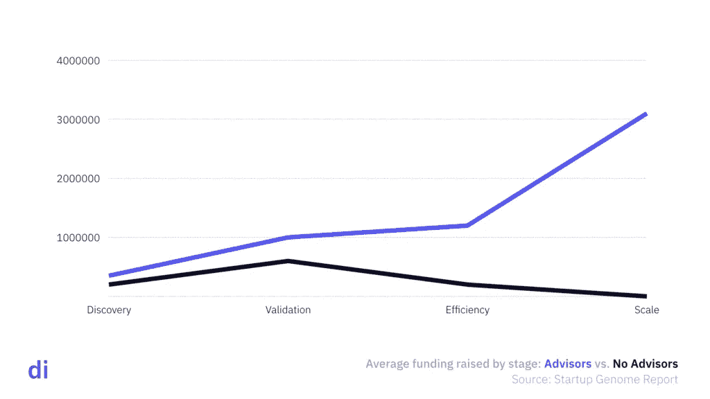
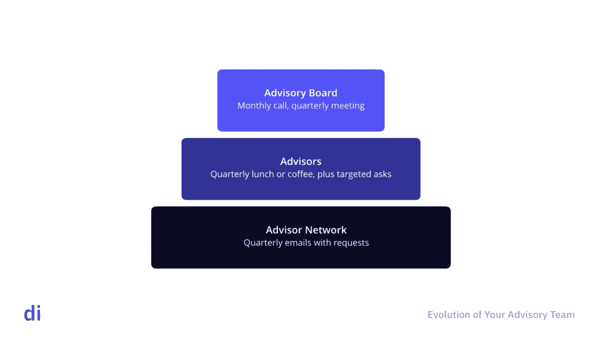

# 如何组建和管理一个高效的顾问委员会

> 原文：<https://medium.com/hackernoon/how-to-form-and-manage-a-high-functioning-advisory-board-7d34eccfee54>

## 顾问为他们建议的企业提高速度和成果。了解他们做什么，为什么他们有价值，以及如何最好地利用他们。

建立一个成功的企业真的很难。所以你应该尽你所能来提高你成功的可能性。创业顾问通常在提高他们所建议的创业公司的速度和成果方面发挥重要作用。这篇文章探讨了什么是顾问，他们做什么，以及如何充分利用他们。

# 什么是顾问？

创业顾问帮助管理团队做出更好的决策，更快地行动，并改善结果。顾问经常帮助的事情包括:

*   关于商业模式战略和定位的建议
*   对业务关键领域的建议(例如，用户获取、产品架构)
*   磨练您的推介平台和演示文稿
*   潜在投资者介绍
*   关键客户介绍
*   帮助识别和招聘人才
*   充当组织和人员问题的宣传板

顾问几乎总是经验丰富的商业人士或领域专家，他们知道创业管理团队不知道的事情或关系。

## 什么顾问不是

顾问不是导师，至少在我们的字典里不是。导师向企业家提供个人支持和建议，而不是更广泛的公司。顾问代表公司和所有股东工作。

顾名思义，**顾问不是员工**。在他们正式参与的范围内(这种关系通常是非正式的)，他们是独立的承包商。

从法律上和实践中，**顾问不是董事会成员**。董事也为公司提供建议和支持，但背景却大不相同。董事会董事拥有法律地位，并拥有顾问所没有的某些权利和义务。董事有权参与有关公司战略和运营的决策，并有权了解公司的情况。他们还有代表公司所有股东的利益行事的信托责任，确保他们对公司保持适当的了解，以及在履行职责时的注意义务。除了书面咨询协议中明确规定的义务或权利之外，顾问没有任何此类义务或权利。

因为顾问不是员工或董事，他们通常更像导师——这意味着他们强调管理团队的利益高于其他股东。出于这个原因，在许多情况下，企业家发现他们可以更坦诚地对待顾问，在处理高压力情况时更容易避免与他们发生冲突。

# 顾问投资公司吗？

顾问也可能投资你的公司。他们中的许多人都很富有，如果他们对你正在做的事情足够感兴趣，对你足够信任并积极提供帮助，那么当他们要求投资时，就不应该感到惊讶。

但是有很多原因可以解释为什么顾问不能够或者不愿意投资。有些人根本没有现金。其他人可能有外部限制，使其变得太困难，例如公司雇主对股权持有的政策，或者风险资本家必须避免有限合伙人和合伙人之间的冲突。坦白地说，当你刚开始投资时，许多顾问都在等着看你的表现，然后再决定是否向你注资。

老生常谈的是，企业家不应该聘用不愿意向公司投入资金的顾问。在一家公司的发展道路上，几乎总会有这样一个点，它足够吸引一些顾问的注意，但对他们来说，仍然太不确定，以至于不敢拿现金冒险。现金在情感上和实践上都不同于时间，特别是对于非企业家顾问来说，他们可能没有太多风险资本化的经验。

投资顾问通常会更加投入和专注，所以他们这样做几乎总是一件好事。一个潜在的不利因素是，投资顾问有时会觉得你有义务听取他们的建议，甚至有义务听从他们的建议。

我的建议通常是首先关注价值贡献和你与顾问的工作关系。任何关于投资的谈话都应该自然地进行，并且应该从他们的建议而不是他们的钱的角度来看待——当然，除非他们是有足够资本来真正为你移动针头的老练投资者。不要因为有前途的顾问不投资就把他们排除在外。最后，这里没有硬性的规则，你应该不断寻求优化，以获得更快、更好的结果。

# 顾问重要吗？

一句话:可以。合适的顾问以适当的方式参与进来，可以极大地加快进度，降低风险，增加成功的可能性。改变工作方式(例如，创建新的业务模式)本质上涉及一定程度的复杂性，需要不同的专业知识和困难的问题解决方案。顾问可以提供运营经验和对专业领域的见解，这是早期团队不太可能具备的。这些见解会对你的公司产生根本性的影响。

一个好的顾问会做的最重要的事情之一就是迫使你重新考虑你的假设。多样性通过带来不同的观点来改善决策，这似乎是很直观的。这是真的，但它没有告诉整个故事。凯洛格管理学院的研究表明:

> *“多样化的群体比更同质的群体表现更好，不是因为新思想的涌入，而是因为多样化引发了更仔细的信息处理，这是同质群体所缺乏的。”*

# 真实世界的例子

## 这种产品做得太好了

2008 年，我作为一家招聘技术风险投资公司的首席执行官，正在进行一次创业转型。当时我没有招聘经验，也没有参与最初的投资，作为一名风险投资家，我代表我的公司试图挽救一家迅速走向糟糕方向的公司。

我们在六周内对产品做了一个看似不可能的转变(我带来的产品团队非常棒)。但令我们惊讶的是，我们产品所针对的招聘人员对此持矛盾态度。我们的一位顾问指出了一个对我们来说似乎陌生的观点:我们的产品做得太好了。招聘人员向他们的老板报告他们的价值，部分是通过将数千份简历筛选成一个小得多的好候选人集。我们的产品为他们自动化了许多工作，让他们有更多的时间来做好只有人类才能做的工作。但因为这让他们觉得被排除在外，他们感到受到了威胁和削弱。

解决方案相当快速简单；我们增加了他们的参与和选择，并确保所有的报告都显示了他们所管理的申请人渠道的规模和复杂性。他们的满意度马上提高了。

作为没有内部视角的绩效驱动型企业家，我们可能会对招聘人员的担忧视而不见，直到为时已晚。顾问得一分。

## 接近过早结垢

几年前，我是一家初创公司的顾问委员会成员，该公司经营一个连接小企业和消费者的双边市场。注册用户增长强劲，CPAs(每次收购成本)符合行业平均水平。单位利润很好，NPS(净推介值)也很高。这是一个早期的小规模项目，但这位创始人相信，事情运转良好，足以通过增加收购支出来加速增长。

然而，我担心收购模式无法扩展——它过于依赖团队的街头营销，我认为这是人为地降低了注册会计师的比例。我还担心 CAC(客户获取成本)高于应有水平，因为消费者的地理需求必须与小企业的供应地理相匹配，而这往往不会发生。换句话说，由于缺乏本地覆盖，新注册的用户往往无法转化为付费用户。最后，我认为他们应该将收购另一方市场(他们的小企业)的成本考虑在内，因为这非常昂贵，而且每个营业点的产量太小，不足以证明他们在消费者方面产生的产量。

我推荐了一种策略，即专注于每个地理区域，以创造一个可持续的循环，而不是试图扩大规模。一开始，队伍推了回去。但是随着他们的深入研究，他们发现了过早结垢的风险。他们暂停了一轮计划中的融资，并重新专注于实现可持续指标。不到一年，生意兴隆起来，后来他们卖给了一家收购公司。但是，如果他们在解决业务的核心单位经济要素之前试图扩大规模，事情可能会朝着一个非常不同的方向发展。

## 水垢也会悄悄靠近你

下一个例子展示了扩展困境的另一面。这个创始团队在好市多购买商品，然后转售给他们的公司客户。这是暂时的:一种不需要太多前期成本和复杂性就能了解什么有效的权宜之计。他们的直觉是对的，但他们没有计算过，也没有考虑过太晚改变流程的影响。我们向他们指出:

*   它们的销量很低，但增长似乎正到达一个拐点
*   如果转型发生在已经形成规模的时候，建立批发渠道的时间和精力将会非常痛苦
*   好市多的付款时间(即时付款，或信用卡至少 30 天付款)通常比他们与批发供应商合作的时间要差
*   好市多购物不会扩大规模(他们的信用卡也不会)
*   好市多的价格规模将大大削弱他们的营运资本周期
*   好市多有限的选择限制了他们有效测试需求的能力

谢天谢地，团队听取了我们的意见，并迅速采取了行动。几周之内，我们就让他们与批发商建立了关系，批发商根据我们与他们的关系向他们提供信贷。这是破坏性的，但在当时的规模下是可控的。其结果是利润和现金流周期的显著改善，以及进一步的增长，因为创始人可以花更多的时间销售，而不是购物。如果他们没有做出这种改变，他们将很快陷入困境，他们的营运资本不足以支持持续增长，但这种情况会在没有足够警告的情况下发生，以筹集支持持续运营所需的资本。值得庆幸的是，他们避免了这种生存威胁，并在接下来的 12 个月里持续增长 11 倍。现金流非常紧张，但他们做到了。

# 有益的导师极大地提高了筹款的成功率

类似上面的例子可能是为什么有好顾问的创业公司比没有好顾问的创业公司筹集到更多资金的原因。《创业公司基因组报告》显示，对于有好顾问的创业公司来说，按阶段筹集的平均资金要高得多。

筹集的资金是创业成功和进步的合理代表。《创业公司基因组报告》的发现表明，特别是在验证阶段之后，创业公司顾问增加了巨大的价值。事实上，看起来“没有有用的导师”的初创公司在规模化阶段不会筹集到任何资金——换句话说，大多数人永远不会达到这一步。

# 这都是关于真正的顾问

不幸的是，许多创始人似乎认为顾问更多的是一个清单或品牌练习，而不是真正的资源。我们经常看到顾问列在球场甲板上，但后来发现他们实际上与团队没有互动。

创业是艰难的、孤独的，而且常常令人沮丧。经常感觉这个世界不理解你正在做的事情的潜力。这可能就是为什么如此多的创始人将顾问视为一种认可或认可，尤其是在早期。“把我当回事，看看我的谋士们！”或者“你知道有这样的顾问我会成功的！”

问题是，除非顾问积极参与，否则他们没有任何用处。在球场上有一个头像，但顾问不愿意花时间实际帮助，这是一种什么样的认可？一个出色的顾问仅仅出现在一个演讲台上，接一两个电话，会有什么好处呢？

这就是为什么在推介层有不活跃的顾问是一种虚荣心，往好里说不会带来真正的好处，往坏里说会给创始人带来很坏的影响。风险投资家很可能会向你的顾问汇报——我们当然会这样做——当我们发现顾问几乎从不与团队交流时，这对创业者来说很尴尬。我们偶尔会发现顾问们甚至不记得公司或团队的情况，并对我们为什么要问他们感到困惑。这是一个消除你向风投融资前景的万全之策。

这里的教训很简单:只有(并列出)真正的、参与的顾问。

# 在顾问中寻找什么

创始人经常寻找显而易见或华而不实的顾问，而不是专注于寻找那些能给企业带来最大价值的人。另一个常见的错误是满足于最容易接近的人，而不是花时间来确定和培养与最有价值的顾问的关系。

正如我们之前所说，华而不实但不参与的顾问是没有帮助的。不合适的顾问可能更糟糕。这就是为什么我推荐一种深思熟虑的、有计划的方法来识别和招聘顾问。我建议寻找这样的顾问:

*   至少了解运营一家初创公司的现实情况(有些人应该是经验丰富的初创公司高管)
*   深入了解与您的业务相关的领域(如技术、行业)
*   以不同于你和彼此的方式看待世界
*   认识一些人，尤其是你不认识的可能有用的人
*   不要害怕挑战你，问一些尖锐的问题
*   有时间集中精力并真正给予帮助
*   分享你的激情，被你的愿景所鼓舞

不要忘记积极融入不同的观点。目睹一个截然不同的视角展现在你面前，会令人大开眼界(并创造价值)。

就顾问而言，您应该能够勾选一些复选框:

*   拥有相似商业模式和客户的成功人士(如 SaaS 企业)
*   你的目标行业的老手，他知道流行的态度和许多关键人物个人
*   顾客超级专家:真正了解你的目标顾客的想法、感受和行为的人，最好也是他们中的一员
*   一个连续创业者，他知道建立创业团队、运营和文化的来龙去脉
*   技术或产品专家，最好有团队建设经验

# 组建您的顾问团队

吸引顾问类似于寻求资助；你必须让他们对你所做的事情充满激情。交易顾问关系不太可能运作良好。毕竟创业公司风险高，不可预测。通过交易说服一个缺乏创意的顾问提供帮助——并可能使她的品牌和网络面临风险——是不太可能发生的。愿景是成功创业的重要组成部分。你必须拿出来吸引高质量的顾问。

它也经常需要长时间的个人互动来给潜在的顾问灌输一种兴奋感，并确定那些真正能帮助你的人。这就是为什么我建议随着时间的推移逐步建立你的顾问团队。逐步构建有助于避免带来不合适的顾问，并使您能够避免不必要的顾问交互带来的混乱。时间是宝贵的，你当然希望在组建和维护你的顾问团队时避免过多的管理开销。

## 您的顾问团队的演变

我倾向于认为顾问存在于三个不同的层次:

1.  咨询网络
2.  顾问
3.  咨询委员会

我也倾向于考虑在从上面的 1 级慢慢建立到 3 级的背景下组建你的顾问团队。

## 咨询网络

你的咨询网络是第一位的。这是一个相对广泛的人群，他们明确或至少暗示愿意向你提供建议和帮助。你是怎么找到这些人的？我建议不断向人们寻求建议。邀请聪明的人加入你的顾问团。

与这个网络互动的最佳方式可能是通过定期(每季度)的电子邮件，并根据需求和顾问的能力补充有针对性的问题。定期的电子邮件应该让顾问们及时了解正在发生的事情，让他们参与进来，并减少你向他们提出要求时的摩擦。这些定期的交流也可以包含你最重要的一般性问题。除了常规的电子邮件，你还可以根据需要直接联系咨询网络的相关成员。

正如我在本文后面提到的，你的顾问网络成员不应该获得报酬，也不应该被要求签署顾问协议或保密协议。对您或他们来说，这样的成本和复杂性是不值得的。如果你担心与他们分享什么(你可能不应该)，那么小心分享或者淡化细节。

你的咨询网络最有可能提供相当被动和不经常的贡献，比如指出感兴趣的公司、一些介绍、总体想法和反馈。当网络成员带着更具体的贡献来找你时，考虑让他们担任顾问角色。

一个值得指出的小风险是，如果你有一个参与太深的顾问，并开始觉得她为公司做出了有意义的知识产权贡献，你可能会发现自己在没有咨询协议的情况下陷入关于知识产权的法律纠纷。这是考虑将某人提升为顾问的另一个原因，如果他们变得更积极地帮助你的话。

## 顾问

你的顾问应该从你的顾问网络中自然形成。这些人将为你提供最大的价值，因为他们的能力符合你的需求，也因为他们可靠地提供帮助，并完成任务。

正如本文后面提到的，顾问可能会也可能不会得到报酬。以我的经验来看，在很多情况下，顾问这样做是因为他们愿意提供帮助，而不是希望得到补偿。但是最后，我建议补偿你的顾问，原因将在后面讨论。

随着你越来越了解你的顾问，你会开始发现一些能为他们提供建议和帮助的人。由于你的业务的性质和方向，这往往会自然而然地发生。这时你可能会考虑给你的顾问委员会增加一名顾问。

## 咨询委员会

你的顾问委员会应该由同意在特定任期内定期参与的关键顾问组成。董事会应该有一个定期的电话会议和会议时间表——可能是每月一次的电话会议和每季度一次的面对面会议。董事会应该足够小，足够灵活，但也要足够大，能够提供你在任何特定时期都需要的关键专业知识和经验。这通常意味着 2 到 4 个人。

你的顾问委员会成员的任期应该与你的业务需求的可能发展相适应。出于以下几个原因，我强烈建议明确的任期(例如，没有期限):

*   你对建议和帮助的需求可能会随着时间而变化
*   它预先设定期望，使人们在不冒犯他们的情况下更容易根据需要进行过渡
*   这限制了他们的承诺，让忙碌的人更有可能接受这个角色

期限应该是一到两年。如果你有近期的需求，而且这种需求不太可能持续，那么一年的时间可能就够了。否则，两年可能更有意义，因为事情似乎总是比你想象的要长，但两年可能提供了足够的时间从顾问那里获得很多价值。

# 顾问薪酬

正如我之前提到的，你通常应该期望用一些股权来补偿你的顾问。我不建议向你的顾问网络提供股权；想必他们会接受这种不求回报的轻度参与。向咨询网络中相当广泛的人群提供股权的股权成本和时间成本(以及法律成本)也很难得到证明。

然而，你的顾问，当然还有你的顾问委员会，可能会期望一些公平。即使他们没有，也有很好的理由让你想给他们。发行股票允许你要求咨询协议，这可以澄清期望，并为公司提供重要的知识产权保护。如果你有一个顾问，他显然在增加价值，而且看起来是一个头脑冷静、通情达理的人，你可能就不用担心让她签合同了。但是不那么老练或理性的人可能应该签约——或者根本不应该给你建议。

## 顾问能得到多少股权？

对于(典型的)两年合约，顾问股权通常在 0.10%至 0.25%之间。在不寻常的情况下，这一比例可能会高得多:1%或更高。总的来说，我认为如果一个顾问期望过多的权益，这是一个不好的信号。这意味着她没有赋予公司太多的价值，也可能意味着她对你的愿景没有特别的热情。

合适的股本数量取决于几个因素:

*   公司的阶段/价值
*   努力程度
*   顾问的预期贡献

另一方面，现在不是一个股票吝啬鬼的时候。我已经指出了一个顾问能产生多少价值。因此，与其考虑你放弃了多少股权，我建议你考虑一下他们的参与会给你的公司增加多少净值。如果你放弃了价值 25，000 美元的股权，但看到企业价值增加了 100，000 美元，那么你为所有相关人员做了一笔好交易。

另一种思考方式是，初创公司极不可能实现有意义的流动性事件。但是当他们有有意义的退场时，他们通常真的(真的)有意义。因此，我建议更多地优化积极结果的可能性，而不是你当时拥有的数量。百分之百的虚无是——等等……虚无。

具体来说，对于一家融资后估值为 1000 万美元的初创公司，0.10%的奖励名义上价值 1 万美元。如果一个顾问在两年的时间里平均每月分配三个小时，理论上就是每小时 138.89 美元。首先，价值取决于旁观者，许多初创公司被高估了，顾问们也知道这一点。另一方面，顾问通常被授予普通股，其价值低于优先股，所以这不是简单的股权百分比乘以事后估值就能得到等值的。

## 顾问股权结构和归属

在我看来，顾问股权应该是普通股期权的形式。没有理由通过向顾问提供优先股来增加你的资本表和投票结构的复杂性。只要期权执行价格设定合理(例如，授予时的合理公平市价)，顾问可以将任何税款延迟到流动性出现时支付。像往常一样，咨询你的税务和会计专业人士，并注意监管因素，如 83b 选举。

所有顾问股权都应归属。时间框架应映射到价值创造的预期时间范围，通常为一到两年。我推荐三个月的悬崖，因为总有顾问不成功的风险。如果发生这种情况，很可能会很快显现出来。悬崖让你可以在三个月的时间内结束与顾问的关系，而不会损失任何权益，也不必处理资本表上难以解释的条目。

顾问权益应在单次触发时 100%加速。换句话说，如果你在他们被完全授权之前卖掉公司，他们应该得到他们在出售后的整个授权期内应该得到的一切。毕竟，他们可能做了自己的工作，不应该指望他们会在周围给新老板提建议。

# 顾问合同

对于任何将获得股权的顾问，你都需要一份顾问协议。把它写进法律文件有很多原因:

*   将期望写下来可以确保清晰，并对可预期的贡献的性质和水平达成“共识”
*   合同让他们更难逃避责任
*   这表明双方都是认真的，并切实致力于此
*   清楚地证明顾问没有利益冲突，如果她有利益冲突，她会通知你
*   正确构建的协议保护您可能从他们那里暴露甚至从他们那里获得的知识产权(例如，可申请专利的想法在没有 NDA 的情况下可能会失去法律保护)
*   它提供了一个机会，随着时间的推移，授予顾问股权，这是一个重要的工具，用于收回没有真正赚到的股权

一些顾问会毫无怨言地同意 NDA、知识产权分配，甚至竞业禁止。老练的投资者几乎总是会回避这些条款中的部分或全部。例如，风险资本家通常不会签署任何此类条款。我们看到如此多的交易和如此多的想法，让自己暴露于侵权指控的风险太大了。出于类似的原因，企业高管也可能会犹豫不决。如果你最终在任何类似条款上陷入僵局，我会建议大幅缩小你所要求的保护范围。你的顾问利用你的风险微乎其微。和他们可能为你创造的价值相比，这根本不算什么。如果你制定了适当的限制性条款，那么你就有可能保护自己免受真正的坏行为者的伤害，而不会将 99.99%的好行为者捕获在你的网中。

在制定重要协议时，寻求法律顾问通常是个好主意。例如，一个好的律师可以在为一个关心你的标准条款的顾问谈判一个适当缩小范围的协议时发挥关键作用。

或者，如果你真的资金紧张，有一些标准的表格可能会有用。这里有两个值得考虑的好方法:

*   方正研究院[标准顾问表](https://fi.co/fast)
*   高级顾问的[标准顾问表格](https://docs.google.com/document/d/1WUz_j4UjYIln_kThHHYANYXm8RwtpyVU3Qgn_umcKPY/edit)

# 最大化顾问的贡献

仅仅寻找和招募顾问是不够的。你必须采取必要的主动，使他们的贡献价值最大化。在大多数情况下，你的顾问会很忙，而你要确保从他们那里获得最大的价值。

同样重要的是，你应该最小化与你的顾问团队相关的管理开销。创业公司的特点是工作负荷已经足够大了。

我看到有人建议专注于与顾问的事务性约定，以最大限度地减少开销。我认为那是一个糟糕的主意。相反，一个定期的、经过深思熟虑管理的顾问系统可以确保你的顾问了解你的业务和行业的最新情况，这样你就不会在每次与他们互动时浪费时间对他们进行再教育。

一个管理得当的顾问委员会可以为忙碌的顾问们提供一个非常强的激励，让他们温习功课，并在顾问委员会会议上拿出最好的水平；他们最不想做的事情就是在他们的顾问同事面前看起来像个白痴。它迫使你提前考虑你的需求和目标，这可能会导致一个更有效率和更有成效的会议。

顾问也往往有强烈的意见和天生的好奇心。而对于很多人(大多数？)顾问，他们帮助你的角色是一个难得的机会，让你沉浸在自己感兴趣的事情中，而不是被自己的事情所约束。因此，他们闯入不请自来甚至可能毫无帮助的业务领域并不罕见。至少有一个风险是，他们不会关注你最需要他们的领域。

这就是我推荐一些与顾问合作的最佳实践的原因:

## 结构化交互

最好为与顾问的核心互动设定一个有规律的节奏。例如，我建议每月与你的顾问委员会通电话，每季度与他们面谈。这确保了他们可以提前计划，并使他们更容易保持对正在发生的事情的了解。如果你让事情在约定之间延伸太久，他们很可能会忘记上下文，需要低效的追赶周期和增加的混乱。这并不是说你不应该在需要的基础上联系顾问。只是你的临时请求应该建立在常规的交互之上。

## 提前分享信息

你应该在顾问委员会会议之前准备好顾问简报——类似于董事会会议。你也应该试着在每次会议前做简短的记录，或者打电话给顾问，让他们了解背景。这保证了你可以把时间花在创造价值上，而不是追赶上。有经验的商人习惯于在消息灵通的情况下参加会议。

## 关注具体问题/问题

大多数顾问帮助公司至少部分是因为他们喜欢这样。因为他们不参与企业的日常活动，他们经常对事情如何运作感到好奇，并可能对企业的发展方向有想法。我建议倾听他们想说的任何事情，但是要平衡好让他们专注于手头任务的需要。这就是为什么你的报告和最初的对话框架应该非常具体。我建议列出你需要他们帮助的具体领域，并尽可能描述你正在考虑的选项。一旦你确定了问题，你就更有可能涵盖对你来说最重要的事情。

# 结论

顾问可能是创业团队的重要资源。然而，许多创始人在组建和管理顾问团队时犯了战略性错误。不要组建一个虚假或敷衍的顾问团队。我的建议是把它当作一个重要的倡议，需要时间和精力来实现全部潜力。

*原载于 2019 年 2 月 14 日*[*【digintent.com】*](https://digintent.com/advisory-boards/)*。*