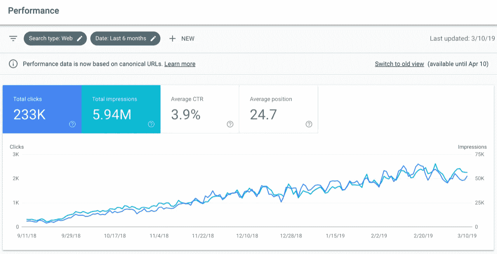

# 如何在 2019 年通过客座博文登顶

> 原文：<https://medium.com/hackernoon/how-to-hack-your-way-to-the-top-through-guest-posting-in-2019-e2c37c0675ba>

[**Case study from 0 to 60k visitors/mo!**](https://www.serptrust.io/case-study-from-zero-to-60k-visitors-per-month/)

无论你卖的是手工编织的婴儿童靴还是高端技术产品，当你有一个在线业务时，你能做的最重要的事情就是增加你网站的流量。

没人愿意这么想。我们愿意相信我们的产品会畅销。

但严酷的事实是，即使你有世界上最有用、最创新的产品，如果不知道它的存在，也没人会买。

## 营销是销售的关键

这就是为什么公司一直在寻找新的方法来增加网站的流量。

任何时候你研究新的方法来增加你网站的流量，你一定会在网上看到一些人的故事，他们在某个方面或几个月内达到了他们领域的顶峰。

这些故事让人感觉好得难以置信，尤其是如果你已经苦干了一段时间，为你网站上的每一个新观点而奋斗。

但事实是，任何人都有可能通过使用经过验证的最佳实践让自己的网站获得浏览量。

## 一个最佳实践是善待你的现有客户

人们会告诉你在你的网站上建立一个社区和提供优质客户服务的重要性。

这些技巧是从实体店时代延续下来的，在那个时代，风度翩翩是让顾客超过竞争对手再次光顾你的最佳方式。

**而这些技术*做*的事。**

但不像夫妻店突然出现在市中心的主要街道上，你不能指望人们偶然发现你的网站。有如此多的网站可以阅读，这是不现实的。

因此，需要新的技术来让这些客户进门，可以说，第一次。

在 [**SerpTrust**](https://www.serptrust.io/) 这里，我们认为实现这一目标的最佳方式不是在脸书购买广告位，也不是在 YouTube 上购买横幅广告。

我们相信，提高网站流量的首要方法是使用客座博文。

今天，我们将向你展示为什么我们相信这一点，以及你如何通过客座博文成功登顶。

# 什么是客座博文？

在你通过客座博文成功登顶之前，你需要知道什么是客座博文。

从根本上来说，客座博文意味着为其他人的网站写内容，并在文章中的某个地方提供链接，将读者引向你网站上的某个页面。

一篇成功的客座博文会非常适合其他网站的定位，以至于他们会想把它推广给他们的目标受众。

他们会在脸书或推特上分享它，并为那篇文章做大量的后端推广，所以你不必这么做。

好的客座博文写得很好，能为读者提供价值。

## 它们不仅仅是塞满关键词的废话

虽然这种策略在几年前可能会奏效，但现在，互联网上有太多的噪音，唯一突出的是重要的片段。

因此，要让客座博文发挥作用，它们必须回答人们想知道答案的问题，或者讲述人们想阅读的故事。

通常，客座博文在博客上效果最好，因为成功的博客需要持续不断的新内容。

与此同时，博客们有时想休息一下，或者有时间陪伴家人。向他们提供读者会喜欢的高质量内容，就为他们提供了一种服务。

因为这将同时增加你网站的流量，这对双方都是双赢的局面。

其他喜欢客座博文的网站是需要定期制作大量内容的网站，包括新闻网站、论坛和可信的信息页面。

这些网站只有通过每天都有有趣的新东西来留住他们的访问者，所以一篇免费的文章往往会在这些地方很受欢迎。

# 客帖如何提高排名？

我们已经讨论了什么是客座博文，但我们还没有解释的是客座博文如何增加你网站的流量并提高你的排名。

为别人写内容会增加你网站的流量，这看起来似乎是反直觉的，但它确实会！

为了解释这是如何工作的，我们首先需要讨论一些叫做搜索引擎优化(SEO)的东西。

## SEO 和你

客户找到网站的首要方式是使用搜索引擎。

在脸书、LinkedIn 或 Twitter 等网站上投放广告是增加网站流量的一种策略，但在谷歌和雅虎搜索上获得比竞争对手更高的排名要好得多。

搜索引擎优化(SEO)是人们使用的一个花哨的术语，意思是确保搜索引擎知道你的网站是关于什么的，以及哪些访问者对访问你的网站最感兴趣。

## 为什么这很重要？

研究表明，谷歌排名第一的 T2 获得了 32.5%的搜索流量。位置 2 获得 17.6%的流量，位置 3 获得 11.4%的流量。

这意味着谷歌前 3 名获得超过 60%的流量。

如果你想想你是如何使用互联网的，那听起来是真的。

当你在谷歌搜索某样东西时，你可能也会点击你看到的第一个条目，而不是浏览几页数据。

通过确保你的网站拥有对你很重要的搜索关键词的前三名之一，你从你的竞争对手那里抢走了客户，并把他们吸引到你这里来。

搜索引擎致力于为客户提供特定搜索项的最佳内容。

当你用谷歌搜索“无麸质食谱”时，你希望搜索引擎中出现的前几个结果实际上是无麸质食谱。

为了给他们的浏览者提供尽可能好的内容，搜索引擎被编程为寻找两件重要的事情:

1.  你网站上的关键词告诉他们你的内容是关于什么的。
2.  来自其他网站的链接，证明人们足够信任你来谈论你并链接到你。

在过去，了解 SEO 的公司会在内容中过度使用关键词，与人交换反向链接，并创建指向其网站的自动链接。

你可以想象，这创造了人们不喜欢的起伏不定的网站。

由于这些粗略的做法，谷歌修改了其搜索引擎，以确保他们不会将人们引向这些难以辨认的网站。

今天，搜索引擎知道如何寻找关键字填充、反向链接交易、社会书签、网络目录、捐赠和奖学金页面以及垃圾博客评论。

这些不诚实的做法不仅无助于你的网站在谷歌中的排名，而且实际上是一面红旗，让你在谷歌中的排名*降低*。

搜索引擎知道没人愿意阅读这些内容，推广这些内容会让搜索者不太可能使用他们的搜索引擎。

正因为如此，搜索引擎每天都变得越来越聪明。

人们越是试图欺骗搜索引擎，谷歌就越是改进他们的算法，以确保用户有良好的搜索体验。

这就是为什么重要的是要知道你的公司是什么，并确保你有一个坚实的反向链接配置文件，引导你的流量时，它应该。

客座博文是关于创建真正的内容，将流量导向你的网站，并将继续将流量导向你的网站，不管搜索引擎对其算法做出什么改变。

## 内容是关键

客座博文为什么有用？

客座博文基于一个所有聪明的企业主都明白的简单前提:内容是关键。

搜索引擎的商业模式之所以有效，是因为人们依靠搜索引擎根据他们在搜索栏中输入的内容为他们提供最佳可用内容。

用户正在寻找问题的详细答案、操作方法文章、技巧和诀窍以及食谱等等。

换句话说，他们在寻找高质量的内容！

因为这是人们正在寻找的，搜索引擎永远不会降低那些真正提供好内容的网站的排名。

## 这是客座博文的关键

提供能给另一个网站带来流量的内容，并将这些内容链接到你的网站，反过来也会给你带来流量。

请这样想:

任何时候一个网站链接到你，他们都在告诉搜索引擎你在这个话题上要说的话很重要。

链接到你的网站越权威，谷歌就越认为你的网站是相关和可靠的信息来源。

就像你哥给你写推荐信和比尔盖茨给你写推荐信的区别。

单单比尔·盖茨的名字就会让这封推荐信更有分量，因为更多的人会关心他要说的话。

另一方面，他们会认为你的兄弟在说你的好话，因为你们是亲戚，或者因为他希望你会回报他。

> 编辑链接，这是来自一个有高质量内容的网站的反向链接，是搜索引擎在确定你的网站的特定关键词的排名时最看重的信任因素。

这就是为什么不仅要向其他网站提供客座博文，还要提供与其受众相关的客座博文。

你发帖的网站越想推广你的内容，就会有越多的人看到你公司的名字，谷歌就会越多地看到——并关心——你的公司与你的目标关键词的关联。

编辑链接的重要性也解释了为什么为一个不仅仅通过客座博文成名的网站写作更好。

一些网站将允许任何人为他们写作，并通过“为我们写作/成为贡献者”等足迹公开邀请人们这样做。

然而，这些网站并没有带来持续良好的流量。

虽然搜索引擎还没有抓住这些做法，但他们发现如何审查这些网站只是时间问题。

因此，如果你仅仅依赖这些类型网站的客座博文，当谷歌发布新的更新时，你很可能会看到你的流量大幅下降。

# 客帖如何带动流量？

所以，总而言之，客座博文通过为其他网站创造高质量的内容，然后从这些网站链接回你的网站，从而推动流量。

这反过来告诉搜索引擎，不仅你有关于某个特定主题的话要说，而且你要说的话是如此独特和重要，以至于另一个网站想与他们的观众分享这些信息。

搜索引擎认为这是对你网站的认可，并把你排在没有知名网站认可的竞争者之前。

反过来，在搜索引擎中排名越来越高，会有越来越多的人访问你的网站，从而带来更多的转化率和利润。

# 快速拓展指南

现在你明白了为什么客座博文是你品牌建设战略的重要组成部分，你的下一个问题可能是你如何在其他网站上获得客座博文。

外联过程可能很复杂，所以让我们一步一步来。

## 寻找潜在客户

在网站上发布客座博文的第一步是找到你可能想要发布内容的潜在网站。

一个理想的网站有足够的流量和排名，与你希望你的网站排名相同的关键词，但不是你的直接竞争对手。

直接竞争对手很少会愿意在他们的网站上发布会给你带来流量的内容，所以接触他们是浪费时间。

找到适合你的网站的一个好方法是访问一些你的直接竞争对手，看看他们的类别。

此外，考虑你在网站上使用的类别，这些成为你应该用来找到相关网站的关键词。

## 例如，假设你卖一个蛋白质棒

蛋白质可能是你用来查找网站的关键词。虽然你不想去其他卖蛋白质棒的网站，但你可能会去健身网站，那里有时会提到蛋白质的重要性。

像 Scrapebox 和 Linkclump 这样的工具可以让你搜索关键词，然后收集相关网站的链接。

这样，你可以一个链接一个链接地点击，而不是一次一个页面地写下网址。

请记住，某些网站的足迹是一个危险信号。

如果网站的帖子中有“为我们写作”或“成为贡献者”的字样，这表明网站的大部分流量可能来自其他公司的客座博文。

虽然这些链接现在可能会给你带来一些排名和流量，但谷歌在未来可以很容易地跟踪这一点，并使这些反向链接过时。

虽然这需要更多的时间，但最好是定期在真正创造独特内容的网站上写客座博文。

## 建立关系的重要性

那么，如何让正版网站愿意发表你的客座博文呢？

关键在于建立关系。

没有人愿意为一个不认识的人帮忙，如果突然请求发表一篇客座博文，可能会让人觉得有点垃圾，但如果他们觉得与你有某种默契，他们可能会更有兴趣听你说些什么。

你发出的第一封邮件应该有一个引人注目的标题，而不应该只是推销你所能提供的东西。

这里的目标是，首先，防止你的电子邮件进入垃圾邮件箱，其次，确保收件人确实阅读了邮件。

一种方法是散弹枪方法，你给他们一个简单的问题，他们可以很快回答。

这个问题可能是这样的

> 嘿，我对你的网站设计印象深刻。我自己也想找一名网页设计师；你能和我分享一下你用了谁吗？

这些快速的问题不会让你觉得很无聊，但是它们可以帮你打开一扇门，为你和网站所有者的对话打开大门。

一旦你收到回复，深入他们的网站，想出一个独特的客座博文。

推介应该是与他们的观众相关的，他们还没有写过的东西。

例如，假设你卖蛋白质棒，并准备在一个博客上向徒步旅行者推销。你可以发布一个关于沿途美味小吃的帖子，这将与他们的观众相关。

在这篇关于旅途中美味小吃的文章中，你知道你可以提到你卖的蛋白质棒，但是你也可以提供其他信息。

# 向潜在客户发送电子邮件的技术部分

我们之前提到过很难打开你的第一封邮件。

其中一个原因是垃圾邮件过滤器会阻止你的邮件被收件人看到。

当你发送邮件的人使用 Gmail 时尤其如此。在这种情况下，最好使用 G-Suite 来联系这些人。

某些电子邮件过滤工具也有帮助。

像 Never Bounce 或 ZeroBounce 这样的工具可以清除无效和未知的电子邮件地址，以确保它不会影响您的送达率。

来自 NeverBounce 的网站:

> 如果超过 10%的邮件是垃圾邮件，那么只有不到 44%的邮件会被投递。

而像 Mailgun 和 Woodpecker 这样的电子邮件递送服务可以帮助确保您的电子邮件能够送达预期的收件人。

# 撰写真实的客座博文

一旦你向一个网站提出了客座博文的想法，并且他们同意继续这个想法，你的下一步就是实际撰写客座博文。

重要的是要记住，即使一个网站说他们对客座博文的想法感兴趣，他们也不会局限于发布它。

如果你写的是低质量的客座博文，他们不相信他们的受众会在意，他们可能会说，“谢谢，但不谢谢。”

一旦他们决定你不能发表高质量的文章，你之前建立的任何关系都将化为乌有。

大多数时候，你没有第二次机会来证明你能写出他们想要的内容。

一旦他们认为你提供的内容不是他们所需要的，他们就会继续寻找能给他们想要的东西的人。

为了防止这种情况发生在你身上，确保你的客座博文提供人们真正关心的高质量信息是很重要的。

这意味着你不只是想让你的客座博文成为你产品的销售广告。

一定要坚持你同意的主题，做好你的研究，这样你就能给他们的听众提供尽可能好的信息。

## 不要只是复制别人已经写好的帖子

用你自己对信息的理解写出新的、独特的内容。

当你使用一个来源做研究时，在你的帖子中链接到它，在应该表扬的地方给予表扬。

考虑如果你是目标读者，你是否有兴趣阅读你正在写的文章。

如果答案是否定的，那就加点东西让它更有趣。

在客座博文中，以相关的方式链接到你的网站，并使用你想在谷歌中排名的关键词。

如果你想对“蛋白质棒”这个词进行排名，那么就让“蛋白质棒”这个词成为你网站的链接。

但是，要确保它能很好地融入文章，不要感觉像是一句奇怪的废话。

当你的客座博文写好后，在发布之前，使用 Grammarly 这样的服务来仔细检查拼写和语法。

在寻找潜在客户、建立关系和撰写客座博文之间，很容易看出这个过程需要花费大量时间才能正确完成。

使用客座博文作为你的主要流量驱动策略无疑是有效的，但它本身很容易成为一份全职工作。

外包一些工作可以让你扩大规模，更有效地完成这个过程，最终更有效地完成。

# 我们如何使用客座博文？

如果你对使用客座博文作为你整体流量建设策略的一部分感兴趣，但又不觉得你有时间做客座博文所涉及的所有事情，那么外包可能是你最好的选择。

## SERPTRUST 提供的价值

SerpTrust 的商业模式围绕着为公司提供客座博文，这些客座博文实际上会为他们的网站带来流量。

我们通过以下方式做到这一点:

首先，我们审查网站，确保选择高质量的网站，这些网站实际上会为您的网站带来流量，同时消除无用的垃圾网站。

随着时间的推移，我们通过不断向这些网站提供他们的观众关心的高质量作品来建立与这些网站的关系。

我们使用我们的天才作家团队来提出创造性的主题，在您的产品和我们将发布客座博文的网站之间形成完美的匹配。

我们使用经过实践检验的真实方法来写文章，以确保文章的高质量和发表。

最后，在让你看了帖子之后，我们会将帖子发送到我们选择的高质量网站，并快速发布，这样你就可以开始享受反向链接的好处了。

结果呢？

对 SerpTrust 来说，为客户拓展业务是常规，而不是例外。

我们已经对众多客户反复这样做了。

事实上，让我们来看看我们的一个客户在使用客座博文作为他们建立受众的主要策略时的结果。

# 案例研究总结

在我们的网站上，我们讨论[我们的一个客户如何在不到一年的时间里从每月 0 到 6 万访客](https://www.serptrust.io/case-study-from-zero-to-60k-visitors-per-month/)。他们指数增长曲线的关键？

你猜对了:他们使用我们的客座博文服务来飙升他们的流量，结果是他们的利润。

事实上，在谷歌发布其[医疗更新](https://www.seroundtable.com/google-medic-update-26177.html)后，我们就开始在这个网站上与这个客户合作。

在医疗更新之后，许多公司不得不改变他们的策略来保持他们的流量稳定。

然而，在这个客户的案例中，他们没有动摇。

这是因为，正如我们前面提到的，无论搜索引擎如何改变策略，客座博文仍然是增加网站流量的可行方式。

因为客座博文依赖于向客户提供高质量的内容，所以像谷歌这样的搜索引擎没有理由改变它们的算法来限制客座博文的成功。

事实上，我们在该案例研究中概述的客户已经不止一次使用了这种策略。一次又一次，雇佣我们的客座博文服务增加了他们的流量，从而增加了他们的收入。

# 值不值这个成本？

任何时候你考虑为你的网站雇佣一项服务，你都会质疑这项服务的成本是否“值得”这是很好的商业意识。

这里要考虑的重要事情是你的投资回报。

前期的一点钱可以启动你的流量，并随着时间的推移保持增长。这反过来又增加了日复一日看你网站的眼球数量。

SerpTrust 提供的一个很棒的东西是 [**基于你的需求的多种软件包**](https://www.serptrust.io/guestpost/) 。

你可以选择让 [**的客座博文按菜单制作**](https://www.serptrust.io/guest-posts/) ，这允许你选择为哪些网站撰写内容，允许你参与决定接收哪些流量。

或者，如果您没有时间，但仍然希望撰写客座博文，我们的 [**客座博文包**](https://www.serptrust.io/guest-post-packages/) 允许您在我们从综合数据库中选择的网站上撰写客座博文。

我们还提供定制推广服务和 [**链接插入服务**](https://www.serptrust.io/curated-backlinks/) 。

事实是，我们在客座博文上是老古董了。

我们关心这个行业，所以我们不断更新我们的网站数据库，提出新的和创新的宣传，并建立关系。

所有这些工作都需要你自己花时间去做——正如任何企业主都会告诉你的，时间就是金钱。

当你考虑支付员工全职工作的成本时，这个成本是非常值得的——特别是因为一个有薪酬的员工仍然没有我们所拥有的经验和资源。

# 最后

在 [**SerpTrust**](https://www.serptrust.io/) 这里，我们真诚地相信*任何人*都可以为他们的网站带来流量，只要他们知道最新的 SEO 技术，并愿意投入资金来增加流量。

2019 年，客座博文是增加你网站流量的关键，反过来，也是增加你收入的关键。

你为实现这一目标而投入的投资可以是你的时间，也可以是你的金钱——当时间就是金钱时，时间就是金钱。

让我们的专家来管理您网站的流量，让您有时间做自己擅长的事情。

因为我们可以把流量给你，但是只有你才能给他们一个他们到了之后关心的产品或者服务。