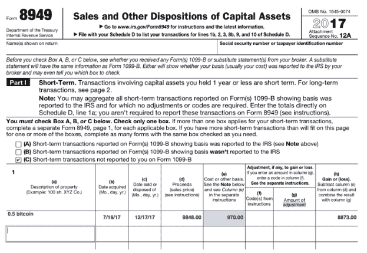
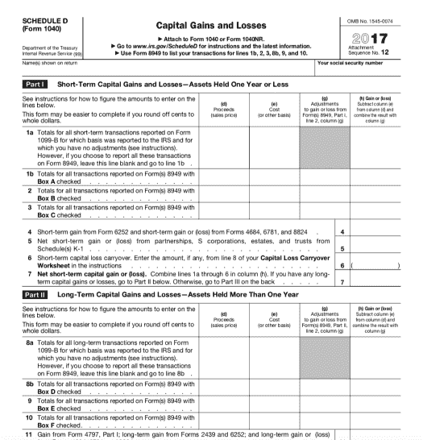

# 作为大规模加密货币交易商，如何处理纳税申报

> 原文：<https://medium.com/hackernoon/how-to-handle-tax-reporting-for-high-volume-cryptocurrency-traders-7923eaeabfd2>

过去几年，比特币的戏剧性涨跌和加密货币的彻底爆发让许多交易员和爱好者想知道如何在税收中申报加密货币。这篇文章深入探讨了大量加密交易商纳税申报的细节。

如果你正在读这篇文章，你可能是一个密码交易者，或者是一个热衷于为你的交易活动缴税的人。也许你有一个自动化交易策略，每个月进行数百笔交易，现在你意识到你没有办法计算你真正的纳税义务。也许你在交易加密货币时损失了很多钱，你现在想要索赔这些损失，以尽可能多地节省你的税单上的钱。

不管你的情况如何，你可能已经做了一些交易，现在你想确保你合法地申报了所有的税。你是怎么做到的？

# 第一步:计算你的资本收益/损失

对于您进行的每一笔交易，即使只是硬币对硬币的交易，您也需要知道您的成本基础，并且需要知道交易时密码的公平市场价值。要计算你的收益和损失，你只需遵循以下等式:

> ***公允市场价值—成本基础=资本利得/损失***

**什么是成本基础？**

成本基础是用于税收目的的资产的原始价值。在加密的世界里，你的成本基础本质上是你获得硬币的成本。

**什么是公平市值？**

从最简单的意义上来说，公平市场价值就是一项资产在公开市场上的售价。同样，对于加密货币，公平市场价值是指在出售时硬币的美元价值。

> ***举例:***

假设你购买了价值 100 美元的比特币，包括交易和经纪费。那 100 美元目前大约可以买到 0.01 个比特币。现在让我们假设两个月后你把你所有的 0.1 比特币换成了 0.16 以太。在这个交易的时候，0.1 比特币的价值已经上升，比你最初以 160 美元购买时的价值还要高。160 美元是公平市价，100 美元是你的成本基础。这使得你的资本收益等于 60 美元，这是你必须申报和纳税的数额。

我知道你在想什么，在这个世界上，我怎么能对我过去一年做的每一笔交易都这样做呢？如果你没有保存详细的电子表格，这可能是一项不可能完成的任务。对于高交易量的交易者来说，最好的处理方式是简单地使用加密税务软件，如 [CryptoTrader。税](https://www.cryptotrader.tax/)。该软件将在几分钟内计算出你的资本利得负债，并为你提供一份可导出的报告(8949 表格)交给税务人员。

**如果我交易时赔钱了怎么办？**

这个过程与上面的例子完全相同；但是，由于 crypto 在税收上的处理方式，您实际上可以注销您的损失并节省资金。

一些交易员正在申报他们的损失，并在他们的税单上节省了数千美元。你可以通读这篇文章，了解如何处理你的[税收目的的加密损失。](https://www.cryptotrader.tax/blog/how-to-handle-your-bitcoin-and-crypto-losses-for-tax-purposes)

好了，我已经准确计算了我的资本损益，现在该怎么办？

下一步是实际收集国税局要求的正确表格，以报告你的资本收益或损失。

# 步骤 2:表格 8949 和 1040 附表 D

[附表 D](https://www.irs.gov/forms-pubs/about-schedule-d-form-1040) 是你用来报告所有个人财产的资本损益的表格。这包括汽车、艺术品、收藏品、股票和债券，当然还有你的加密货币。这是您将最终报告您的加密交易活动的资本收益的表格；然而，在填写附表 D 之前，你必须在 8949 中详细说明你的所有交易。

为了正确地填写 8949，你需要知道那些你计算实际资本收益所需要的东西。

**听起来像是头疼？**

如果您一年中有大量交易，您可以使用 [CryptoTrader 自动创建 8949 和整个加密纳税申报流程。税收](https://www.cryptotrader.tax/)。然后你可以把表格交给密码商。税收出口到您的注册会计师或税务专业人士或上传到您最喜欢的报税软件，如 TurboTax。

总的来说，这个过程并不复杂。跟踪你所有的加密货币交易和必要的数据。使用该数据正确填写 8949 表格。把你 8949 的总收益转到你的 d 表中。把它和你剩下的报税表一起送过去。

# 关于虾皮

Shrimpy.io 是一个加密管理工具，任何人都可以管理自己的加密货币资产，如指数投资组合或共同基金。用户能够配置定制的加密货币组合，并实施被动管理策略，消除了必须主动交易加密的麻烦。

除了免费的加密交易和投资组合管理，Shrimpy 还提供每月订阅服务，包括以下内容:

*   [社交](https://www.shrimpy.io/pricing):跟踪、交流和分享其他交易者的策略
*   [洞察](https://blog.shrimpy.io/blog/shrimpy-introduces-social-insights):了解其他 Shrimpy 用户如何构建和管理他们的加密组合。
*   [高级回溯测试](https://blog.shrimpy.io/blog/the-crypto-portfolio-rebalancing-backtest-tool):用于评估定制加密货币投资组合&策略的强大回溯测试工具。

免费报名:[https://www.shrimpy.io/signup](https://www.shrimpy.io/signup)

[电报](http://t.me/ShrimpyGroup)

[推特](https://twitter.com/ShrimpyApp)

[脸书](https://www.facebook.com/ShrimpyApp/)

David Kemmerer 的客座博客。税收

声明:在这篇客座博文中表达的观点、意见和立场仅属于作者个人，不代表 Shrimpy 的观点、意见和立场。本文中任何陈述的准确性、完整性和有效性都不保证。我们对任何错误、遗漏或陈述不承担任何责任。此内容的版权属于作者，任何与侵犯知识产权相关的责任由作者承担。

本网站提供的信息不构成投资建议、财务建议或交易建议。在做出任何投资决定之前，请进行您自己的尽职调查并咨询您的财务顾问。Shrimpy 不对您根据网站上提供的信息做出的投资决定负责。

*原载于*[*blog . shrimpy . io*](https://blog.shrimpy.io/blog/tax-reporting-for-high-volume-cryptocurrency-traders)*。*