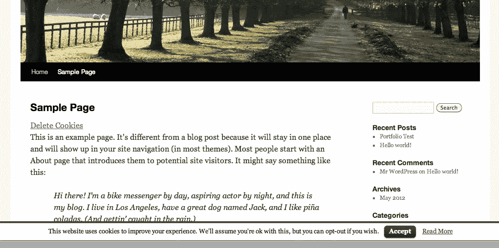

# 如何隐藏恼人的 Cookie 使用权限请求[浏览器扩展]

> 原文：<https://medium.com/hackernoon/how-to-hide-annoying-cookie-usage-permission-requests-in-chrome-13f41b1acdbc>

Img source: agent.media

最近，我发现了一个扩展，可以删除所有烦人的弹出窗口和显示栏，警告你他们正在使用你的 cookies。

GDPR 法律已经在网上引起了很多恐慌，所以很多网站现在不断向我们发送大量通知，要求我们允许使用我们的 cookies。我…