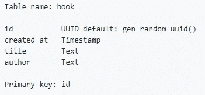
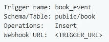

# 如何使用 Hasura GraphQL 引擎和 Next.js 实现 ETL 应用

> 原文：<https://medium.com/hackernoon/how-to-implement-etl-application-using-hasura-graphql-engine-and-next-js-4e528ae3a8bd>

# **什么是 ETL💭？**

[**ETL**](https://www.webopedia.com/TERM/E/ETL.html) 是 ***e*** *xtract，****t****transform，****l****oad*三个数据库函数组合成一个工具，从一个数据库中取出数据，放入另一个数据库中。

*   **提取**是*从数据库中读取数据*的过程。在这一阶段，通常从多种不同类型的来源收集数据。
*   **转换**是***将提取的数据*从其先前的形式转换成其需要的形式，以便将其放入另一个数据库的过程。通过使用规则或查找表，或者通过将数据与其他数据相结合，可以进行转换。**
*   ****加载**是*将数据*写入目标数据库的过程**

**在 hasura 给出的样例 app 中，serverless-etl app 就是其中之一。我将展示如何使用 Next.js 实现它。**

**这是 hasura 给出的例子的[链接](https://github.com/hasura/graphql-engine/tree/master/community/sample-apps/serverless-etl)。**

**这个应用程序的主要特点将是:-**

*   **将图书添加到数据库**
*   **数据库中的数据保存在 algolia 索引中**
*   **在 algolia 索引中搜索这本书**

## ****我们将如何实现它？****

**我们将使用 graphql 突变将图书详细信息插入到数据库中，当一些内容被插入到数据库中时，将触发一个事件，该事件将使用数据库中插入的数据更新 algolia 索引，并且在搜索时可以从 algolia 索引中检索该数据。就是这样！就这么简单。**

## ****先决条件:****

*   **阿尔戈利亚账户**
*   **Hasura GraphQL 发动机(HGE)安装**

**既然你准备好了，我们就开始吧！**

# ****设置基本 Next.js 项目和 Graphql 引擎****

**第一步是使用`yarn create next-app etl-example`创建一个 next.js 项目。这个命令将为我们将要处理的 next.js 项目创建一个基本的样板文件。**

**从下面的要点中添加 package.json 文件中不存在的包和脚本，并使用`yarn install`安装它。**

**接下来使用 [one-click](https://heroku.com/deploy?template=https://github.com/hasura/graphql-engine-heroku) deploy 选项设置一个 Hasura GraphQL 引擎，记下部署的 url，并使用以下代码在根文件夹中创建一个 **config.js** 文件**

**用部署的 hasura 引擎的 url 替换`herokuapp-url`。如果有的话，在配置对象中添加身份验证头。**

# **创建图书表格**

**我们将有一个名为 **book** 的单个表，其中包含书名和作者等书的详细信息。为此，我们必须转到 Hasura GraphQL 引擎控制台并创建下表**

****

**book table**

# **设置 Algolia 指数**

**下一步是建立一个 Algolia 指数，按照下面给出的指示。**

*   **注册 [Algolia 账户](https://www.algolia.com/)**
*   **转到仪表板，**
*   **点击左侧工具条上的`Indices`选项卡**
*   **点击`New Index`按钮**
*   **命名为`demo_serverless_etl_app`**
*   **转到侧边栏上的`API Keys`标签**
*   **复制`Application ID`(我们称之为`**ALGOLIA_APP_ID**`)**
*   **点击`All API Keys`选项卡，然后点击`New API Key`按钮**
*   **描述为`server key`**
*   **选择`demo_serverless_etl_app`索引**
*   **选择 ACL 部分下的`Add records`**
*   **点击`Generate`并从列表中复制这个 API 键(我们称之为`**ALGOLIA_ADMIN_API_KEY**`)**

# **设置 webhooks**

**当一些数据被插入到数据库中时，为了将数据添加到 algolia 索引中，我们将需要一个在数据插入时触发的 webhook，这个 webhook 将把插入的数据添加到 algolia 索引中。对于单个 api 端点来说，拥有一个单独的服务器是没有意义的。我们可以做的是设置一个节点服务器，为 webhook 添加 api 端点，并将所有其他 url 路由到 next.js 处理程序。**

**对于节点服务器，我们必须在根目录下创建一个名为`server.js`的文件，并从下面复制内容。当数据被插入表格并添加到 algolia 索引中时，路径`/webhook`将用于触发事件。在代码中的空白处添加您的 algolia APP_ID 和 ADMIN_API_KEY。**

# **构建前端**

**接下来，我们将设置我们的页面，其中我们将接受作者姓名和书名，这将被添加到数据库中，还有一个搜索栏，您可以在其中搜索任何书籍。在`post`文件夹中创建一个名为`index.js`的文件，添加以下代码，并用您的值替换 algolia api 变量。**

****

**Search Component**

****react-instantsearch-dom** 包提供的 **InstantSearch** 组件会自动执行搜索魔法。你不必担心编码所有这些搜索的东西😉。**搜索框**组件将呈现搜索框，而**点击**组件将呈现您的搜索结果**

# **部署**

**现在我们已经准备好了服务器，把它部署到任何地方，比如说 [glitch](https://glitch.com) ，你将得到一个已部署服务器的 url。**

# **创建事件触发器**

**我们的下一步是在向数据库添加新书时创建一个事件触发器，为此，请转到 Hasura Graphql 引擎控制台中的`Events`选项卡，并添加一个新的触发器。将 **< TRIGGER_URL >** 替换为**<SERVER _ URL>/web hook。****

****

**Trigger**

**现在你可以在你的浏览器中打开<server_url>看看神奇之处！😉</server_url>**

**就这样，我们准备好了 ETL-demo🙌。我没有在代码中添加任何样式。如果你想让它看起来更棒，只需添加所需的 css 并使其更好😎。**

**链接到 gists :- [index.js](https://gist.github.com/aswinzz/58e91f9c3b843cde3835deacc79804bf) ， [server.js](https://gist.github.com/aswinzz/d062678d14df02b6063217c4b81e0e94) ， [package.json](https://gist.github.com/aswinzz/cff43e3ff51ff689454e5234308656cc)**

# **关于我**

**我的名字是 [**Aswin VB**](http://aswinzz.me) 。我是阿拉哈巴德印度信息技术学院的一名本科生，正在攻读信息技术的学士学位。**

**我喜欢创造和学习新事物，当我有空的时候我总是这样做。我喜欢用 J **avaScript 和 Python** 编写代码。**

**你可以在 [Twitter](https://twitter.com/aswinvb1) 和 [GitHub](https://github.com/aswinzz) 上关注我。**