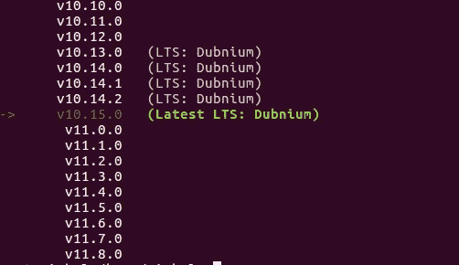
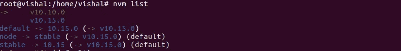

# 如何使用 NVM(节点版本管理器)在 Ubuntu 16.04/18.04 上安装 Node.js

> 原文：<https://medium.com/hackernoon/how-to-install-node-js-on-ubuntu-16-04-18-04-using-nvm-node-version-manager-668a7166b854>


# 介绍

NVM 基本上是 [Node.js](https://nodejs.org/en/about/) 的版本管理器。在 NVM 的帮助下，我们可以安装和使用多个版本的 Node.js 以及 NPM。如果我们有多个 Node.js 项目有不同版本的 Node 和 npm，那么总是只使用 NVM 安装 node。

# NVM 的安装

首先使用 cURL 下载 NVM 安装脚本，如下所示

```
$ curl -o- https://raw.githubusercontent.com/creationix/nvm/v0.34.0/install.sh | bash
```

下载脚本后，使用 bash 运行脚本，如下所示

```
$ bash install_nvm.sh
```

要反映当前用户会话的更改，请使用以下命令

```
$ source ~/.profile
```

按如下方式检查安装的 NVM 版本

```
$ nvm --version
```

使用以下 nvm 命令列出所有可用的 node.js 版本

```
$ nvm ls-remote
```

它显示的输出如下



## 使用以下 nvm 命令安装特定的节点版本:

```
$ nvm install 10.15 # it will install node 10.15.0
```

要查看所有已安装的节点版本，使用 **nvm 列表**如下:



要使用特定的节点版本，请使用

```
$ nvm use 10.15 # it will use node 10.15.0
```

要检查节点和 npm 版本，请使用以下命令:

```
$ node -v
$ npm -v
```

# **结论**

现在使用 NVM 成功安装了 Node.js 和 npm。管理具有不同节点版本的各种 nodejs 项目将非常有用。希望这篇指南能帮助你在 ubuntu 环境下安装节点。

谢谢大家！！！