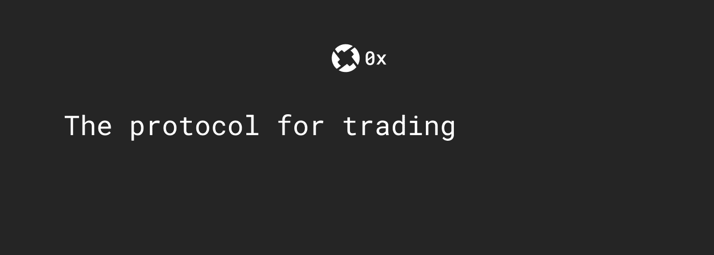
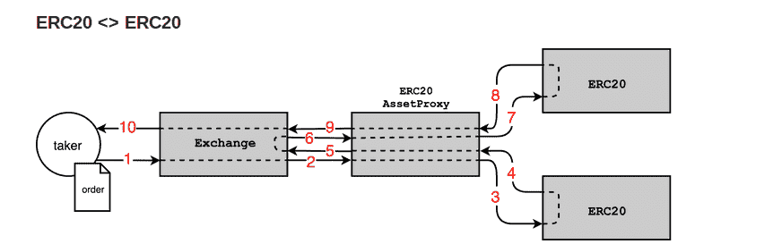

# 如何集成 0x(ZRX)协议来设置您自己的分散交换(DEX)

> 原文：<https://medium.com/hackernoon/how-to-integrate-0x-zrx-protocol-to-setup-your-own-decentralized-exchange-dex-584daea7a8f0>

什么是 0x 协议，它是如何工作的？在此了解更多关于 **0x 协议**、其链外顺序中继和其分散式交换中继的信息，以及如何使用 0x 智能合约在以太坊公共或私有网络上创建自己的分散式交换(DEX)。



Ref — [https://cdn-images-1.medium.com/max/800/1*1SkgYeGxQ6nn_WF6zgWVpQ.gif](https://cdn-images-1.medium.com/max/800/1*1SkgYeGxQ6nn_WF6zgWVpQ.gif)

# 什么是 0x 协议？

0x 是一种开放协议，支持以太坊区块链上的对等资产交换。

开源基础设施使开发者和企业能够构建能够购买和交易加密令牌的产品，包括所有 ERC-20 和 ERC-721 资产。

> ***我们先来讨论一下 0x 协议的特点。***

# 0x 协议的特点

*   *安全的非托管交易*
*   *灵活的订单类型*
*   *建立业务*

## 安全的非托管交易

支持无存款或取款的钱包对钱包代币交易。

## 灵活的订单类型

选择以特定的“立即购买”价格出售资产，或允许潜在买家投标。

## 建立企业

通过对每笔交易收取费用，将你的产品货币化，并加入 0x 生态系统中越来越多的中间商。

上面列出的 0x 协议的特征赋予了分散交换功能。

# 使用 0x 协议的好处-

0x 协议使用模块化方法在以太坊区块链上交易资产。

*   **稳健的智能合约**
*   **可扩展架构**
*   **高效设计**

## 稳健的智能合约

0x Protocol 的智能合同已经通过了两轮严格的安全审核。

## 可扩展架构

0x 的模块化管道使您能够通过可扩展的 API 插入自己的智能合同。

## 高效设计

0x 的带链上结算的链外订单中继是一种非常有效的 P2P 交易方式。

0x 协议可用于多种用例，如游戏和收藏品、市场预测、分散交易订单簿、分散贷款等等。

接下来是“0x 协议的智能合约”。0x 使用以太坊区块链的模块化智能合约，可以通过治理进行升级，而不会影响系统的其他组件，也不会导致活跃市场的中断。

# 0x 协议的智能合约

*   **交换合同**
*   ERC20 代理合同
*   **ERC721 代理合同**

## 交换合同

交换合同包含 0x 协议的业务逻辑，交换合同是-的入口点

1.  填写订单
2.  取消订单
3.  执行事务
4.  验证签名
5.  在系统中注册新的资产代理合同

## ERC20 代理合同

此合同负责代表用户转让 ERC20 令牌。因此，每个用户(ERC20 令牌持有者)必须批准此合同，以代表令牌持有者转移令牌。

## ERC721 代理合同

本合同负责转让 ERC721 令牌。因此，每个用户(ERC721 令牌持有者)必须批准此合同，以代表令牌持有者转移令牌。

为了部署和使用 0x 智能合同，您需要安装 0x.js。0x.js 是与 0x 协议交互的 JavaScript 库。通过使用该库，您可以轻松调用智能合约来创建、取消或验证订单，检查 ERC20 和 ERC721 令牌持有者的限额和余额。

## 为了深入了解 0x 协议并了解 0x 智能合约如何工作，我们需要了解 0x 协议的架构

0x 协议使用一种方法，我们称之为**带链上结算的链外顺序中继**。在这种方法中，加密签名的订单通过任意通信信道从区块链广播出去。感兴趣的交易方可以将一个或多个此类订单注入 0x protocol 的交易合同，以直接在区块链上执行和结算交易。



Exchange ERC20-ERC20 tokens — 0x-github(source)

可以使用 0x 协议来交换任何 ERC20 或 ERC721 资产。上图显示了当收款人在 exchange 智能合约中提交订单时，代币的实际转移是如何发生的。

1.  收单人使用交易所智能合约的 **fillOrder()** 函数向交易所智能合约提交已签署的订单。
2.  兑换合同将区块链结算订单传递给相应的 ERC 20 代理合同，代币的实际转让将在代理合同中进行。**注**:造单人和收单人在向交易所提交订单前必须批准 ERC 20 代理合同。
3.  从代理合同中调用相应的制单人令牌合同的 transferFrom() 函数。
4.  在制造商的 ERC20 令牌合同失败时恢复。
5.  从 from 代理合同恢复到交换合同。
6.  交换合同将订单从交换合同传递到 ERC 20 代理合同。
7.  从代理合同中调用相应的收款人令牌合同的 transferFrom() 函数。
8.  接受方 ERC20 令牌合同失败时的恢复。
9.  从 from 代理合同恢复到交换合同。
10.  返回填充结果。

> **现在我们将讨论使用 0x.js 库在以太坊上交易资产的 0x 智能合约的工作和部署。**

```
**Use npm install 0x.js — save to install and save 0x.js library**
```

# 0x 智能合同的部署步骤

为了与智能合约进行交互，我们需要部署 0x 智能合约，并使用智能合约的地址通过 0x.js 库与智能合约进行交互。

## Exchange 智能合同

在 [git](https://github.com/0xProject/0x-monorepo/tree/development/contracts/exchange) 上提供源代码，部署 exchange 智能合约，其中 exchange 合约的构造者不需要任何参数，智能合约的部署者(msg.sender)将是智能合约的所有者。

所有者将能够在交换合同中设置资产代理合同地址。

## ERC20 代理合同

在 [git](https://github.com/0xProject/0x-monorepo/blob/development/contracts/asset-proxy/contracts/src/ERC20Proxy.sol) 上提供源代码，部署 ERC 20 代理契约，其中代理契约的构造者不需要任何参数，智能契约的部署者(msg.sender)将是智能契约的所有者。

业主将能够在 ERC 20 代理合同中设置交换合同地址。

## ERC721 代理合同

在 [git](https://github.com/0xProject/0x-monorepo/blob/development/contracts/asset-proxy/contracts/src/ERC721Proxy.sol) 上提供源代码，部署 ERC 20 代理契约，其中代理契约的构造者不需要任何参数，智能契约的部署者(msg.sender)将是智能契约的所有者。

业主将能够在 ERC 20 代理合同中设置交换合同地址。

部署上述合约后，您需要将**交易所**合约的地址设置为**资产代理**合约，将**资产代理**合约的地址设置为**交易所**合约。调用函数**registerAssetProxy(**address ERC 20/ERC 721 proxy contract**)**函数 exchange smart contract 将存储 assetproxy contract 的地址，实际交易将在该地址进行，以交换令牌。

此功能只能由 exchange 智能合约的所有者调用。

*   要在 ERC 20 代理合同上注册交换合同，调用函数**addauthorizeddaddress(**address ExchnageContract**)。**
*   要从 ERC 20 代理契约中删除交换契约，调用函数**removeauthorizeddaddress(**地址交换契约**)。**

使用交换地址和资产代理契约通过 0x.js 库进行交互。

```
let contractConfig = {contractAddresses: {erc20Proxy: proxyAddress.toLowerCase(),erc721Proxy: "0x1d7022f5b17d2f8b695918fb48fa1089c9f85401",exchange: exchangeAddress.toLowerCase() },networkId: networkId};const contractWrappers = new ContractWrappers(holderEngine, contractConfig);
```

现在，您可以与部署在您的专用或测试网络上的 0x 协议智能合约进行交互。记住添加 RPC 子提供程序来与区块链交互。

## 为了与 0x.js 库交互，我们需要导入如下所示的相关包，最终目标是使用 0x.js 库从 maker 帐户创建订单，接受者将使用 fillOrder()函数提交以交换令牌。

```
*const {assetDataUtils,BigNumber,ContractWrappers,**generatePseudoRandomSalt,orderHashUtils,signatureUtils,} 
= require(‘0x.js’);**const TX_DEFAULTS = { gas: 400000 };**const { RPCSubprovider, Web3ProviderEngine } = require(‘0x.js’);*let newWallet = new ethers.Wallet(wallet.signingKey.privateKey, prov);const holderWallet = new PrivateKeyWalletSubprovider(wallet.signingKey.privateKey.slice(2));
```

## 添加 RPC 子提供程序

```
const holderEngine = new Web3ProviderEngine();holderEngine.addProvider(holderWallet);holderEngine.addProvider(new RPCSubprovider(providerUrl));holderEngine.start();In new RPC sub provider add custom URL to connect with blockchain that may be ethereum main net, test net or private blockchain.
```

## 获取协定地址并实例化协定包装

```
/ Instantiate ContractWrappers with the provider
const contractWrappers = new ContractWrappers(holderEngine, contractConfig);const web3Wrapper = new Web3Wrapper(providerEngine);const contractAddresses = getContractAddressesForNetworkOrThrow(100);//networkID
```

选择网络 id 以从 0x.js 库中获取智能合同的地址。

**现在，制作者(代币 a 的持有者)将创建要约，接受者(代币 B 的持有者)将提交或填写订单以交换代币。**

```
//contract Addresses
const tokenAAddress = contractAddresses.tokenA;const tokenBAddress = contractAddresses.tokenB;const exchange = contractAddresses.exchange;
```

所有的地址都是从 0x.js 库中获取的。

```
//encode all the necessary information about an asset into a single hexadecimal stringconst makerAssetData = assetDataUtils.encodeERC20AssetData(tokenAAddress);const takerAssetData = assetDataUtils.encodeERC20AssetData(tokenBAddress);const makerAssetAmount = Web3Wrapper.toBaseUnitAmount(new BigNumber(100), DECIMALS);const takerAssetAmount = Web3Wrapper.toBaseUnitAmount(new BigNumber(200), DECIMALS);const NULL_ADDRESS = ‘0x0000000000000000000000000000000000000000’;const ZERO = new BigNumber(0);
const DECIMALS = 18;
```

现在，制造商和接受者应批准相应的资产代理合同，以代表制造商和接受者转让代币。

```
//Allow ERC20 Proxy to move tokenA on behalf of makerAccount
const makerApprovalTxHash = await contractWrappers.erc20Token.setUnlimitedProxyAllowanceAsync(
    tokenAAddress,
    maker,
);
await web3Wrapper.awaitTransactionSuccessAsync(makerApprovalTxHash);// Allow ERC20 Proxy to move tokenB on behalf of takerAccount
const takerApprovalTxHash = await contractWrappers.erc20Token.setUnlimitedProxyAllowanceAsync(
    tokenBAddress,
    taker,
);
await web3Wrapper.awaitTransactionSuccessAsync(takerApprovalTxHash);
```

在制定者和接受者分别代表制定者和接受者批准资产代理合同以转让代币后。现在，创建者将创建一个要约并签署要约链，接受者将提交要约以交换令牌。

## 创建订单

```
const order = {exchangeAddress: exchangeAddress,makerAddress: maker,//address of makertakerAddress: taker,//address of takersenderAddress: taker,//address of senderfeeRecipientAddress: NULL_ADDRESS,//fee in the form of native currency of platformexpirationTimeSeconds: randomExpiration,//expire time of ordersalt: generatePseudoRandomSalt(),//random no to differentiate ordermakerAssetAmount,//maker asset amounttakerAssetAmount,//taker asset amountmakerAssetData,//encoded address of tokenAtakerAssetData,//encoded address of tokenBmakerFee: ZERO,//fee if requiredtakerFee: ZERO,//fee if required};
```

现在我们已经创建了一个报价；我们会在调用 0x.js 库的 getOrderHash()函数得到订单 hash 后，再来签署 offer。根据 [EIP712](https://github.com/ethereum/EIPs/pull/712/files) 规范对订单进行哈希处理。

```
const orderHashHex = orderHashUtils.getOrderHashHex(order);
```

获得订单散列后，订单生成者将使用 0x.js 库的 ecSignHashAsync()函数签署订单。

```
const signature = await signatureUtils.ecSignHashAsync(providerEngine, orderHashHex, maker);const signedOrder = { …order, signature };await contractWrappers.exchange.validateFillOrderThrowIfInvalidAsync(signedOrder, takerAssetAmount, taker);try{txHash = await contractWrappers.exchange.fillOrderAsync(signedOrder, takerAssetAmount, taker, {TX_DEFAULTS,});var transaction = await web3Wrapper.awaitTransactionSuccessAsync(txHash);}catch(error){}}
```

让我们快速回顾一下到目前为止我们所学的内容，然后通过介绍已经建立在 0x 基础上的项目来结束我们的讨论。

# 概述

*   0x 协议概述
*   0x 协议的特点
*   0x 智能合同的运作
*   Maker 使用 0x.js 创建报价
*   接受者向交易所提交报价

**下面列出了已经使用 0x 协议实现 DEX 和 order book 的项目。**

## 分散交换

[雷达继电器](https://radarrelay.com/)、 [paradex](https://paradex.io/) 、 [Star bitex](https://www.starbitex.com/) 、 [LedgerDex](https://www.ledgerdex.com/)

## 定货簿

[打开继电器](https://openrelay.xyz/)

> 感谢阅读。*希望本指南对您有用，并帮助您理解集成 0x(ZRX)协议以设置您自己的分散式交换(DEX)的过程*并且 [***也请查看我之前的博文***](https://hackernoon.com/how-is-security-token-different-from-utility-token-5d12d7109740) ***。*** [**在 QuillHash**](https://www.quillhash.com/) **，**我们了解 0x 协议，并拥有一个开发团队，他们可以在 0x(ZRX)协议之上开发 [**区块链应用，如 dApp、DeFi、DEX**](https://www.quillhash.com/blockchain/0x-protocol-blockchain-development) 。
> **我们再来讨论一下 0x(ZRX)协议，在我的电报手柄上 ping 我—**[**https://t.me/bigrkg**](https://t.me/bigrkg)