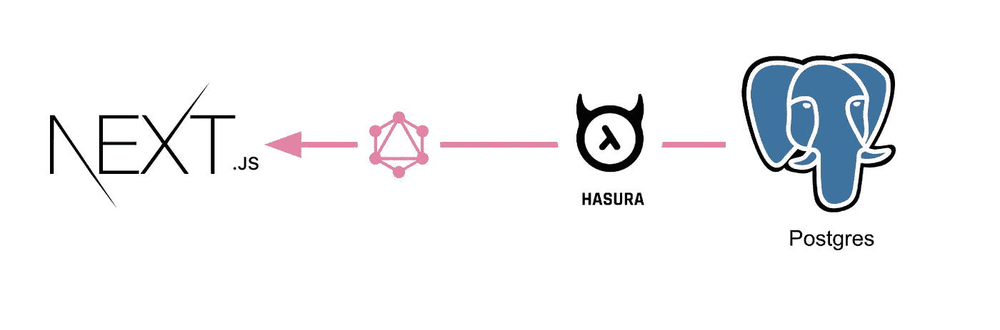
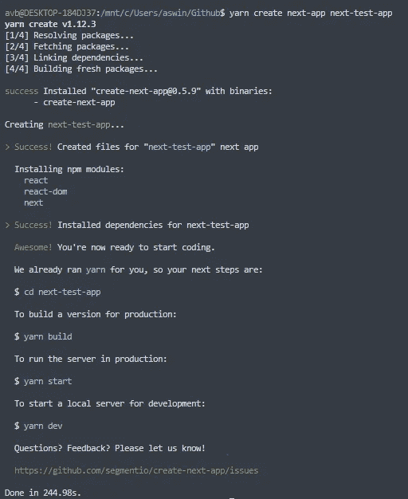
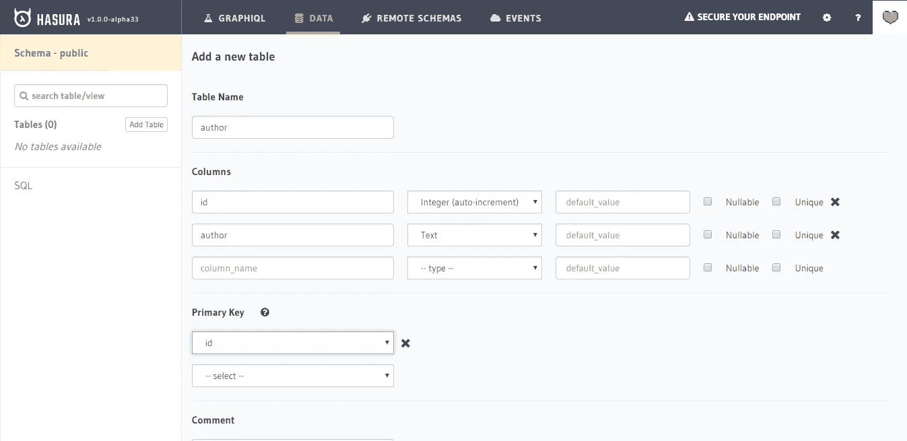
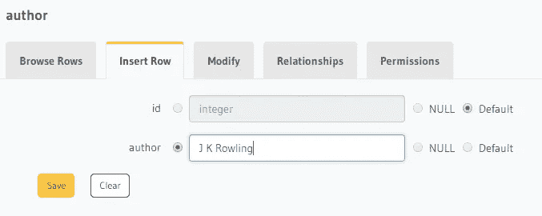
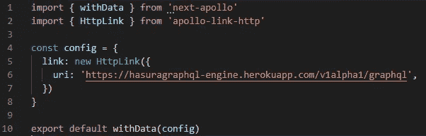
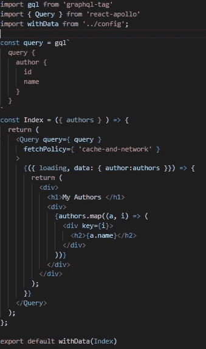

# 接下来如何整合。Js 和哈苏拉

> 原文：<https://medium.com/hackernoon/how-to-integrate-next-js-and-hasura-4a964424db6d>



在您开始这个项目之前，我假设您对 Next.js 和 Hasura 有基本的了解。在这篇博客中，我将展示如何整合 Next.js 和 Hasura。

# 接下来是什么。Js？

**Next.js** 是由 [Zeit](https://zeit.co/) 创建的 JavaScript 框架。它允许您使用 React 构建服务器端呈现和静态 web 应用程序。这是建立你下一个网站的好工具。它有许多很棒的特性和优点，可以让 Nextjs 成为构建下一个 web 应用程序的首选。

开始使用 Next.js 不需要任何 webpack 或类似的配置，它自带配置。您所需要的就是运行`yarn run dev`并开始构建您的应用程序😃。

既然你已经准备好了，让我们开始吧！


# 如何建立下一个？Js app？

我希望你知道 create-react-app，就像我们有 create-next-app 一样，它将完成设置 Next.js 项目所需的所有工作😉。

如果您使用 yarn 或 npx，有一个内置的软件包可以创建 next.js 应用程序，它们是:

```
yarn create next-app my-appnpx create-next-app my-app
```

如果您使用 npm，那么应该安装 **create-next-app** 包，使用该包可以设置一个新项目。

```
npm install -g create-next-appcreate-next-app my-app
```



create-next-app

正如您在图像中看到的，使用一个命令，所有的项目文件都已准备就绪。一旦项目设置完毕，将会显示启动和构建项目所需的命令。

构建项目运行`yarn build`

要启动本地服务器，请运行`yarn dev`

在生产运行中启动服务器`yarn start`

现在我们已经准备好了基本项目，让我们安装 hasura graphQL 引擎。

我们可以使用[一键式](https://heroku.com/deploy?template=https://github.com/hasura/graphql-engine-heroku)部署选项轻松设置 hasura-graphQL 引擎。一旦它被部署，你可以去部署的网址，你会有这样的东西。


在主页顶部记下网址。

```
[https://hasuragraphql-engine.herokuapp.com/v1alpha1/graphql](https://hasuragraphql-engine.herokuapp.com/v1alpha1/graphql)
```

单击顶部栏中的数据，并创建一个新表，如下所示



author table

在表中添加一个虚拟数据



Adding a dummy author

一旦 hasura 引擎安装完毕，我们就可以继续连接 Hasura 和 Next.js 了。

为此，我们必须安装 **graphql-tag** 、 **next-apollo** 和 **react-apollo。**

```
yarn add graphql-tag next-apollo react-apollo
```

一旦安装了上面的包，在根目录下创建一个 config.js 文件，并添加以下代码



将 uri 替换为您部署的引擎所指向的 url。这将为`withData`配置一个`httpLink`来连接到一个有效的 GraphQL 服务器 URL。

下一个任务是用来自`react-apollo`的`Query`组件包装您的页面组件，以便在服务器端呈现页面时可以获取适当的数据。

## GraphQL 查询

```
const query = gql`
   query {
    author {
     id
     name
    }
   }
`
```

## 用查询包装组件

```
<Query query={ query } fetchPolicy={ 'cache-and-network' }>
    {({ loading, data: { author:authors }}) => {
      return (
        <div>
          <div>
           {authors.map((a, i) => (
              <div key={i}>
               <h2>{a.name}</h2>
              </div>
           ))}
          </div>
        </div>
      );
    }}
</Query>
```

一旦这些代码被组合起来，我们将得到类似这样东西👇。



运行`yarn run dev`,你的 hasura-next.js 应用就启动并运行了。

在你的浏览器中打开[**http://localhost:3000**](http://localhost:3000)，你会在主页中看到我们在 hasura 引擎中创建的作者。


Authors page


就是这样，使用 Hasura Graphql 引擎创建 Next.js 应用程序是如此简单🙌。您可以扩展它以包括更多的功能和更好的外观和感觉。使用`yarn build`部署您的应用程序，这将为您提供静态版本，可以使用 Github 或 Netlify 轻松部署。

# 关于我

我叫 **Aswin VB** 。我是阿拉哈巴德印度信息技术学院的一名本科生，正在攻读信息技术的学士学位。

我喜欢创造和学习新事物，当我有空的时候我总是这样做。我喜欢用 J **avaScript 和 Python** 编写代码。

你可以在 [Twitter](https://twitter.com/aswinvb1) 和 [GitHub](https://github.com/aswinzz) 上关注我。