# 如何解释等高线图

> 原文：<https://medium.com/hackernoon/how-to-interpret-a-contour-plot-a617d45f91ba>

## 在 2D 等高线图中可视化三维表面

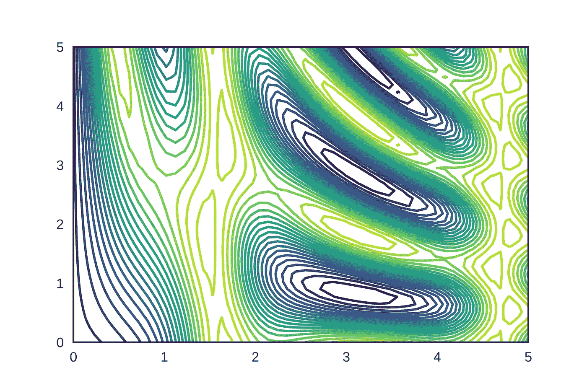

[Contour Plot](https://jakevdp.github.io/PythonDataScienceHandbook/04.04-density-and-contour-plots.html)

在三维空间中绘图是不方便的，等值线图是在 2D 空间中表示地块的一种有用的替代方法。等高线图使用等高线或彩色编码区域帮助我们在二维空间中可视化三维数据。等高线图还用于可视化深度学习/机器学习优化技术中的误差表面，如梯度下降、动量梯度下降、Adam 等

在本文中，我们将了解如何解释等值线图并使用等值线图可视化 3D 梯度下降误差表面。

> 引用说明:本文的内容和结构基于四分之一实验室的深度学习讲座— [Padhai](https://padhai.onefourthlabs.in) 。

让我们假设我的 3D 误差表面从正面看是这样的，

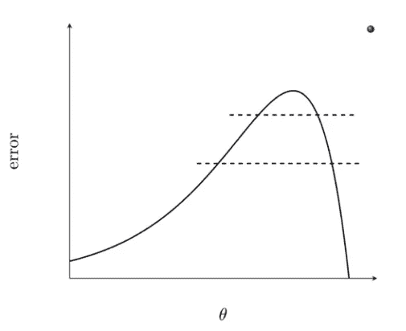

Front View of 3D Error Surface

图中的 x 轴表示两个参数 **w** 、 **b** 的组合，表示为一个参数θ，y 轴表示误差值。假设我沿着纵轴取这个误差曲面的水平切片。从顶部看误差表面会是什么样子？

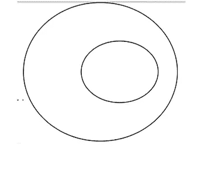

Top View of Horizontal Slices

内椭圆对应于误差表面上从顶部开始的第一个切片，外椭圆对应于第二个切片。每个水平切片就像一个切割这个帽子状误差表面的平面，并且围绕被切片的帽子的整个周长的损失函数值将是相同的。这意味着围绕内椭圆整个周长的损失函数值将是相同的。类似地，围绕外椭圆的整个周长的损失函数值将是相同的。

> 请记住，无论何时你在等值线图中看到一个边界，都要盲目地认为整个边界周围的损失值是相同的。

如果你从顶部注意到误差面，两个椭圆之间的距离是不相等的。在左侧，距离较大，而在右侧，距离较小。其原因是两个用红色标记的椭圆之间的最短距离对应于误差表面中斜率非常陡的区域。

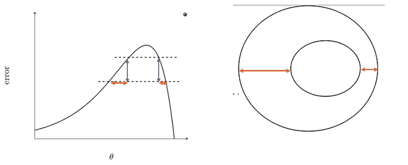

类似地，用黄色标记的两个椭圆之间的最长距离对应于误差表面中斜率稍微平缓的区域。

这个分析的关键是，

*   等高线之间的小距离表示沿该方向的陡坡。
*   等高线之间的大距离表示沿该方向的缓坡。

利用这种直觉，现在我们将看到一些 2D 等高线图，并理解如何解释它们。

假设我们有一个三维表面误差表面的 2D 等高线图，如下所示，现在你能想象三维表面会是什么样子吗？

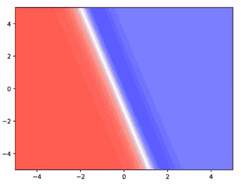

Guess the 3D Surface

红色阴影越深表示损耗值越高，蓝色阴影越深表示损耗值越低。对于本文中显示的所有等值线图，我将遵循相同的颜色模式。

您在等高线图中看到的每条有角度的线代表沿垂直轴的一次切割，这意味着误差(损失值)沿该线是相同的。如果观察图中最左侧的等高线(下图中用黄色标记),左侧没有其他边界或等高线表面，与右侧相反，右侧可以看到一组彼此非常接近的等高线表面。

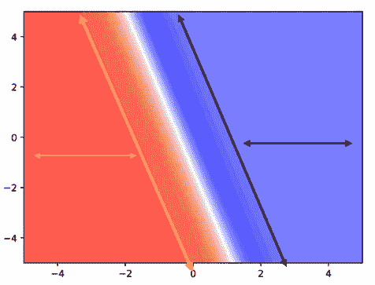

Contour Extremes

由于左侧没有等高线，我可以说两个等高线(标有黄色的等高线和位于左侧远处的其他等高线，如果有的话)之间的距离非常大，因为我在附近看不到任何等高线。如果等高线之间的距离很大，这意味着该区域的坡度非常平缓，因此 3D 图中的该区域将是平坦区域。

> 是低平区还是高平区？

这将是一个高平的区域，因为红色表示该区域的误差值很高。同样，如果我们观察图中最右端的等高线(下图中用黑色标记),右侧没有边界，这意味着该区域的斜率也非常平缓，这将是一个平坦区域，这将是一个低平坦区域，因为该区域的颜色为蓝色，这表明该区域的误差值很低

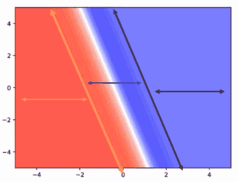

Look at the Middle Region

现在我们来看两个极端之间的区域(在上图中用紫色标记),它表明我们正在从高平坦区向低平区过渡，并且过渡非常迅速。如果你观察这个中间区域的等高线，它们彼此非常接近，我们知道如果等高线之间的距离非常小，这意味着等高线之间有一个非常陡的斜率。

现在让我们看看 3D 表面是什么样子的，

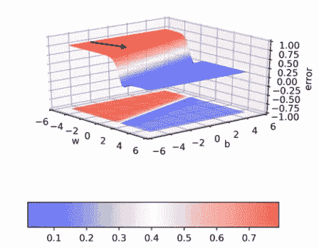

3D Surface

我们从高平表面(暗红色)开始，损耗值在很长一段时间内是恒定的，因为表面是平的。我们正非常迅速地从深红色区域过渡到深蓝色区域，因为这个区域的坡度非常陡。这就是我们如何解释等高线图，并想象从相应的 2D 表面看起来的 3D 表面的样子。

我们将看到一个更多的等高线图进行练习，然后我们将进入可视化梯度下降误差表面。

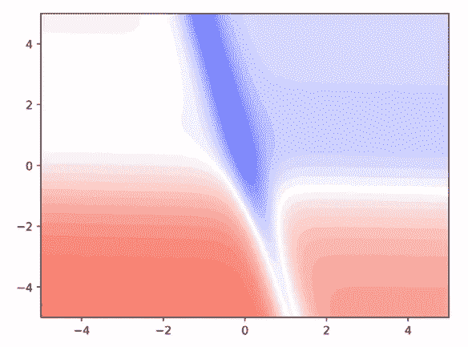

Guess the 3D Surface

我们将从图的角落开始，找出平坦表面或高原的位置，然后我们将找出山谷的位置。首先，通过观察下图中标记为(黑色)的区域，我们可以看到等高线之间的距离很大，这意味着这些区域的坡度较缓，这些是平坦的表面。

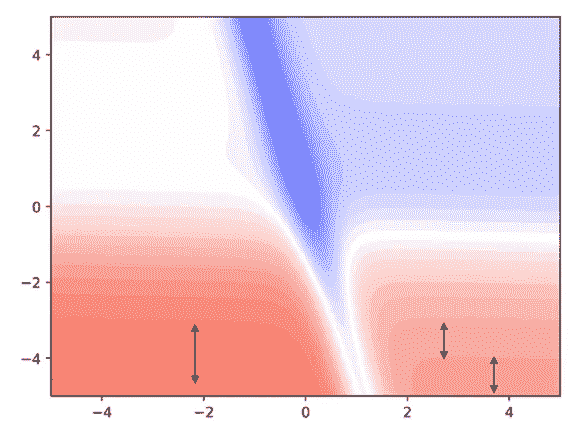

此外，相应轮廓之间的阴影差异不大，这意味着它们彼此接近，并且损失值在轮廓之间没有减少那么多。这些平坦区域将是高区域，因为它们的颜色被编码为红色，这表示这些区域中的误差值将是高的。

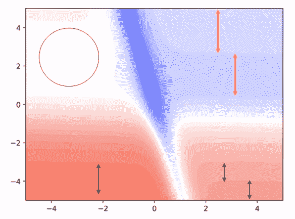

现在来看标有黄线的蓝色区域，等高线之间的距离很大，这意味着这些区域的坡度将很平缓，这些将是平坦的表面。这些区域中的误差值会较低，因为这些区域用浅蓝色进行了颜色编码。图中的白色区域表示，当我们在某处从红色过渡到蓝色时，我们会碰到白色。白色区域的误差值是中等的，不高也不低。

这个白色区域的拓扑也是一个平坦的平台，因为两个连续的橙色轮廓之间的距离很大。让我们看看 3D 表面会是什么样子，

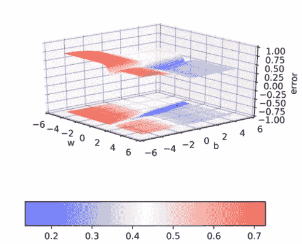

3D Surface

正如我们所解释的，根据误差值，我们在不同的高度有四个平台，所有这四个平台都迅速收敛到误差最小的山谷(深蓝色区域)。

# 在 2D 等高线图上可视化梯度下降

为了生成 3D 梯度下降损失表面，我已经获取了一些玩具数据，并在所有数据点上迭代了 1000 个时期，并计算了不同值的 **w** 和**b**的损失。一旦我获得了 **w** 和 **b** 的所有可能组合的损失值，我就能够生成一个动画来显示梯度下降规则的作用。

Gradient Descent Rule in Action (Animation)

底部的点表示 **w** & **b** (参数)的不同组合，轮廓上的点表示相应参数值的损失值。通过查看 3D 图，尝试想象 2D 等值线图的样子，从梯度下降损失动画中，您会观察到在最初的几次迭代中，曲线仍然在平坦的浅红色表面上，更新移动非常缓慢，这意味着我们预计等值线之间的距离很大。

一旦曲线到达平台的边缘，它会迅速收敛到深蓝色的山谷中，这意味着我们会期望连续的等高线彼此非常接近。现在让我们看看 2D 等高线是什么样子的，

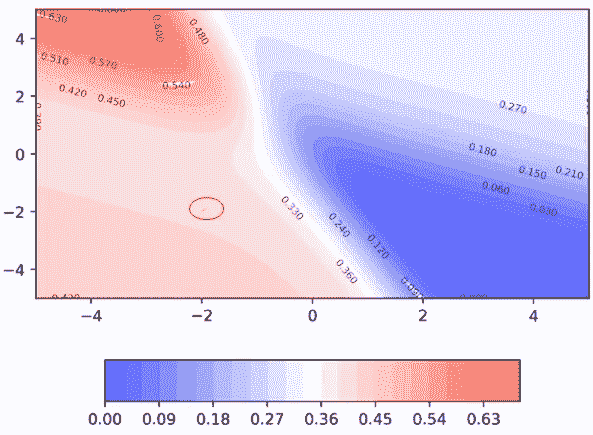

正如在梯度下降曲线开始的区域中所预期的，连续轮廓之间的距离很大。一旦曲线开始向深蓝色区域移动，我们可以看到连续轮廓之间的距离非常小，这表明沿着该方向有一个陡坡。

现在我们将看到一个动画，显示梯度下降更新如何在 2D 等高线图上移动。

The animation is a bit slow

大概就是这样，这就是我们解释等高线图的方式。

# 结论

在这篇文章中，我们已经看到，使用等高线之间的距离，我们可以知道梯度是如何沿着那个方向移动的，然后我们继续解释几个等高线图。然后，我们使用等高线图可视化 3D 梯度下降误差表面，并对其进行解释。

# 继续学习

作为一名数据科学家，一项重要的技能是创建可视化效果，以便向客户展示您的结果。Microsoft Excel 是整个行业中使用最广泛的数据分析和可视化工具之一。查看来自 [Starttechacademy](https://courses.starttechacademy.com/full-site-access/?coupon=NKSTACAD) 的 Abhishek 和 Pukhraj 的[微软 Excel 大师班:从零到英雄课程](https://courses.starttechacademy.com/full-site-access/?coupon=NKSTACAD)。

Photo by [Rashtravardhan Kataria](https://unsplash.com/@chilledinlife?utm_source=medium&utm_medium=referral) on [Unsplash](https://unsplash.com?utm_source=medium&utm_medium=referral)

在我的下一篇文章中，我们将讨论梯度下降优化算法的不同变体，如 Momentum、Adagrad、内斯特罗夫加速等..我们还将使用等高线图来可视化每种优化技术中的误差面。所以确保你在媒体上跟踪我，以便在它下降时得到通知。

直到那时和平:)

NK。

[Niranjan Kumar](https://medium.com/u/3e4fb2985698?source=post_page-----a617d45f91ba--------------------------------) 是汇丰银行分析部门的实习生。他对深度学习和人工智能充满热情。目前，他是[人工智能](/tag/artificial-intelligence/top-writers)中[媒介](https://medium.com/u/504c7870fdb6?source=post_page-----a617d45f91ba--------------------------------)的顶级作家之一。在 LinkedIn[上与我联系，或者在 Twitter](https://www.linkedin.com/in/niranjankumar-c/)[上关注我，了解关于深度学习和人工智能的最新文章。](https://twitter.com/Nkumar_283)

**免责声明** —这篇文章中可能有一些相关资源的附属链接。你可以以尽可能低的价格购买捆绑包。如果你购买这门课程，我会收到一小笔佣金。