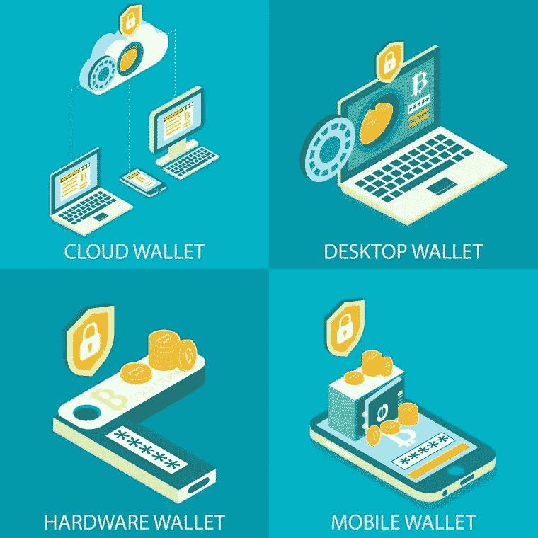
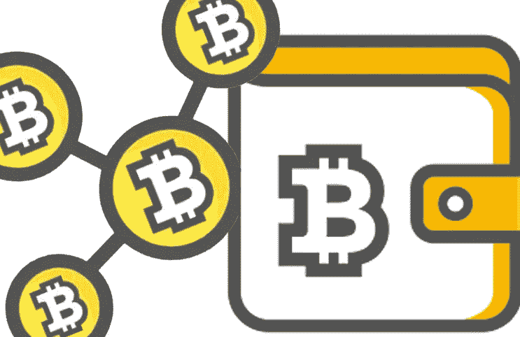
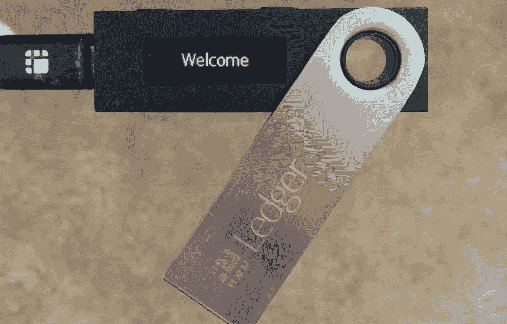

# 如何保护你的比特币免受网上盗窃

> 原文：<https://medium.com/hackernoon/how-to-keep-your-bitcoins-safe-from-online-theft-9815e50b9480>

比特币被认为是全球最受欢迎的加密货币，因为它价格高，功能分散，数字化。然而，它是如此受欢迎，以至于网络攻击者和在线窃贼继续试图使用任何可能的手段来窃取硬币。无论你多么精通技术，如果你[购买比特币](https://www.xcoins.com)，你需要确保它们被安全可靠地储存。这里有四个小贴士可以帮助你的比特币免于被盗。

**1。选择一个强密码**

如果有有效的密码保护，几乎所有在线内容都可以避免不必要和不适当的访问。也就是说，许多人对多个账户使用相同的密码，从社交媒体到电子邮件和购物平台，这使得他们很容易成为黑客的目标。例如，如果你的电子邮件地址和另一个平台使用相同的密码，黑客只需检索另一个平台的密码，他们就可以立即访问你的电子邮件帐户，从而访问你在网上做的任何事情。

比特币存储在虚拟钱包中，因此使用强密码来保护它至关重要。每隔几个月定期更改你的钱包密码也是一个很好的习惯，当然，也包括你所有在线账户的密码。这样，你可以确保没有人能够猜出你的比特币钱包密码。

如果你已经没有主意了，考虑一个安全的密码管理系统，比如 [LastPass](https://www.lastpass.com/) ，它会生成由随机字符组成的长而复杂的密码，并在你的笔记本电脑或个人电脑上保护它们，而不必记住你所有的独特密码。为了提高安全性，请启用双因素身份验证，这意味着您需要输入密码和其他信息，例如发送到您手机的代码，然后才能登录您的密码管理工具。

**2。选择合适的钱包种类**

选择一个强密码是必不可少的，但更重要的是你选择哪种钱包来存储你的比特币。有多种钱包类型，您选择哪一种取决于您的需求。

第一种是典型的云钱包(可从移动端和桌面端访问)，最好与 PayPal 相比。就像 PayPal 让你可以从银行账户中存储和访问资金，并直接通过 PayPal 支付商品一样，云钱包让你可以在任何地方存储和访问比特币。如果你是一个初学者，没有任何比特币，云钱包是你快速简单的选择，因为它们很容易设置和使用。

你可以考虑的另一个存储比特币的选择是硬件钱包。这是一个类似 u 盘的设备，你可以在里面轻松的存储你所有的私人密钥。因为一旦你的工作完成，这些钱包就可以从联网的电脑上断开，黑客访问存储在上面的信息的机会就大大减少了。

为了增加安全性，请将您的硬件钱包及其备份密钥放在不同的地方。

如果你每个月都在做价值过万美元的大额票额比特币交易，那么最好给你的比特币钱包多加一层安全保障。这可以通过选择纸质钱包而不是云或硬件替代方案来实现。由于它们没有连接到互联网，黑客无法在线访问存储在它们上面的任何信息。

在生成纸质钱包之前，在你的电脑上运行一个恶意软件检查，并在创建任何密钥之前断开它与互联网的连接，这是至关重要的。在你重新连接到互联网之前，销毁你设备上的任何比特币足迹，这将确保黑客无法访问你的信息。

**3。不要从公共电脑访问钱包**

无论你多么迫切地需要访问你的账户，永远不要试图使用一台其他用户全天使用的公共电脑来访问你的比特币信息。为了检查你的比特币余额和发送或接收硬币，请始终使用你的个人电脑或笔记本电脑，并确保它有密码保护，配备最新的恶意软件保护，并且不被其他任何人使用。

**4。启用多重签名**

启用多重签名时，用户必须拥有两个或更多钱包密钥才能处理任何交易。与某些网站的双因素身份验证类似，多重签名意味着即使黑客有私钥，他们也需要有一个额外的密钥来执行交易。然而，当你可以信任另一个人保管你的比特币密钥时，这一附加的安全功能是最有效的，所以在选择这种方法之前要考虑这一点。

如果你遵循这些步骤，你将最大限度地降低黑客访问你的比特币钱包的风险，并确保你的加密货币的安全。