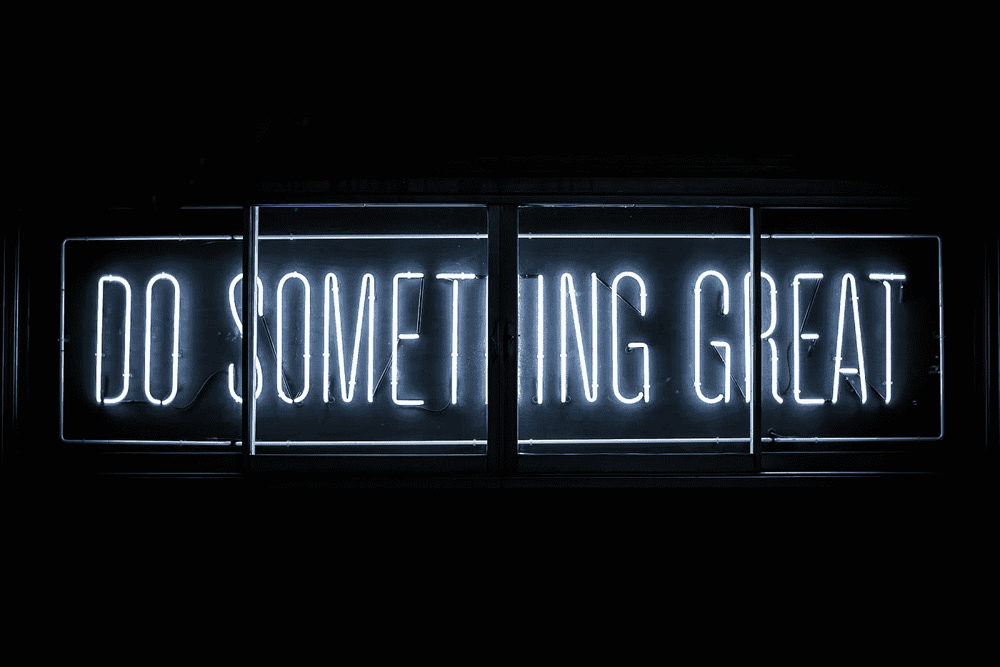
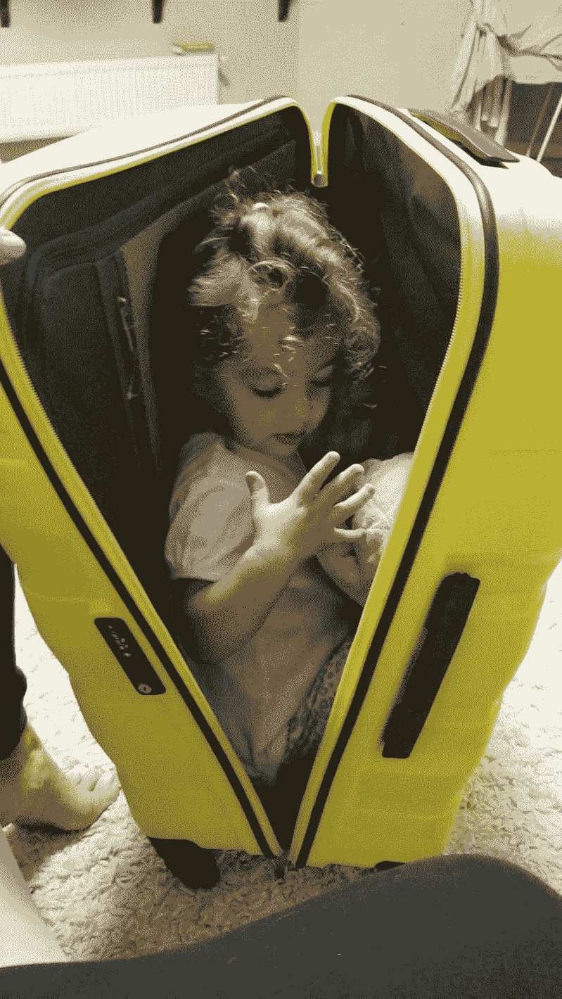
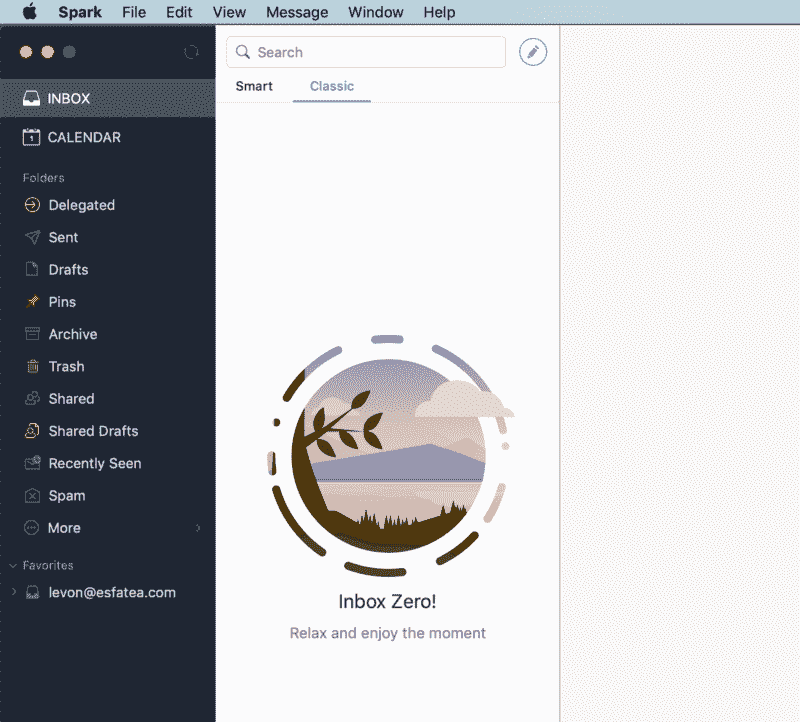
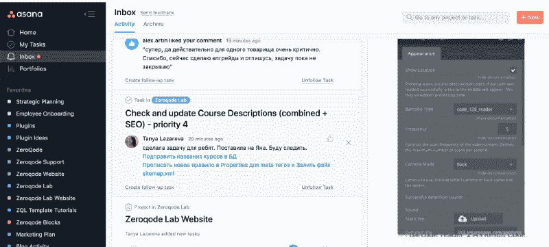
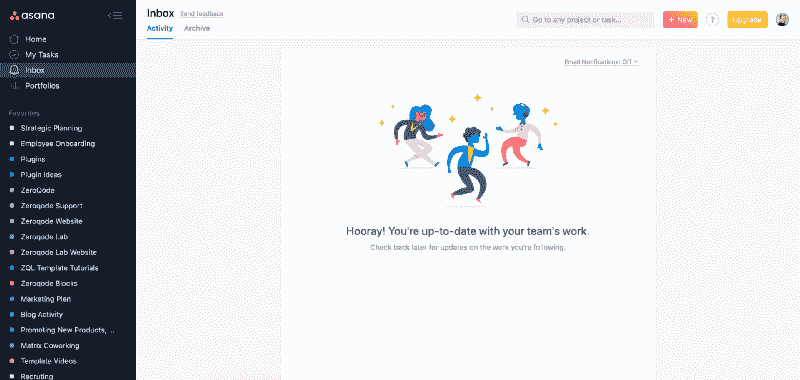
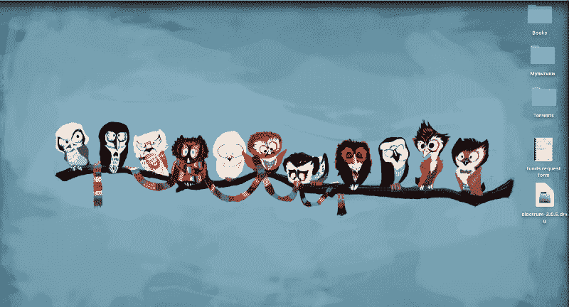
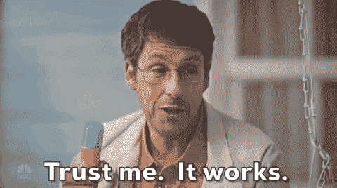
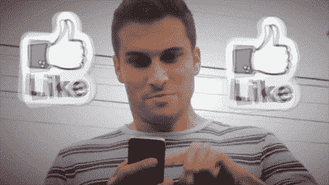

# 作为一个互联网创业公司的联合创始人和一对双胞胎的父亲，如何保持较高的生产力水平

> 原文：<https://medium.com/hackernoon/how-to-keep-your-productivity-level-high-as-a-co-founder-of-internet-startup-and-father-of-twins-ef2cb810b684>

我总是对生产力有一种健康的痴迷。自从我毕业后，我就成了一名连续创业的企业家，随着每一项新业务的开展，工作量也在增加。2001 年，21 岁的我在哈萨克斯坦开办了第一家提供 IT 服务的公司，2002 年我在法国开办了国际电信业务，为全球提供廉价的长途电话服务。2015 年，我开发了一个冥想应用程序，但失败了(这是一个关于我如何花了 5 万美元在一个冥想应用程序上的故事)，同年，我成为了一对双胞胎的父亲，我的生活发生了天翻地覆的变化🙃。在双胞胎出生之前，我可以完全自由地选择我的工作和休息时间，我可以很容易地找到时间进行锻炼，冥想静修和其他爱好。双胞胎出生后，我的柔韧性发生了根本的变化。

*This sweet couple is always on the lookout for some mischief :)*

即使没有其他义务和家庭杂务来照顾外面的工作，我们也经常努力保持生产力。但是当孩子到来时(尤其是一次两个:)，你真的开始挤压你的效率资源，落入帕累托努力等式的 20%。如果你不熟悉帕累托原则，它说 80%的工作在 20%的时间和努力内完成。嗯，有孩子在，你只有 20%的时间来完成 100%的工作！

2016 年，我在无代码领域创办了一家非常成功的初创公司，现在叫做 Zeroqode。(了解更多关于 [Zeroqode](https://zeroqode.com) 和[我们如何在两年内成长为一个 20+](https://blog.zeroqode.com/how-we-bootstrapped-our-no-code-web-development-startup-to-a-team-of-20-in-2-years-2f9245117d0e) 人的团队。)

有了创业的经历，有了照顾孩子和家庭杂务的经历，我学到了一些关于生产力的东西。

我知道已经有很多关于这个话题的文章和演讲，但我想分享一些帮助我在混乱的日程、无尽的家庭旅行和在家不断分心的情况下保持高效率的事情。(我每年只有几个月不在办公室，其余时间我更喜欢在世界各地寻找灵感，当然我会和家人一起去。)

*My kids love the travel and do not hesitate to jump in a suitcase from time to time (ATTENTION: DO NOT ALLOW YOUR KIDS TO GET IN A SUITCASE UNSUPERVISED)*

免责声明:我的方法可能不会(也不应该)吸引所有人。请有所选择，只采纳那些对你有用的建议。对我来说，如果你发现任何有趣的窍门，并把它们应用到你的日常生活中，帮助你变得更有效率，这已经是一笔大买卖了！

**零收件箱规则**

我知道，我的收件箱并不总是有 0 封邮件，但大多数时候不超过 2-3 封，我一周会看到几次。

*My clean email inbox. Oh, it feels so good! Email client — Spark.*

(嘶…我这里作弊了！我在收件箱里回复了几封挥之不去的电子邮件，向你展示了这张截图——但这不正是如今人们在 instagram 和 facebook 上为了一张精彩的快照而作弊的方式吗？)

对我来说，保持收件箱数量接近于零是很重要的，因为它消除了混乱，它只是在我的脑海中创造了一种干净的禅空间，相比之下，你看到你的收件箱充满了电子邮件，即使它们都被查看和回复了(以及如果你错过回复其中一封会发生什么的潜在想法)

你可能会说:“你一定每天只收到几封邮件，否则我不知道这怎么可能”。我数了一下，昨天收到了 73 封邮件。

老实说，大多数电子邮件不需要我采取任何行动，它们要么是一些确认或通讯的交易，但有些需要我的回复和评论。我们根本不使用电子邮件进行团队交流——所有的内部讨论都是在空闲时间进行的。(如果你仍然依赖电子邮件/skype/whatsapp/telegram 进行工作交流，你应该立即切换到 Slack！)

现在我们来谈谈电子邮件客户端——我的是 Mac 版 Spark。我认为这是最好的电子邮件应用程序，它很容易为电子邮件配置滑动动作。(Android 爱好者的好消息——Spark for Android 刚刚发布！)当我将鼠标悬停在邮件上并在触控板或鼠标上向右滑动时，邮件会被存档，向左滑动时，邮件会被删除。早上第一件事就是刷几下，清理掉我晚上收到的大部分邮件。然后我再花 15-30 分钟回复剩下的邮件或者采取邮件中暗示的行动。一旦电子邮件线程完成，我存档它。剩下的邮件是我待办事项清单上的一个补充。有时我喜欢花时间思考答案，或者做出与邮件相关的决定。

此外，我总是取消订阅我从未订阅过的时事通讯，或者我注册任何服务后收到的电子邮件。反正我不会去读它，它只会塞满我的收件箱，降低我的工作效率。我关闭了所有通过电子邮件和应用程序发送的 facebook 通知(除了直接消息和评论)，因为 facebook 在试图将用户带回平台并保持他们参与的痛苦中变得越来越咄咄逼人，所以这太令人讨厌和分散注意力了。

我的零收件箱规则也适用于 Asana 项目管理工具，我们(在 Zeroqode)用它来管理所有与工作相关的项目和任务。只要你关注的任务有任何更新，它就会出现在收件箱中。

*My Asana inbox in the mornings*

你看，我并不总是作弊，仍然有一些未决的更新我需要通过——他们整天都在不断地到来，所以我只是在我可以的时候回复。

现在，我经历了所有的更新，它回到了原来的状态。

*My Asana inbox after clean up*

顺便说一下，Asana 是一个超级有效的项目管理工具，可以组织你的团队工作，让你永远不会忘记你和你的队友必须做什么，什么时候做。它可以让你看到更大的画面，也可以在必要时放大细节。当我开始做 Zeroqode 的时候，我研究了很多项目管理工具，包括吉拉、Basecamp、Wryke 等等。其中一些确实很棒，但对我来说，就方便和效率而言，没有一个能与体式相比。它有一个我们仍在使用的免费层！

**把你的思想从你需要记住的事情中解放出来**

当我需要记住一条有价值的信息时，我会立即把它写下来。这让我安心。我知道所有的事情都被处理好了，我不需要担心我是否记得所有的事情，或者我是否忘记了一些事情。持续的担心和在内部检查待办事项清单会影响你的效率。它会耗尽你的内存资源，分散你的注意力。当我写下事情的时候，我知道我会在需要的时候看到通知，在那之前我根本不用担心。

如果是我需要做的事情，我会将其作为任务添加到我的待办事项应用 Todoist 中(感谢我的合作伙伴 Vlad 提供的提示)。我相信这是目前最流行的应用程序，每年 29 美元，物有所值！

*My to-do list in the Todoist app*

从上面的截图可以看出，我今天的待办事项已经完成，这就是我写这篇文章的原因，尽管这是我明天待办事项列表中的一项任务。这实际上是我的下一个建议——*保持你的待办事项清单简短*！

保持你的待办事项清单简短而现实，可以让你更快地完成大部分计划好的任务，并且不会让自己或他人失望。一旦今天的所有任务都完成了，就去做明天的任务，当然，如果你感到足够热情的话:)

如果只是简单的信息，比如银行账户的详细信息、地点、旅行记录或其他任何东西，我会在 Evernote 中将其添加为注释。

**将你的 WINDOWS PC 换成 MAC**

我知道我会因为这个被诅咒很多次，但老实说，直到一年前我还是一个 windows 用户(所以几乎是我的一生)，我的联合创始人 Vlad 一直在唠叨我 Windows 笔记本电脑慢和崩溃(你好，蓝屏！).我会用相当合理的论点进行反击，但在某些时候，我变得很好奇——如果这真的会让我的工作变得更容易呢？我当然担心我以前在 Windows PC 上使用的应用程序的兼容性，但我仍然决定尝试一下。知道吗？我想我再也不会回去了:)(再见蓝屏！).这让我的生活变得简单多了。启动笔记本电脑、在应用程序之间切换以及直接使用电脑变得更快、更简单。这些应用程序更加漂亮和直观。我知道这是 Windows 和 Mac 爱好者之间永无休止的圣战，但你不会知道其中的区别，直到你尝试。当然，Mac 更贵，但考虑到它节省了我很多时间，我也更喜欢它——我认为它完全值得。

**保持极简屏幕**

有时候，我会看到其他人的桌面，他们同时打开的大量标签或应用程序图标让我感到幽闭恐怖。你怎么可能在那里发生的无数事情中保持你的专注和禅定。

在我的 dock 中，我只保存日常使用的应用程序。

*My Mac dock at the moment*

我的桌面也是如此(尽管与 Windows 相比，我很少在 Mac 上打开它)。

*My minimal desktop*

如果有我经常使用的网站，我只需在我的 Chrome 浏览器中锁定标签(抱歉，不是 Safari，不是 Mozilla，必须是 Chrome)。

*Pinned tabs in my Google Chrome browser*

书签栏中的链接我仍然经常使用，但不太常用。

*Popular Bookmarks in my Google Chrome browser*

**使用快捷键**

我仍然需要学习更多地使用快捷方式，但是与点击相比，它们确实节省了你的时间。如果你还没有扔掉你的鼠标(虽然我很喜欢它，但我不想放弃它很长时间:)，你的触控板(如果它足够大，如果它在 Mac 上)将更有效地达到同样的目的。你需要做的就是花些时间学习如何有效地使用它。

**永远用电脑而不是手机**

与电脑相比，在手机上做同样的事情需要花费更多的时间和精力。在电脑上浏览互联网、回复电子邮件或 whatsapp 信息或几乎任何其他事情都更容易、更快。所以，如果你的电脑上还没有安装 whatsapp，你应该现在就安装它，在使用它的时候用它来代替你的手机。当你在排队或其他地方有几分钟空闲时间时，你可能会忍不住回你的电子邮件或手机短信，但如果不紧急，放松和休息一下，当你再次回到办公桌前时，你会更快地做这些事情。

如果你因为手机嗡嗡作响而想回答这些问题，看看我的下一个建议。

**关闭手机通知**

最近，我们致力于重塑和推出我们新收购的教育平台——[zero qode Lab](https://lab.zeroqode.com/)(在我们的文章中阅读更多关于[我们如何收购 Zeroqode Lab](/@levon377/why-we-acquired-a-saas-learning-platform-and-how-we-set-it-up-for-success-by-rebranding-it-6a13850cc31) 的信息)，在此过程中，我突然被我必须浏览的大量工作淹没了。由于我目前住在巴厘岛，团队在摩尔多瓦，有 6 个小时的时差，我的工作时间很快就从早上 8:30 变成了晚上 11:00。我做的事情之一就是关掉手机上的电子邮件和空闲通知。他们仍然关闭，虽然它变得更容易。

**尽可能多的锻炼**

这是一个众所周知的事实——体育锻炼可以提高生产力、创造力、幸福感，还有很多其他好处。我不认为我需要详细说明更多锻炼的好处。相信我，去做吧，你会亲眼看到的。

**做瑜伽和冥想**

瑜伽和冥想对你的健康、身体和情绪都有很多好处。冥想对于理清你的个人生活或工作非常重要。有许多语音指导冥想的应用程序，其中最受欢迎的是 Headspace 和 Calm。

**调节你的工作量**

如果你经常超负荷工作，发现自己处于情绪或身体崩溃的边缘，那么任何关于生产力的技巧或提示都不会帮助你。在某一点上，你会完全崩溃。如果你有上述想法，这里有一些你急需做的事情。每当我接近超负荷时，我的生存机制就会启动，在这样的时刻，对我来说，没有什么比恢复工作与生活的平衡更重要的了。我是这样做的:

1.  我问自己，我正在做的所有事情是否真的很重要，其中一些事情是否可以推迟。
2.  如果每件事都是优先的，必须立即完成，那么我会想办法把我的部分工作委托给某人(向我的队友致敬)。
3.  如果其他人都很忙，我就再雇一个团队成员。
4.  如果你雇不起人，那就质疑你的商业模式。是可持续的吗？

我应该在这里说明一下，大多数时候我每周工作超过 40 个小时，因为我热爱我的工作，但是当我每天必须工作很多小时，即使我不觉得累，我也会在情绪和身体上疲惫不堪，感觉我正在失去自由。那就是我进入生存模式，做我上面提到的事情的时候。

**做你喜欢的事或改变你做的事**

这一条很简单，如果你在寻找你为什么做你不喜欢的事情的解释，你是在欺骗自己。尽快摆脱它。不。更多。借口。勇敢一点，相信自己，相信生活，只要你决定做自己喜欢的事情，一切都会以最好的方式进行。

**克服拖延症**

让我们面对现实吧，每个人都会推迟一些任务，对此我也很内疚。我们不要小题大做，除非这是一个长期问题，影响到你的大部分任务，而且你根本无法让自己解决它们(在这种情况下，我会建议更激进的事情，如禁食几周(阅读保罗·布拉格关于禁食好处的书籍)，进行积极的冥想或非常激烈的锻炼——所有这些都会促进你的新陈代谢和能量水平)。如果你因为不喜欢自己做的事情而推迟事情，请看上一段。

但是让我们考虑这样一种情况，当它不是什么大事，但有时仍然有事情要做，它们变得很重要，而你只是不想开始做它们，并把它们推迟到第二天甚至下周。

不久前，我偶然发现了这个技巧，这个想法很简单，但是很有效！如果你不想做某个特定的任务，不要做，但也不要做其他任何事情，不要看电视，不要社交媒体，不要玩游戏，什么都不要做！只是坐在那里什么也不做，盯着你不想做的任务。只要想想任务和完成任务所需的步骤。简单地观察任务。需要做多久就做多久，我可以 100%向你保证(好吧，就 95%)在某个时候你会觉得你已经准备好搞定它了。

**带负电荷的能量仍然是能量——利用它！**

我记得当孩子们还很小的时候，我们经常和我的妻子吵架，我会非常生气地去上班，但是这种愤怒会如何帮助我在更短的时间内完成这么多事情(谢谢你，亲爱的，即使我们吵架，我也爱你:)。

**调成心流状态**

当你完全迷失在自己所做的事情中，不去关注周围的任何事情时，你大概就知道这种状态了。这是最有效率的状态之一，试着每天至少花几个小时进入这种状态。花些时间关注是什么帮助你进入这种状态，并学会在需要的时候反复这么做。

如果你在办公室经常分心，那就离开几个小时，去附近的咖啡店工作。

**浏览社交网络**

我喜欢每天浏览一次我的 instagram feed，我不会关注太多人，所以这只需要几分钟时间。

如果我想进行一些更无意识的冲浪，我可能会阅读我的 facebook feed(记得我关掉了 FB 上的大部分通知)。但是如果你使用 facebook，一定要取消关注所有发布恼人/无关/负面内容的人——为什么要让他们扰乱你的情绪状态呢？我并不建议取消好友，因为在需要的时候从你的联系人列表中找到某个人很实际也很容易，但是取消关注是无害的，也是保持你的订阅源干净的有效方法。也不要关注你几乎不认识的人，如果你刚刚在飞机上遇到一个人，然后在脸书转机，你为什么会想知道他的狗吃什么样的食物，对吗？另一个好主意是对内容进行优先排序，这样对你来说更重要的帖子会出现在提要中所有其他帖子的前面(你可以通过点击朋友的个人资料或你订阅的页面来做到这一点)。如果你花一些时间浏览所有的帖子，或者不关注它们，或者对它们进行优先排序，你花在脸书上的时间会更有价值:)

**在激发你灵感的地方工作**

如果你被允许远程工作，找一个餐厅或共同工作的空间，在那里你会发现自己非常舒适和振奋。或者你也可以在大自然中找一个地方，湖边、河边、山上或海滨餐厅。由于经常出差，我最喜欢在五星级酒店的大厅里工作。一杯茶或咖啡的费用并不贵，但你会被一种奢华和放松的氛围所包围(有时甚至伴有现场音乐:)。

这是我的 16 条建议，当你的业务在增长，任务永无止境，有孩子跑来跑去乞求关注的时候，保持你的高生产力水平。虽然不是每一条建议都适合你的生活方式，但我希望这篇文章能证明你是有效率的，并激励你采取一些切实可行的措施来安排好你的工作。